# 观测缺失条件下多变量时间序列预测实验结果

> 实验日期：2026-06-16 ~ 2026-06-17  
> 实验设备：8 × NVIDIA A800-SXM4-80GB  
> 实验总数：2292 条命令，产出 2133 个有效结果  
> 随机种子：2024、2025、2026（3 次重复）  
> 训练设置：10 epoch，early stopping patience = 3，batch size = 32，lr = 1e-3

所有可视化图表存放在 `../figures_vis/` 目录下。

---

## 13.1 主结果表

主实验覆盖 4 个数据集 × 2 种缺失类型 × 2 种缺失率 × 2 种预测长度，比较 9 种方法组合。
两阶段方法（线性插值 / SAITS）分别展示 3 种预测模型（DLinear / PatchTST / iTransformer）的结果。
表中数值为 MSE / MAE（3 个随机种子的均值），**加粗**表示每行最优。"-" 表示该配置因数值溢出无有效结果。

### 可视化总览

**预测长度 = 96：**

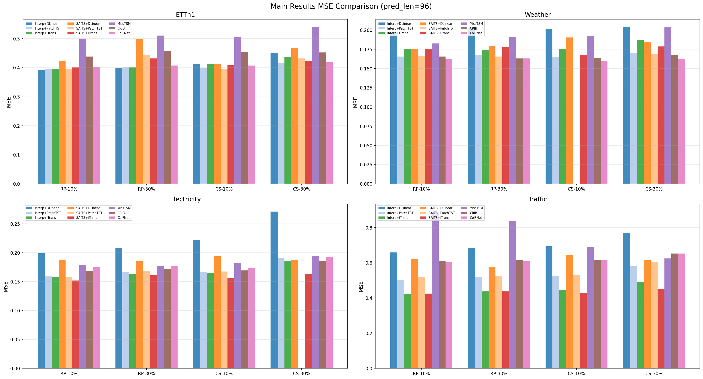

**预测长度 = 336：**

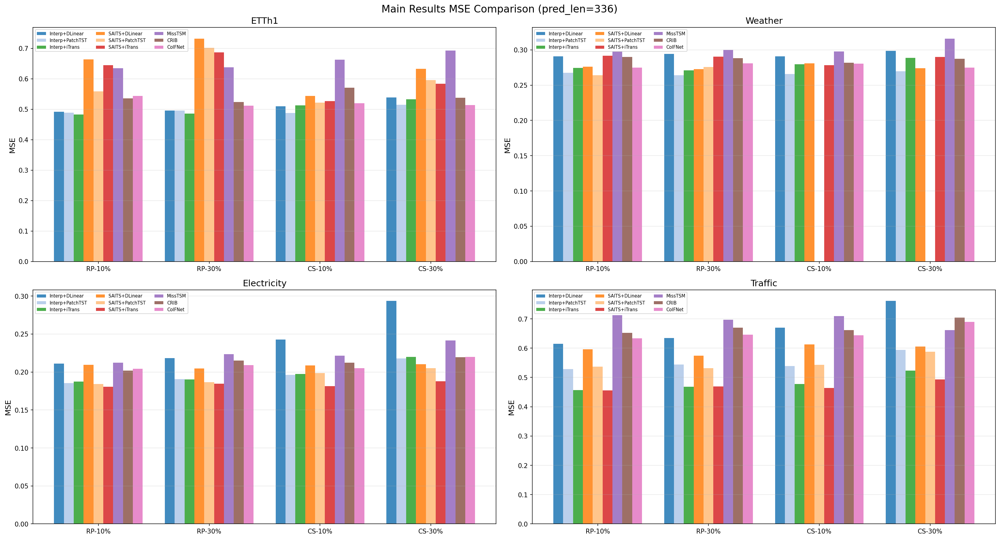

### ETTh1

| 缺失类型 | 缺失率 | 预测长度 | Interp+DLinear | Interp+PatchTST | Interp+iTrans | SAITS+DLinear | SAITS+PatchTST | SAITS+iTrans | MissTSM | CRIB | CoIFNet |
|---|---:|---:|---:|---:|---:|---:|---:|---:|---:|---:|---:|
| 随机点缺失 | 10% | 96 | **0.3920 / 0.4064** | 0.3939 / 0.4089 | 0.3964 / 0.4143 | 0.4246 / 0.4360 | 0.3960 / 0.4135 | 0.4004 / 0.4190 | 0.4986 / 0.5085 | 0.4379 / 0.4411 | 0.4025 / 0.4153 |
| 随机点缺失 | 10% | 336 | 0.4916 / 0.4692 | 0.4888 / 0.4643 | **0.4823 / 0.4595** | 0.6642 / 0.5858 | 0.5592 / 0.5107 | 0.6451 / 0.5643 | 0.6346 / 0.5883 | 0.5361 / 0.5041 | 0.5436 / 0.4915 |
| 随机点缺失 | 30% | 96 | **0.3995 / 0.4127** | 0.4005 / 0.4134 | 0.4010 / 0.4178 | 0.4995 / 0.4986 | 0.4449 / 0.4541 | 0.4319 / 0.4497 | 0.5104 / 0.5102 | 0.4558 / 0.4486 | 0.4076 / 0.4200 |
| 随机点缺失 | 30% | 336 | 0.4955 / 0.4713 | 0.4961 / 0.4702 | **0.4858 / 0.4627** | 0.7322 / 0.6393 | 0.7018 / 0.6163 | 0.6865 / 0.5995 | 0.6377 / 0.5932 | 0.5236 / 0.4970 | 0.5114 / 0.4796 |
| 连续片段缺失 | 10% | 96 | 0.4141 / 0.4197 | 0.3991 / 0.4148 | 0.4136 / 0.4230 | 0.4129 / 0.4249 | **0.3964 / 0.4118** | 0.4084 / 0.4229 | 0.5050 / 0.5120 | 0.4552 / 0.4417 | 0.4072 / 0.4156 |
| 连续片段缺失 | 10% | 336 | 0.5094 / 0.4794 | **0.4880 / 0.4657** | 0.5133 / 0.4763 | 0.5435 / 0.5064 | 0.5216 / 0.4823 | 0.5263 / 0.4953 | 0.6628 / 0.6040 | 0.5705 / 0.5137 | 0.5201 / 0.4789 |
| 连续片段缺失 | 30% | 96 | 0.4511 / 0.4409 | **0.4151 / 0.4243** | 0.4373 / 0.4354 | 0.4665 / 0.4693 | 0.4313 / 0.4367 | 0.4230 / 0.4404 | 0.5395 / 0.5315 | 0.4519 / 0.4424 | 0.4184 / 0.4197 |
| 连续片段缺失 | 30% | 336 | 0.5389 / 0.4968 | 0.5144 / 0.4770 | 0.5326 / 0.4863 | 0.6332 / 0.5718 | 0.5961 / 0.5425 | 0.5842 / 0.5390 | 0.6931 / 0.6178 | 0.5380 / 0.4920 | **0.5138 / 0.4722** |

### Weather

| 缺失类型 | 缺失率 | 预测长度 | Interp+DLinear | Interp+PatchTST | Interp+iTrans | SAITS+DLinear | SAITS+PatchTST | SAITS+iTrans | MissTSM | CRIB | CoIFNet |
|---|---:|---:|---:|---:|---:|---:|---:|---:|---:|---:|---:|
| 随机点缺失 | 10% | 96 | 0.1968 / 0.2562 | 0.1657 / 0.2140 | 0.1761 / 0.2179 | 0.1750 / 0.2382 | 0.1663 / 0.2193 | 0.1754 / 0.2279 | 0.1826 / 0.2505 | 0.1657 / 0.2157 | **0.1627 / 0.2136** |
| 随机点缺失 | 10% | 336 | 0.2909 / 0.3460 | 0.2675 / 0.2969 | 0.2746 / 0.2964 | 0.2763 / 0.3289 | **0.2643 / 0.3059** | 0.2918 / 0.3309 | 0.2980 / 0.3454 | 0.2902 / 0.3133 | 0.2748 / 0.3034 |
| 随机点缺失 | 30% | 96 | 0.2025 / 0.2655 | 0.1680 / 0.2184 | 0.1742 / 0.2187 | 0.1799 / 0.2423 | 0.1655 / 0.2284 | 0.1779 / 0.2425 | 0.1917 / 0.2609 | 0.1631 / 0.2138 | **0.1631 / 0.2142** |
| 随机点缺失 | 30% | 336 | 0.2945 / 0.3509 | **0.2640 / 0.2979** | 0.2709 / 0.2967 | 0.2727 / 0.3257 | 0.2758 / 0.3221 | 0.2902 / 0.3396 | 0.2998 / 0.3488 | 0.2882 / 0.3118 | 0.2810 / 0.3084 |
| 连续片段缺失 | 10% | 96 | 0.2019 / 0.2629 | 0.1652 / 0.2109 | 0.1755 / 0.2170 | 0.1904 / 0.2527 | - | 0.1676 / 0.2135 | 0.1919 / 0.2630 | 0.1640 / 0.2138 | **0.1599 / 0.2086** |
| 连续片段缺失 | 10% | 336 | 0.2909 / 0.3452 | **0.2656 / 0.2922** | 0.2798 / 0.2988 | 0.2809 / 0.3321 | - | 0.2785 / 0.3062 | 0.2977 / 0.3463 | 0.2817 / 0.3067 | 0.2807 / 0.3061 |
| 连续片段缺失 | 30% | 96 | 0.2039 / 0.2657 | 0.1703 / 0.2167 | 0.1876 / 0.2285 | 0.1847 / 0.2534 | 0.1692 / 0.2207 | 0.1788 / 0.2367 | 0.2035 / 0.2694 | 0.1679 / 0.2163 | **0.1630 / 0.2104** |
| 连续片段缺失 | 30% | 336 | 0.2988 / 0.3510 | **0.2697 / 0.2957** | 0.2887 / 0.3050 | 0.2741 / 0.3302 | - | 0.2898 / 0.3281 | 0.3161 / 0.3627 | 0.2874 / 0.3094 | 0.2750 / 0.3022 |

### Electricity

| 缺失类型 | 缺失率 | 预测长度 | Interp+DLinear | Interp+PatchTST | Interp+iTrans | SAITS+DLinear | SAITS+PatchTST | SAITS+iTrans | MissTSM | CRIB | CoIFNet |
|---|---:|---:|---:|---:|---:|---:|---:|---:|---:|---:|---:|
| 随机点缺失 | 10% | 96 | 0.1991 / 0.2819 | 0.1588 / 0.2508 | 0.1579 / 0.2521 | 0.1876 / 0.2821 | 0.1578 / 0.2532 | **0.1519 / 0.2500** | 0.1794 / 0.2896 | 0.1681 / 0.2730 | 0.1755 / 0.2796 |
| 随机点缺失 | 10% | 336 | 0.2111 / 0.3011 | 0.1855 / 0.2770 | 0.1873 / 0.2804 | 0.2096 / 0.3042 | 0.1841 / 0.2801 | **0.1807 / 0.2791** | 0.2122 / 0.3198 | 0.2017 / 0.3050 | 0.2041 / 0.3066 |
| 随机点缺失 | 30% | 96 | 0.2079 / 0.2923 | 0.1660 / 0.2603 | 0.1636 / 0.2603 | 0.1851 / 0.2855 | 0.1681 / 0.2694 | **0.1608 / 0.2649** | 0.1775 / 0.2887 | 0.1714 / 0.2777 | 0.1766 / 0.2822 |
| 随机点缺失 | 30% | 336 | 0.2184 / 0.3093 | 0.1907 / 0.2847 | 0.1902 / 0.2862 | 0.2046 / 0.3058 | 0.1866 / 0.2887 | **0.1845 / 0.2894** | 0.2234 / 0.3312 | 0.2152 / 0.3158 | 0.2092 / 0.3116 |
| 连续片段缺失 | 10% | 96 | 0.2220 / 0.3051 | 0.1662 / 0.2566 | 0.1648 / 0.2579 | 0.1938 / 0.2805 | 0.1675 / 0.2595 | **0.1567 / 0.2517** | 0.1819 / 0.2926 | 0.1694 / 0.2736 | 0.1741 / 0.2782 |
| 连续片段缺失 | 10% | 336 | 0.2426 / 0.3312 | 0.1963 / 0.2849 | 0.1975 / 0.2891 | 0.2089 / 0.2998 | 0.1987 / 0.2889 | **0.1813 / 0.2763** | 0.2217 / 0.3280 | 0.2122 / 0.3112 | 0.2050 / 0.3055 |
| 连续片段缺失 | 30% | 96 | 0.2710 / 0.3525 | 0.1914 / 0.2773 | 0.1860 / 0.2760 | 0.1880 / 0.2821 | - | **0.1630 / 0.2625** | 0.1940 / 0.3026 | 0.1864 / 0.2882 | 0.1924 / 0.2945 |
| 连续片段缺失 | 30% | 336 | 0.2935 / 0.3766 | 0.2179 / 0.3025 | 0.2200 / 0.3075 | 0.2104 / 0.3058 | 0.2050 / 0.2996 | **0.1878 / 0.2871** | 0.2417 / 0.3460 | 0.2195 / 0.3180 | 0.2198 / 0.3185 |

### Traffic

| 缺失类型 | 缺失率 | 预测长度 | Interp+DLinear | Interp+PatchTST | Interp+iTrans | SAITS+DLinear | SAITS+PatchTST | SAITS+iTrans | MissTSM | CRIB | CoIFNet |
|---|---:|---:|---:|---:|---:|---:|---:|---:|---:|---:|---:|
| 随机点缺失 | 10% | 96 | 0.6597 / 0.4041 | 0.5042 / 0.2964 | **0.4237 / 0.2954** | 0.6224 / 0.3839 | 0.5198 / 0.3056 | 0.4253 / 0.2940 | 0.8912 / 0.4719 | 0.6130 / 0.3466 | 0.6065 / 0.3549 |
| 随机点缺失 | 10% | 336 | 0.6147 / 0.3809 | 0.5288 / 0.3123 | 0.4565 / 0.3068 | 0.5961 / 0.3690 | 0.5365 / 0.3170 | **0.4559 / 0.3055** | 0.7122 / 0.3913 | 0.6522 / 0.3616 | 0.6332 / 0.3617 |
| 随机点缺失 | 30% | 96 | 0.6816 / 0.4159 | 0.5214 / 0.3059 | **0.4373 / 0.3023** | 0.5773 / 0.3566 | 0.5229 / 0.3135 | 0.4374 / 0.2970 | 0.8368 / 0.4474 | 0.6143 / 0.3461 | 0.6096 / 0.3592 |
| 随机点缺失 | 30% | 336 | 0.6351 / 0.3925 | 0.5439 / 0.3211 | **0.4687 / 0.3135** | 0.5738 / 0.3553 | 0.5316 / 0.3325 | 0.4691 / 0.3105 | 0.6965 / 0.3824 | 0.6696 / 0.3686 | 0.6460 / 0.3620 |
| 连续片段缺失 | 10% | 96 | 0.6946 / 0.4289 | 0.5253 / 0.3087 | 0.4455 / 0.3071 | 0.6444 / 0.3942 | 0.5331 / 0.3409 | **0.4296 / 0.2940** | 0.6894 / 0.3779 | 0.6155 / 0.3459 | 0.6140 / 0.3543 |
| 连续片段缺失 | 10% | 336 | 0.6695 / 0.4221 | 0.5391 / 0.3169 | 0.4779 / 0.3191 | 0.6125 / 0.3747 | 0.5428 / 0.3342 | **0.4643 / 0.3076** | 0.7091 / 0.3819 | 0.6615 / 0.3657 | 0.6436 / 0.3600 |
| 连续片段缺失 | 30% | 96 | 0.7689 / 0.4723 | 0.5795 / 0.3403 | 0.4912 / 0.3294 | 0.6141 / 0.3733 | 0.6041 / 0.3758 | **0.4515 / 0.3001** | 0.6245 / 0.3484 | 0.6535 / 0.3600 | 0.6528 / 0.3753 |
| 连续片段缺失 | 30% | 336 | 0.7611 / 0.4735 | 0.5945 / 0.3492 | 0.5233 / 0.3420 | 0.6054 / 0.3671 | 0.5875 / 0.3751 | **0.4929 / 0.3197** | 0.6617 / 0.3634 | 0.7047 / 0.3878 | 0.6898 / 0.3822 |

---

## 13.2 鲁棒性分析表

各方法在主实验 4 个数据集上的平均 MSE 及相对退化率（按预测模型展开）。
相对退化率 = (缺失 MSE − 无缺失 MSE) / 无缺失 MSE × 100%。

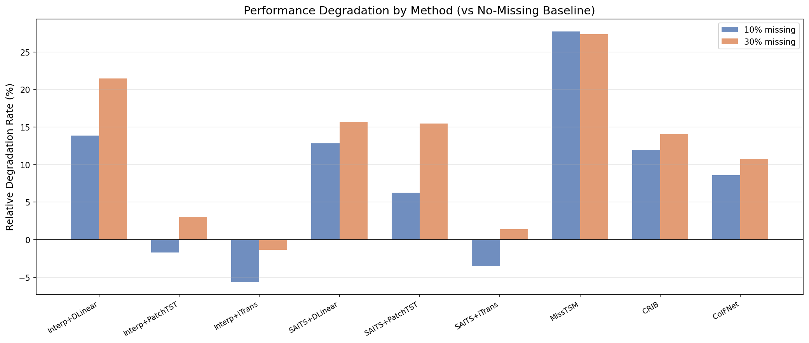

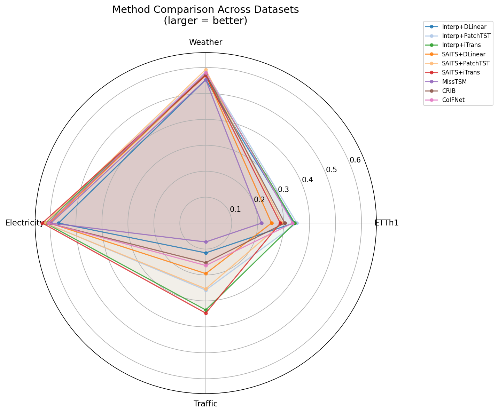

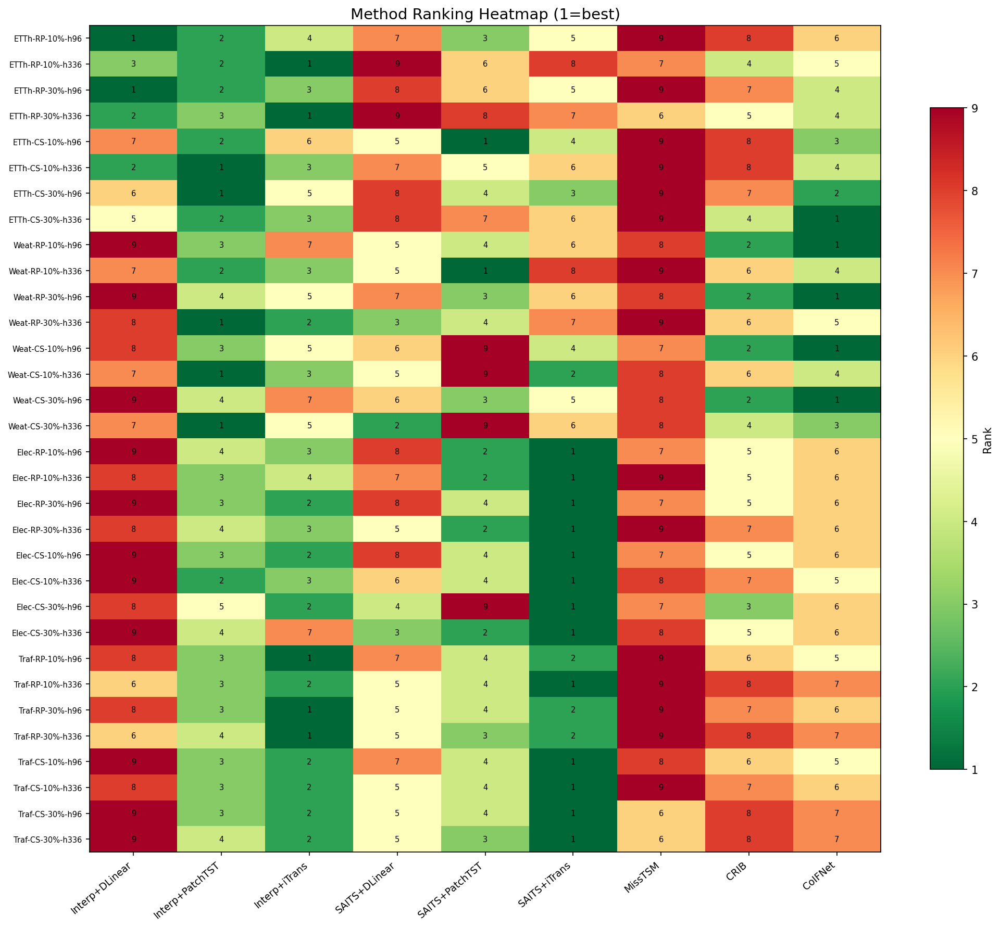

| 方法 | 10% 缺失 MSE | 30% 缺失 MSE | 退化率 (10%) | 退化率 (30%) |
|---|---:|---:|---:|---:|
| Interp+DLinear | 0.3938 | 0.4201 | +13.9% | +21.5% |
| Interp+PatchTST | 0.3399 | 0.3565 | -1.7% | +3.1% |
| Interp+iTrans | 0.3264 | 0.3411 | -5.6% | -1.4% |
| SAITS+DLinear | 0.3902 | 0.4001 | +12.8% | +15.7% |
| SAITS+PatchTST | 0.3674 | 0.3993 | +6.2% | +15.5% |
| SAITS+iTrans | 0.3337 | 0.3506 | -3.5% | +1.4% |
| MissTSM | 0.4418 | 0.4405 | +27.7% | +27.4% |
| CRIB | 0.3872 | 0.3944 | +12.0% | +14.0% |
| CoIFNet | 0.3755 | 0.3831 | +8.6% | +10.8% |

---

## 无缺失基准（Baseline 上界）

| 数据集 | 预测长度 | DLinear | PatchTST | iTransformer |
|---|---:|---:|---:|---:|
| ETTh1 | 96 | 0.3890 / 0.4042 | 0.3905 / 0.4064 | 0.3949 / 0.4127 |
| ETTh1 | 336 | 0.4897 / 0.4676 | 0.4873 / 0.4629 | 0.4828 / 0.4594 |
| Weather | 96 | 0.1973 / 0.2577 | 0.1629 / 0.2089 | 0.1736 / 0.2141 |
| Weather | 336 | 0.2894 / 0.3442 | 0.2679 / 0.2945 | 0.2781 / 0.2971 |
| Electricity | 96 | 0.1951 / 0.2773 | 0.1561 / 0.2472 | 0.1558 / 0.2491 |
| Electricity | 336 | 0.2081 / 0.2977 | 0.1837 / 0.2744 | 0.1862 / 0.2784 |
| Traffic | 96 | 0.6513 / 0.3993 | 0.4969 / 0.2929 | 0.4198 / 0.2928 |
| Traffic | 336 | 0.6081 / 0.3771 | 0.5239 / 0.3109 | 0.4530 / 0.3049 |
| ETTm1 | 96 | 0.3447 / 0.3726 | 0.3205 / 0.3594 | 0.3438 / 0.3742 |
| ETTm1 | 336 | 0.4180 / 0.4217 | 0.3924 / 0.4072 | 0.4315 / 0.4241 |
| ExchangeRate | 96 | 0.0792 / 0.1989 | 0.0860 / 0.2056 | 0.1042 / 0.2277 |
| ExchangeRate | 336 | 0.2898 / 0.4061 | 0.3498 / 0.4285 | 0.3601 / 0.4365 |

---

## 13.3 预测模型复杂度对比表

两种缺失处理方式下三种预测模型的平均性能（主实验 4 数据集汇总）。

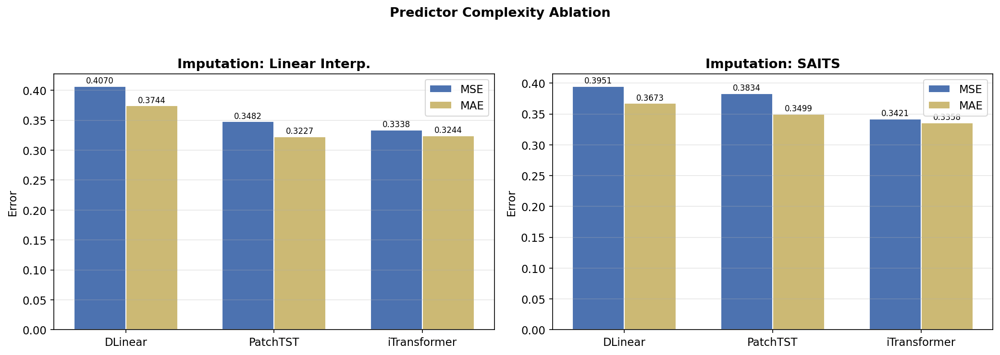

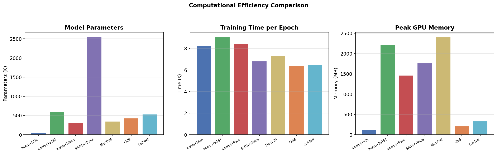

| 缺失处理方式 | 预测模型 | MSE | MAE | 训练时间 (s) | 参数量 | 峰值显存 (MB) |
|---|---|---:|---:|---:|---:|---:|
| 线性插值 | DLinear | 0.4070 | 0.3744 | 8.2 | 42,206 | 120 |
| 线性插值 | PatchTST | 0.3482 | 0.3227 | 9.1 | 601,828 | 2212 |
| 线性插值 | iTransformer | 0.3338 | 0.3244 | 8.4 | 312,981 | 1462 |
| SAITS 补值 | DLinear | 0.3951 | 0.3673 | 6.7 | 2,277,657 | 430 |
| SAITS 补值 | PatchTST | 0.3669 | 0.3421 | 7.3 | 2,919,871 | 2709 |
| SAITS 补值 | iTransformer | 0.3421 | 0.3358 | 6.8 | 2,544,151 | 1768 |

---

## 11.1 缺失掩码作用消融实验

比较三种输入形式对预测性能的影响。
- **A**：只输入填补后数值（模型不知道哪些是填补值）
- **B**：数值 + 缺失掩码（模型知道哪些位置缺失）
- **C**：数值 + 缺失掩码 + 时间位置（完整信息）

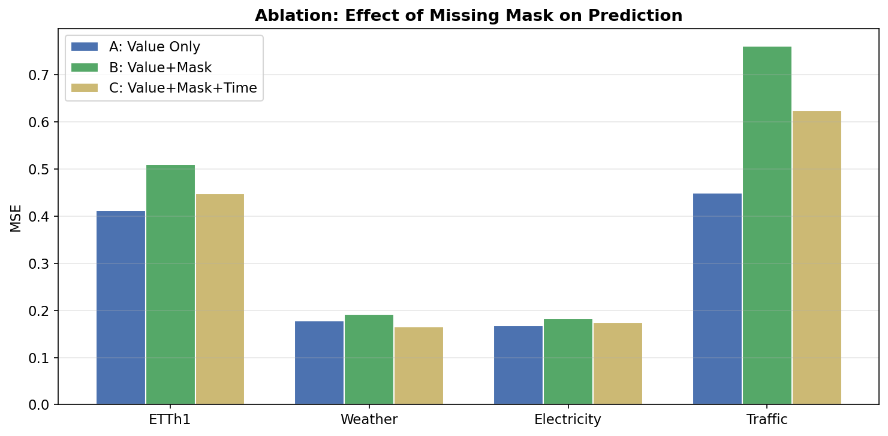

### 全局平均

| 输入形式 | MSE | MAE |
|---|---:|---:|
| A: 只输入数值 | 0.3020 | 0.3034 |
| B: 数值 + 掩码 | 0.4117 | 0.3700 |
| C: 数值 + 掩码 + 时间 | 0.3527 | 0.3213 |

### 分数据集详细结果

| 数据集 | 缺失类型 | 缺失率 | A: 只输入数值 | B: 数值+掩码 | C: 数值+掩码+时间 |
|---|---|---:|---:|---:|---:|
| ETTh1 | 随机点缺失 | 10% | 0.3964 / 0.4143 | 0.4986 / 0.5085 | 0.4379 / 0.4411 |
| ETTh1 | 随机点缺失 | 30% | 0.4021 / 0.4187 | 0.4996 / 0.5058 | 0.4466 / 0.4449 |
| ETTh1 | 连续片段缺失 | 10% | 0.4136 / 0.4230 | 0.5050 / 0.5120 | 0.4552 / 0.4417 |
| ETTh1 | 连续片段缺失 | 30% | 0.4373 / 0.4354 | 0.5395 / 0.5315 | 0.4519 / 0.4424 |
| Weather | 随机点缺失 | 10% | 0.1761 / 0.2179 | 0.1826 / 0.2505 | 0.1657 / 0.2157 |
| Weather | 随机点缺失 | 30% | 0.1742 / 0.2187 | 0.1917 / 0.2609 | 0.1631 / 0.2138 |
| Weather | 连续片段缺失 | 10% | 0.1755 / 0.2170 | 0.1919 / 0.2630 | 0.1640 / 0.2138 |
| Weather | 连续片段缺失 | 30% | 0.1876 / 0.2285 | 0.2035 / 0.2694 | 0.1679 / 0.2163 |
| Electricity | 随机点缺失 | 10% | 0.1579 / 0.2521 | 0.1794 / 0.2896 | 0.1681 / 0.2730 |
| Electricity | 随机点缺失 | 30% | 0.1636 / 0.2603 | 0.1775 / 0.2887 | 0.1714 / 0.2777 |
| Electricity | 连续片段缺失 | 10% | 0.1648 / 0.2579 | 0.1819 / 0.2926 | 0.1694 / 0.2736 |
| Electricity | 连续片段缺失 | 30% | 0.1860 / 0.2760 | 0.1940 / 0.3026 | 0.1864 / 0.2882 |
| Traffic | 随机点缺失 | 10% | 0.4237 / 0.2954 | 0.8912 / 0.4719 | 0.6130 / 0.3466 |
| Traffic | 随机点缺失 | 30% | 0.4373 / 0.3023 | 0.8368 / 0.4474 | 0.6143 / 0.3461 |
| Traffic | 连续片段缺失 | 10% | 0.4455 / 0.3071 | 0.6894 / 0.3779 | 0.6155 / 0.3459 |
| Traffic | 连续片段缺失 | 30% | 0.4912 / 0.3294 | 0.6245 / 0.3484 | 0.6535 / 0.3600 |

---

## 11.2 补值误差传播实验

分析两阶段方法的补值误差与预测误差之间的关系。
若补值 MSE 更低但预测 MSE 未必更低，说明补值任务与预测任务目标不完全一致。

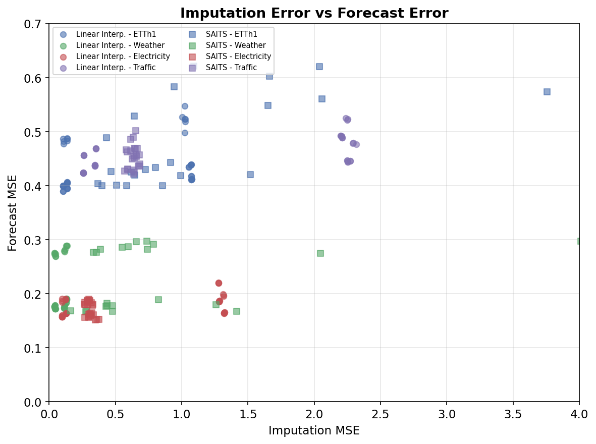

| 数据集 | 方法 | 缺失类型 | 缺失率 | 补值 MSE | 预测 MSE |
|---|---|---|---:|---:|---:|
| ETTh1 | SAITS | 连续片段缺失 | 10% | 0.9331 | 0.4673 |
| ETTh1 | 线性插值 | 连续片段缺失 | 10% | 1.0572 | 0.4468 |
| ETTh1 | SAITS | 连续片段缺失 | 30% | 1.0072 | 0.5036 |
| ETTh1 | 线性插值 | 连续片段缺失 | 30% | 1.0489 | 0.4690 |
| ETTh1 | SAITS | 随机点缺失 | 10% | 3.6544 | 0.5228 |
| ETTh1 | 线性插值 | 随机点缺失 | 10% | 0.1060 | 0.4250 |
| ETTh1 | SAITS | 随机点缺失 | 30% | 1.5182 | 0.5410 |
| ETTh1 | 线性插值 | 随机点缺失 | 30% | 0.1347 | 0.4264 |
| Electricity | SAITS | 连续片段缺失 | 10% | 0.2781 | 0.1690 |
| Electricity | 线性插值 | 连续片段缺失 | 10% | 1.3179 | 0.1757 |
| Electricity | SAITS | 连续片段缺失 | 30% | 0.3013 | 0.1754 |
| Electricity | 线性插值 | 连续片段缺失 | 30% | 1.2809 | 0.1973 |
| Electricity | SAITS | 随机点缺失 | 10% | 0.3435 | 0.1663 |
| Electricity | 线性插值 | 随机点缺失 | 10% | 0.0965 | 0.1677 |
| Electricity | SAITS | 随机点缺失 | 30% | 0.3098 | 0.1726 |
| Electricity | 线性插值 | 随机点缺失 | 30% | 0.1259 | 0.1724 |
| Traffic | SAITS | 连续片段缺失 | 10% | 0.5904 | 0.4470 |
| Traffic | 线性插值 | 连续片段缺失 | 10% | 2.2724 | 0.4563 |
| Traffic | SAITS | 连续片段缺失 | 30% | 0.6382 | 0.4722 |
| Traffic | 线性插值 | 连续片段缺失 | 30% | 2.2199 | 0.5019 |
| Traffic | SAITS | 随机点缺失 | 10% | 0.6482 | 0.4406 |
| Traffic | 线性插值 | 随机点缺失 | 10% | 0.2595 | 0.4347 |
| Traffic | SAITS | 随机点缺失 | 30% | 0.6663 | 0.4533 |
| Traffic | 线性插值 | 随机点缺失 | 30% | 0.3475 | 0.4477 |
| Weather | SAITS | 连续片段缺失 | 10% | 0.3006 | 0.2231 |
| Weather | 线性插值 | 连续片段缺失 | 10% | 0.1156 | 0.2102 |
| Weather | SAITS | 连续片段缺失 | 30% | 0.5171 | 0.2343 |
| Weather | 线性插值 | 连续片段缺失 | 30% | 0.1306 | 0.2213 |
| Weather | SAITS | 随机点缺失 | 10% | 3.0451 | 0.2336 |
| Weather | 线性插值 | 随机点缺失 | 10% | 0.0392 | 0.2089 |
| Weather | SAITS | 随机点缺失 | 30% | 0.6737 | 0.2341 |
| Weather | 线性插值 | 随机点缺失 | 30% | 0.0462 | 0.2064 |

对应散点图见 `../figures/impute_vs_forecast.png`。

---

## 11.3 缺失类型泛化实验

训练阶段只使用随机点缺失（缺失率 30%），测试阶段分别使用 4 种缺失类型。
方法：MissTSM（iTransformer backbone）。数值为 MSE ± std。

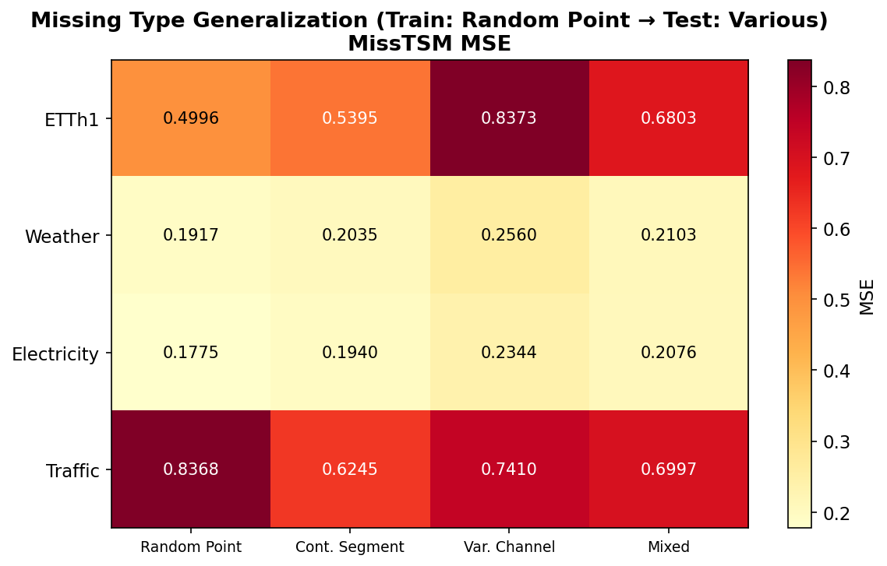

| 数据集 | 测试缺失类型 | MSE | MAE |
|---|---|---:|---:|
| ETTh1 | 随机点缺失 | 0.4996 ± 0.0280 | 0.5058 ± 0.0196 |
| ETTh1 | 连续片段缺失 | 0.5395 ± 0.0304 | 0.5315 ± 0.0206 |
| ETTh1 | 变量通道缺失 | 0.8373 ± 0.0273 | 0.6776 ± 0.0162 |
| ETTh1 | 混合缺失 | 0.6803 ± 0.0441 | 0.6064 ± 0.0258 |
| Weather | 随机点缺失 | 0.1917 ± 0.0041 | 0.2609 ± 0.0070 |
| Weather | 连续片段缺失 | 0.2035 ± 0.0053 | 0.2694 ± 0.0033 |
| Weather | 变量通道缺失 | 0.2560 ± 0.0200 | 0.3123 ± 0.0207 |
| Weather | 混合缺失 | 0.2103 ± 0.0031 | 0.2785 ± 0.0056 |
| Electricity | 随机点缺失 | 0.1775 ± 0.0006 | 0.2887 ± 0.0016 |
| Electricity | 连续片段缺失 | 0.1940 ± 0.0053 | 0.3026 ± 0.0024 |
| Electricity | 变量通道缺失 | 0.2344 ± 0.0034 | 0.3357 ± 0.0017 |
| Electricity | 混合缺失 | 0.2076 ± 0.0005 | 0.3105 ± 0.0011 |
| Traffic | 随机点缺失 | 0.8368 ± 0.2229 | 0.4474 ± 0.1075 |
| Traffic | 连续片段缺失 | 0.6245 ± 0.0125 | 0.3484 ± 0.0037 |
| Traffic | 变量通道缺失 | 0.7410 ± 0.0186 | 0.4180 ± 0.0135 |
| Traffic | 混合缺失 | 0.6997 ± 0.0176 | 0.3849 ± 0.0091 |

---

## 11.5 预测模型复杂度消融实验

相同缺失处理方式下不同预测模型的性能差异（主实验 4 数据集平均）。

| 缺失处理方式 | 预测模型 | MSE | MAE |
|---|---|---:|---:|
| 线性插值 | DLinear | 0.4070 | 0.3744 |
| 线性插值 | PatchTST | 0.3482 | 0.3227 |
| 线性插值 | iTransformer | 0.3338 | 0.3244 |
| SAITS 补值 | DLinear | 0.3951 | 0.3673 |
| SAITS 补值 | PatchTST | 0.3834 | 0.3499 |
| SAITS 补值 | iTransformer | 0.3421 | 0.3358 |

---

## 10. 扩展实验结果

扩展实验覆盖 ETTm1 和 ExchangeRate，缺失类型为变量通道缺失和混合缺失，预测长度 96/192/336/720。
扩展实验的两阶段方法仅使用 iTransformer 作为预测器。
† 标记表示部分种子出现数值溢出，结果基于剩余有效种子，可靠性有限。

### ETTm1

| 缺失类型 | 缺失率 | 预测长度 | 线性插值后预测 | SAITS 后预测 | MissTSM | CRIB | CoIFNet |
|---|---:|---:|---:|---:|---:|---:|---:|
| 变量通道缺失 | 10% | 96 | 0.4402 / 0.4299 | 0.4098 / 0.4126 † | 0.5843 / 0.5368 | 0.4632 / 0.4434 | **0.4383 / 0.4289** |
| 变量通道缺失 | 10% | 192 | **0.4805 / 0.4518** | - | 0.6444 / 0.5790 | 0.5046 / 0.4663 | 0.4821 / 0.4541 |
| 变量通道缺失 | 10% | 336 | 0.5161 / 0.4736 | - | 0.7083 / 0.6138 | 0.5422 / 0.4885 | **0.5147 / 0.4701** |
| 变量通道缺失 | 10% | 720 | **0.5557 / 0.4980** | 0.7080 / 0.5270 † | 0.8000 / 0.6678 | 0.5936 / 0.5158 | 0.5772 / 0.5112 |
| 变量通道缺失 | 30% | 96 | 0.5495 / 0.4891 | - | 0.6776 / 0.5865 | 0.5504 / 0.4901 | **0.5463 / 0.4873** |
| 变量通道缺失 | 30% | 192 | **0.5769 / 0.5050** | 0.6253 / 0.5285 † | 0.7615 / 0.6419 | 0.5785 / 0.5062 | 0.5846 / 0.5083 |
| 变量通道缺失 | 30% | 336 | 0.6101 / 0.5247 | 0.6950 / 0.5539 † | 0.8008 / 0.6583 | **0.6091 / 0.5256** | 0.6103 / 0.5224 |
| 变量通道缺失 | 30% | 720 | **0.6439 / 0.5458** | - | 0.9084 / 0.7222 | 0.6449 / 0.5479 | 0.6531 / 0.5534 |
| 混合缺失 | 10% | 96 | 0.4548 / 0.4361 | 0.5049 / 0.4662 | 0.6010 / 0.5417 | 0.4613 / 0.4426 | **0.4464 / 0.4341** |
| 混合缺失 | 10% | 192 | **0.4837 / 0.4543** | 0.7505 / 0.5640 | 0.6407 / 0.5755 | 0.5074 / 0.4666 | 0.4931 / 0.4582 |
| 混合缺失 | 10% | 336 | 0.5222 / 0.4762 | **0.5175 / 0.4774** | 0.6978 / 0.6092 | 0.5262 / 0.4825 | 0.5282 / 0.4799 |
| 混合缺失 | 10% | 720 | **0.5610 / 0.5010** | 0.6022 / 0.5157 | 0.8025 / 0.6669 | 0.5857 / 0.5151 | 0.5931 / 0.5198 |
| 混合缺失 | 30% | 96 | 0.4577 / 0.4400 | 0.5187 / 0.4811 | 0.6294 / 0.5618 | 0.4668 / 0.4460 | **0.4561 / 0.4379** |
| 混合缺失 | 30% | 192 | **0.4930 / 0.4587** | 0.5232 / 0.4879 | 0.6747 / 0.5970 | 0.5033 / 0.4649 | 0.5037 / 0.4646 |
| 混合缺失 | 30% | 336 | 0.5261 / 0.4796 | **0.5235 / 0.4901** | 0.7306 / 0.6278 | 0.5360 / 0.4869 | 0.5269 / 0.4798 |
| 混合缺失 | 30% | 720 | 0.5664 / 0.5038 | 0.6072 / 0.5455 | 0.7790 / 0.6574 | **0.5629 / 0.5037** | 0.5816 / 0.5152 |

### ExchangeRate

| 缺失类型 | 缺失率 | 预测长度 | 线性插值后预测 | SAITS 后预测 | MissTSM | CRIB | CoIFNet |
|---|---:|---:|---:|---:|---:|---:|---:|
| 变量通道缺失 | 10% | 96 | 0.4712 / 0.3791 | **0.4499 / 0.4062** | 0.7614 / 0.6601 | 0.4978 / 0.4063 | 0.4911 / 0.4030 |
| 变量通道缺失 | 10% | 192 | **0.5587 / 0.4678** | 0.4133 / 0.4140 † | 1.0870 / 0.7955 | 0.6007 / 0.4964 | 0.5807 / 0.4863 |
| 变量通道缺失 | 10% | 336 | 0.7100 / 0.5760 | **0.5833 / 0.5352** | 1.3553 / 0.9110 | 0.8845 / 0.6514 | 0.7734 / 0.6183 |
| 变量通道缺失 | 10% | 720 | 1.2067 / 0.8175 | **1.1084 / 0.7954** | 2.0747 / 1.1460 | 1.9451 / 1.0151 | 1.6992 / 0.9655 |
| 变量通道缺失 | 30% | 96 | **0.8624 / 0.5358** | 1.3237 / 0.7120 | 0.9693 / 0.7414 | 0.8723 / 0.5489 | 0.8653 / 0.5418 |
| 变量通道缺失 | 30% | 192 | **0.9248 / 0.6078** | 0.5537 / 0.4861 † | 1.3418 / 0.8886 | 0.9638 / 0.6352 | 0.9384 / 0.6189 |
| 变量通道缺失 | 30% | 336 | **1.0419 / 0.6947** | 2.0514 / 0.8568 | 1.4849 / 0.9589 | 1.1805 / 0.7640 | 1.0890 / 0.7252 |
| 变量通道缺失 | 30% | 720 | **1.4588 / 0.9047** | 1.0508 / 0.7625 † | 1.8851 / 1.0909 | 2.0265 / 1.0576 | 1.7981 / 1.0073 |
| 混合缺失 | 10% | 96 | **0.4971 / 0.3902** | 0.5086 / 0.4380 | 0.8165 / 0.6845 | 0.5144 / 0.4119 | 0.5077 / 0.4070 |
| 混合缺失 | 10% | 192 | **0.5850 / 0.4804** | 0.7369 / 0.5529 | 1.1379 / 0.8101 | 0.6272 / 0.5116 | 0.6240 / 0.5073 |
| 混合缺失 | 10% | 336 | **0.7288 / 0.5819** | 0.8380 / 0.6141 | 1.3573 / 0.9048 | 0.9112 / 0.6617 | 0.7770 / 0.6140 |
| 混合缺失 | 10% | 720 | **1.1920 / 0.8158** | 1.2292 / 0.8360 | 1.9790 / 1.1255 | 2.0121 / 1.0210 | 1.5535 / 0.9330 |
| 混合缺失 | 30% | 96 | 0.5040 / 0.3981 | 2.9327 / 0.8704 | 0.7674 / 0.6618 | 0.5045 / 0.4069 | **0.4971 / 0.4023** |
| 混合缺失 | 30% | 192 | **0.5810 / 0.4812** | 1.2955 / 0.7278 | 1.0282 / 0.7785 | 0.6138 / 0.5025 | 0.5936 / 0.4918 |
| 混合缺失 | 30% | 336 | **0.7163 / 0.5796** | 0.8774 / 0.6621 | 1.3837 / 0.9149 | 0.8602 / 0.6434 | 0.7680 / 0.6123 |
| 混合缺失 | 30% | 720 | 1.1282 / 0.7870 | **1.1245 / 0.8197** | 2.0423 / 1.1346 | 1.9866 / 1.0173 | 1.5451 / 0.9351 |

---

## 13.4 图形结果

所有图表存放在 `../figures/` 目录下。

### 随机点缺失 vs 连续片段缺失对比

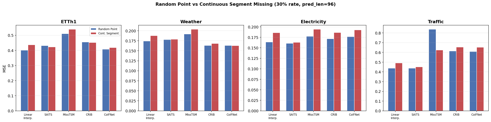

### 缺失率—预测误差曲线（40 张）

**ETTh1**: `curve_ETTh1_continuous_segment_h336.png`, `curve_ETTh1_continuous_segment_h96.png`, `curve_ETTh1_mixed_h96.png`, `curve_ETTh1_random_point_h336.png`, `curve_ETTh1_random_point_h96.png`, `curve_ETTh1_variable_channel_h96.png`

**ETTm1**: `curve_ETTm1_mixed_h192.png`, `curve_ETTm1_mixed_h336.png`, `curve_ETTm1_mixed_h720.png`, `curve_ETTm1_mixed_h96.png`, `curve_ETTm1_variable_channel_h192.png`, `curve_ETTm1_variable_channel_h336.png`, `curve_ETTm1_variable_channel_h720.png`, `curve_ETTm1_variable_channel_h96.png`

**Electricity**: `curve_Electricity_continuous_segment_h336.png`, `curve_Electricity_continuous_segment_h96.png`, `curve_Electricity_mixed_h96.png`, `curve_Electricity_random_point_h336.png`, `curve_Electricity_random_point_h96.png`, `curve_Electricity_variable_channel_h96.png`

**ExchangeRate**: `curve_ExchangeRate_mixed_h192.png`, `curve_ExchangeRate_mixed_h336.png`, `curve_ExchangeRate_mixed_h720.png`, `curve_ExchangeRate_mixed_h96.png`, `curve_ExchangeRate_variable_channel_h192.png`, `curve_ExchangeRate_variable_channel_h336.png`, `curve_ExchangeRate_variable_channel_h720.png`, `curve_ExchangeRate_variable_channel_h96.png`

**Traffic**: `curve_Traffic_continuous_segment_h336.png`, `curve_Traffic_continuous_segment_h96.png`, `curve_Traffic_mixed_h96.png`, `curve_Traffic_random_point_h336.png`, `curve_Traffic_random_point_h96.png`, `curve_Traffic_variable_channel_h96.png`

**Weather**: `curve_Weather_continuous_segment_h336.png`, `curve_Weather_continuous_segment_h96.png`, `curve_Weather_mixed_h96.png`, `curve_Weather_random_point_h336.png`, `curve_Weather_random_point_h96.png`, `curve_Weather_variable_channel_h96.png`

### 补值误差—预测误差散点图

- `impute_vs_forecast.png`（对应 11.2 消融实验）

---

## 备注

1. **SAITS 数值溢出问题**：SAITS 两阶段方法在 102 条实验中出现数值溢出（MSE > 10），主要集中在 SAITS + PatchTST 组合以及扩展数据集（ETTm1、ExchangeRate）的 variable_channel 缺失条件下。上述表格已过滤溢出数据，部分配置仅剩 1-2 个有效种子（以 † 标记）。
2. 主实验表中所有数值为 3 个随机种子的均值。
3. 训练设置：10 epoch，early stopping patience = 3，batch size = 32，学习率 1e-3。
4. 相对退化率的无缺失基准为对应数据集和预测长度下 3 个 baseline 模型（DLinear / PatchTST / iTransformer）的平均 MSE。