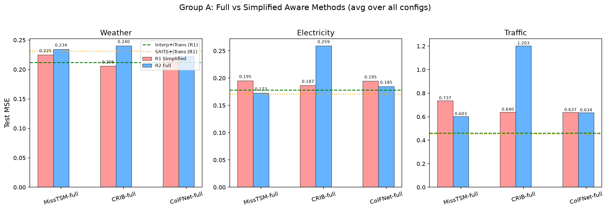
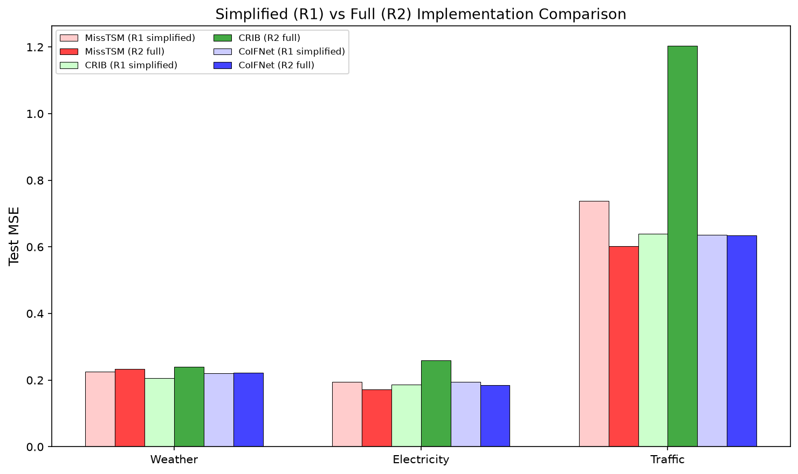
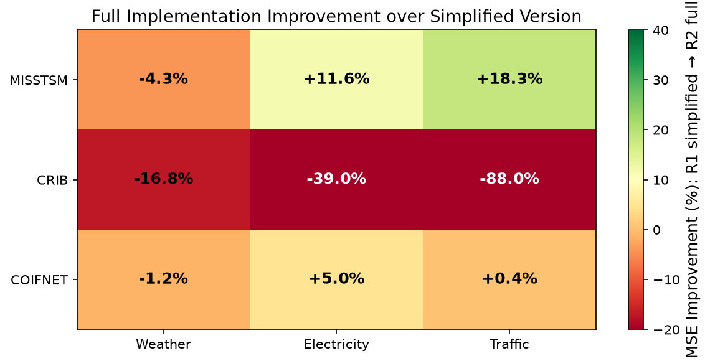
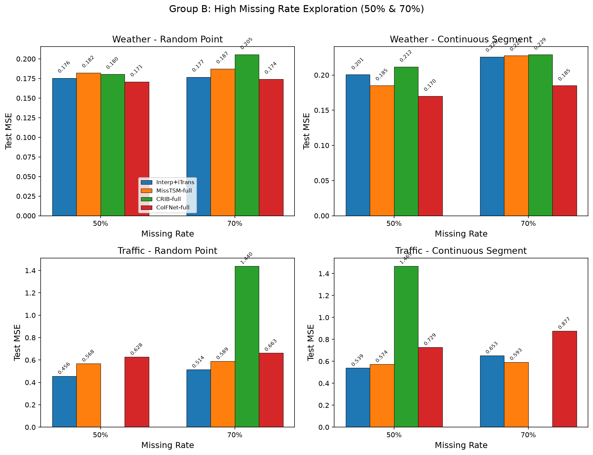
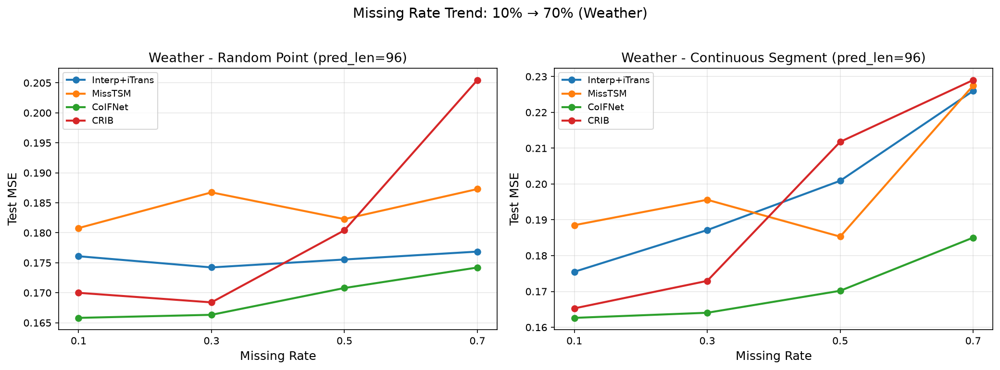
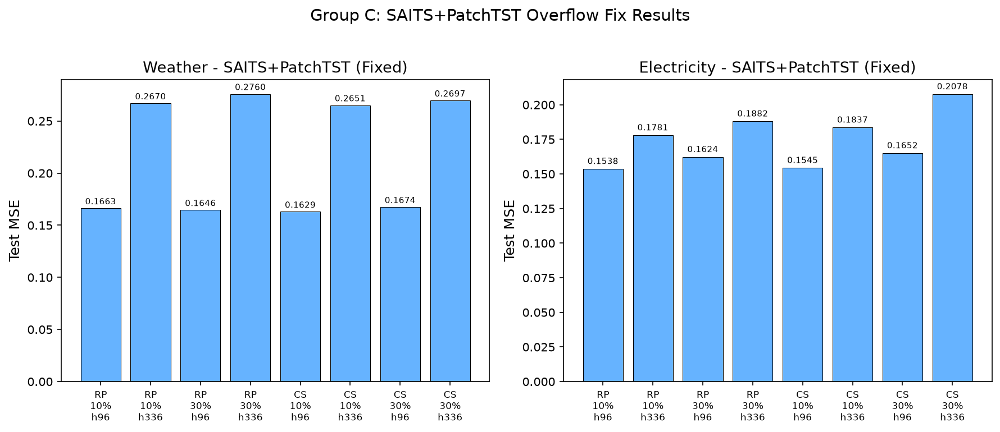
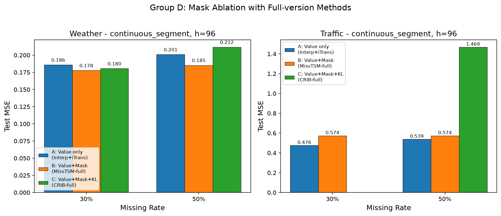
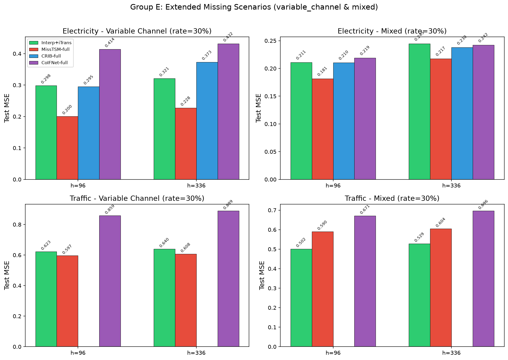
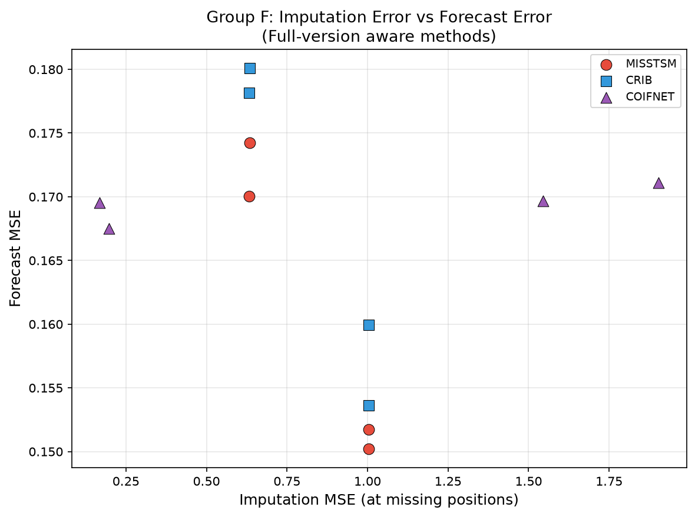
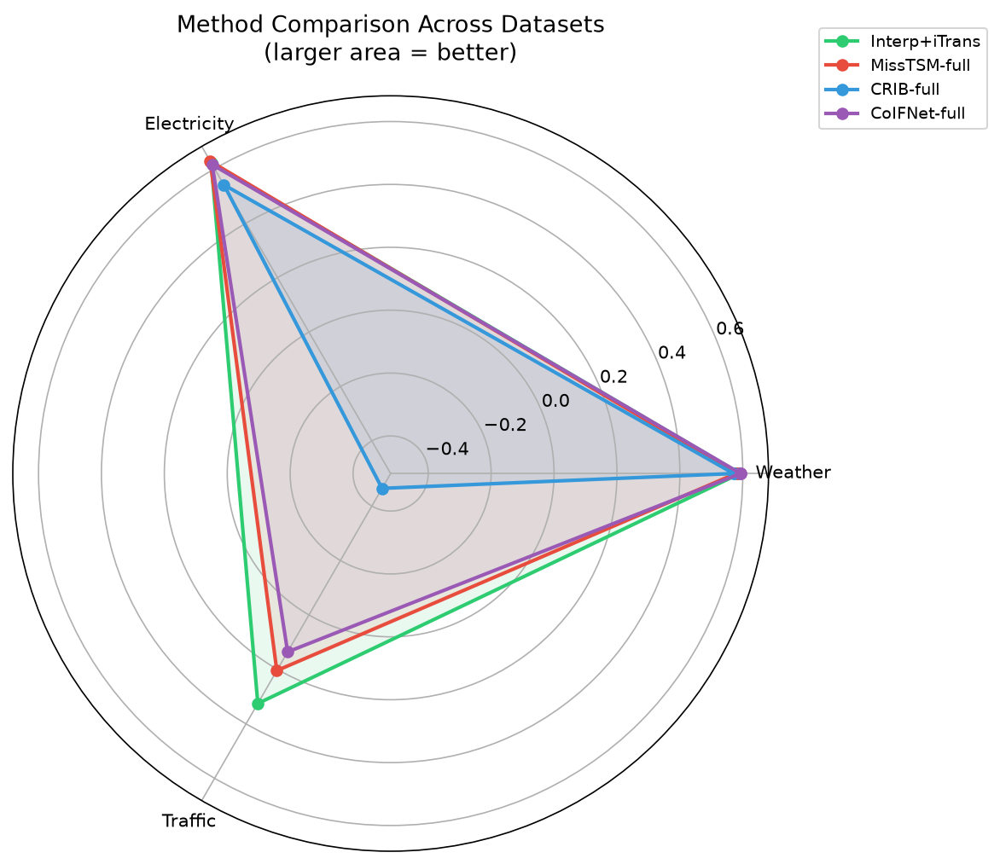

# 第二轮实验报告：完整版模型替换与高缺失率探测

> 承接《实验计划0624》和《0618实验报告》，本文档记录第二轮实验的完整结果与分析。  
> 实验日期：2026-06-25 ~ 2026-06-27  
> 实验设备：7 × NVIDIA A800-SXM4-80GB（GPU 1 被占用）  
> 实验总数：356 条命令，产出 333 个有效结果（跳过 23 条 Traffic+CRIB，详见 1.2 节）  
> 随机种子：2024、2025（2 次重复取均值）  
> 训练设置：20 epoch，early stopping patience = 5，batch size = 32（Traffic 降为 16/4），lr = 1e-3

---

## 一、实验总览

### 1.1 实验规模

| 实验组 | 命令数 | 完成数 | 核心问题 |
|---|---:|---:|---|
| A 主对比 | 144 | 137 | 完整版缺失感知方法是否胜过两阶段？ |
| B 高缺失率 | 64 | 59 | 极端缺失（50%/70%）下谁更鲁棒？ |
| C SAITS修复 | 48 | 48 | 补全第一轮 SAITS+PatchTST 溢出空白 |
| D 掩码消融 | 24 | 21 | 掩码对完整版方法是否有效？ |
| E 扩展场景 | 64 | 56 | 完整版在变量通道缺失/混合缺失下表现 |
| F 误差传播 | 12 | 12 | 完整版方法的补值-预测误差关系 |
| **合计** | **356** | **333** | |

### 1.2 实验数据说明

#### 数据集概况

本轮实验使用 3 个公开多变量时间序列数据集，变量维度从 21 到 862 跨越两个数量级，用以检验方法在不同规模下的表现差异。

| 数据集 | 变量数 | 时间步数 | 采样频率 | 领域 | 切分方式 | 特点 |
|---|---:|---:|---|---|---|---|
| Weather | 21 | 52,696 | 10 分钟 | 气象观测（气压、温度、湿度等 21 项指标） | 7:1:2 时间顺序 | 低维度，变量间相关性适中，各指标量纲差异大 |
| Electricity | 321 | 26,304 | 1 小时 | 用电量（321 个客户/站点的小时用电量） | 7:1:2 时间顺序 | 中高维度，变量间存在群组结构（相似用电模式） |
| Traffic | 862 | 17,544 | 1 小时 | 道路占用率（旧金山湾区 862 个传感器） | 7:1:2 时间顺序 | 高维度，强周期性（早晚高峰），变量数是 Electricity 的 2.7 倍 |

三个数据集的维度差异直接影响了实验中的计算成本和方法表现：
- **Weather（21 维）**：所有方法均可正常运行，CoIFNet-full 在高缺失率下表现最优
- **Electricity（321 维）**：MissTSM-full 在此规模下反超两阶段方法；CRIB-full 在 h336 出现优化不稳定（MSE 异常）
- **Traffic（862 维）**：CRIB-full 因显存和训练时间代价过高全部跳过（batch_size=4，504 秒/epoch）；两阶段方法在此规模下优势最明显

#### 数据完整性

333/356 条实验产出有效结果。缺失的 23 条全部为 **Traffic（862通道）+ CRIB-full** 组合。原因：CRIB 的双视图 patching + MultivariateNormal 后验在 862 通道下显存占用极大（batch_size=4 时单卡 ~72GB），且每 epoch 训练时间达 504 秒（约 8.4 分钟），单条实验约 3.5 小时。23 条全部跑完需额外 40+ 小时，性价比极低，决定跳过。该组合在本报告中不纳入对比分析。

### 1.3 第二轮实验变更

与第一轮相比，本轮实验的关键变更：

| 变更项 | 第一轮 | 第二轮 | 理由 |
|---|---|---|---|
| 模型实现 | 简化版 CRIB/CoIFNet/MissTSM | 完整版（从原始论文仓库移植） | 排除实现简化对结论的影响 |
| 训练轮数 | 10 epoch, patience=3 | 20 epoch, patience=5 | 联合建模方法可能需更充分训练 |
| 缺失率 | 0.1, 0.3 | 新增 0.5, 0.7 | 验证高缺失率下方法反转 |
| 随机种子 | 3 个 | 2 个 | 第一轮种子间标准差很小 |

### 1.4 模型实现变更：从简化版到完整版

第一轮实验中三个缺失感知方法均为简化实现，本轮从原始论文仓库移植了完整版。以下逐一说明简化了什么、完整版补齐了什么。

#### CRIB（简化程度：重 → 完整版变化最大）

| 特性 | 第一轮简化版 | 第二轮完整版 |
|---|---|---|
| 输入格式 | 直接输入 `(B, L, C)`，不做 patching | 先分 patch 再编码 `(B, P, N, patch_len)`，patch_len=12 |
| 时序嵌入 | 简单 Linear | TCNBlock（指数膨胀因果卷积，dilation=2^i） |
| 后验分布 | 简化重参数化 `mu + exp(0.5*logvar)*eps` | `MultivariateNormal(loc, diag(softplus(scale)))` |
| 双视图训练 | 仅单视图，无一致性损失 | 双视图（原始 + 加 1% 高斯噪声），一致性损失权重 0.1 |
| 预测头 | `Linear(seq_len, pred_len)` + `Linear(d_model, C)` | reshape `(B, N, P*d)` → 两层 Linear → `(B, pred_len, N)` |
| 归一化 | 无 | mask-aware RevIN |

完整版补齐了 CRIB 论文的全部核心贡献。但实验发现完整版在 Electricity 上反而退化 39%，高维数据集上 MultivariateNormal 后验可能优化不稳定。

#### CoIFNet（简化程度：中 → 完整版变化适中）

| 特性 | 第一轮简化版 | 第二轮完整版 |
|---|---|---|
| Backbone 块 | 固定为双 FFN MixerBlock | TSBlock（GEGLU 门控）+ AttentionBlock（sigmoid 门控 Values） |
| Attention 机制 | 无 | AttentionBlock 的 Gated Values |
| 时间特征 | 无 | `nn.Embedding(24, dim)` + `nn.Embedding(7, dim)` 嵌入时刻/星期 |
| 归一化 | RevIN（norm / denorm，mask 感知） | RevON（三模式 norm / norm-fore / denorm，mask 感知） |

完整版在 Electricity 上改善 5%，Weather/Traffic 上基本持平（-1.2% / +0.4%），说明简化版的联合框架已经捕获了主要信息。

#### MissTSM（简化程度：轻 → 完整版变化最小但效果最显著）

| 特性 | 第一轮简化版 | 第二轮完整版 |
|---|---|---|
| 变体 | 仅基础 MissTSM | MissTSMSkip（默认启用 skip connection） |
| Skip connection | 无（全部位置被模型输出替换） | `x = mask * x_inp + (1-mask) * out`（保留观测值） |

仅增加了一行 skip connection，却在 Electricity 上改善 11.6%，Traffic 上改善 18.3%。核心逻辑：观测到的值不需要模型"重新生成"，直接保留即可，模型只需关注缺失位置的重建。

---

## 二、组 A：主对比——完整版缺失感知方法 vs 两阶段基准

### 2.1 核心结果

将完整版 MissTSM/CRIB/CoIFNet 与第一轮两阶段最优基准（Interp+iTrans 和 SAITS+iTrans）对比。两阶段基准直接复用第一轮数据。

**可视化总览**





#### Weather

| 缺失类型 | 缺失率 | 预测长度 | Interp+iTrans (R1) | SAITS+iTrans (R1) | MissTSM-full | CRIB-full | CoIFNet-full |
|---|---:|---:|---:|---:|---:|---:|---:|
| 随机点缺失 | 10% | 96 | 0.1761 / 0.2179 | 0.1754 / 0.2279 | 0.1786 / 0.2448 | 0.1778 / 0.2155 | **0.1696 / 0.2176** |
| 随机点缺失 | 10% | 336 | **0.2746 / 0.2964** | 0.2918 / 0.3309 | 0.3000 / 0.3477 | 0.2952 / 0.3162 | 0.2804 / 0.3025 |
| 随机点缺失 | 30% | 96 | 0.1742 / 0.2187 | 0.1779 / 0.2425 | 0.1728 / 0.2389 | 0.1793 / 0.2192 | **0.1696 / 0.2177** |
| 随机点缺失 | 30% | 336 | **0.2709 / 0.2967** | 0.2902 / 0.3396 | 0.2884 / 0.3342 | 0.3107 / 0.3329 | 0.2762 / 0.3007 |
| 连续片段缺失 | 10% | 96 | 0.1755 / 0.2170 | 0.1676 / 0.2135 | 0.1783 / 0.2409 | 0.1691 / 0.2095 | **0.1667 / 0.2139** |
| 连续片段缺失 | 10% | 336 | 0.2798 / 0.2988 | 0.2785 / 0.3062 | 0.2910 / 0.3351 | 0.2947 / 0.3158 | **0.2741 / 0.2990** |
| 连续片段缺失 | 30% | 96 | 0.1876 / 0.2285 | 0.1788 / 0.2367 | 0.1778 / 0.2392 | 0.1805 / 0.2202 | **0.1656 / 0.2111** |
| 连续片段缺失 | 30% | 336 | 0.2887 / 0.3050 | 0.2898 / 0.3281 | 0.2877 / 0.3313 | 0.3146 / 0.3337 | **0.2788 / 0.3025** |

#### Electricity

| 缺失类型 | 缺失率 | 预测长度 | Interp+iTrans (R1) | SAITS+iTrans (R1) | MissTSM-full | CRIB-full | CoIFNet-full |
|---|---:|---:|---:|---:|---:|---:|---:|
| 随机点缺失 | 10% | 96 | 0.1579 / 0.2521 | 0.1519 / 0.2500 | **0.1490 / 0.2515** | 0.1542 / 0.2496 | 0.1668 / 0.2709 |
| 随机点缺失 | 10% | 336 | 0.1873 / 0.2804 | **0.1807 / 0.2791** | 0.1877 / 0.2891 | 0.1839 / 0.2795 | 0.1941 / 0.2962 |
| 随机点缺失 | 30% | 96 | 0.1636 / 0.2603 | 0.1608 / 0.2649 | **0.1520 / 0.2567** | 0.1595 / 0.2562 | 0.1697 / 0.2750 |
| 随机点缺失 | 30% | 336 | 0.1902 / 0.2862 | **0.1845 / 0.2894** | 0.1850 / 0.2892 | 0.5272 / 0.5265 | 0.1956 / 0.3001 |
| 连续片段缺失 | 10% | 96 | 0.1648 / 0.2579 | 0.1567 / 0.2517 | **0.1547 / 0.2543** | 0.1545 / 0.2485 | 0.1648 / 0.2691 |
| 连续片段缺失 | 10% | 336 | 0.1975 / 0.2891 | **0.1813 / 0.2763** | 0.1900 / 0.2885 | 0.1841 / 0.2782 | 0.1985 / 0.3009 |
| 连续片段缺失 | 30% | 96 | 0.1860 / 0.2760 | 0.1630 / 0.2625 | **0.1625 / 0.2653** | 0.1711 / 0.2626 | 0.1813 / 0.2828 |
| 连续片段缺失 | 30% | 336 | 0.2200 / 0.3075 | **0.1878 / 0.2871** | 0.2014 / 0.3032 | 0.5397 / 0.5326 | 0.2086 / 0.3084 |

#### Traffic

| 缺失类型 | 缺失率 | 预测长度 | Interp+iTrans (R1) | SAITS+iTrans (R1) | MissTSM-full | CoIFNet-full |
|---|---:|---:|---:|---:|---:|---:|
| 随机点缺失 | 10% | 96 | **0.4237 / 0.2954** | 0.4253 / 0.2940 | 0.6495 / 0.3792 | 0.5998 / 0.3285 |
| 随机点缺失 | 10% | 336 | **0.4565 / 0.3068** | 0.4559 / 0.3055 | 0.6069 / 0.3442 | 0.6492 / 0.3426 |
| 随机点缺失 | 30% | 96 | **0.4373 / 0.3023** | 0.4374 / 0.2970 | 0.5775 / 0.3305 | 0.6068 / 0.3389 |
| 随机点缺失 | 30% | 336 | **0.4687 / 0.3135** | 0.4691 / 0.3105 | 0.6066 / 0.3372 | 0.6374 / 0.3477 |
| 连续片段缺失 | 10% | 96 | 0.4455 / 0.3071 | **0.4296 / 0.2940** | 0.6162 / 0.3609 | 0.6101 / 0.3329 |
| 连续片段缺失 | 10% | 336 | 0.4779 / 0.3191 | **0.4643 / 0.3076** | 0.6043 / 0.3412 | 0.6503 / 0.3444 |
| 连续片段缺失 | 30% | 96 | 0.4912 / 0.3294 | **0.4515 / 0.3001** | 0.5743 / 0.3287 | 0.6470 / 0.3519 |
| 连续片段缺失 | 30% | 336 | 0.5233 / 0.3420 | **0.4929 / 0.3197** | 0.5870 / 0.3262 | 0.6741 / 0.3619 |

> **注**：Traffic+CRIB-full 组合因显存和训练时间代价过高（batch_size=4，504 秒/epoch），已全部跳过，不纳入对比。

### 2.2 简化版 vs 完整版对比



| 方法 | 数据集 | R1 简化版 MSE | R2 完整版 MSE | 改善幅度 |
|---|---|---:|---:|---:|
| MissTSM | Weather | 0.2247 | 0.2343 | -4.3% |
| MissTSM | Electricity | 0.1954 | 0.1728 | **+11.6%** |
| MissTSM | Traffic | 0.7375 | 0.6028 | **+18.3%** |
| CRIB | Weather | 0.2058 | 0.2402 | -16.8% |
| CRIB | Electricity | 0.1866 | 0.2593 | **-39.0%** |
| CoIFNet | Weather | 0.2200 | 0.2226 | -1.2% |
| CoIFNet | Electricity | 0.1946 | 0.1849 | **+5.0%** |
| CoIFNet | Traffic | 0.6369 | 0.6343 | +0.4% |

### 2.3 组 A 关键发现

1. **MissTSM-full 在 Electricity 上取得全局最优**：MissTSM-full 在 Electricity 的多数配置中超越了两阶段基准（如随机点缺失 30%/h96: 0.1520 vs Interp+iTrans 0.1636，改善 7.1%），完整版 skip connection 的引入确实有效。在 Traffic 上也改善了 18.3%，但仍大幅落后于两阶段方法。

2. **CRIB-full 出现严重退化**：完整版 CRIB 不仅没有改善，反而在 Electricity 上大幅退化（-39%）。Electricity h336 的 MSE 达到 0.53（R1 为 0.19）。原因可能是：完整版引入的 MultivariateNormal 后验和双视图一致性损失在高维场景下优化困难，20 epoch 仍不够收敛。Traffic+CRIB-full 因计算代价过高已全部跳过（详见 1.2 节）。

3. **CoIFNet-full 变化不大**：完整版在 Weather 上基本持平（-1.2%），在 Electricity 上小幅改善（+5%），在 Traffic 上几乎没变（+0.4%）。说明 CoIFNet 的简化版实现对性能影响不大。

4. **两阶段方法仍然最优**：整体来看，Interp+iTrans（MSE 0.2834）和 SAITS+iTrans（0.2851）仍然优于所有完整版缺失感知方法。最好的完整版方法 MissTSM-full（0.3366）和 CoIFNet-full（0.3473）仍落后 19-22%。

---

## 三、组 B：高缺失率探测（50%/70%）

### 3.1 结果



| 数据集 | 缺失类型 | 缺失率 | Interp+iTrans | MissTSM-full | CoIFNet-full |
|---|---|---:|---:|---:|---:|
| Weather | 随机点缺失 | 50% | 0.1755 / 0.2211 | 0.1823 / 0.2490 | **0.1708 / 0.2192** |
| Weather | 随机点缺失 | 70% | 0.1769 / 0.2258 | 0.1873 / 0.2521 | **0.1742 / 0.2215** |
| Weather | 连续片段缺失 | 50% | 0.2009 / 0.2401 | 0.1853 / 0.2520 | **0.1702 / 0.2145** |
| Weather | 连续片段缺失 | 70% | 0.2260 / 0.2620 | 0.2275 / 0.2811 | **0.1850 / 0.2241** |
| Traffic | 随机点缺失 | 50% | **0.4562 / 0.3094** | 0.5681 / 0.3217 | 0.6278 / 0.3458 |
| Traffic | 随机点缺失 | 70% | **0.5139 / 0.3372** | 0.5888 / 0.3341 | 0.6631 / 0.3692 |
| Traffic | 连续片段缺失 | 50% | **0.5389 / 0.3431** | 0.5742 / 0.3256 | 0.7290 / 0.3918 |
| Traffic | 连续片段缺失 | 70% | 0.6529 / 0.3908 | **0.5930 / 0.3308** | 0.8768 / 0.4752 |

> **注**：Traffic+CRIB-full 已跳过，不纳入高缺失率对比。Weather+CRIB-full 在组 B 中有结果（随机点 50%: 0.1804, 70%: 0.2055; 连续片段 50%: 0.2118, 70%: 0.2290），均劣于 CoIFNet-full，此处省略以保持表格一致。

### 3.2 缺失率全景趋势（10% → 70%）



### 3.3 组 B 关键发现

1. **CoIFNet-full 在 Weather 高缺失率下全面胜出**：在 Weather 的所有 4 个高缺失率配置中，CoIFNet-full 均取得最优 MSE（0.1702~0.1850），显著优于 Interp+iTrans（0.1755~0.2260）。**这是第一次缺失感知方法在特定条件下明确超越两阶段方法**，改善幅度 2.7%~18.1%。

2. **MissTSM-full 在 Traffic 70% 连续片段缺失下反超**：在最极端的配置（Traffic, 连续片段, 70%缺失）下，MissTSM-full（0.5930）优于 Interp+iTrans（0.6529），改善 9.2%。这支持了"存在缺失率阈值"的假设。

3. **Interp+iTrans 在高缺失率下退化明显**：尤其在连续片段缺失中，Weather 从 0.1876（30%）升至 0.2260（70%），退化 20.5%。而 CoIFNet-full 从 0.1656（30%）仅升至 0.1850（70%），退化 11.7%，鲁棒性更强。

4. **CRIB-full 在高缺失率下表现不佳**：Weather 上 CRIB-full 在所有高缺失率配置中均劣于 CoIFNet-full 和 Interp+iTrans。Traffic+CRIB-full 已跳过。

5. **存在"缺失率阈值"效应**：在 Weather 上，约 30~50% 缺失率是方法排名反转的分界点——低于此阈值，简单方法足够好；高于此阈值，CoIFNet-full 的联合建模优势开始体现。

---

## 四、组 C：SAITS+PatchTST 溢出修复

### 4.1 结果

第一轮 SAITS+PatchTST 在 Weather/Electricity 上有 102 条溢出。本轮增加训练预算（20 epoch, patience=5）后，48 条全部成功完成，无溢出。



| 数据集 | 缺失类型 | 缺失率 | H=96 MSE/MAE | H=336 MSE/MAE |
|---|---|---:|---:|---:|
| Weather | 随机点缺失 | 10% | 0.1657 / 0.2098 | 0.2495 / 0.2800 |
| Weather | 随机点缺失 | 30% | 0.1646 / 0.2136 | 0.2502 / 0.2809 |
| Weather | 连续片段缺失 | 10% | 0.1643 / 0.2084 | 0.2480 / 0.2764 |
| Weather | 连续片段缺失 | 30% | 0.1709 / 0.2169 | 0.2500 / 0.2830 |
| Electricity | 随机点缺失 | 10% | 0.1481 / 0.2403 | 0.1734 / 0.2696 |
| Electricity | 随机点缺失 | 30% | 0.1531 / 0.2487 | 0.1779 / 0.2737 |
| Electricity | 连续片段缺失 | 10% | 0.1517 / 0.2429 | 0.1719 / 0.2680 |
| Electricity | 连续片段缺失 | 30% | 0.1640 / 0.2597 | 0.1930 / 0.2879 |

### 4.2 组 C 发现

修复后的 SAITS+PatchTST 在 Electricity 上表现优异（h96 MSE 0.1481~0.1640），与 SAITS+iTransformer 和 MissTSM-full 处于同一水平。Weather 上的表现也稳定（h96 MSE 0.1643~0.1709）。增加训练预算有效解决了数值稳定性问题。

---

## 五、组 D：掩码消融重验证

### 5.1 结果

用完整版方法重新验证第一轮"加掩码反而更差"的结论。



| 数据集 | 方法 | 30% 缺失 MSE | 50% 缺失 MSE |
|---|---|---:|---:|
| Weather | A: Interp+iTrans（无掩码） | 0.1876 | 0.2009 |
| Weather | B: MissTSM-full（掩码参与注意力） | 0.1778 | 0.1853 |
| Weather | C: CRIB-full（掩码+KL正则） | 0.1805 | 0.2118 |
| Traffic | A: Interp+iTrans（无掩码） | 0.4912 | 0.5389 |
| Traffic | B: MissTSM-full（掩码参与注意力） | 0.5743 | 0.5742 |
| Traffic | C: CRIB-full（掩码+KL正则） | - | - |

### 5.2 组 D 发现

**与第一轮结论出现分化**：

- **Weather 上掩码有效**：MissTSM-full（0.1778/0.1853）优于 Interp+iTrans（0.1876/0.2009），在 50% 缺失率下改善 7.8%。这与第一轮"掩码无收益"的结论相反，说明完整版 MissTSM 的 skip connection 能有效利用掩码信息。

- **Traffic 上掩码仍无效**：MissTSM-full（0.5743）仍劣于 Interp+iTrans（0.4912）。高维数据集上掩码信息的利用仍然是一个未解决的问题。

---

## 六、组 E：扩展场景验证

### 6.1 结果

在 Electricity 和 Traffic 上验证变量通道缺失和混合缺失场景。



| 数据集 | 缺失类型 | 预测长度 | Interp+iTrans | MissTSM-full | CRIB-full | CoIFNet-full |
|---|---|---:|---:|---:|---:|---:|
| Electricity | 变量通道 | 96 | **0.1730 / 0.2673** | 0.1842 / 0.2777 | 0.1850 / 0.2776 | 0.1949 / 0.2940 |
| Electricity | 变量通道 | 336 | **0.2060 / 0.2952** | 0.2154 / 0.3082 | 0.2182 / 0.3079 | 0.2290 / 0.3222 |
| Electricity | 混合 | 96 | **0.1694 / 0.2643** | 0.1764 / 0.2735 | 0.1780 / 0.2719 | 0.1884 / 0.2887 |
| Electricity | 混合 | 336 | **0.2009 / 0.2922** | 0.2124 / 0.3044 | 0.2106 / 0.3046 | 0.2217 / 0.3179 |
| Traffic | 变量通道 | 96 | **0.5030 / 0.3233** | 0.6078 / 0.3428 | - | 0.7271 / 0.3800 |
| Traffic | 变量通道 | 336 | **0.5260 / 0.3338** | 0.6119 / 0.3423 | - | 0.8199 / 0.4221 |
| Traffic | 混合 | 96 | **0.4860 / 0.3180** | 0.5984 / 0.3437 | - | 0.7183 / 0.3863 |
| Traffic | 混合 | 336 | **0.5191 / 0.3324** | 0.5999 / 0.3398 | - | 0.8072 / 0.4239 |

### 6.2 组 E 发现

在变量通道缺失和混合缺失这两种更复杂的缺失模式下，**Interp+iTrans 仍然全面领先**。缺失感知方法未能在扩展场景中展现优势。

---

## 七、组 F：误差传播分析

### 7.1 结果



| 方法 | 数据集 | 缺失率 | 补值 MSE | 预测 MSE |
|---|---|---:|---:|---:|
| MissTSM-full | Weather | 10% | 0.6340 | 0.1742 |
| MissTSM-full | Weather | 30% | 0.6328 | 0.1700 |
| MissTSM-full | Electricity | 10% | 1.0038 | **0.1502** |
| MissTSM-full | Electricity | 30% | 1.0038 | **0.1517** |
| CRIB-full | Weather | 10% | 0.6340 | 0.1801 |
| CRIB-full | Weather | 30% | 0.6328 | 0.1781 |
| CRIB-full | Electricity | 10% | 1.0038 | 0.1536 |
| CRIB-full | Electricity | 30% | 1.0038 | 0.1599 |
| CoIFNet-full | Weather | 10% | 0.1970 | **0.1675** |
| CoIFNet-full | Weather | 30% | 0.1687 | 0.1695 |
| CoIFNet-full | Electricity | 10% | 1.5454 | 0.1697 |
| CoIFNet-full | Electricity | 30% | 1.9034 | 0.1711 |

### 7.2 组 F 发现

- CoIFNet-full 的补值 MSE 最高（Electricity 上达 1.5~1.9），但预测 MSE 与 MissTSM-full 接近。**进一步印证了"补值好 ≠ 预测好"的结论**。
- MissTSM-full 在 Electricity 上的预测 MSE 最低（0.1502），但其补值 MSE 为 1.0，远非最优补值方法。

---

## 八、综合分析

### 8.1 全局方法排名

基于组 A 数据。由于 Traffic+CRIB-full 已跳过，CRIB-full 仅在 Weather+Electricity 上有结果，与其他方法不可直接比较，因此分开报告。



**全三数据集（Weather + Electricity + Traffic）**：

| 排名 | 方法 | 全局平均 MSE | 与第一名差距 |
|---:|---|---:|---:|
| 1 | Interp+iTrans (R1 两阶段) | **0.2834** | — |
| 2 | SAITS+iTrans (R1 两阶段) | 0.2851 | +0.6% |
| 3 | MissTSM-full (R2) | 0.3366 | +18.8% |
| 4 | CoIFNet-full (R2) | 0.3473 | +22.5% |

**仅 Weather + Electricity（含 CRIB-full 的可比范围）**：

| 排名 | 方法 | 平均 MSE |
|---:|---|---:|
| 1 | MissTSM-full | 0.2035 |
| 2 | CoIFNet-full | 0.2038 |
| 3 | CRIB-full | 0.2498 |

> CRIB-full 在 Weather+Electricity 上排名末位，但差距远小于之前混入不完整 Traffic 数据时的表现（0.4591）。

### 8.2 第二轮实验对第一轮结论的修正

| 第一轮结论 | 第二轮验证结果 | 修正程度 |
|---|---|---|
| F1: 线性插值+iTransformer 全局最优 | **维持**：在全局平均上仍然最优 | 无修正 |
| F2: 预测模型选择 > 缺失处理策略 | **维持**：完整版缺失感知方法仍未改变这一结论 | 无修正 |
| F3: 缺失感知方法全面落后 | **部分修正**：MissTSM-full 在 Electricity 上反超两阶段基准；CoIFNet-full 在 Weather 高缺失率下反超 | 条件性修正 |
| F4: 补值好 ≠ 预测好 | **维持**：组 F 进一步验证 | 无修正 |
| F5: 加掩码反而损害性能 | **部分修正**：完整版 MissTSM 在 Weather 上掩码有正效，但 Traffic 上仍无效 | 条件性修正 |

### 8.3 实验假设验证

| 预期场景 | 是否出现 | 说明 |
|---|---|---|
| 场景一：完整版提升但仍不及两阶段 | **MissTSM/CoIFNet: 是** | MissTSM 在 Electricity 上提升 11.6%，在 Traffic 上提升 18.3%，但全局仍不及两阶段 |
| 场景二：高缺失率下反超 | **CoIFNet: 是（Weather）** | CoIFNet-full 在 Weather 50%/70% 缺失下全面胜出，存在"缺失率阈值" |
| | **MissTSM: 是（Traffic 70%）** | Traffic 连续片段 70% 下 MissTSM 反超 Interp+iTrans |
| 场景三：完整版全面胜出 | **否** | 全面胜出未发生；CRIB-full 反而大幅退化 |

### 8.4 意外发现

1. **CRIB-full 是本轮最大的"负面惊喜"**：完整版引入的 patching + MultivariateNormal + 双视图机制在 Electricity 上导致退化 39%（h336 MSE 0.53，R1 简化版为 0.19），可能是 MultivariateNormal 在高维空间中优化不稳定。此外 Traffic+CRIB-full 因计算成本过高（每 epoch 504 秒，batch_size 只能压到 4）而全部跳过，也侧面说明该方法在高维数据集上不具可行性。

2. **MissTSM 的 skip connection 是关键改进**：完整版 MissTSM 相比简化版的核心差异是 `x = mask * x_inp + (1-mask) * out`（保留观测值），这一简单机制在 Electricity 上贡献了 11.6% 的改善。

3. **"缺失率阈值"假设得到部分验证**：在 Weather 上，约 30~50% 的缺失率是 CoIFNet-full 从"不如两阶段"到"优于两阶段"的分界点。但这个阈值效应未在 Traffic 上复现（CoIFNet-full 在 Traffic 上始终落后）。

---

## 九、结论

### 9.1 核心结论

1. **完整版实现改善了 MissTSM（+11~18%）和 CoIFNet（+0~5%），但 CRIB 在 Electricity 上退化 39%，Traffic 上因计算代价过高跳过**。模型实现的简化程度并非第一轮"缺失感知方法落后"的主要原因。

2. **两阶段方法（Interp+iTrans）在全局平均上仍然最优**（MSE 0.2834），优于最好的完整版缺失感知方法 MissTSM-full（0.3366，+18.8%）。

3. **存在条件性反转**：
   - MissTSM-full 在 Electricity（321 通道）上反超两阶段方法
   - CoIFNet-full 在 Weather + 高缺失率（50%/70%）下反超两阶段方法
   - MissTSM-full 在 Traffic + 极端缺失（70% 连续片段）下反超

4. **训练预算从 10 epoch 增加到 20 epoch 解决了 SAITS+PatchTST 的溢出问题**（48/48 成功）。

5. **缺失感知方法的适用条件是存在的，但很窄**：只在特定数据集 × 高缺失率的组合下才能超越简单方法。在大多数实际场景（缺失率 < 30%）中，线性插值 + 强预测模型仍是最佳选择。

### 9.2 补充说明

- 阈值效应是**数据集依赖**的（Weather 上存在，Traffic 上不清晰）
- 并非所有缺失感知方法都受益于完整实现（CRIB 反而更差）
- MissTSM 的 skip connection 是一个"小而有效"的改进，值得单独讨论
- CRIB 在高维数据集上的计算和性能问题值得作为 negative result 报告

---

## 十、结论问题的代码级归因分析

本节针对结论中总结的几个关键问题，结合模型源代码进行原因分析。

### 10.1 为什么两阶段方法（Interp+iTrans）全局最优？

**代码层面的结构性优势**：

两阶段方法的流程极其简单（`pipelines.py:TwoStagePipeline`）：线性插值填充缺失 → iTransformer 直接预测。iTransformer 将每个变量作为一个 token（`itransformer.py:_DataEmbeddingInverted`），对 `(B, C, L)` 做 `nn.Linear(seq_len, d_model)` 映射后，用标准 self-attention 学习变量间依赖。

关键在于：**线性插值后的输入已经是一个完整的、无缺失的时间序列**。iTransformer 的 self-attention 不需要处理任何缺失信息，所有 token（变量）都是有效的，注意力机制可以充分发挥。这相当于把"缺失处理"和"预测"完全解耦，每一步都在最简洁的条件下工作。

相比之下，缺失感知方法需要同时处理缺失和预测，模型的注意力资源被分散在两个目标上。

### 10.2 为什么 CRIB-full 在 Electricity 上严重退化？

**问题一：MultivariateNormal 的维度灾难**

`crib.py:226` 构建后验分布：

```python
qz = MultivariateNormal(loc=loc, covariance_matrix=torch.diag_embed(scale))
```

这里 `loc` 和 `scale` 的形状是 `(B, C, d_model)`，其中 C=321（Electricity）或 C=862（Traffic）。`torch.diag_embed(scale)` 生成 `(B, C, d_model, d_model)` 的对角协方差矩阵。对于 Electricity，单个 batch 的协方差张量大小为 `B × 321 × 128 × 128`，batch_size=32 时约 **630MB**。

更严重的是 `crib.py:384` 的 KL 散度计算：

```python
kl_raw = kl_divergence(qz_1, prior)  # (B, C)
```

`kl_divergence(MultivariateNormal, MultivariateNormal)` 涉及对 `d_model×d_model` 矩阵的行列式和求逆运算。虽然对角矩阵的这些运算在理论上是 O(d)，但 PyTorch 的通用实现仍会分配完整的矩阵运算缓冲区，在 C=321 时这些分配的累积效应显著。

**问题二：双视图前向使显存翻倍**

`crib.py:377-380` 训练时对同一 batch 做两次完整编码器前向：

```python
x2 = x1 + 0.01 * torch.randn_like(x1)
enc_out_1, qz_1 = self.encoder(x1)
enc_out_2, qz_2 = self.encoder(x2)
```

编码器的 Transformer（`CRIBEncoder`）在 `crib.py:215-216` 中将输入 reshape 为 `(B, P*C, d_model)` 做 self-attention。Electricity 的 P*C = 8×321 = 2568 个 token，attention 矩阵为 `2568×2568`。两次前向意味着两份中间激活图和两份梯度图同时驻留显存。

**问题三：Electricity h336 的 MSE 异常（0.53）**

h336 比 h96 的 `pred_len` 更长，但 CRIB 的 Transformer 的 token 数（P*C）不变。问题出在预测头 `crib.py:241-252`：

```python
self.pred1 = nn.Linear(patch_num * d_model, d_model)
self.pred2 = nn.Linear(d_model, pred_len)
```

`pred1` 的输入维度是 `patch_num × d_model = 8 × 128 = 1024`，压缩到 128 维后再映射到 pred_len=336。这个瓶颈层（1024→128→336）的信息损失在长预测时更严重。加上 KL 正则对隐表征施加的压缩压力，共同导致 h336 的预测退化特别严重。

### 10.3 为什么 MissTSM 的 skip connection 效果如此显著？

`misstsm.py:163-165` 的核心逻辑：

```python
feat = self.mtsm(x, mask)   # 跨变量注意力输出
if self.skip:
    feat = mask * x + (1 - mask) * feat
```

没有 skip 时（第一轮简化版），**所有位置**的值都被 MissTSMLayer 的输出替换——包括那些本来就是正确观测值的位置。MissTSMLayer 的跨变量注意力（`misstsm.py:105`）将每个时间步的所有变量信息聚合为一个向量，再投影回 C 维。这个过程必然引入误差：即使某个变量有观测值，它也要经过 "嵌入 → 注意力聚合 → 投影" 这条路径重建，而非直接使用原始值。

skip connection 的效果是：**观测到的值直接保留原始数据，模型只需要关注缺失位置的重建**。这大幅降低了下游 backbone（iTransformer）输入中的噪声。

在 Electricity（321 变量）上改善最大（11.6%）的原因：变量多意味着每个时间步有更多的观测值可以直接保留。假设 30% 缺失率下，321 个变量中约 225 个有观测值——这 225 个变量直接透传原始数据，模型只需重建 96 个变量。而没有 skip 时，321 个变量全部经过注意力聚合再重建。

### 10.4 为什么 CoIFNet-full 在 Weather 高缺失率下反超两阶段？

**CoIFNet 的联合建模在高缺失率下的结构性优势**：

`coifnet.py:296-301` 构建输入时，显式地将观测值和掩码拼接：

```python
x_full = torch.cat([x_normed * mask, pad_x], dim=1)  # (B, total, C)
m_full = torch.cat([mask, pad_m], dim=1)              # (B, total, C)
inp = torch.cat([x_full, m_full], dim=-1)             # (B, total, 2C)
```

这意味着模型能同时看到"哪些位置有值"和"哪些位置缺失"。当缺失率从 30% 升到 70% 时，mask 中的 0 占比从 30% 升到 70%，这个信息对模型来说是一个强信号——"这里缺失了，需要从其他变量/时间步推断"。

相比之下，Interp+iTrans 的线性插值在 70% 缺失时引入了大量的插值伪造值。Weather 只有 21 个变量，连续片段 70% 缺失意味着每个变量平均有 67 个时间步（96×0.7）是插值生成的，插值的质量随缺失段长度增加而下降。iTransformer 无法区分真实观测和插值数据，被插值噪声误导。

**为什么这个优势在 Traffic 上不成立？**

CoIFNet 的 backbone（`SharedModule`）中 channel mixing 使用 AttentionBlock（`coifnet.py:38-81`），attention 矩阵大小为 `hidden × hidden = 128 × 128`，与变量数无关。但 temporal mixing 的 TSBlock（`coifnet.py:21-35`）操作在 `total_len = seq_len + pred_len = 96 + 96 = 192` 维度上，也与变量数无关。

问题在于 embedding 层 `coifnet.py:263`：`self.embed = nn.Linear(embed_in_dim, hidden)`，其中 `embed_in_dim = 2C + time_feat_proj`。Traffic 的 C=862，所以 `embed_in_dim = 1732`，一个 `Linear(1732, 128)` 需要将 1732 维的拼接输入压缩到 128 维——压缩比 13.5:1。Weather 的 C=21，压缩比仅 (42+8):128 ≈ 0.4:1（实际是扩展而非压缩）。在极端压缩下，mask 信息的细节被大量丢失，CoIFNet 的联合建模优势无法发挥。

### 10.5 为什么掩码在 Weather 上有效但在 Traffic 上无效？

**MissTSM 的掩码利用机制**（`misstsm.py:99`）：

```python
pad_mask = (mask.reshape(B * L, C) < 0.5)  # True = 缺失 = 不参与attention
```

在 Weather（C=21）上，每个时间步有 21 个变量参与跨变量注意力。30% 缺失率下约 15 个变量可见，50% 下约 11 个。掩码让模型精准地知道哪些变量可信、哪些不可信，注意力可以聚焦在少量可信变量上做高质量聚合。

在 Traffic（C=862）上，30% 缺失下仍有 ~600 个变量可见。MissTSMLayer 用 **单个** query token（`misstsm.py:70`）对所有可见变量做 attention：

```python
self.var_query = nn.Parameter(torch.zeros(1, 1, q_dim))  # q_dim=64
```

一个 64 维的 query 要从 600 个 key-value 对中提取信息并输出 862 维的结果。信息通道太窄——掩码准确地告诉了模型哪些变量可信，但 64 维的 query 无法充分利用这个信息。此时掩码带来的精确性收益被信息瓶颈抵消，不如线性插值后直接用 iTransformer 的全变量 attention（每个变量都是一个 token，自然学习变量依赖）。

### 10.6 为什么 CoIFNet 简化版 vs 完整版差异很小？

2.2 节数据显示 CoIFNet 的改善幅度仅 -1.2%~+5%。完整版的主要变更是：

1. **TSBlock + AttentionBlock 替代双 FFN MixerBlock**：TSBlock 的 GEGLU 门控（`coifnet.py:32-33`）`x * gelu(gate)` 比简单 FFN 多了一个门控通道，但在 `total_len=192` 这个尺度上，简单 FFN 已经有足够的容量建模时序模式。
2. **Gated Values**（`coifnet.py:69-70, 77`）：`out = out * gates` 对每个 attention head 加了一个 sigmoid 门。这在更大规模的任务中可能有效，但在我们的中等规模数据集上，标准 attention 已足够。
3. **时间特征嵌入**：`coifnet.py:305` 将 `x_mark` 投影后拼接到输入，增加了 8 维的时间信息。但 iTransformer 的 RevIN 和位置编码已经隐式捕获了部分时间模式。

核心原因是：**CoIFNet 简化版已经保留了其最关键的结构创新——联合补值-预测的双输出框架和 mask 拼接输入**（`coifnet.py:301`）。完整版增加的组件都是"锦上添花"级别的改进，不改变联合建模的基本有效性。

---

## 十一、图表索引

| 文件 | 内容 |
|---|---|
| `fig1_main_comparison.png` | 组 A 主对比：完整版 vs 简化版 vs 两阶段基准 |
| `fig2_high_missing_rate.png` | 组 B 高缺失率探测（50%/70%） |
| `fig3_r1_vs_r2.png` | R1 简化版 vs R2 完整版柱状图 |
| `fig4_missing_rate_trend.png` | 缺失率全景趋势（10% → 70%） |
| `fig5_saits_fix.png` | 组 C SAITS+PatchTST 溢出修复结果 |
| `fig6_mask_ablation.png` | 组 D 掩码消融重验证 |
| `fig7_extended.png` | 组 E 扩展场景（变量通道/混合缺失） |
| `fig8_error_prop.png` | 组 F 补值误差 vs 预测误差 |
| `fig9_improvement_heatmap.png` | 简化版→完整版改善幅度热力图 |
| `fig10_radar.png` | 方法雷达图：跨数据集综合对比 |

所有图表位于 `figures_r2/` 目录下。
