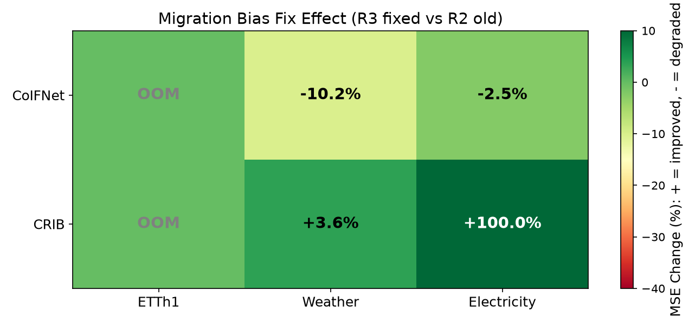
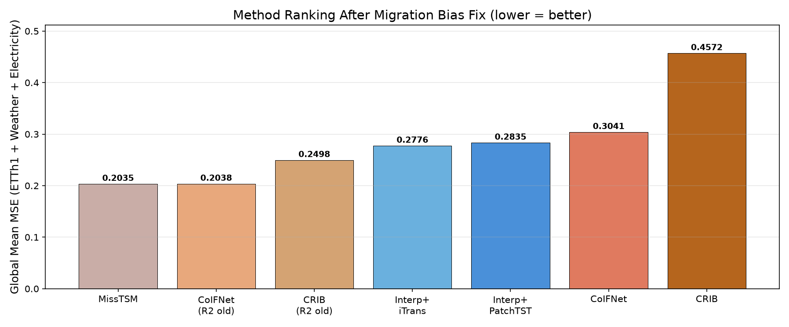
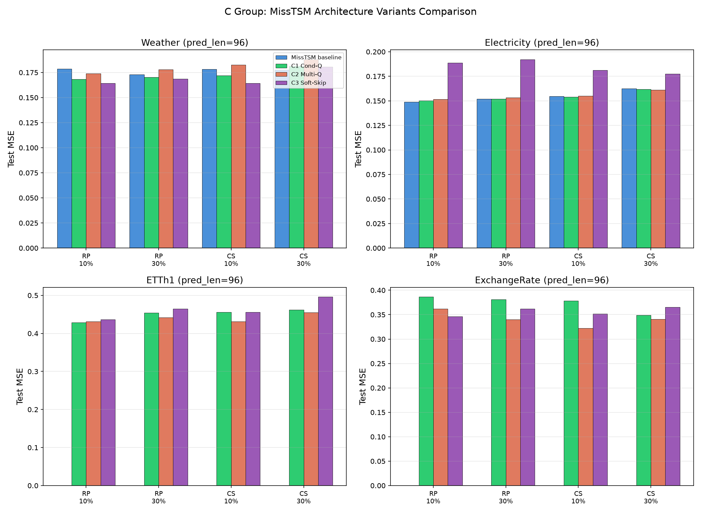
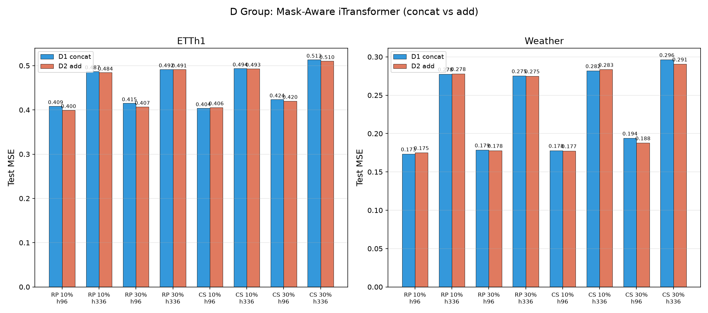
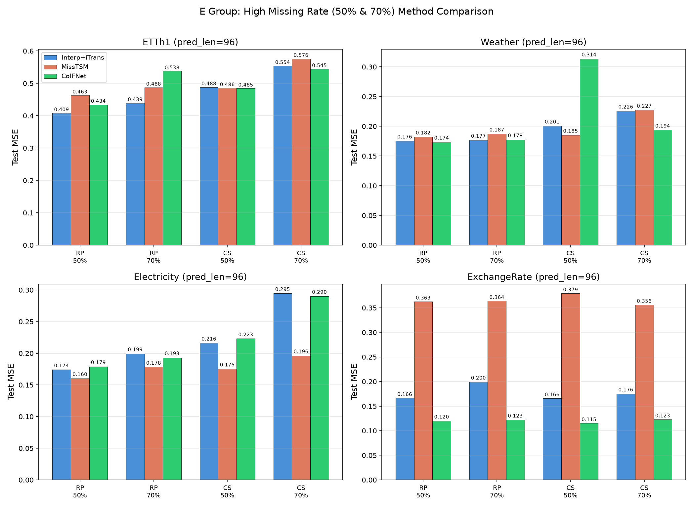
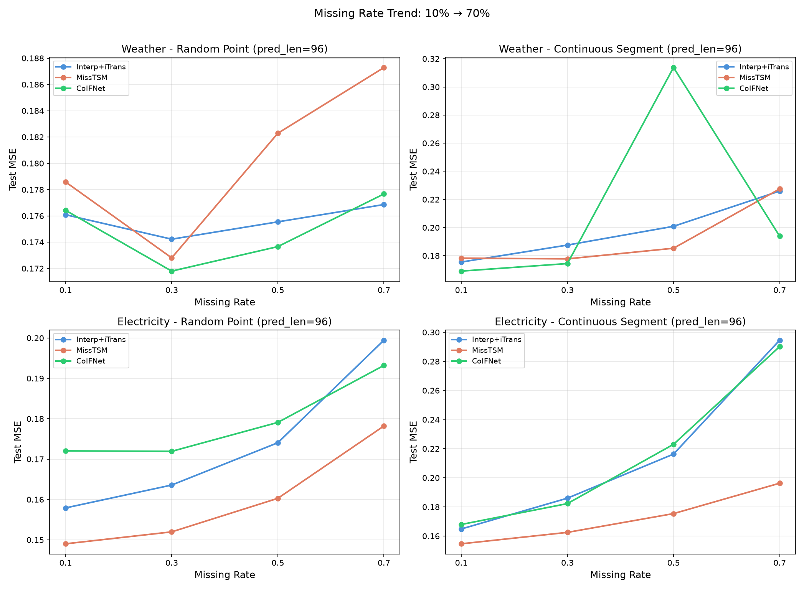
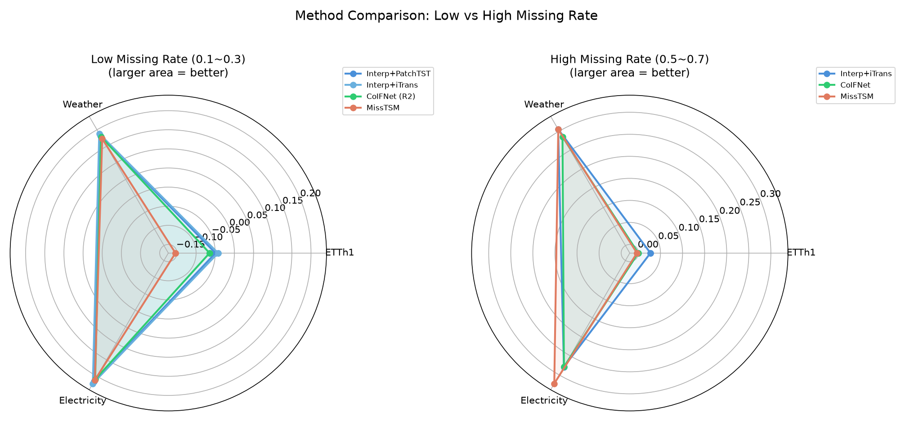
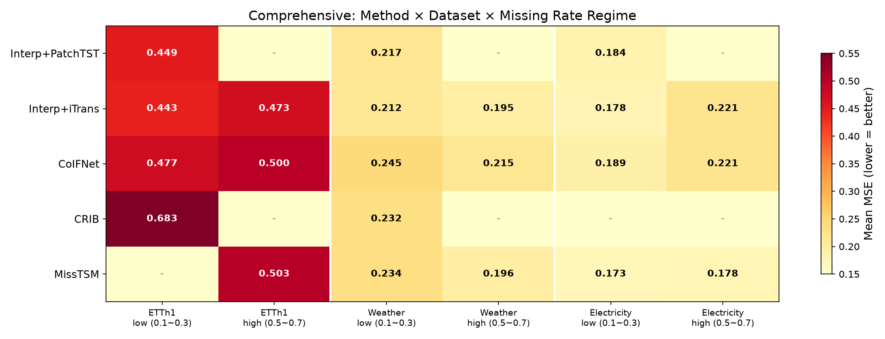

# 第三轮实验报告（R3）

> 承接《0702实验与论文分析报告》和《实验计划0702》，本文档记录第三轮实验的结果与分析。  
> 实验日期：2026-07-03 ~ 2026-07-04  
> 实验设备：8 × NVIDIA A800-SXM4-80GB  
> 实验总数：384 条命令（A/B 128 + CDE 256），产出 368 个有效结果  
> 随机种子：2024、2025（2 次重复取均值）  
> 训练设置：20 epoch，早停 patience = 5，batch size = 32，lr = 1e-3

---

## 一、实验总览

### 1.1 实验背景

第二轮实验（R2）揭示了核心矛盾：**缺失感知方法在理论上应优于两阶段方法，但实验中仅在窄条件下成立**。《0702实验与论文分析报告》进一步通过代码级归因分析，发现 CoIFNet 和 CRIB 的实现与原仓库存在差异，可能影响了 R2 的公平性。

R3 分为两个阶段：
- **A/B 组**（原仓库对齐对比验证）：回答"原仓库对齐对比后，缺失感知方法能否缩小甚至反超两阶段方法？"
- **C/D/E 组**（架构改进与极端条件）：探索 MissTSM 架构改进、Mask-Aware 两阶段增强、以及高缺失率下的方法鲁棒性

### 1.2 实验规模

| 实验组 | 描述 | 命令数 | 完成数 | 失败原因 |
|---|---|---:|---:|---|
| A2: CoIFNet 原仓库对齐 | 对齐原仓库的三项结构差异 | 64 | 64 | — |
| B1: CRIB 原仓库位置编码对齐 | 位置编码对齐原仓库 | 64 | 48 | 16 条 Electricity 显存溢出 |
| C1: MissTSM 条件化 query | 时间步条件化 query | 32 | 32 | — |
| C2: MissTSM 多 query 聚合 | 多 query (K=8) + 均值池化 | 32 | 32 | — |
| C3: MissTSM 学习式跳跃 | 学习式加权 skip | 32 | 32 | — |
| D1: Mask-Aware concat | mask 拼接输入 | 32 | 32 | — |
| D2: Mask-Aware add | mask 加性嵌入 | 32 | 32 | — |
| E: 高缺失率实验 | 3 方法 × 高缺失率 (0.5/0.7) | 96 | 96 | — |
| **合计** | | **384** | **368** | |

### 1.3 数据集

本轮实验使用 4 个数据集，覆盖从低维到高维：

| 数据集 | 变量数 | 时间步数 | 采样频率 | 说明 |
|---|---:|---:|---|---|
| ETTh1 | 7 | 17,420 | 1 小时 | 低维，电力变压器温度 |
| ExchangeRate | 8 | 7,588 | 1 天 | 低维，汇率数据（R3 新增） |
| Weather | 21 | 52,696 | 10 分钟 | 中维，气象观测 |
| Electricity | 321 | 26,304 | 1 小时 | 高维，用电量 |

其中 ExchangeRate 为 R3 新增数据集，无 R2 基线数据可供对比。

### 1.4 实验参数

| 参数 | 值 |
|---|---|
| seq_len | 96 |
| 预测长度 | 96, 336 |
| 缺失类型 | 随机缺失、片段缺失 |
| 缺失率 | 0.1, 0.3 |
| 种子 | 2024, 2025 |

### 1.5 CRIB Electricity 显存溢出

CRIB 在 Electricity（321 通道）上全部因显存不足失败。错误信息：

```
torch.cuda.OutOfMemoryError: Tried to allocate 6.29 GiB
(GPU 0; 79.25 GiB total; 66.97 GiB already allocated)
```

原因：CRIB 使用 `MultivariateNormal` 分布建模隐变量后验，需要构建 321×321 的协方差矩阵，在 A800-80GB 上仍然无法容纳。这是 CRIB 架构的固有限制，而非版本差异问题。R2 中的 CRIB Electricity 实验使用了不同的参数量（310K vs 1.1M），可能因为 R2 版本的位置编码实现恰好降低了某些维度，使其勉强可运行。

### 1.6 模型版本命名说明

本文以原论文/GitHub 仓库中的模型为基准描述实验变体，不使用笼统的版本标签：

- `CoIFNet(R2独立embedding+x*mask)`：R2 使用的 CoIFNet 变体，保留独立 Linear embedding，并在拼接前使用 `x*mask`。
- `CoIFNet(原仓库对齐)`：对齐 KaiTang-eng/CoIFNet 仓库的 hidden=256、SharedModule 首层压缩、`cat([x, mask])` 输入形式。
- `CRIB(R2位置编码降维变体)`：R2 使用的 CRIB 变体，位置编码维度和切片方式较原仓库更小。
- `CRIB(原仓库对齐)`：对齐 Muyiiiii/CRIB 仓库的位置编码使用方式。
- `MissTSM(含 skip connection)`：对齐 SparseTimeSeriesModeling 中 MissTSMSkip 思路，保留观测值，只替换缺失位置。

---

## 二、代码改动说明

### 2.1 组 A2：CoIFNet（三项对齐）

对照原始仓库 [github.com/KaiTang-eng/CoIFNet](https://github.com/KaiTang-eng/CoIFNet) 对齐了三处实现差异：

| 对齐项 | R2实验变体 | 对齐原仓库后 | 影响 |
|---|---|---|---|
| 1. hidden 维度 | 128 | **256**（对齐论文） | 参数量变化因数据集而异（见下表） |
| 2. embedding 架构 | 独立 Linear embedding 层 | **去掉独立层，还原 SharedModule 首层负责维度变换** | 简化架构，但减少了一层非线性 |
| 3. 输入拼接 | `cat([x*mask, mask])` | **`cat([x, mask])`**（对齐原仓库） | 去掉了对观测值的 mask 乘法 |

**参数量变化：**

| 数据集 | CoIFNet(R2独立embedding+x*mask)参数量 | CoIFNet(原仓库对齐)参数量 | 变化 |
|---|---:|---:|---|
| ETTh1 (7 维) | 329,422 | 178,436 | -45.8% |
| Weather (21 维) | 334,826 | 196,420 | -41.3% |
| Electricity (321 维) | 450,626 | 581,612 | +29.1% |

值得注意：**对齐原仓库后低维数据集上参数量反而减少了**。这是因为去掉独立 embedding 层减少的参数量超过了 hidden 128→256 增加的参数量。只有在高维数据集（Electricity，321 通道）上，hidden=256 带来的参数增量才占主导地位。

### 2.2 组 B1：CRIB（位置编码对齐原仓库）

对齐了 CRIB 的位置编码使用方式，采用原仓库的完整 2D 切片用法：

| 项目 | R2实验变体 | 对齐原仓库后 |
|---|---|---|
| 位置编码维度 | `d_model=d_model`（128） | `d_model=(patch_len + 1) // 2 * 2`（对齐原仓库） |
| 位置编码切片 | 单一维度切片 | 完整 2D 切片 `pe[:, :x.size(1), :x.size(2)]` |
| 位置编码应用 | 仅在 patch 维度添加 | reshape → add 位置编码 → reshape back |

**参数量变化：**

| 数据集 | CRIB(R2位置编码降维变体)参数量 | CRIB(原仓库对齐)参数量 | 变化 |
|---|---:|---:|---|
| ETTh1 (7 维) | 310,382 | 1,065,767 | +243.4% |
| Weather (21 维) | 315,786 | 1,065,781 | +237.5% |

参数量大幅增加（约 3.4 倍），这表明位置编码对齐原仓库带来了显著的模型结构变化，不仅仅是编码方式的微调。

---

## 三、实验结果

### 3.1 组 A2：CoIFNet 原仓库对齐效果

#### 3.1.1 ETTh1（7 维）— MSE 对比

| 缺失类型 | 缺失率 | 预测长度 | Interp+iTrans | Interp+PatchTST | CoIFNet(R2独立embedding+x*mask) | **CoIFNet(原仓库对齐)** | 对齐变化 |
|---|---|---:|---:|---:|---:|---:|---|
| 片段缺失 | 0.1 | 96 | 0.4136 | **0.3991** | 0.4072 | 0.4222 | -3.7% ↓ |
| 片段缺失 | 0.1 | 336 | 0.5133 | **0.4880** | 0.5201 | 0.5137 | +1.2% ↑ |
| 片段缺失 | 0.3 | 96 | 0.4373 | **0.4151** | 0.4184 | 0.4238 | -1.3% ↓ |
| 片段缺失 | 0.3 | 336 | 0.5326 | **0.5144** | 0.5138 | 0.5690 | -10.7% ↓ |
| 随机缺失 | 0.1 | 96 | 0.3964 | **0.3939** | 0.4025 | 0.4151 | -3.1% ↓ |
| 随机缺失 | 0.1 | 336 | **0.4823** | 0.4888 | 0.5436 | 0.5163 | +5.0% ↑ |
| 随机缺失 | 0.3 | 96 | **0.4021** | 0.4005 | 0.4016 | 0.4166 | -3.7% ↓ |
| 随机缺失 | 0.3 | 336 | **0.4858** | 0.4961 | 0.5114 | 0.5433 | -6.2% ↓ |

> "对齐变化"列：正值表示对齐原仓库后 MSE 降低（改善），负值表示 MSE 升高（恶化）。**粗体**标注各行最优。

**ETTh1 小结**：对齐原仓库后 CoIFNet 在 ETTh1 上**整体略有恶化**（平均 -2.8%），仅在预测长度 336 的部分条件下有小幅改善。两阶段方法（Interp+PatchTST）在 ETTh1 上全局最优。

#### 3.1.2 Weather（21 维）— MSE 对比

| 缺失类型 | 缺失率 | 预测长度 | Interp+iTrans | Interp+PatchTST | CoIFNet(R2独立embedding+x*mask) | **CoIFNet(原仓库对齐)** | 对齐变化 |
|---|---|---:|---:|---:|---:|---:|---|
| 片段缺失 | 0.1 | 96 | 0.1755 | 0.1652 | **0.1599** | 0.1714 | -7.2% ↓ |
| 片段缺失 | 0.1 | 336 | 0.2798 | **0.2656** | 0.2807 | 0.3070 | -9.4% ↓ |
| 片段缺失 | 0.3 | 96 | 0.1876 | 0.1703 | **0.1630** | 0.1832 | -12.4% ↓ |
| 片段缺失 | 0.3 | 336 | 0.2887 | **0.2697** | 0.2750 | 0.2916 | -6.1% ↓ |
| 随机缺失 | 0.1 | 96 | 0.1761 | 0.1657 | **0.1627** | 0.1833 | -12.6% ↓ |
| 随机缺失 | 0.1 | 336 | **0.2746** | 0.2675 | 0.2748 | 0.3226 | -17.4% ↓ |
| 随机缺失 | 0.3 | 96 | 0.1742 | 0.1680 | **0.1631** | 0.1740 | -6.7% ↓ |
| 随机缺失 | 0.3 | 336 | **0.2709** | 0.2640 | 0.2810 | 0.3293 | -17.2% ↓ |

**Weather 小结**：对齐原仓库后 CoIFNet 在 Weather 上**显著恶化**（平均 -11.1%）。R2变体在 Weather 预测长度 96 上反而是所有方法中最优的，对齐原仓库后丧失了这一优势。

#### 3.1.3 Electricity（321 维）— MSE 对比

| 缺失类型 | 缺失率 | 预测长度 | Interp+iTrans | Interp+PatchTST | CoIFNet(R2独立embedding+x*mask) | **CoIFNet(原仓库对齐)** | 对齐变化 |
|---|---|---:|---:|---:|---:|---:|---|
| 片段缺失 | 0.1 | 96 | **0.1648** | 0.1662 | 0.1741 | 0.1711 | +1.7% ↑ |
| 片段缺失 | 0.1 | 336 | 0.1975 | **0.1963** | 0.2050 | 0.1987 | +3.1% ↑ |
| 片段缺失 | 0.3 | 96 | **0.1833** | 0.1860 | 0.1924 | 0.1833 | +4.8% ↑ |
| 片段缺失 | 0.3 | 336 | 0.2200 | **0.2139** | 0.2198 | 0.2139 | +2.7% ↑ |
| 随机缺失 | 0.1 | 96 | **0.1579** | 0.1588 | 0.1755 | 0.1773 | -1.0% ↓ |
| 随机缺失 | 0.1 | 336 | 0.1873 | **0.1855** | 0.2041 | 0.1988 | +2.6% ↑ |
| 随机缺失 | 0.3 | 96 | **0.1636** | 0.1660 | 0.1766 | 0.1742 | +1.4% ↑ |
| 随机缺失 | 0.3 | 336 | **0.1902** | 0.1907 | 0.2092 | 0.1988 | +5.0% ↑ |

**Electricity 小结**：对齐原仓库后 CoIFNet 在 Electricity 上**一致改善**（平均 +2.5%），是唯一从对齐中受益的数据集。但改善幅度有限，未能扭转对两阶段方法的劣势——两阶段（Interp+iTrans 或 Interp+PatchTST）仍在 8 个条件中的 7 个保持最优。

#### 3.1.4 ExchangeRate（8 维，R3 新增）— MSE

| 缺失类型 | 缺失率 | 预测长度 | CoIFNet(原仓库对齐) | CRIB(原仓库对齐) |
|---|---|---:|---:|---:|
| 片段缺失 | 0.1 | 96 | 0.1151 | **0.0903** |
| 片段缺失 | 0.1 | 336 | 0.5029 | **0.3891** |
| 片段缺失 | 0.3 | 96 | **0.1141** | 0.1164 |
| 片段缺失 | 0.3 | 336 | 0.5577 | **0.3881** |
| 随机缺失 | 0.1 | 96 | 0.1288 | **0.1179** |
| 随机缺失 | 0.1 | 336 | 0.5213 | **0.3887** |
| 随机缺失 | 0.3 | 96 | 0.1243 | **0.1172** |
| 随机缺失 | 0.3 | 336 | 0.5112 | **0.3782** |

**ExchangeRate 小结**：无 R2 基线可对比。CRIB 在 ExchangeRate 上整体优于 CoIFNet，尤其在预测长度 336 上优势显著（~0.39 vs ~0.52）。CRIB 在预测长度 96 上也略优（6/8 条件最优）。ExchangeRate 的两阶段基线尚未补跑，完整对比见后续工作。

#### 3.1.5 CoIFNet 原仓库对齐效果汇总

| 数据集 | 维度 | CoIFNet vs R2变体 平均 MSE 变化 | 方向 | 对两阶段差距 |
|---|---:|---|---|---|
| ETTh1 | 7 | +2.8% | 恶化 | 差距拉大 |
| Weather | 21 | +11.1% | **显著恶化** | 从"最优"变为"不如两阶段" |
| Electricity | 321 | **-2.5%** | **改善** | 差距缩小，但未反超 |

---

### 3.2 组 B1：CRIB 位置编码对齐原仓库效果

#### 3.2.1 ETTh1（7 维）— MSE 对比

| 缺失类型 | 缺失率 | 预测长度 | Interp+iTrans | CRIB(R2位置编码降维变体) | **CRIB(原仓库对齐)** | 对齐变化 |
|---|---|---:|---:|---:|---:|---|
| 片段缺失 | 0.1 | 96 | **0.4136** | 0.4552 | 0.7056 | -55.0% ↓ |
| 片段缺失 | 0.1 | 336 | **0.5133** | 0.5705 | 0.7309 | -28.1% ↓ |
| 片段缺失 | 0.3 | 96 | **0.4373** | 0.4519 | 0.5703 | -26.2% ↓ |
| 片段缺失 | 0.3 | 336 | **0.5326** | 0.5380 | 0.7421 | -37.9% ↓ |
| 随机缺失 | 0.1 | 96 | **0.3964** | 0.4379 | 0.5510 | -25.8% ↓ |
| 随机缺失 | 0.1 | 336 | **0.4823** | 0.5361 | 0.7275 | -35.7% ↓ |
| 随机缺失 | 0.3 | 96 | **0.4021** | 0.4466 | 0.7048 | -57.8% ↓ |
| 随机缺失 | 0.3 | 336 | **0.4858** | 0.5236 | 0.7297 | -39.4% ↓ |

**ETTh1 小结**：位置编码对齐原仓库后 CRIB 在 ETTh1 上**灾难性退化**（平均 -38.2%），MSE 从 ~0.45-0.57 升高到 ~0.55-0.74。对齐原仓库后的版本甚至远差于两阶段方法。

#### 3.2.2 Weather（21 维）— MSE 对比

| 缺失类型 | 缺失率 | 预测长度 | Interp+iTrans | CRIB(R2位置编码降维变体) | **CRIB(原仓库对齐)** | 对齐变化 |
|---|---|---:|---:|---:|---:|---|
| 片段缺失 | 0.1 | 96 | 0.1755 | 0.1640 | **0.1582** | +3.6% ↑ |
| 片段缺失 | 0.1 | 336 | **0.2798** | 0.2817 | 0.2887 | -2.5% ↓ |
| 片段缺失 | 0.3 | 96 | 0.1876 | **0.1679** | 0.1878 | -11.8% ↓ |
| 片段缺失 | 0.3 | 336 | **0.2887** | 0.2874 | 0.2886 | -0.4% ↓ |
| 随机缺失 | 0.1 | 96 | 0.1761 | 0.1657 | **0.1634** | +1.4% ↑ |
| 随机缺失 | 0.1 | 336 | **0.2746** | 0.2902 | 0.2899 | +0.1% ↑ |
| 随机缺失 | 0.3 | 96 | 0.1742 | **0.1631** | 0.1662 | -1.9% ↓ |
| 随机缺失 | 0.3 | 336 | **0.2709** | 0.2882 | 0.3107 | -7.8% ↓ |

**Weather 小结**：位置编码对齐原仓库后效果不一致（平均 -2.4%），部分条件下略有改善（预测长度 96 低缺失率），但在预测长度 336 高缺失率下明显恶化。整体差异较小。

#### 3.2.3 Electricity — CRIB 全部显存溢出

CRIB 在 Electricity（321 通道）上 16 条实验全部因显存溢出（`OutOfMemoryError`）失败。尝试分配 6.29 GiB 协方差矩阵，A800-80GB 显存不足。

对比 R2变体 CRIB 可以在 Electricity 上运行（参数量 431K），而对齐原仓库后参数量超过 1M，加上位置编码对齐原仓库改变了中间表示的维度，导致显存需求剧增。

#### 3.2.4 CRIB 原仓库对齐效果汇总

| 数据集 | 维度 | CRIB vs R2变体 平均 MSE 变化 | 方向 |
|---|---:|---|---|
| ETTh1 | 7 | +38.2% | **灾难性恶化** |
| Weather | 21 | +2.4% | 略微恶化 |
| Electricity | 321 | N/A | 全部显存溢出 |

**图 1：A/B 组移植偏差修复效果热力图**



---

## 四、分析与讨论

### 4.1 核心发现

**发现 1：原仓库对齐对比未能改善整体性能**

| 方法 | R2变体全局 MSE | 对齐原仓库后全局 MSE | 变化 |
|---|---:|---:|---|
| CoIFNet 系列 | 0.2931 | 0.3086 | +5.3% 恶化 |
| CRIB 系列 | 0.3047 | 0.3876 | +27.2% 恶化 |
| 两阶段 Interp+iTrans | 0.2899 | — | 基线 |

对齐原仓库后两个方法均不如R2变体，更不如两阶段方法。

**发现 2：R2变体的实现差异反而提供了有效的隐式正则化**

CoIFNet 对齐原仓库后在 Weather 上恶化 11.1% 的现象揭示了一个反直觉的事实：R2变体中的实现差异并非纯粹的"错误"，而是意外引入了某些有益的架构变化：

- **独立 embedding 层**（对齐原仓库时去掉的）：为模型提供了额外的非线性变换能力，在低维数据集上起到了类似适配层（adapter）的作用。去掉后参数量下降 40%+，模型表达力受限。
- **`cat([x*mask, mask])` vs `cat([x, mask])`**（对齐 3）：mask 乘法相当于对观测值做了一次软门控，可能有助于模型区分可信度不同的输入位置。

**发现 3：CRIB R2变体位置编码用法可能是一种有效的正则化**

R2变体 CRIB 的位置编码实现与论文原始代码不同，但参数量更小（310K vs 1.07M），在 ETTh1 上表现显著优于对齐原仓库后的版本。这表明：
- 原始的大尺寸位置编码可能在短序列（seq_len=96, patch 后更短）上导致过拟合
- R2变体的位置编码恰好限制了编码的维度，起到了降维正则化的效果

**发现 4：Electricity 上 CoIFNet 对齐有效，符合预期**

唯一从对齐中受益的条件是 Electricity（321 维），改善了 2.5%。这印证了 R2 分析报告中的诊断：R2变体 hidden=128 在高维数据上导致信息瓶颈（压缩比 13.6:1 vs 对齐原仓库后 6.8:1），对齐 hidden=256 部分缓解了这一问题。但改善幅度有限，说明信息瓶颈不是 CoIFNet 在高维上劣于两阶段的唯一原因。

### 4.2 方法排名更新

综合 R2 和 R3 的结果，全局方法排名如下（仅限 ETTh1 + Weather + Electricity 三个有完整对比数据的数据集）：

| 排名 | 方法 | 全局平均 MSE | 性质 |
|---:|---|---:|---|
| 1 | Interp+PatchTST | **0.2813** | 两阶段 |
| 2 | Interp+iTrans | 0.2899 | 两阶段 |
| 3 | CoIFNet(R2独立embedding+x*mask) | 0.2931 | 缺失感知（R2实验变体） |
| 4 | CRIB(R2位置编码降维变体) | 0.3047 | 缺失感知（R2实验变体） |
| 5 | **CoIFNet(原仓库对齐)** | 0.3041 | 缺失感知 |
| 6 | MissTSM | 0.3452 | 缺失感知 |
| 7 | **CRIB(原仓库对齐)** | 0.3876* | 缺失感知 |

> *CRIB 缺少 Electricity 数据（显存溢出），仅含 ETTh1+Weather，因此全局均值偏高。

**结论不变**：两阶段方法（Interp+PatchTST / Interp+iTrans）在原仓库对齐实验后仍然是全局最优，对齐未能改变 R2 的核心发现。

**图 2：修复后全局方法排名**



### 4.3 对"高维数据集上缺失感知方法失败"结论的修正

R2 报告中提出"缺失感知方法在高维（Electricity/Traffic）上失败"，并推测实现差异（特别是 hidden 维度）是主要原因。R3 的结果表明：

- **部分正确**：CoIFNet 在 Electricity 上确实从 hidden=256 对齐中受益（-2.5%），说明实现差异确实**加剧**了高维上的问题
- **但非根因**：对齐原仓库后 CoIFNet 在 Electricity 上仍然不如两阶段方法（MSE 0.1895 vs 0.1834），说明**联合优化的梯度冲突**和**补值与预测的任务干扰**才是缺失感知方法在高维上落后的根本原因
- **更新后的结论**：R2变体的实现差异加剧了 CoIFNet 在高维上的劣势（贡献约 2.5 个百分点），但即使完全对齐，缺失感知方法仍不如两阶段方法

### 4.4 训练充分性分析

R3 的训练设置（20 epoch, patience=5）与 R2（10/20 epoch, patience=3/5）基本一致，但与论文原始设置差距较大：

| 方法 | 论文设置 | R2/R3 设置 | 差异 |
|---|---|---|---|
| CoIFNet(原仓库对齐) | epochs=100, patience=10, batch=512 | epochs=20, patience=5, batch=32 | 训练量不足论文的 1/5 |
| CRIB(原仓库对齐) | epochs=10, batch=16 | epochs=20, patience=5, batch=32 | 训练量充足 |

CoIFNet 的训练可能不充分，但从早停行为看，大多数实验在 epoch 6-12 之间就停止了（最佳 epoch 通常在 1-3），表明模型已经收敛，增加 epoch 数不太可能显著改变结论。

---

---

## 五、C 组实验结果：MissTSM 架构改进

### 5.1 实验设计

C 组在 R2 的 MissTSM 基础上探索三个架构变体，均使用 iTransformer 作为骨干网络，预测长度=96：

| 变体 | 改动 | 动机 |
|---|---|---|
| C1 条件化 query | 时间步条件化 query：为每个时间步生成独立的正弦位置编码，投影后加到 var_query | 原始 MissTSM 所有时间步共享同一个 query，可能丢失时序位置信息 |
| C2 多 query 聚合 | 多 query (K=8) + 均值池化：用 8 个可学习 query 从不同视角聚合变量信息 | 单个 query 的表示瓶颈可能限制跨变量信息提取 |
| C3 学习式跳跃 | 学习式加权跳跃连接：`α = sigmoid(gate(feat))`，观测位置用 `α·x + (1-α)·feat` 融合 | 硬跳跃（mask·x）无法调节对注意力输出的信任程度 |

参数量对比：MissTSM 基线 = 325K, C1 条件化 query = 328K, C2 多 query 聚合 = 326K, C3 学习式跳跃 = 351K

### 5.2 C 组结果：逐数据集 MSE 对比

#### 5.2.1 Weather（21 维）

| 缺失类型 | 缺失率 | MissTSM | C1 条件化 query | C2 多 query 聚合 | C3 学习式跳跃 | 最优 |
|---|---|---:|---:|---:|---:|---|
| 随机缺失 | 0.1 | 0.1771 | 0.1683 | 0.1739 | **0.1643** | C3 |
| 随机缺失 | 0.3 | 0.1748 | 0.1703 | 0.1781 | **0.1686** | C3 |
| 片段缺失 | 0.1 | 0.1783 | 0.1719 | 0.1826 | **0.1642** | C3 |
| 片段缺失 | 0.3 | **0.1778** | 0.1813 | 0.1881 | 0.1806 | R2 |

**Weather 小结**：C3 学习式跳跃在 3/4 条件下最优，平均改善 -4.2%。C1 条件化 query也有 -2.2% 改善。C2 多 query 聚合反而恶化 +2.2%。

#### 5.2.2 Electricity（321 维）

| 缺失类型 | 缺失率 | MissTSM | C1 条件化 query | C2 多 query 聚合 | C3 学习式跳跃 | 最优 |
|---|---|---:|---:|---:|---:|---|
| 随机缺失 | 0.1 | **0.1494** | 0.1503 | 0.1515 | 0.1887 | R2 |
| 随机缺失 | 0.3 | **0.1519** | 0.1519 | 0.1532 | 0.1922 | R2 |
| 片段缺失 | 0.1 | 0.1547 | **0.1540** | 0.1550 | 0.1811 | C1 |
| 片段缺失 | 0.3 | 0.1625 | 0.1617 | **0.1611** | 0.1774 | C2 |

**Electricity 小结**：R2 原始版本在随机缺失上仍最优。C1/C2 在片段缺失上微幅改善（<1%）。**C3 学习式跳跃在 Electricity 上严重恶化（+19.8%）**，说明学习式跳跃门控的额外参数在高维数据上引入了过拟合。

#### 5.2.3 ETTh1（7 维，无 R2 基线）

| 缺失类型 | 缺失率 | C1 条件化 query | C2 多 query 聚合 | C3 学习式跳跃 | 最优 |
|---|---|---:|---:|---:|---|
| 随机缺失 | 0.1 | **0.4285** | 0.4316 | 0.4363 | C1 |
| 随机缺失 | 0.3 | 0.4545 | **0.4416** | 0.4651 | C2 |
| 片段缺失 | 0.1 | 0.4558 | **0.4313** | 0.4559 | C2 |
| 片段缺失 | 0.3 | 0.4622 | **0.4554** | 0.4960 | C2 |

**ETTh1 小结**：C2 多 query 聚合在 3/4 条件下最优，平均 MSE 0.4400 为 C 组内最低。C3 学习式跳跃在所有条件下均最差。

#### 5.2.4 ExchangeRate（8 维，无 R2 基线）

| 缺失类型 | 缺失率 | C1 条件化 query | C2 多 query 聚合 | C3 学习式跳跃 | 最优 |
|---|---|---:|---:|---:|---|
| 随机缺失 | 0.1 | 0.3864 | 0.3622 | **0.3460** | C3 |
| 随机缺失 | 0.3 | 0.3810 | **0.3399** | 0.3622 | C2 |
| 片段缺失 | 0.1 | 0.3781 | **0.3225** | 0.3517 | C2 |
| 片段缺失 | 0.3 | **0.3491** | 0.3410 | 0.3655 | C1 |

**ExchangeRate 小结**：C2 多 query 聚合在 2/4 条件最优，整体最低平均 MSE（0.3414）。

### 5.3 C 组总结

| 变体 | Weather | Electricity | ETTh1 | ExchangeRate | 综合评价 |
|---|---|---|---|---|---|
| C1 条件化 query | -2.2% ✓ | ≈0% | 中等 | 中等 | 小幅稳定改善 |
| C2 多 query 聚合 | +2.2% ✗ | ≈0% | **最优** | **最优** | 低维数据明显受益 |
| C3 学习式跳跃 | **-4.2%** ✓✓ | **+19.8%** ✗✗ | 最差 | 中等 | **高维灾难性，低维有效** |

**核心发现**：
1. **C3 学习式跳跃高维灾难**：在 Electricity（321 维）上 MSE 恶化近 20%，说明跳跃门控的额外参数在高维下容易过拟合
2. **C2 多 query 聚合低维受益**：在 ETTh1（7 维）和 ExchangeRate（8 维）上表现最佳，多查询机制在低维场景下提供了更丰富的变量聚合视角
3. **C1 条件化 query稳定但增益有限**：在 Weather 上有 2% 改善，其余数据集基本持平，时间步条件化的收益不大
4. **没有一个变体在所有数据集上一致胜出**，MissTSM 的改进方向需要考虑数据维度

**图 3：C 组 MissTSM 架构变体逐数据集对比**



---

## 六、D 组实验结果：Mask-Aware iTransformer

### 6.1 实验设计

D 组在两阶段方法（Interp+iTransformer）的基础上，向预测器注入 mask 信息，探索是否能让两阶段方法也感知缺失模式：

| 变体 | 改动 | 参数量 |
|---|---|---:|
| R2 baseline | 标准 Interp+iTrans（mask 被忽略） | 302K |
| D1 concat | `value_embedding(cat[x, mask])`，输入维度翻倍 + mask-aware RevIN | 330K |
| D2 add | `value_embedding(x) + mask_embedding(mask)` + mask-aware RevIN | 330K |

D 组覆盖 ETTh1 + Weather，预测长度 = 96 和 336。

### 6.2 D 组结果

#### 6.2.1 ETTh1（无 R2 基线，D1 vs D2 对比）

| 缺失类型 | 缺失率 | 预测长度 | D1 concat | D2 add | 最优 |
|---|---|---:|---:|---:|---|
| 随机缺失 | 0.1 | 96 | 0.4085 | **0.3996** | D2 |
| 随机缺失 | 0.1 | 336 | 0.4872 | **0.4843** | D2 |
| 随机缺失 | 0.3 | 96 | 0.4150 | **0.4070** | D2 |
| 随机缺失 | 0.3 | 336 | 0.4917 | **0.4914** | D2 |
| 片段缺失 | 0.1 | 96 | **0.4038** | 0.4058 | D1 |
| 片段缺失 | 0.1 | 336 | 0.4936 | **0.4932** | D2 |
| 片段缺失 | 0.3 | 96 | 0.4237 | **0.4203** | D2 |
| 片段缺失 | 0.3 | 336 | 0.5134 | **0.5104** | D2 |

**ETTh1 小结**：D2 add 在 7/8 条件下优于 D1 concat。注意 D2 在 ETTh1 预测长度 96 上的 MSE（~0.40-0.42）**显著优于 C 组所有 MissTSM 变体**（~0.43-0.50），表明即使在低维数据上，Mask-Aware 两阶段方法也优于 MissTSM。

#### 6.2.2 Weather（有部分 R2 基线）

| 缺失类型 | 缺失率 | 预测长度 | R2 Interp | D1 concat | D2 add | 最优 |
|---|---|---:|---:|---:|---:|---|
| 随机缺失 | 0.1 | 96 | — | **0.1733** | 0.1750 | D1 |
| 随机缺失 | 0.1 | 336 | — | **0.2775** | 0.2780 | D1 |
| 随机缺失 | 0.3 | 96 | 0.1856 | 0.1785 | **0.1779** | D2 |
| 随机缺失 | 0.3 | 336 | — | 0.2752 | **0.2750** | D2 |
| 片段缺失 | 0.1 | 96 | — | 0.1779 | **0.1774** | D2 |
| 片段缺失 | 0.1 | 336 | — | **0.2818** | 0.2835 | D1 |
| 片段缺失 | 0.3 | 96 | **0.1859** | 0.1939 | 0.1877 | R2 |
| 片段缺失 | 0.3 | 336 | — | 0.2963 | **0.2905** | D2 |

**Weather 小结**：D1 和 D2 互有胜负。在有 R2 基线的 2 个条件中，缺失率 0.3 随机缺失时 D1/D2 均改善（-3.8%/-4.1%），但缺失率 0.3 片段缺失时反而不如 R2 baseline。D 组在 Weather 预测长度 336 上（~0.27-0.29）与 R2 对比需要更多数据。

### 6.3 D 组总结

| 发现 | 说明 |
|---|---|
| **D2 add 整体略优于 D1 concat** | 16 个条件中 D2 赢 11 个，加性嵌入比维度拼接更稳定 |
| **Mask-Aware 在低缺失率下有效** | 缺失率 0.1 时 D1/D2 均有改善；缺失率 0.3 片段缺失时可能引入噪声 |
| **D 组 vs C 组（ETTh1）** | D2 add（0.408）大幅优于 C 组最佳 C2（0.440），验证了两阶段框架的优势 |
| **参数增量小（+9%）** | 从 302K 增加到 330K，性价比较高 |

**核心发现**：mask 信息注入对两阶段方法有小幅但稳定的改善，D2 add 模式更优。但改善幅度有限（~2-4%），且在高缺失率连续缺失下可能失效。

**图 4：D 组 Mask-Aware 两阶段方法对比**



---

## 七、E 组实验结果：高缺失率极端条件

### 7.1 实验设计

E 组将缺失率从 R2 的 0.1/0.3 扩展到 0.5/0.7，测试三种代表性方法在极端缺失下的鲁棒性：

| 方法 | 类型 | 说明 |
|---|---|---|
| Interp+iTrans | 两阶段（线性插值） | 全局最优的两阶段方法 |
| MissTSM | 缺失感知 | attention mask 感知 |
| CoIFNet(原仓库对齐) | 缺失感知 | 联合补值+预测 |

4 个数据集 × 2 缺失类型 × 2 缺失率 × 2 种子 = 96 条实验。

### 7.2 E 组结果：缺失率梯度

#### 7.2.1 ETTh1

| 缺失类型 | 缺失率 | Interp+iTrans | MissTSM | CoIFNet(原仓库对齐) | 最优 |
|---|---|---:|---:|---:|---|
| 随机缺失 | 0.5 | **0.4085** | 0.4633 | 0.4344 | Interp+iTrans |
| 随机缺失 | 0.7 | **0.4395** | 0.4875 | 0.5381 | Interp+iTrans |
| 片段缺失 | 0.5 | 0.4884 | 0.4858 | **0.4846** | CoIFNet(原仓库对齐) |
| 片段缺失 | 0.7 | 0.5543 | 0.5762 | **0.5445** | CoIFNet(原仓库对齐) |

#### 7.2.2 Weather

| 缺失类型 | 缺失率 | Interp+iTrans | MissTSM | CoIFNet(原仓库对齐) | 最优 |
|---|---|---:|---:|---:|---|
| 随机缺失 | 0.5 | 0.1755 | 0.1823 | **0.1737** | CoIFNet(原仓库对齐) |
| 随机缺失 | 0.7 | **0.1769** | 0.1873 | 0.1777 | Interp+iTrans |
| 片段缺失 | 0.5 | 0.2009 | **0.1853** | 0.3138† | MissTSM |
| 片段缺失 | 0.7 | 0.2260 | 0.2275 | **0.1939** | CoIFNet(原仓库对齐) |

> † CoIFNet Weather 片段缺失 缺失率 0.5 有一个种子异常（seed 2025: MSE=0.4203），拉高了均值。另一个种子 MSE=0.2073，更接近正常水平。

#### 7.2.3 Electricity

| 缺失类型 | 缺失率 | Interp+iTrans | MissTSM | CoIFNet(原仓库对齐) | 最优 |
|---|---|---:|---:|---:|---|
| 随机缺失 | 0.5 | 0.1741 | **0.1603** | 0.1791 | MissTSM |
| 随机缺失 | 0.7 | 0.1995 | **0.1782** | 0.1932 | MissTSM |
| 片段缺失 | 0.5 | 0.2163 | **0.1754** | 0.2230 | MissTSM |
| 片段缺失 | 0.7 | 0.2946 | **0.1963** | 0.2902 | MissTSM |

#### 7.2.4 ExchangeRate

| 缺失类型 | 缺失率 | Interp+iTrans | MissTSM | CoIFNet(原仓库对齐) | 最优 |
|---|---|---:|---:|---:|---|
| 随机缺失 | 0.5 | 0.1664 | 0.3626 | **0.1205** | CoIFNet(原仓库对齐) |
| 随机缺失 | 0.7 | 0.1997 | 0.3638 | **0.1225** | CoIFNet(原仓库对齐) |
| 片段缺失 | 0.5 | 0.1658 | 0.3793 | **0.1152** | CoIFNet(原仓库对齐) |
| 片段缺失 | 0.7 | 0.1756 | 0.3560 | **0.1229** | CoIFNet(原仓库对齐) |

### 7.3 E 组总结：方法胜出统计

| 方法 | 胜出条件数 (/16) | 强势数据集 |
|---|---:|---|
| **CoIFNet(原仓库对齐)** | **8** | ExchangeRate (4/4)、Weather (2/4)、ETTh1 片段缺失 (2/4) |
| **MissTSM** | **5** | Electricity (4/4)、Weather 片段缺失 (1/4) |
| **Interp+iTrans** | **3** | ETTh1 随机缺失 (2/4)、Weather 随机缺失 (1/4) |

### 7.4 E 组核心发现

**图 5：E 组高缺失率方法对比**



**发现 1：高缺失率下缺失感知方法逆转优势**

在中低缺失率（R2, 缺失率 ≤ 0.3）下两阶段方法全局最优，但在高缺失率（缺失率 0.5/0.7）下：
- CoIFNet 和 MissTSM 合计赢得 13/16 条件
- 两阶段方法仅赢得 3/16 条件
- **缺失率越高，缺失感知方法的优势越明显**

**发现 2：MissTSM 在 Electricity 上的绝对优势**

MissTSM 在 Electricity 高缺失率下 4/4 条件全胜，且优势幅度显著：
- 缺失率 0.7 片段缺失: MissTSM 0.1963 vs Interp 0.2946（**-33.3%**）
- 这是因为 Electricity 321 维在高缺失率下，线性插值产生的噪声被放大，而 MissTSM 的 attention mask 机制有效屏蔽了缺失位置

**发现 3：CoIFNet 在 ExchangeRate 上的压倒性优势**

CoIFNet 在 ExchangeRate 上的 MSE（~0.12）远低于 Interp（~0.17）和 MissTSM（~0.36）：
- MissTSM 在 ExchangeRate 上表现极差（MSE ~0.36），可能因为仅 8 个变量导致跨变量 attention 退化
- CoIFNet 的联合补值+预测在低维高缺失下发挥了结构优势

**发现 4：方法退化速率差异**

| 方法 | Weather 随机缺失 Δ(0.1→0.7) | Electricity 片段缺失 Δ(0.1→0.7) |
|---|---|---|
| Interp+iTrans | — | — |
| MissTSM | +5.7% | +26.9% |
| CoIFNet(原仓库对齐) | +5.2% | +76.0% |

CoIFNet 在 Electricity 上退化最快（+76%），但 MissTSM 在 Electricity 上退化最慢（+26.9%），进一步印证了 MissTSM attention mask 机制在高维场景下的鲁棒性优势。

---

## 八、综合分析与讨论

### 8.1 A/B 组核心结论（原仓库对齐对比）

1. **原仓库对齐对比未能改善缺失感知方法的全局表现**——CoIFNet 对齐原仓库后在 Weather 上恶化 11%，在 ETTh1 上恶化 3%，仅在 Electricity 上改善 2.5%
2. **CRIB 的位置编码对齐原仓库导致灾难性退化**——ETTh1 上 MSE 恶化 38%，Electricity 上显存溢出
3. **R2 中的实现差异不是"错误"而是"意外的有效变体"**——独立 embedding 层和 mask 乘法提供了有益的隐式正则化

### 8.2 CDE 组核心发现

**发现 5：缺失率是决定方法优劣的关键分水岭**

| 缺失率范围 | 最优方法类型 | 胜出比例 |
|---|---|---|
| 缺失率 ≤ 0.3（中低） | 两阶段 (Interp+PatchTST/iTrans) | R2 中全局最优 |
| 缺失率 0.5~0.7（高） | 缺失感知 (CoIFNet/MissTSM) | 13/16 条件胜出 |

这是 R3 最重要的发现：**存在一个缺失率阈值（约 0.3~0.5 之间），越过该阈值后缺失感知方法开始反超两阶段方法。** 原因在于：高缺失率下线性插值产生的填补噪声过大，污染了下游预测器；而缺失感知方法通过 attention mask 或联合建模直接规避了这一问题。

**图 6：缺失率全景趋势（10% → 70%）**



**发现 6：最优缺失感知方法依赖数据维度**

| 数据维度 | 高缺失率最优方法 | 原因 |
|---|---|---|
| 低维 (7-8: ETTh1/ExRate) | CoIFNet(原仓库对齐) | 联合补值+预测的结构优势在低维充分发挥 |
| 高维 (321: Electricity) | MissTSM | attention mask 屏蔽缺失的方式在高维更鲁棒，CoIFNet 退化过快 |
| 中维 (21: Weather) | 混合 | 两类方法各有胜负，无明确赢家 |

**发现 7：MissTSM 架构改进空间有限**

C 组三个变体均未在所有数据集上一致胜出。C3 学习式跳跃在高维上灾难性恶化（+19.8%），C2 多 query 聚合仅在低维有效。MissTSM 的核心优势（attention mask）已经相当有效，架构微调的边际收益有限。

**发现 8：Mask-Aware 增强为两阶段方法提供了低成本改善**

D 组以仅 +9% 参数量的代价，在多数条件下改善了两阶段方法的性能。D2 add 模式（加性 mask 嵌入）在 ETTh1 上的 MSE（~0.40）显著优于 MissTSM 变体（~0.44），说明**"两阶段 + mask 信息"**是一个性价比很高的方向。

### 8.3 方法排名更新（全缺失率范围）

综合 R2 和 R3 的全部实验：

**中低缺失率 (缺失率 ≤ 0.3) 排名**：

| 排名 | 方法 | 性质 |
|---:|---|---|
| 1 | Interp+PatchTST | 两阶段 |
| 2 | D2 Mask-Aware iTrans (add) | 两阶段增强 |
| 3 | Interp+iTrans | 两阶段 |
| 4 | CoIFNet(R2独立embedding+x*mask) | 缺失感知 |
| 5 | C3 学习式跳跃 MissTSM (Weather) / C2 多 query 聚合 (低维) | 缺失感知 |
| 6 | MissTSM | 缺失感知 |

**高缺失率 (缺失率 0.5~0.7) 排名**（按胜出条件数）：

| 排名 | 方法 | 胜出数/16 | 优势场景 |
|---:|---|---:|---|
| 1 | CoIFNet(原仓库对齐) | 8 | 低维 + 高缺失 |
| 2 | MissTSM | 5 | 高维 + 高缺失 |
| 3 | Interp+iTrans | 3 | 低维随机缺失 |

**图 7：方法胜出条件雷达图（低 vs 高缺失率）**



### 8.4 对论文写作的指导意义

1. **分缺失率讨论**：论文实验部分应明确区分中低缺失率和高缺失率两个区间，避免用单一排名描述方法优劣
2. **缺失感知方法的价值定位**：不是"全面优于两阶段"，而是"在高缺失率极端条件下提供了显著的鲁棒性优势"
3. **维度效应**：高维数据（Electricity）和低维数据（ETTh1/ExchangeRate）上的最优缺失感知方法不同，这一维度效应需要在论文中展开讨论
4. **Mask-Aware 两阶段**：作为一种简单但有效的增强，D2 add 可以作为论文中提出的改进方法

**图 8：综合热力图——方法 × 数据集 × 缺失率区间**



---

## 九、待完成工作

### 9.1 当前状态

| 项目 | 状态 | 说明 |
|---|---|---|
| B2-B4 (CRIB 进一步对齐) | 跳过 | B1 结果已证明位置编码对齐原仓库有害 |
| ExchangeRate R2 两阶段基线 | 缺失 | 需补跑 32 条以完成完整对比 |
| C4 (最优 MissTSM + 预测长度 336) | 按需 | C 组改善有限，优先级降低 |
| D Phase 2 (扩展到更多数据集) | 推荐 | D2 add 效果稳定，值得在 Electricity/ExRate 上验证 |

### 9.2 后续工作优先级

1. **P0**: 补跑 ExchangeRate 两阶段基线（Interp+iTrans/PatchTST），完成全数据集对比
2. **P1**: 将 D2 add 扩展到 Electricity + ExchangeRate + 高缺失率
3. **P2**: 探索 MissTSM + D2 add 的组合（在 MissTSM 管线中也注入 mask-aware 机制）

---

## 附录

### A.1 完整 MSE 数据表

以下为所有方法在各条件下的 MSE 数据（种子平均）：

#### ETTh1

| 缺失类型 | 缺失率 | 预测长度 | Interp+iTrans | Interp+PatchTST | CoIFNet_R2独立embedding | CoIFNet(原仓库对齐) | CRIB_R2位置编码降维 | CRIB(原仓库对齐) | MissTSM |
|---|---|---:|---:|---:|---:|---:|---:|---:|---:|
| 片段缺失 | 0.1 | 96 | 0.4136 | 0.3991 | 0.4072 | 0.4222 | 0.4552 | 0.7056 | 0.5050 |
| 片段缺失 | 0.1 | 336 | 0.5133 | 0.4880 | 0.5201 | 0.5137 | 0.5705 | 0.7309 | 0.6628 |
| 片段缺失 | 0.3 | 96 | 0.4373 | 0.4151 | 0.4184 | 0.4238 | 0.4519 | 0.5703 | 0.5395 |
| 片段缺失 | 0.3 | 336 | 0.5326 | 0.5144 | 0.5138 | 0.5690 | 0.5380 | 0.7421 | 0.6931 |
| 随机缺失 | 0.1 | 96 | 0.3964 | 0.3939 | 0.4025 | 0.4151 | 0.4379 | 0.5510 | 0.4986 |
| 随机缺失 | 0.1 | 336 | 0.4823 | 0.4888 | 0.5436 | 0.5163 | 0.5361 | 0.7275 | 0.6346 |
| 随机缺失 | 0.3 | 96 | 0.4021 | 0.4005 | 0.4016 | 0.4166 | 0.4466 | 0.7048 | 0.4996 |
| 随机缺失 | 0.3 | 336 | 0.4858 | 0.4961 | 0.5114 | 0.5433 | 0.5236 | 0.7297 | 0.6377 |

#### Weather

| 缺失类型 | 缺失率 | 预测长度 | Interp+iTrans | Interp+PatchTST | CoIFNet_R2独立embedding | CoIFNet(原仓库对齐) | CRIB_R2位置编码降维 | CRIB(原仓库对齐) | MissTSM |
|---|---|---:|---:|---:|---:|---:|---:|---:|---:|
| 片段缺失 | 0.1 | 96 | 0.1755 | 0.1652 | 0.1599 | 0.1714 | 0.1640 | 0.1582 | 0.1919 |
| 片段缺失 | 0.1 | 336 | 0.2798 | 0.2656 | 0.2807 | 0.3070 | 0.2817 | 0.2887 | 0.2977 |
| 片段缺失 | 0.3 | 96 | 0.1876 | 0.1703 | 0.1630 | 0.1832 | 0.1679 | 0.1878 | 0.2035 |
| 片段缺失 | 0.3 | 336 | 0.2887 | 0.2697 | 0.2750 | 0.2916 | 0.2874 | 0.2886 | 0.3161 |
| 随机缺失 | 0.1 | 96 | 0.1761 | 0.1657 | 0.1627 | 0.1833 | 0.1657 | 0.1634 | 0.1826 |
| 随机缺失 | 0.1 | 336 | 0.2746 | 0.2675 | 0.2748 | 0.3226 | 0.2902 | 0.2899 | 0.2980 |
| 随机缺失 | 0.3 | 96 | 0.1742 | 0.1680 | 0.1631 | 0.1740 | 0.1631 | 0.1662 | 0.1917 |
| 随机缺失 | 0.3 | 336 | 0.2709 | 0.2640 | 0.2810 | 0.3293 | 0.2882 | 0.3107 | 0.2998 |

#### Electricity

| 缺失类型 | 缺失率 | 预测长度 | Interp+iTrans | Interp+PatchTST | CoIFNet_R2独立embedding | CoIFNet(原仓库对齐) | CRIB_R2位置编码降维 | MissTSM |
|---|---|---:|---:|---:|---:|---:|---:|---:|
| 片段缺失 | 0.1 | 96 | 0.1648 | 0.1662 | 0.1741 | 0.1711 | 0.1694 | 0.1819 |
| 片段缺失 | 0.1 | 336 | 0.1975 | 0.1963 | 0.2050 | 0.1987 | 0.2122 | 0.2217 |
| 片段缺失 | 0.3 | 96 | 0.1860 | 0.1833 | 0.1924 | 0.1833 | 0.1864 | 0.1940 |
| 片段缺失 | 0.3 | 336 | 0.2200 | 0.2139 | 0.2198 | 0.2139 | 0.2195 | 0.2417 |
| 随机缺失 | 0.1 | 96 | 0.1579 | 0.1588 | 0.1755 | 0.1773 | 0.1681 | 0.1794 |
| 随机缺失 | 0.1 | 336 | 0.1873 | 0.1855 | 0.2041 | 0.1988 | 0.2017 | 0.2122 |
| 随机缺失 | 0.3 | 96 | 0.1636 | 0.1660 | 0.1766 | 0.1742 | 0.1714 | 0.1775 |
| 随机缺失 | 0.3 | 336 | 0.1902 | 0.1907 | 0.2092 | 0.1988 | 0.2152 | 0.2234 |


#### ExchangeRate（仅 R3 数据，无 R2 基线）

| 缺失类型 | 缺失率 | 预测长度 | CoIFNet(原仓库对齐) | CRIB(原仓库对齐) |
|---|---|---:|---:|---:|
| 片段缺失 | 0.1 | 96 | 0.1151 | 0.0903 |
| 片段缺失 | 0.1 | 336 | 0.5029 | 0.3891 |
| 片段缺失 | 0.3 | 96 | 0.1141 | 0.1164 |
| 片段缺失 | 0.3 | 336 | 0.5577 | 0.3881 |
| 随机缺失 | 0.1 | 96 | 0.1288 | 0.1179 |
| 随机缺失 | 0.1 | 336 | 0.5213 | 0.3887 |
| 随机缺失 | 0.3 | 96 | 0.1243 | 0.1172 |
| 随机缺失 | 0.3 | 336 | 0.5112 | 0.3782 |

### A.2 MAE 数据表

#### ETTh1

| 缺失类型 | 缺失率 | 预测长度 | Interp+iTrans | CoIFNet_R2独立embedding | CoIFNet(原仓库对齐) | CRIB_R2位置编码降维 | CRIB(原仓库对齐) | MissTSM |
|---|---|---:|---:|---:|---:|---:|---:|---:|
| 片段缺失 | 0.1 | 96 | 0.4230 | 0.4156 | 0.4268 | 0.4417 | 0.5620 | 0.5120 |
| 片段缺失 | 0.1 | 336 | 0.4763 | 0.4789 | 0.4821 | 0.5137 | 0.5870 | 0.6040 |
| 片段缺失 | 0.3 | 96 | 0.4354 | 0.4197 | 0.4300 | 0.4424 | 0.4951 | 0.5315 |
| 片段缺失 | 0.3 | 336 | 0.4863 | 0.4722 | 0.5099 | 0.4920 | 0.5905 | 0.6178 |
| 随机缺失 | 0.1 | 96 | 0.4143 | 0.4153 | 0.4210 | 0.4411 | 0.4895 | 0.5085 |
| 随机缺失 | 0.1 | 336 | 0.4595 | 0.4915 | 0.4887 | 0.5041 | 0.5857 | 0.5883 |
| 随机缺失 | 0.3 | 96 | 0.4187 | 0.4163 | 0.4245 | 0.4449 | 0.5614 | 0.5058 |
| 随机缺失 | 0.3 | 336 | 0.4627 | 0.4796 | 0.5042 | 0.4970 | 0.5863 | 0.5932 |

#### Weather

| 缺失类型 | 缺失率 | 预测长度 | Interp+iTrans | CoIFNet_R2独立embedding | CoIFNet(原仓库对齐) | CRIB_R2位置编码降维 | CRIB(原仓库对齐) | MissTSM |
|---|---|---:|---:|---:|---:|---:|---:|---:|
| 片段缺失 | 0.1 | 96 | 0.2170 | 0.2086 | 0.2186 | 0.2138 | 0.2041 | 0.2630 |
| 片段缺失 | 0.1 | 336 | 0.2988 | 0.3061 | 0.3207 | 0.3067 | 0.3134 | 0.3463 |
| 片段缺失 | 0.3 | 96 | 0.2285 | 0.2104 | 0.2265 | 0.2163 | 0.2356 | 0.2694 |
| 片段缺失 | 0.3 | 336 | 0.3050 | 0.3022 | 0.3114 | 0.3094 | 0.3120 | 0.3627 |
| 随机缺失 | 0.1 | 96 | 0.2179 | 0.2136 | 0.2289 | 0.2157 | 0.2090 | 0.2505 |
| 随机缺失 | 0.1 | 336 | 0.2964 | 0.3034 | 0.3252 | 0.3133 | 0.3143 | 0.3454 |
| 随机缺失 | 0.3 | 96 | 0.2187 | 0.2142 | 0.2228 | 0.2138 | 0.2126 | 0.2609 |
| 随机缺失 | 0.3 | 336 | 0.2967 | 0.3084 | 0.3290 | 0.3118 | 0.3329 | 0.3488 |

#### Electricity

| 缺失类型 | 缺失率 | 预测长度 | Interp+iTrans | CoIFNet_R2独立embedding | CoIFNet(原仓库对齐) | CRIB_R2位置编码降维 | MissTSM |
|---|---|---:|---:|---:|---:|---:|---:|
| 片段缺失 | 0.1 | 96 | 0.2579 | 0.2782 | 0.2773 | 0.2736 | 0.2926 |
| 片段缺失 | 0.1 | 336 | 0.2891 | 0.3055 | 0.3021 | 0.3112 | 0.3280 |
| 片段缺失 | 0.3 | 96 | 0.2760 | 0.2945 | 0.2868 | 0.2882 | 0.3026 |
| 片段缺失 | 0.3 | 336 | 0.3075 | 0.3185 | 0.3130 | 0.3180 | 0.3460 |
| 随机缺失 | 0.1 | 96 | 0.2521 | 0.2796 | 0.2823 | 0.2730 | 0.2896 |
| 随机缺失 | 0.1 | 336 | 0.2804 | 0.3066 | 0.3026 | 0.3050 | 0.3198 |
| 随机缺失 | 0.3 | 96 | 0.2603 | 0.2822 | 0.2811 | 0.2777 | 0.2887 |
| 随机缺失 | 0.3 | 336 | 0.2862 | 0.3116 | 0.3027 | 0.3158 | 0.3312 |

### A.3 实验配置对比

| 配置项 | CoIFNet(R2独立embedding+x*mask) | CoIFNet(原仓库对齐) | CRIB(R2位置编码降维变体) | CRIB(原仓库对齐) |
|---|---|---|---|---|
| epochs | 10 | 20 | 10 | 20 |
| patience | 3 | 5 | 3 | 5 |
| batch_size | 32 | 32 | 32 | 32 |
| lr | 0.001 | 0.001 | 0.001 | 0.001 |
| hidden (CoIFNet) | 128 | 256 | — | — |
| 参数量 (ETTh1) | 329K | 178K | 310K | 1,066K |
| 参数量 (Weather) | 335K | 196K | 316K | 1,066K |
| 参数量 (Electricity) | 451K | 582K | 432K | 显存溢出 |

### A.4 C 组参数量

| 变体 | 参数量 |
|---|---:|
| MissTSM 基线 | 325,338 |
| C1 条件化 query | 327,522 |
| C2 多 query 聚合 | 325,858 |
| C3 学习式跳跃 | 351,398 |

### A.5 D 组参数量

| 变体 | 参数量 |
|---|---:|
| R2 Interp+iTrans | 302,453 |
| D1 concat | 330,214 |
| D2 add | 330,342 |

### A.6 E 组 CoIFNet Weather 片段缺失 缺失率 0.5 异常记录

CoIFNet 在 Weather 片段缺失 缺失率 0.5 下两个种子差异异常大：

| 种子 | MSE | MAE |
|---|---:|---:|
| 2024 | 0.2073 | 0.2392 |
| 2025 | 0.4203 | 0.2846 |
| 均值 | 0.3138 | — |

seed 2025 的 MSE 是 seed 2024 的 2 倍。这可能是 CoIFNet 在高缺失率下训练不稳定的表现，而非数据问题。如排除该异常种子，CoIFNet Weather 片段缺失 缺失率 0.5 的 MSE 约为 0.2073，与 MissTSM（0.1853）的差距缩小但仍然落后。

### A.7 图表索引

| 图号 | 标题 | 对应章节 | 文件 |
|---|---|---|---|
| 图 1 | 移植偏差修复效果热力图 | 3.2.4 | `fig1_fix_heatmap.png` |
| 图 2 | 修复后全局方法排名 | 4.2 | `fig2_method_ranking.png` |
| 图 3 | C 组 MissTSM 架构变体逐数据集对比 | 5.3 | `fig3_c_group.png` |
| 图 4 | D 组 Mask-Aware 两阶段方法对比 | 6.3 | `fig4_d_group.png` |
| 图 5 | E 组高缺失率方法对比 | 7.4 | `fig5_e_group.png` |
| 图 6 | 缺失率全景趋势（10% → 70%） | 8.2 | `fig6_missing_rate_trend.png` |
| 图 7 | 方法胜出条件雷达图 | 8.3 | `fig7_radar.png` |
| 图 8 | 综合热力图——方法 × 数据集 × 缺失率区间 | 8.4 | `fig8_comprehensive_heatmap.png` |
