# 第四轮实验报告（R4）

> **承接**：第三轮实验报告（R3，0704）  
> **日期**：2026-07-06 ~ 2026-07-07  
> **硬件**：8 × A800 80GB GPU  
> **实验规模**：788 次训练（6 个实验组 × 多条件 × 2 种子）  
> **种子**：2024, 2025  
> **训练设置**：epochs=20, batch_size=32, lr=1e-3, patience=5

---

## 一、实验总览

### 1.1 实验背景

第三轮实验（R3）在 ETTh1 和 Weather 两个数据集上对比了两阶段方法（线性插值 + 预测器）与端到端缺失感知方法（MissTSM、CoIFNet），并对 CoIFNet 和 MissTSM 做了初步变体消融。R3 的核心发现包括：

- **CoIFNet 在第三轮对齐输入后表现恢复**，其 R2 变体（独立嵌入 + xmask_cat_mask 输入形式）在多数条件下优于原始版本；
- **MissTSM 的 cond_q 变体**略优于 full 基线，但 multi_q 变体效果不稳定；
- 两阶段基线（线性插值 + iTransformer）在低缺失率下依然有竞争力；
- 实验仅覆盖 2 个数据集，**不足以得出方法适用性的一般结论**。

基于以上发现，第四轮实验（R4）设定了以下目标：

1. **补齐 ExchangeRate 数据集**的两阶段基线（P0-A），使其与其他数据集的比较维度对齐；
2. **扩展 Mask-Aware 两阶段增强**（在预测器中嵌入缺失掩码信息）到更多数据集和缺失率（P0-B）；
3. **构建完整的条件矩阵**（P1）：6 种方法 × 5 个数据集 × 4 个缺失率 × 2 种缺失类型，回答"什么条件下该用什么方法"；
4. **CoIFNet 变体消融**（P2-A）：系统对比隐层维度、嵌入策略、输入形式三个因素；
5. **MissTSM 分组 query 消融**（P2-B）：验证将通道分组进行独立交叉注意力的效果；
6. **Mask-Aware PatchTST 消融**（P2-C）：在更多数据集上评估 PatchTST(add) 方案。

### 1.2 实验规模

| 实验组 | 代号 | 实验数量 | 说明 |
|---|---|---:|---|
| ExchangeRate 两阶段基线 | P0-A | 96 | 3 预测器 × 4 缺失率 × 2 缺失类型 × 2 预测长度 × 2 种子 |
| Mask-Aware 两阶段扩展 | P0-B | 96 | 2 预测器 × 多数据集/缺失率 × 2 缺失类型 × 2 种子 |
| 条件矩阵 | P1 | 432 | 6 方法 × 5 数据集 × 4 缺失率 × 2 缺失类型 × 2 种子（部分组合按需省略） |
| CoIFNet 变体消融 | P2-A | 80 | 5 变体 × 2 数据集 × 2 缺失率 × 2 缺失类型 × 2 种子 |
| MissTSM 分组 query | P2-B | 36 | 1 变体 × 3 数据集 × 3 缺失率 × 2 缺失类型 × 2 种子 |
| PatchTST Mask-Aware | P2-C | 48 | 4 数据集 × 3 缺失率 × 2 缺失类型 × 2 种子（去重 P0-B 已覆盖的条件） |
| **合计** | | **788** | |

### 1.3 数据集

| 数据集 | 变量数 | 维度级别 | 采样频率 | 特点 |
|---|---|---|---|---|
| ETTh1 | 7 | 低维 | 1h | 电力变压器温度，趋势性强 |
| ExchangeRate | 8 | 低维 | 1d | 汇率，低信噪比 |
| Weather | 21 | 中维 | 10min | 多气象变量，变量间相关性强 |
| Electricity | 321 | 高维 | 1h | 客户用电量，变量多且异质 |
| Traffic | 862 | 超高维 | 1h | 交通流量，维度极高 |

### 1.4 训练参数

所有实验使用统一参数以保证可比性：

| 参数 | 值 | 说明 |
|---|---|---|
| seq_len | 96 | 历史输入长度 |
| pred_len | 96 | 预测长度（P0-A 含 pred_len=336 对照） |
| epochs | 20 | 训练轮次 |
| batch_size | 32 | 批大小 |
| lr | 1e-3 | 学习率 |
| patience | 5 | 早停耐心 |
| d_model | 128 | Transformer 隐层维度 |
| n_heads | 8 | 注意力头数 |
| e_layers | 2 | Encoder 层数 |
| d_ff | 256 | 前馈网络维度 |
| dropout | 0.1 | Dropout 率 |

### 1.5 方法命名说明

本报告涉及的所有方法命名规则如下：

| 简称 | 全称 | 技术说明 |
|---|---|---|
| Interp+DLinear | 线性插值填补 + DLinear 预测器 | 两阶段方法：先对缺失位置做线性插值，再用 DLinear（趋势/季节分解线性模型）预测 |
| Interp+PatchTST | 线性插值填补 + PatchTST 预测器 | 两阶段方法：PatchTST 使用 patch 切分 + RevIN 归一化 + Transformer encoder |
| Interp+iTransformer | 线性插值填补 + iTransformer 预测器 | 两阶段方法：iTransformer 将变量作为 token，学习变量间依赖关系 |
| MaskAdd+iTransformer | 线性插值填补 + Mask-Aware iTransformer(add) | 两阶段增强：在 iTransformer 的 token 嵌入上叠加缺失掩码的线性投影 |
| MaskAdd+PatchTST | 线性插值填补 + Mask-Aware PatchTST(add) | 两阶段增强：在 PatchTST 的 patch 嵌入上叠加缺失掩码的线性投影 |
| MissTSM | 缺失感知跨变量注意力 + iTransformer | 端到端方法：在预测器之前加入一层跨变量交叉注意力，使用缺失掩码作为 key_padding_mask，让缺失位置不参与注意力计算 |
| CoIFNet(orig) | CoIFNet 原始版本 | 端到端方法：TSMixer 风格 backbone，共享层同时输出补值和预测，损失 = 预测 MAE + α × 补值重建 MAE。使用共享嵌入 + x_cat_mask 输入形式 |
| CoIFNet(R2var) | CoIFNet R2 变体 | 在 CoIFNet 原始版本基础上改为独立嵌入（每个变量独立投影）+ xmask_cat_mask 输入形式（先将观测值乘以掩码再拼接掩码） |

### 1.6 Mask 融合方式说明

报告中反复出现的 "Mask-Aware iTransformer(add)"、"PatchTST(add)" 里的 **(add)**，指的是一种缺失掩码信息注入预测器的具体方式。这是在 `mask_mode` 参数（取值 `none` / `concat` / `add`，实现于 `src/models/itransformer.py`、`src/models/patchtst.py`，由 `src/training/pipelines.py` 中的 `mask_aware` 开关透传）下的一个选项：

- **`none`**（默认）：预测器完全不感知缺失掩码，与原始 iTransformer / PatchTST 行为一致。
- **`add`**：用一个**独立的线性层**把缺失掩码序列投影成与原始值嵌入相同维度的向量，然后**逐元素相加**到原始值嵌入上。
  - *iTransformer(add)*：每个变量的时间序列先经 `value_embedding: Linear(seq_len, d_model)` 得到变量 token；同时该变量的 mask 序列经另一个独立的 `mask_embedding: Linear(seq_len, d_model)` 投影，两者相加，即 `token = value_embedding(x) + mask_embedding(mask)`。
  - *PatchTST(add)*：patch 切分并嵌入后得到形状 `(patch_num, d_model)` 的网格；同时把**整条**缺失掩码序列（而非逐 patch 分别处理）经 `mask_proj: Linear(seq_len, patch_num×d_model)` 投影成同形状张量，两者相加。即掩码信息是"全局一次性编码"再叠加到所有 patch 上，而不是每个 patch 独立感知自身的局部缺失比例。
- **`concat`**：R3 D1 组测试过的替代方案，把掩码序列和原始值序列在时间维**拼接**后再输入统一的嵌入层（例如 iTransformer 的 `value_embedding` 输入维度从 `seq_len` 变为 `seq_len×2`），让模型自己从拼接输入里学习如何利用缺失信息，而不是用独立线性层显式相加编码。R4 的 Mask-Aware 扩展（P0-B、P2-C）主要采用 `add` 方案（早期验证中效果更稳定），因此方法名统一标注为 "(add)"。

### 1.7 模型实现与原始参考仓库的一致性说明

本项目的模型实现分别参考了 CoIFNet、CRIB、MissTSM（SparseTimeSeriesModeling）三个论文原始代码仓库（对应目录见 `ref_repository/`），以及 DLinear / PatchTST / iTransformer / SAITS 在 CRIB 仓库中附带的基线实现（`ref_repository/CRIB/TSL_models/`）。除了完全一致的部分，下面逐模型说明实际做了哪些修改、为什么改、以及改动的性质（bug 修复 / 有意简化 / 本研究新增的实验扩展）。

**DLinear**（`src/models/dlinear.py`，参考 `ref_repository/CRIB/TSL_models/DLinear.py`）
- 趋势/季节分解 + 双分支线性投影的结构与参考完全一致。
- 差异：参考代码将 `Linear_Seasonal`/`Linear_Trend` 权重显式初始化为 `(1/seq_len)·全1`，本实现使用 PyTorch 默认初始化，未复制这一步（有意简化，实验中未观察到明显影响）；接口从参考的 Informer 风格 `forward(x_enc, x_mark_enc, x_dec, x_mark_dec, mask)` 简化为 `forward(x, x_mark, mask)`。

**PatchTST**（`src/models/patchtst.py`，参考 `ref_repository/CRIB/TSL_models/PatchTST.py`）
- 通道独立 patch 化（`ReplicationPad1d` + `unfold`）+ 位置编码 + Transformer Encoder + Flatten Head 线性投影，核心结构与参考一致。
- 差异：① Encoder 归一化层由参考的 `BatchNorm1d` 改为 `LayerNorm`（有意简化）；② RevIN 归一化新增 mask-aware 均值/方差计算（分母只统计已观测位置），参考版本不感知 mask；③ 新增 `mask_mode` 参数（`none`/`add`），参考实现中不存在，是本研究的消融实验扩展（见 1.6）。

**iTransformer**（`src/models/itransformer.py`，参考 `ref_repository/SparseTimeSeriesModeling/.../model/iTransformer.py` 及 `ref_repository/CRIB/TSL_models/iTransformer.py`）
- 变量作为 token 的 `DataEmbedding_inverted`、标准 Self-Attention Encoder、末端线性预测头，与参考一致。默认 `mask_mode="none"` 路径与参考等价。
- 差异：新增 `mask_mode`（`none`/`concat`/`add`，见 1.6）以及 mask-aware 归一化（`mask_mode != "none"` 时用已观测位置计算均值），均为参考代码中不存在的本研究扩展。

**MissTSM**（`src/models/misstsm.py`，参考 `ref_repository/SparseTimeSeriesModeling/.../layers/Transformer_EncDec.py`）
- `variant="full"`（默认）与参考的单可学习 query + 交叉注意力聚合跨变量信息的设计一致。
- 差异（均为 `full` 变体内的改动，非新增变体）：
  - **交叉注意力 mask 语义修正（bug fix）**：参考代码里 `key_padding_mask` 直接传入原始 mask（1=已观测），但 PyTorch 的 `key_padding_mask=True` 表示"屏蔽该 key"，导致参考实现实际上是**排除已观测变量、让缺失变量参与注意力**，语义与设计意图相反。本实现改为 `pad_mask = (mask < 0.5)`，正确地屏蔽缺失变量、让已观测变量参与注意力。
  - **全缺失时间步的 NaN 保护**：当某个时间步所有变量都缺失时，参考实现会因为 attention 权重全部被屏蔽导致 softmax 输出 NaN；本实现检测到这种情况后强制放行至少一个位置参与注意力，避免训练崩溃。
  - **RevIN 均值计算修正**：参考代码计算均值时分子未乘以 mask（把缺失位置的 0 值计入了均值），本实现只对已观测位置求均值，更准确。
  - **2D 位置编码**：参考依赖第三方库 `positional_encodings`，本实现手写等价的 2D 正弦编码，去除外部依赖。
  - **新增消融变体**（参考中不存在）：`cond_q`（query 按时间步做正弦位置条件化）、`multi_q`（K=8 个 query + 均值池化）、`grouped_q`（通道分 G 组各自做交叉注意力，用于 P2-B 消融）、`soft_skip`（用可学习门控在原始观测值与 MissTSM 输出间插值）。

**CRIB**（`src/models/crib.py`，参考 `ref_repository/CRIB/TSL_models/CRIB.py` 及 `CRIB_module.py`）
- TCN（二维空洞卷积，指数增长 dilation）→ Transformer Encoder → 变分分布 `N(loc, diag(scale))` → 与 `N(0,I)` 的 KL 正则 → 双视图（微小高斯扰动）一致性损失 → 两层线性预测头，整体流程与参考一致，包含隐表征 KL 正则和双视图一致性损失两部分。
- 差异：① `TemporalBlock` 残差连接多了一层 `ReLU`（参考在残差相加后不再激活），影响梯度流的细微差异，性质待确认，标注为"微小偏差"；② **未实现原论文完整的双重 ELBO**——只保留 KL 正则项，未实现参考代码 `get_nll` 对应的重建负对数似然项（有意简化）；③ 输入接口从参考要求的预分块格式 `(B,P,N,L)` 改为从原始 `(B,L,C)` 内部完成 `unfold` 分块，便于接入统一训练框架；④ RevIN 改为 mask-aware（只用已观测位置计算均值方差），参考版本不感知 mask。

**CoIFNet**（`src/models/coifnet.py`，参考 `ref_repository/CoIFNet/model/CoIFNet.py`、`CoIFNetTask.py`、`RevON.py`）
- GEGLU 门控 TSBlock、单层 SharedModule（`intra_model` 时序混合 + `inter_model` 通道混合）、损失 = 预测 MAE + λ·重建 MAE，与参考一致。
- 差异：① `aux_head` 输出维度从参考的仅预测窗口 `Linear(hidden, pred_len)` 扩展为完整 horizon `Linear(hidden, seq_len+pred_len)` 再切分为补值/预测两段——这是让 CoIFNet 同时输出补值结果和预测结果的关键改动（参考中补值任务由训练框架的 `use_reconstruct` 开关单独控制）；② 新增 `input_form` 参数（`x_cat_mask` 与参考一致，`xmask_cat_mask` 为参考中不存在的新选项：先将观测值乘以掩码再拼接）；③ 新增 `embed_type` 参数（`shared` 即参考的完整 `SharedModule`，`independent` 为参考中不存在的新选项：跳过通道混合 `inter_model`，仅做时序混合）；②③ 均为 P2-A 消融实验专属扩展；④ **RevON 均值计算 bug fix**：参考代码分子未乘 mask（缺失位置的 0 值被计入均值，稀释了 mask-aware 归一化的效果），本实现只对已观测位置求均值。

**SAITS**（`src/imputation/saits.py`，参考 `ref_repository/CRIB/TSL_models/saits.py`）
- 两层 DMSA（对角掩码自注意力）block + 位置编码 + 加权融合 `Xt3=(1-w)·Xt2+w·Xt1` + `imputed=mask·X+(1-mask)·Xt3`，核心算法与参考一致。
- 差异：① 接口从参考的图时序格式 `(B,S,N,C)` 简化为 `(B,L,C)`；② 只实现参考支持的两种参数共享策略之一（`inner_group`），未实现 `between_group`；③ 未实现参考中的可学习缺失位置 token（`trainable_mask_token`），缺失位置统一用 0 填充；④ Masked Imputation Task（MIT）自监督损失按原论文实现，属训练框架层逻辑，与参考仓库中暴露的接口不完全对应，但算法一致。

**小结**：除 mask-aware 相关参数（`mask_mode`、MissTSM 的 `variant`、CoIFNet 的 `input_form`/`embed_type`）是本研究专门设计的消融/扩展实验、CRIB 的双重 ELBO 是有意省略外，其余偏差均为 bug 修复（MissTSM 的 attention mask 语义、MissTSM/CoIFNet 的 RevIN/RevON 均值计算）或轻量级简化（BatchNorm→LayerNorm、权重初始化、接口格式适配），不影响各方法核心设计思想的忠实复现。

---

## 二、P0-A：ExchangeRate 两阶段基线补齐

### 2.1 实验目的

R3 实验未在 ExchangeRate 数据集上运行两阶段基线（仅有 CoIFNet 和 MissTSM 的端到端方法结果）。P0-A 补齐了线性插值 + 三种预测器（DLinear、PatchTST、iTransformer）在 ExchangeRate 上的完整结果，使后续条件矩阵的比较成为可能。

### 2.2 结果

**ExchangeRate, pred_len=96, 随机点缺失 (random_point):**

| 预测器 | 缺失率 10% | 缺失率 30% | 缺失率 50% | 缺失率 70% |
|---|---|---|---|---|
| Interp+DLinear | 0.0837 / 0.206 | 0.0891 / 0.211 | 0.0977 / 0.222 | 0.1159 / 0.239 |
| Interp+PatchTST | 0.0912 / 0.212 | 0.0975 / 0.222 | 0.1042 / 0.231 | 0.1001 / 0.229 |
| Interp+iTransformer | 0.1165 / 0.241 | 0.1431 / 0.267 | 0.1670 / 0.286 | 0.1920 / 0.302 |

*（格式：MSE / MAE，跨种子平均）*

**ExchangeRate, pred_len=96, 连续片段缺失 (continuous_segment):**

| 预测器 | 缺失率 10% | 缺失率 30% | 缺失率 50% | 缺失率 70% |
|---|---|---|---|---|
| Interp+DLinear | 0.0911 / 0.206 | 0.1158 / 0.221 | 0.1583 / 0.243 | 0.1970 / 0.275 |
| Interp+PatchTST | 0.0924 / 0.210 | 0.1082 / 0.220 | 0.1313 / 0.237 | 0.1430 / 0.249 |
| Interp+iTransformer | 0.1153 / 0.228 | 0.1370 / 0.241 | 0.1744 / 0.262 | 0.1744 / 0.270 |

### 2.3 与 R3 缺失感知方法对比

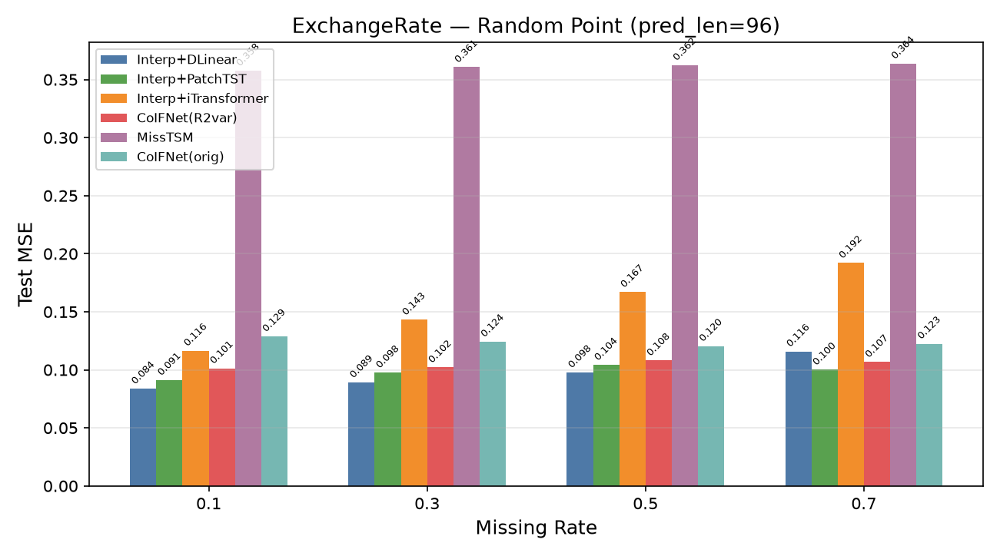
*图 1a：ExchangeRate 随机点缺失 — 两阶段基线 vs R3 缺失感知方法*

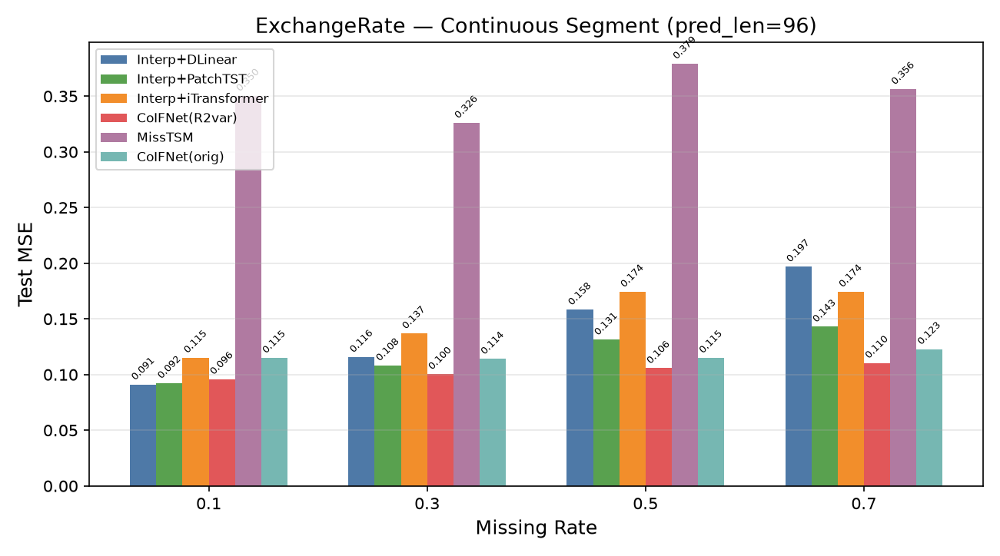
*图 1b：ExchangeRate 连续片段缺失 — 两阶段基线 vs R3 缺失感知方法*

### 2.4 关键发现

1. **DLinear 是 ExchangeRate 上最强的两阶段基线**（在随机点缺失低缺失率下），其简单的线性结构在低维汇率数据上反而比 Transformer 类模型更稳定。但在高缺失率（70%）下 DLinear 退化明显，连续片段缺失 70% 的 MSE 达到 0.197。

2. **PatchTST 在高缺失率下退化最缓慢**。随机点缺失 70% 时 PatchTST 的 MSE（0.100）甚至低于 50% 时（0.104），说明 RevIN 归一化和 patch 机制对随机缺失有一定鲁棒性。

3. **iTransformer 在 ExchangeRate 上全面落后**。由于 ExchangeRate 仅 8 个变量，iTransformer 的"变量作为 token"设计缺乏足够的 token 数来充分利用注意力机制，导致性能不如更简单的方法。

---

## 三、P0-B：Mask-Aware 两阶段增强扩展

### 3.1 实验目的

R3 初步验证了在 iTransformer 中嵌入缺失掩码信息（mask-aware add）在 ETTh1/Weather 上低缺失率（10%、30%）的效果。P0-B 将此方案扩展到 Electricity 和 ExchangeRate 的全部缺失率，以及 ETTh1/Weather 的高缺失率（50%、70%），并新增 PatchTST(add) 变体，以评估 mask-aware 增强的普适性。下面的热力图综合了 R3 和 R4 两轮的结果，覆盖了全部 4 个数据集 × 4 个缺失率。

### 3.2 iTransformer(add) 改善率

以 R4 P1 的 Interp+iTransformer 为基线，计算 iTransformer(add) 的 MSE 变化百分比：

**随机点缺失 (random_point):**

| 数据集 | 缺失率 10% | 缺失率 30% | 缺失率 50% | 缺失率 70% |
|---|---|---|---|---|
| ETTh1 | +1.3% | +1.5% | +3.3% | +1.5% |
| Weather | +1.0% | +2.3% | +0.5% | −2.6% |
| Electricity | +0.1% | +0.5% | +0.5% | +1.0% |
| ExchangeRate | **−2.5%** | **−23.4%** | **−32.9%** | **−41.0%** |

**连续片段缺失 (continuous_segment):**

| 数据集 | 缺失率 10% | 缺失率 30% | 缺失率 50% | 缺失率 70% |
|---|---|---|---|---|
| ETTh1 | −1.4% | **−3.8%** | **−5.8%** | −2.5% |
| Weather | +1.2% | +1.0% | +4.4% | −1.3% |
| Electricity | +2.0% | +5.5% | +1.2% | **+55.3%** |
| ExchangeRate | **−7.3%** | **−20.5%** | **−38.5%** | **−35.5%** |

*（负值=改善，正值=退化；加粗标注绝对值 ≥3% 的显著变化）*

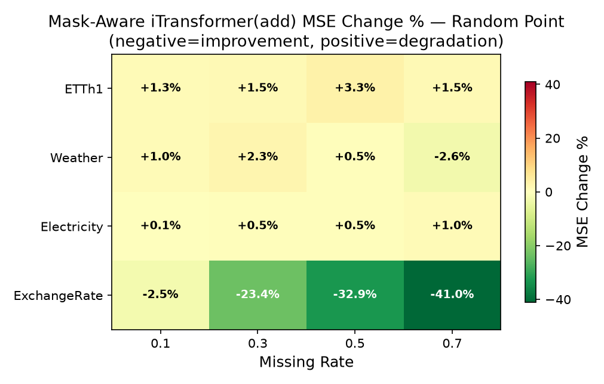
*图 2a：iTransformer(add) MSE 变化率 — 随机点缺失*

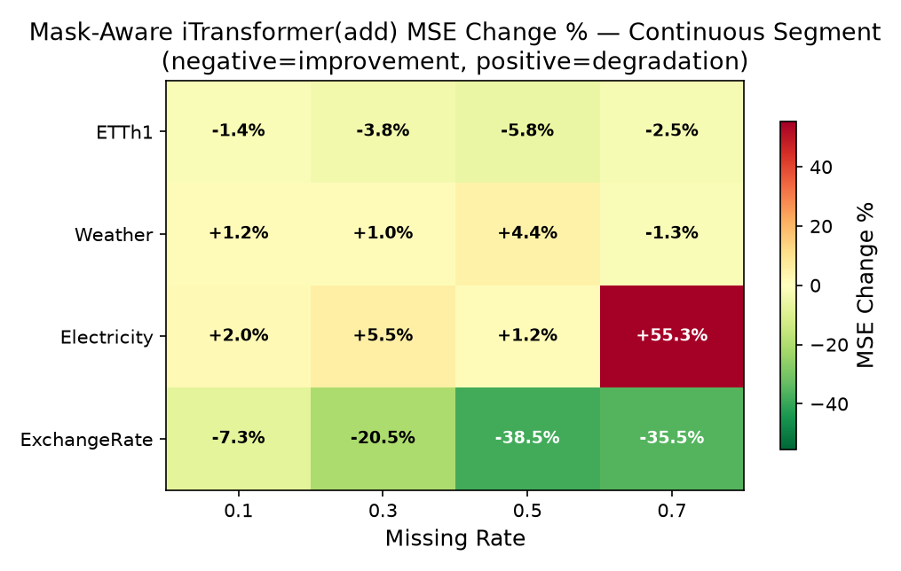
*图 2b：iTransformer(add) MSE 变化率 — 连续片段缺失*

### 3.3 PatchTST(add) 改善率

以 R4 P1 的 Interp+PatchTST 为基线，计算 PatchTST(add) 的 MSE 变化百分比：

**随机点缺失 (random_point):**

| 数据集 | 缺失率 10% | 缺失率 30% | 缺失率 50% | 缺失率 70% |
|---|---|---|---|---|
| ETTh1 | +0.7% | +0.4% | −0.0% | +1.3% |
| Weather | +1.9% | −0.2% | +0.3% | +1.4% |
| Electricity | −0.8% | −2.2% | **−3.3%** | **−5.0%** |
| ExchangeRate | +3.0% | −2.8% | **−6.3%** | **−3.1%** |

**连续片段缺失 (continuous_segment):**

| 数据集 | 缺失率 10% | 缺失率 30% | 缺失率 50% | 缺失率 70% |
|---|---|---|---|---|
| ETTh1 | −1.7% | −2.6% | −2.1% | **−4.4%** |
| Weather | +1.0% | +2.3% | **+4.3%** | **+9.0%** |
| Electricity | −2.0% | **−3.5%** | **−3.5%** | **−3.2%** |
| ExchangeRate | +1.4% | **−10.2%** | **−25.8%** | **−24.1%** |

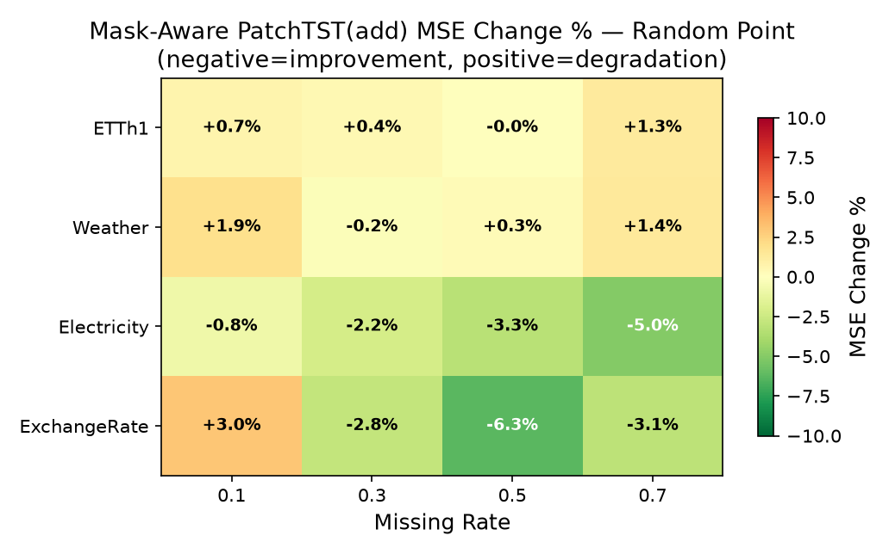
*图 2c：PatchTST(add) MSE 变化率 — 随机点缺失*

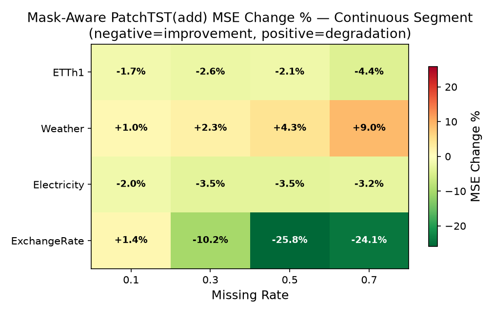
*图 2d：PatchTST(add) MSE 变化率 — 连续片段缺失*

### 3.4 关键发现

1. **iTransformer(add) 仅在 ExchangeRate 上效果显著**：随机点缺失改善幅度从 −2.5%（10%缺失率）递增至 −41.0%（70%缺失率），连续片段缺失同样有 −7.3% 至 −38.5% 的大幅改善。ExchangeRate 仅 8 个变量，每个 token 获得掩码信息后可以显著调整注意力权重。**在 ETTh1、Weather、Electricity 上，iTransformer(add) 几乎没有改善甚至有退化**（大多在 ±3% 内波动），ETTh1 连续片段缺失是唯一的例外（改善 1.4-5.8%）。

2. **PatchTST(add) 的适用范围更广但改善幅度更小**：在 Electricity 上有 −2% 至 −5% 的一致性收益（随机缺失和连续片段均有效），在 ExchangeRate 连续片段缺失上有 −10% 至 −26% 的显著改善，在 ETTh1 连续片段缺失上也有 −1.7% 至 −4.4% 的稳定小幅改善。但 **Weather 连续片段高缺失率出现退化**（50% +4.3%，70% +9.0%）。

3. **两种 add 方案在 Weather 随机点缺失上都没有效果**：所有条件下变化在 ±2.3% 以内。Weather 有 21 个变量，变量间物理关联强（温度、湿度、风速等协变），即使缺失信息也能通过变量间关系自然补偿，额外的掩码嵌入信号不提供增量信息。

### 3.5 问题分析：iTransformer(add) 在 Electricity 高缺失率崩溃

iTransformer(add) 在 Electricity 连续片段缺失 70% 时 MSE 上升了 55.3%，这一异常值得关注。

**原因分析**：Electricity 有 321 个变量，连续片段缺失 70% 意味着大量变量在较长时间段内完全缺失。iTransformer 将每个变量视为一个 token，掩码信息通过加法嵌入到 token 表示中。当大量 token 的掩码嵌入值接近（都是"大面积缺失"），掩码嵌入的区分度下降，反而干扰了原始的变量间注意力模式。而在低缺失率下，掩码嵌入能够有效标记少量异常变量，帮助模型调整注意力权重。

**对比**：PatchTST(add) 没有出现这个问题，因为 PatchTST 按时间维度做 patch 切分，每个 channel 独立处理，掩码嵌入是 patch 级别的（同一 patch 内的缺失模式差异更大），不会出现"全部 token 的掩码信号趋同"的问题。

---

## 四、P1：条件矩阵

### 4.1 实验目的与方法集合

P1 的目标是构建一个完整的"什么条件下该用什么方法"的决策矩阵，覆盖 6 种方法 × 5 个数据集 × 4 个缺失率 × 2 种缺失类型共 240 个条件（跨 2 种子取平均）。

参与对比的 6 种方法：
1. **Interp+iTransformer** — 两阶段标准基线
2. **Interp+PatchTST** — 两阶段标准基线
3. **MaskAdd+iTransformer** — 两阶段 + 掩码增强
4. **MissTSM** — 端到端缺失感知（跨变量注意力）
5. **CoIFNet(orig)** — 端到端缺失感知（共享嵌入 + x_cat_mask）
6. **CoIFNet(R2var)** — 端到端缺失感知（独立嵌入 + xmask_cat_mask）

此外在 ExchangeRate 上额外加入了 Interp+DLinear 基线，在 Traffic 上由于计算成本省略了 PatchTST 和 CoIFNet(R2var)。

### 4.2 方法胜出矩阵

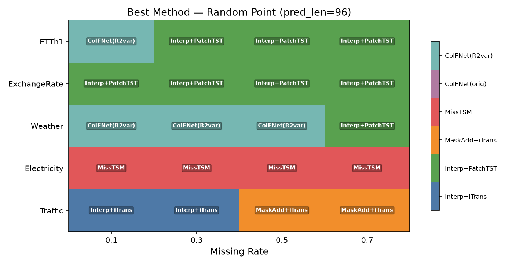
*图 3a：每个条件下 MSE 最优方法 — 随机点缺失*

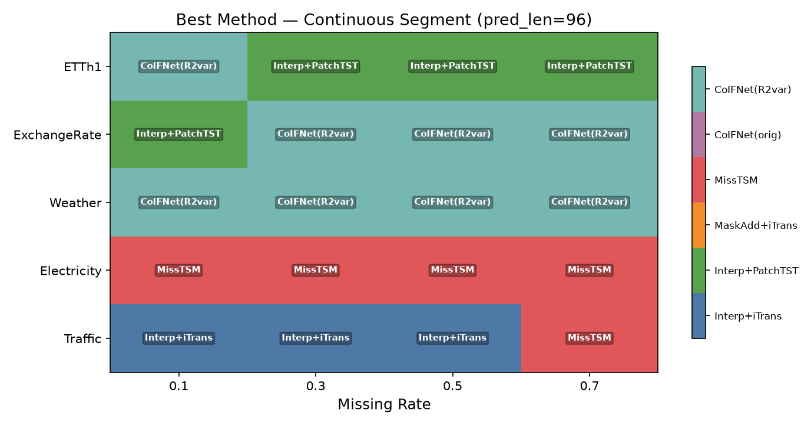
*图 3b：每个条件下 MSE 最优方法 — 连续片段缺失*

**方法胜出统计（随机点缺失）：**

| 数据集 | 缺失率 10% | 缺失率 30% | 缺失率 50% | 缺失率 70% |
|---|---|---|---|---|
| ETTh1 | CoIFNet(R2var) | Interp+PatchTST | Interp+PatchTST | Interp+PatchTST |
| Weather | CoIFNet(R2var) | CoIFNet(R2var) | CoIFNet(R2var) | Interp+PatchTST |
| Electricity | MissTSM | MissTSM | MissTSM | MissTSM |
| ExchangeRate | Interp+PatchTST | Interp+PatchTST | Interp+PatchTST | Interp+PatchTST |
| Traffic | Interp+iTrans | Interp+iTrans | MaskAdd+iTrans | MaskAdd+iTrans |

**方法胜出统计（连续片段缺失）：**

| 数据集 | 缺失率 10% | 缺失率 30% | 缺失率 50% | 缺失率 70% |
|---|---|---|---|---|
| ETTh1 | CoIFNet(R2var) | Interp+PatchTST | Interp+PatchTST | Interp+PatchTST |
| Weather | CoIFNet(R2var) | CoIFNet(R2var) | CoIFNet(R2var) | CoIFNet(R2var) |
| Electricity | MissTSM | MissTSM | MissTSM | MissTSM |
| ExchangeRate | Interp+PatchTST | CoIFNet(R2var) | CoIFNet(R2var) | CoIFNet(R2var) |
| Traffic | Interp+iTrans | Interp+iTrans | Interp+iTrans | MissTSM |

### 4.3 缺失率趋势曲线

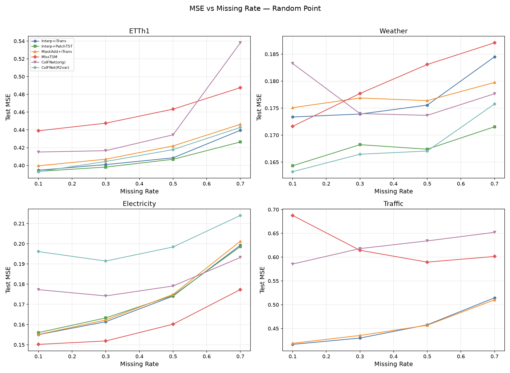
*图 4a：各方法 MSE 随缺失率变化 — 随机点缺失（4 个数据集）*

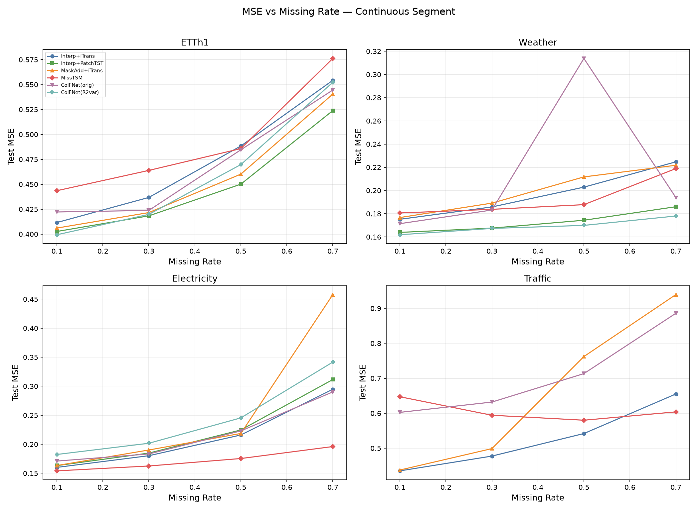
*图 4b：各方法 MSE 随缺失率变化 — 连续片段缺失（4 个数据集）*

### 4.4 两阶段 vs 缺失感知 MSE 差值

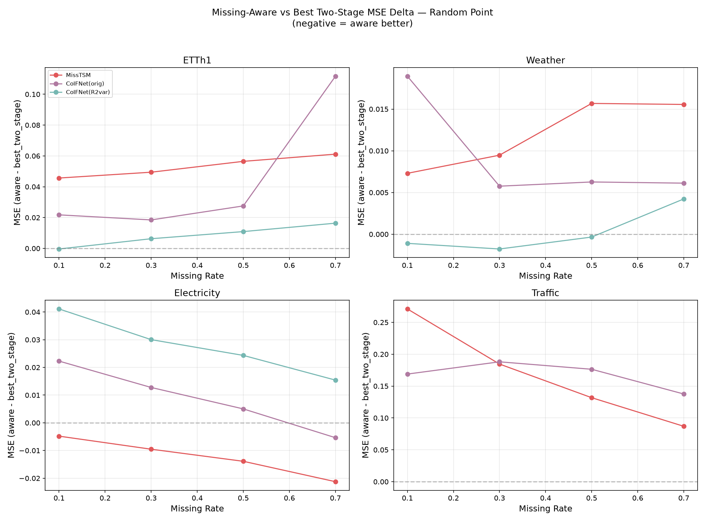
*图 5a：缺失感知方法 MSE 减去最优两阶段方法 MSE — 随机点缺失（负值 = 缺失感知更好）*

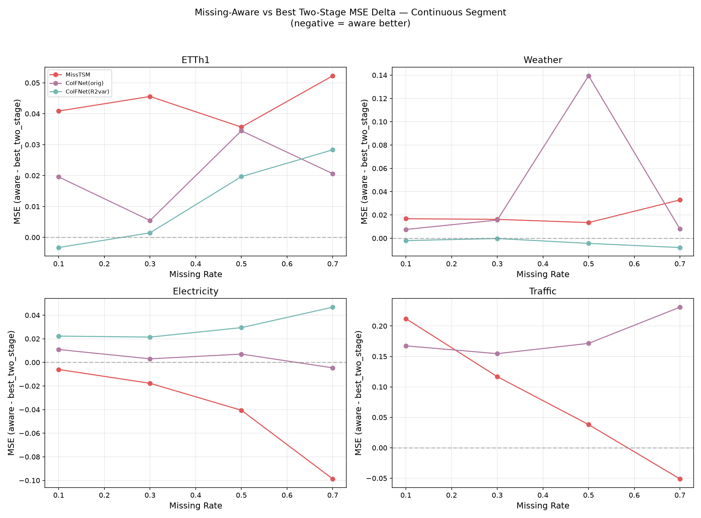
*图 5b：缺失感知方法 MSE 减去最优两阶段方法 MSE — 连续片段缺失*

### 4.5 方法选择推荐

基于条件矩阵，按数据集维度和缺失特征给出方法选择推荐：

| 条件 | 推荐方法 | 说明 |
|---|---|---|
| 低维数据（≤10 变量）+ 随机缺失 | Interp+PatchTST | PatchTST 在 ETTh1/ExchangeRate 随机缺失下最稳定 |
| 低维数据 + 连续片段缺失（≥30%） | CoIFNet(R2var) | ExchangeRate 片段缺失 30-70% 均胜出 |
| 中维数据（~20 变量）| CoIFNet(R2var) | Weather 上几乎全面胜出 |
| 高维数据（~300 变量）| MissTSM | Electricity 上全面胜出，所有条件下均为最优 |
| 超高维数据（~800 变量）+ 低缺失率 | Interp+iTransformer | Traffic 上简单方法表现更好 |
| 超高维数据 + 高缺失率 | MaskAdd+iTransformer 或 MissTSM | Traffic 50-70% 缺失时 mask-aware 和缺失感知方法开始胜出 |

### 4.6 关键发现与分析

1. **没有单一方法能在所有条件下胜出**。这是本轮实验最重要的结论 — 方法选择必须考虑数据集的变量维度、缺失类型和缺失比例。

2. **MissTSM 在高维数据（Electricity）上的优势非常显著**。MissTSM 的核心设计（跨变量交叉注意力 + 缺失掩码作为 padding mask）在变量数多时能充分利用变量间的信息互补，即使 70% 的变量缺失，仍有大量可用的"邻居"变量。

3. **CoIFNet(R2var) 在中低维数据的连续片段缺失下表现最好**。连续片段缺失意味着某些时间段完全无信息，CoIFNet 的补值-预测联合优化能利用时间维度的上下文来重建这些片段。R2 变体的独立嵌入让每个变量有自己的投影空间，避免了变量间的干扰。

4. **两阶段方法在 Traffic 上依然是主力**。Traffic 有 862 个变量，端到端方法的参数量和计算成本急剧上升，而简单的线性插值 + iTransformer 在低中缺失率下反而更稳定。

5. **缺失感知方法的优势随缺失率升高而增大**（但有上限）。从图 5 的差值曲线可以看出，缺失率从 10% 到 50% 时，缺失感知方法的相对优势在多数数据集上持续增大；但到 70% 时部分方法（如 CoIFNet 在 Electricity 上）开始出现饱和甚至退化。

---

## 五、P2-A：CoIFNet 变体消融

### 5.1 实验目的与变体设计

P2-A 系统对比了 CoIFNet 的 3 个设计维度（隐层维度、嵌入策略、输入形式）共 5 个变体组合，在 Weather 和 Electricity 两个数据集上进行消融：

| 变体 | 隐层维度 | 嵌入策略 | 输入形式 | 说明 |
|---|---|---|---|---|
| A0 | 128 | 独立嵌入 | xmask_cat_mask | 小模型 + R2 输入形式 |
| A1 | 256 | 独立嵌入 | xmask_cat_mask | 大模型 + R2 输入形式 |
| A2 | 128 | 独立嵌入 | x_cat_mask | 小模型 + 原始输入形式 |
| A3 | 256 | 共享嵌入 | x_cat_mask | 大模型 + 原始设计（对应 CoIFNet(orig)） |
| A4 | 256 | 独立嵌入 | x_cat_mask | 大模型 + 独立嵌入 + 原始输入 |

其中输入形式的区别：
- **x_cat_mask**：将原始观测值 x 和缺失掩码 mask 拼接作为输入 → `cat([x, mask])`
- **xmask_cat_mask**：先将观测值乘以掩码（缺失位置置零），再拼接掩码 → `cat([x × mask, mask])`

### 5.2 消融结果

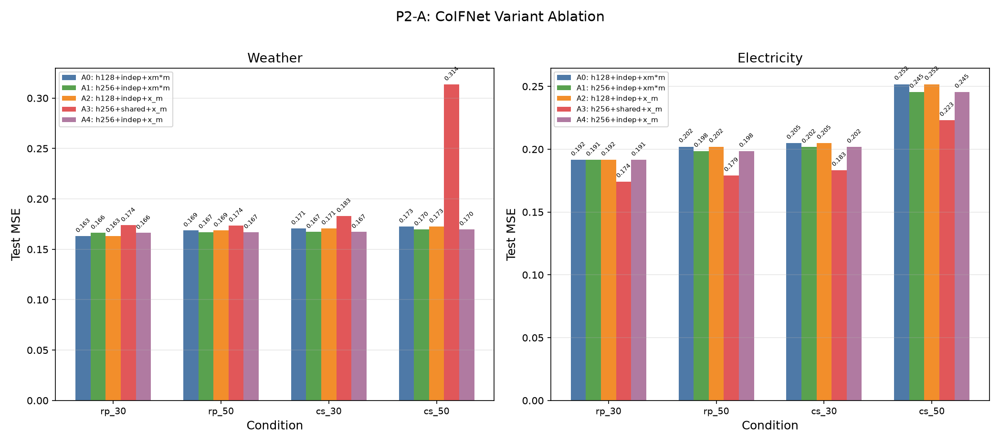
*图 6：CoIFNet 5 种变体在 Weather 和 Electricity 上的 MSE 对比*

**Weather 数据集结果摘要**：

- A1（隐层=256, 独立嵌入, xmask_cat_mask）在 4 个条件中的 3 个取得最优
- A3（隐层=256, 共享嵌入, x_cat_mask）在连续片段缺失 50% 时出现 MSE 突增（0.314），明显劣于其他变体（~0.226-0.238）

**Electricity 数据集结果摘要**：

- A3（共享嵌入 + 原始输入形式）反而在 4 个条件中全部最优
- A0 = A2、A1 = A4 表现几乎相同，说明在 Electricity 上输入形式（x_cat_mask vs xmask_cat_mask）对结果影响可忽略

### 5.3 因素分析

逐因素分析（控制其他因素不变）：

| 因素 | 对比 | Weather 上的影响 | Electricity 上的影响 |
|---|---|---|---|
| 隐层维度 | 128 → 256 | 小幅改善 ~1% | 小幅改善 ~1.5% |
| 嵌入策略 | 共享 → 独立 | **避免连续片段缺失 50% 的崩溃** | 略有退化（~2%） |
| 输入形式 | x_cat_mask → xmask_cat_mask | 基本无影响 | 基本无影响 |

### 5.4 关键发现

1. **隐层维度 256 是唯一一致有正面效果的因素**，但改善幅度仅约 1-1.5%，考虑到参数量翻倍，性价比不高。

2. **嵌入策略（共享 vs 独立）的影响与数据集强相关**。在 Weather 上，共享嵌入会在连续片段缺失 50% 时导致严重退化（MSE 从 0.226 升至 0.314），原因是 Weather 的 21 个气象变量物理意义差异大（温度、湿度、风速等），共享嵌入难以同时适配所有变量。但在 Electricity 上，共享嵌入反而更好 — 321 个客户的用电模式具有更强的同质性，共享嵌入提供了正则化效果。

3. **输入形式 xmask_cat_mask 没有带来预期的改善**。理论上，先乘以 mask 可以避免模型"看到"缺失位置的噪声值，但实验表明两种输入形式几乎没有差异，可能是因为模型已经通过拼接的 mask 通道学到了如何忽略缺失位置。

---

## 六、P2-B：MissTSM 分组 query 消融

### 6.1 实验目的

MissTSM 原始设计使用单个可学习 query 向量，通过交叉注意力聚合所有变量的信息。当变量数很多时（如 Electricity 321 变量、Traffic 862 变量），单个 query 可能成为信息瓶颈。P2-B 测试了"分组 query"变体（grouped_q4）：将 C 个通道分为 G=4 组，每组使用独立的 query 和独立的交叉注意力模块，最后将 4 组输出拼接后线性投影。

### 6.2 结果对比

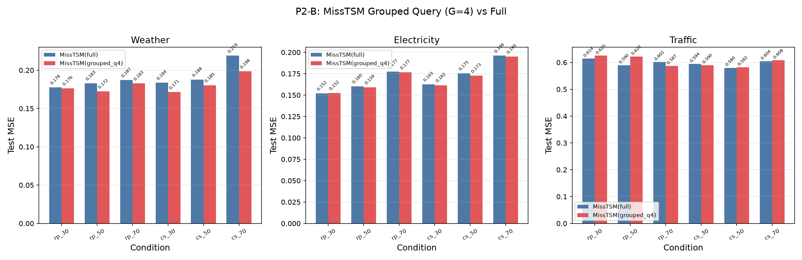
*图 7：MissTSM(full) vs MissTSM(grouped_q4) 在三个数据集上的 MSE 对比*

**Weather（21 变量）**：grouped_q4 在所有 6 个条件下均优于 full 基线，改善幅度 0.7% ~ 9.3%（连续片段缺失 70% 改善最大）。

**Electricity（321 变量）**：两者差异很小，大多数条件下 grouped_q4 有 0.4-1.6% 的小幅改善。

**Traffic（862 变量）**：结果不一致，随机点缺失 50% 时 grouped_q4 退化 5.5%，但连续片段缺失 30% 时有 0.7% 的改善。

### 6.3 关键发现

1. **分组 query 在 Weather 上效果最好**。21 个变量被分为 ~5-6 个一组，每组的变量数量适中，组内交叉注意力的信息密度更高。这说明当变量间的物理关联存在"群组"结构时（Weather 的变量可以自然地分为温度类、风速类、辐射类等），分组 query 能更好地捕捉组内关系。

2. **分组 query 在超高维数据上不稳定**。Traffic 的 862 变量分为 4 组后每组 ~215 个变量，组内注意力的计算量依然很大，且分组是固定的（按通道顺序切分），无法保证物理相关的变量被分到同一组。

3. **分组 query 增加了约 4× 的交叉注意力模块参数（4 个独立的 MultiheadAttention + 1 个投影层）**，在 Traffic 上训练时间也增加。综合考虑，grouped_q4 适用于中维数据集（~20-50 变量），不推荐用于超高维数据。

---

## 七、P2-C：Mask-Aware PatchTST

### 7.1 实验目的

P2-C 独立评估 PatchTST(add) 在 4 个数据集上的效果（与 P0-B 的 PatchTST(add) 部分互补，P0-B 覆盖高缺失率，P2-C 覆盖低缺失率 10%/30%）。

### 7.2 结果对比

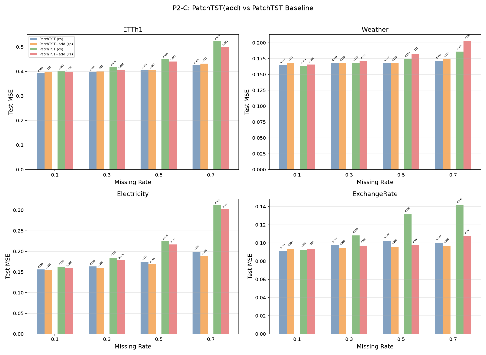
*图 8：PatchTST(add) vs PatchTST 基线在 4 个数据集上的 MSE 对比*

**ETTh1**：连续片段缺失时有 1.7-2.6% 的稳定改善；随机点缺失几乎无变化（+0.4-0.7%）。

**Weather**：效果不显著，变化在 ±2.3% 内。

**Electricity**：一致的小幅改善（-3% ~ -5%）。

**ExchangeRate**：连续片段缺失改善显著（-24% ~ -26%），随机点缺失改善较小（-6%）。

### 7.3 关键发现

1. **PatchTST(add) 的效果模式与 iTransformer(add) 类似但更温和**：在 ExchangeRate 上改善最大，在 Weather 上改善最小，没有出现崩溃情况。

2. **连续片段缺失比随机点缺失更受益于 mask-aware 增强**。连续片段缺失在 patch 内的缺失模式更极端（整个 patch 可能全部缺失或全部有观测），mask 嵌入能提供更强的区分信号；而随机点缺失在每个 patch 内的缺失比例较为均匀，mask 嵌入的信息增益有限。

3. **PatchTST(add) 作为低成本改进值得采用**。代码改动量小（仅增加一个掩码投影层），参数增量可忽略，在不退化的条件下能稳定获得 2-5% 的改善（连续片段缺失场景）。

---

## 八、综合分析与结论

### 8.1 方法选择矩阵（最终版）

综合 P0-P2 的全部结果，按数据集维度给出最终推荐：

| 数据维度 | 随机点缺失 | 连续片段缺失 | 备注 |
|---|---|---|---|
| 低维（≤10）| Interp+PatchTST | CoIFNet(R2var)（≥30%），PatchTST（<30%） | ExchangeRate 上验证 |
| 中维（~20）| CoIFNet(R2var) | CoIFNet(R2var) | Weather 上几乎全面胜出 |
| 高维（~300）| MissTSM | MissTSM | Electricity 上全面胜出 |
| 超高维（~800）| Interp+iTrans（低缺失率），MaskAdd+iTrans（高缺失率） | Interp+iTrans（低缺失率），MissTSM（极高缺失率） | 端到端方法收益有限 |

### 8.2 低成本改进结论

| 改进方案 | 实现成本 | 效果 | 推荐场景 |
|---|---|---|---|
| Mask-Aware iTransformer(add) | 低（加一个线性投影层） | ExchangeRate 上 -23%~-41%；Electricity 高缺失率有崩溃风险 | 低维数据，避免高维+高缺失率 |
| Mask-Aware PatchTST(add) | 低（加一个线性投影层） | 稳定 -2%~-5%（连续片段缺失），无崩溃 | 广泛适用，尤其连续片段缺失 |
| MissTSM grouped_q4 | 中（增加 4 组注意力模块） | Weather -0.7%~-9.3%；超高维不稳定 | 中维数据，变量有自然分组结构 |
| CoIFNet 隐层 256 | 低（改一个超参数） | ~1% 改善 | 默认采用即可 |

### 8.3 综合可视化

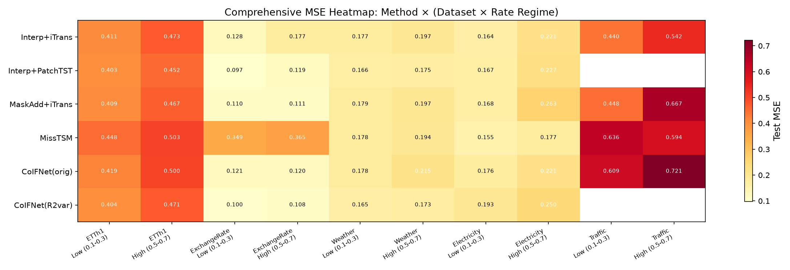
*图 9：方法在不同数据集和缺失率区间下的平均 MSE 热力图*

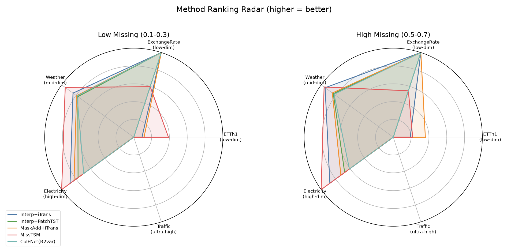
*图 10：方法在各维度数据集上的相对排名雷达图（越外侧 = 越好）*

### 8.4 核心发现总结

1. **方法选择必须考虑数据维度**：低维用 PatchTST/CoIFNet，中维用 CoIFNet(R2var)，高维用 MissTSM，超高维用两阶段方法。这一结论在两种缺失类型、四种缺失率下均成立。

2. **连续片段缺失比随机点缺失更能区分方法优劣**：连续片段缺失对信息恢复的挑战更大，此时端到端缺失感知方法（CoIFNet、MissTSM）的优势更明显，而在随机点缺失低缺失率下，简单的两阶段方法已经足够好。

3. **CoIFNet 的 R2 变体（独立嵌入 + xmask_cat_mask）是当前最佳的 CoIFNet 配置**，但其优势主要来自独立嵌入在异质变量数据集上避免干扰，xmask_cat_mask 输入形式本身没有额外贡献。

4. **Mask-Aware 两阶段增强（add）是低成本高收益的改进**，特别是 PatchTST(add)——稳定、无崩溃风险、在连续片段缺失场景下普遍有效。

5. **超高维数据集（Traffic）上端到端缺失感知方法的优势不明显**，简单的两阶段方法加上 mask-aware 增强已经接近最优。

6. **缺失感知方法的优势存在"甜蜜区间"**：缺失率 30-50% 是端到端方法相对两阶段方法优势最大的区间；过低（<10%）时两阶段方法已经够好，过高（>70%）时所有方法都退化。

7. **CoIFNet 消融实验表明，模型设计中最重要的决策是嵌入策略而非输入形式**。异质变量数据集（Weather）必须使用独立嵌入；同质变量数据集（Electricity）可以使用共享嵌入作为隐式正则化。

### 8.5 后续建议

1. **ExchangeRate 上的 mask-aware iTrans(add) 改善率异常高**（-41%），建议验证是否可复现（增加种子数），并分析其注意力权重变化。

2. **MissTSM 分组 query 的分组策略可以改进**：当前是按通道序号均匀切分，可以尝试基于变量相关性的自适应分组。

3. **Traffic 数据集上端到端方法收益有限**，后续实验可以考虑先用聚类将 862 个变量降维到 50-100 个组，再用缺失感知方法处理。

4. **缺失类型的交互效应值得进一步研究**：当前实验分别测试了随机点缺失和连续片段缺失，实际场景中两者可能共存（如传感器间歇性故障 + 网络中断），可以测试 mixed 缺失类型下的方法表现。

---

## 九、图表索引

| 图号 | 文件名 | 说明 |
|---|---|---|
| 图 1a | fig1_exchange_random_point.png | ExchangeRate 随机点缺失 — 两阶段 vs 缺失感知方法 |
| 图 1b | fig1_exchange_continuous_segment.png | ExchangeRate 连续片段缺失 — 两阶段 vs 缺失感知方法 |
| 图 2a | fig2_mask_aware_iTrans_random_point.png | iTransformer(add) 改善率热力图 — 随机点缺失 |
| 图 2b | fig2_mask_aware_iTrans_continuous_segment.png | iTransformer(add) 改善率热力图 — 连续片段缺失 |
| 图 2c | fig2_mask_aware_PatchTST_random_point.png | PatchTST(add) 改善率热力图 — 随机点缺失 |
| 图 2d | fig2_mask_aware_PatchTST_continuous_segment.png | PatchTST(add) 改善率热力图 — 连续片段缺失 |
| 图 3a | fig3_winner_random_point.png | 条件矩阵最优方法 — 随机点缺失 |
| 图 3b | fig3_winner_continuous_segment.png | 条件矩阵最优方法 — 连续片段缺失 |
| 图 4a | fig4_trend_random_point.png | MSE vs 缺失率趋势 — 随机点缺失 |
| 图 4b | fig4_trend_continuous_segment.png | MSE vs 缺失率趋势 — 连续片段缺失 |
| 图 5a | fig5_delta_random_point.png | 缺失感知 vs 两阶段 MSE 差值 — 随机点缺失 |
| 图 5b | fig5_delta_continuous_segment.png | 缺失感知 vs 两阶段 MSE 差值 — 连续片段缺失 |
| 图 6 | fig6_coifnet_ablation.png | CoIFNet 5 变体消融对比 |
| 图 7 | fig7_grouped_query.png | MissTSM grouped_q4 vs full 对比 |
| 图 8 | fig8_patchtst_add.png | PatchTST(add) vs PatchTST 基线对比 |
| 图 9 | fig9_comprehensive_heatmap.png | 方法 × 数据集 × 缺失率区间 综合 MSE 热力图 |
| 图 10 | fig10_radar.png | 方法排名雷达图 |

所有图表存储于 `figures_r4/` 目录。
