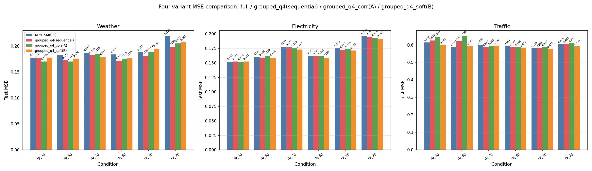
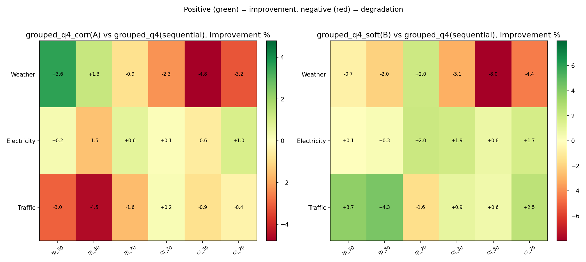
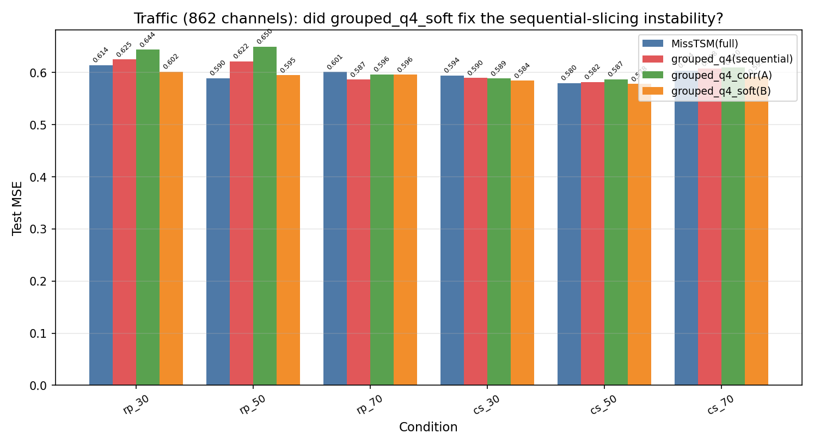
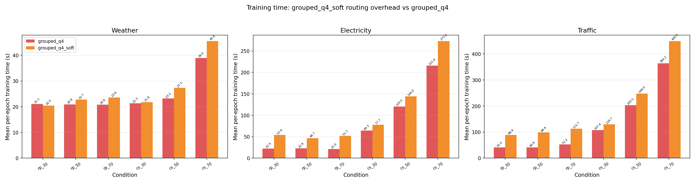
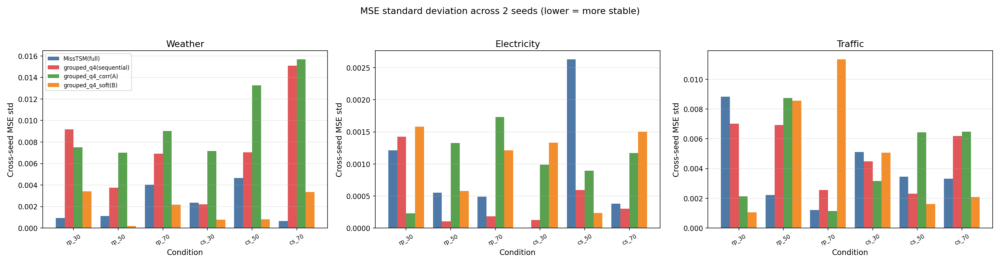

# MissTSM 分组 Query 自动分组实验报告（R0709）

> **承接**：第四轮实验报告（R4，0706）§6（P2-B：MissTSM 分组 query 消融）及《四轮实验综合总结报告.md》遗留问题 #5
> **日期**：2026-07-09 ~ 2026-07-10
> **硬件**：7 × GPU（GPU 1-7，per-gpu=1，round-robin 调度）
> **实验规模**：72 次训练（2 个实验组 × 3 数据集 × 2 缺失类型 × 3 缺失率 × 2 种子）
> **种子**：2024, 2025
> **训练设置**：epochs=20, batch_size=32, lr=1e-3, patience=5, pred_len=96

---

## 一、实验总览

### 1.1 实验背景

R4 报告 §6（P2-B：MissTSM 分组 query 消融）与《四轮实验综合总结报告.md》遗留问题 #5 给出的核心发现是：

1. **`grouped_q4`（按通道序号均匀切分为 4 组）在 Weather（21 变量）上全面改善**：6 个条件全部优于 `full` 基线，改善幅度 0.7%~9.3%。
2. **在 Electricity（321 变量）上效果很小**：多数条件小幅改善 0.4%~1.6%。
3. **在 Traffic（862 变量）上不稳定**：随机点缺失 50% 退化 5.5%，连续片段缺失 30% 反而改善 0.7%。
4. **关键诊断（R4 §6.3 + 综合报告遗留问题 #5）**：Weather 的分组收益很可能是巧合——CSV 列顺序恰好把物理相关的变量（温度类、风速类等）排在了一起；Traffic 的传感器编号与地理/交通关联性无关，序号切分等价于随机分组，因此效果不稳定。

基于以上发现，《实验计划0709.md》提出两条路径，把"按通道序号切分"替换为"数据驱动的自动分组"：

- **方案 A（相关性预分组，`grouped_q4_corr`）**：验证能否用训练集统计量算出的相关性顺序把 Traffic 的分组收益"救回来"，同时不破坏 Weather 已验证有效的表现——对应问题：*序号切分在 Traffic 上的不稳定，是否可以通过数据驱动的重排解决？*
- **方案 B（可学习软路由，`grouped_q4_soft`）**：验证让模型端到端学习通道-组归属权重，是否能达到甚至超过离线聚类的效果，并且不引入额外的训练不稳定性——对应问题：*训练时自动学习分组是否比离线聚类更好，代价是什么？*

### 1.2 实验规模

| 实验组 | 变体 | 数据集×缺失类型×缺失率×种子 | 数量 | 说明 |
|---|---|---|---:|---|
| P1A（方案 A） | `grouped_q4_corr` | 3×2×3×2 | 36 | 本轮新跑 |
| P1B（方案 B） | `grouped_q4_soft` | 3×2×3×2 | 36 | 本轮新跑 |
| 对照组 `grouped_q4` | 序号切分 | — | 36 | 复用 R4 P2-B 结果 |
| 对照组 `full` | 单 query 基线 | — | 36 | 复用 R4 P1 结果 |
| **合计新跑** | | | **72** | |

### 1.3 数据集

| 数据集 | 变量数 | 维度级别 | 采样频率 | 特点 |
|---|---:|---|---|---|
| Weather | 21 | 中维 | 10 分钟 | 多气象变量（温度、湿度、风速、辐射等），变量间存在明显的物理群组结构 |
| Electricity | 321 | 高维 | 1 小时 | 电力用户用电量，变量间相关性中等偏弱，无明显的天然分组 |
| Traffic | 862 | 超高维 | 1 小时 | 道路占用率传感器，通道编号与地理位置基本无关，序号顺序与物理关联性脱钩 |

### 1.4 训练参数

epochs=20，batch_size=32，lr=1e-3，patience=5（早停耐心值），seq_len=96，pred_len=96，种子=2024/2025，与 R4 P1/P2-B 保持完全一致，确保四变体可直接对比。

### 1.5 方法命名说明

| 简称 | 全称 | 技术说明 |
|---|---|---|
| MissTSM(full) | MissTSM 单 query 基线 | 端到端方法：单个可学习 query 向量通过交叉注意力聚合所有变量信息 |
| grouped_q4（序号切分） | MissTSM 分组 query，G=4，按通道序号连续切分 | R4 已验证变体：C 个通道按固定序号切成 4 组，每组独立 query + 独立 `MultiheadAttention`，输出拼接后线性投影 |
| grouped_q4_corr（方案 A） | MissTSM 分组 query，G=4，相关性重排后连续切分 | 本轮新变体：训练前用**训练集**原始序列算 C×C 皮尔逊相关矩阵，`1-\|corr\|` 为距离做层次聚类（average linkage + `optimal_leaf_ordering=True`），叶子顺序作为固定重排 `group_order`；重排后复用与 `grouped_q4` 完全相同的连续切片代码，不增加参数 |
| grouped_q4_soft（方案 B） | MissTSM 分组 query，G=4，可学习软路由 | 本轮新变体：每个通道学一个身份向量 `channel_embed (C, q_dim)`，每组学一个原型向量 `group_proto (G, q_dim)`，`route_weights = softmax(channel_embed @ group_proto.T, dim=1)` 得到 (C, G) 归属权重；每组 query 仍对全部 C 个通道做交叉注意力，但注意力前先用该组的路由权重对通道 embedding 做软门控（`emb_g = emb * route_weights[:, g]`），而非硬性截取子集 |

### 1.6 机制说明：方案 A 与方案 B 的核心差异

两者都保留 G=4，都只改变"通道分组来源"这一个变量，其余（`q_dim`、`num_heads`、训练超参）与 `grouped_q4` 完全一致，是干净的单变量消融：

- **方案 A** 分组在训练前**离线、固定**决定，不参与梯度更新，每组注意力的输入仍是该组包含的通道子集（硬切分），计算量与 `grouped_q4` 相同。
- **方案 B** 分组在训练中**端到端学习**，但每组的 query 始终对**全部** C 个通道做注意力（只是通过权重软性强调相关通道），因此单组计算量接近 `full`（单 query 的计算规模），并新增了 `channel_embed`（C×q_dim）和 `group_proto`（G×q_dim）两个小矩阵的参数与一次矩阵乘法。
- 本轮 `group_entropy_weight` 全部设为 0.0（关闭熵正则化），即只跑《实验计划0709.md》§3.4 中标注为"主实验"的无正则版本，尚未涉及熵正则消融版本 `grouped_q4_soft_ent`。

### 1.7 模型实现与本研究扩展说明

本轮涉及的代码改动均为**本研究新增的实验扩展**，不涉及对参考仓库的 bug 修复或简化（R4 报告 §1.7 已覆盖 MissTSM `full` 变体本身的 bug 修复，本轮改动建立在其之上）：

- **`src/data/grouping.py`（新增）**：`compute_channel_order()` 只使用训练集切分后的原始序列计算相关矩阵，与项目"标准化只用训练集统计量"的既定约定一致；结果缓存到 `results_cache/group_order/{dataset}.json`，避免每次训练重复聚类。
- **`src/models/misstsm.py`**：`MissTSMLayer` 新增 `group_order` 参数（供 `grouped_q` 变体在切片前重排通道）以及 `grouped_q_soft` 分支（`channel_embed`/`group_proto`/`route_weights()`/`route_entropy()`）。这两者在参考仓库（`ref_repository/SparseTimeSeriesModeling`）中均不存在，属于本项目为验证遗留问题 #5 新增的消融变体。
- **`src/training/run_forecast.py`**：`--misstsm_variant` 新增 `grouped_q4_corr`、`grouped_q4_soft` 两个可选值，`--group_entropy_weight` 新增熵正则开关（本轮固定为 0.0）。

**小结**：本轮所有代码改动都是在已验证正确的 `full`/`grouped_q4` 基础上新增的消融开关，不改变原有变体的行为，`grouped_q4`/`full` 的历史结果可以直接复用做对比。

---

## 二、方案 A：相关性预分组（grouped_q4_corr）结果

### 2.1 实验目的

对应背景中的问题——序号切分在 Traffic 上的不稳定，是否可以通过数据驱动的重排解决。判定标准（《实验计划0709.md》§2.5）：Traffic 上 `grouped_q4_corr` 相对 `grouped_q4` MSE 改善 ≥3% 且 6 个条件中至少 5 个不劣于 `full`；同时 Weather 上不应比 `grouped_q4` 明显变差（允许 <1% 波动）。

### 2.2 结果

*跨种子（2024/2025）平均，数值格式 MSE / MAE。*

**Weather（21 变量）**

| 缺失类型 | 缺失率 | full | grouped_q4(序号) | grouped_q4_corr(方案A) |
|---|---:|---|---|---|
| random_point | 0.3 | 0.1777 / 0.2467 | 0.1764 / 0.2471 | 0.1701 / 0.2398 |
| random_point | 0.5 | 0.1831 / 0.2518 | 0.1724 / 0.2420 | 0.1702 / 0.2388 |
| random_point | 0.7 | 0.1871 / 0.2519 | 0.1829 / 0.2537 | 0.1845 / 0.2556 |
| continuous_segment | 0.3 | 0.1838 / 0.2455 | 0.1714 / 0.2318 | 0.1754 / 0.2369 |
| continuous_segment | 0.5 | 0.1878 / 0.2521 | 0.1804 / 0.2495 | **0.1890 / 0.2547** |
| continuous_segment | 0.7 | 0.2189 / 0.2827 | 0.1985 / 0.2661 | **0.2048 / 0.2699** |

**Traffic（862 变量）**

| 缺失类型 | 缺失率 | full | grouped_q4(序号) | grouped_q4_corr(方案A) |
|---|---:|---|---|---|
| random_point | 0.3 | 0.6144 / 0.3556 | 0.6250 / 0.3607 | **0.6440 / 0.3720** |
| random_point | 0.5 | 0.5895 / 0.3353 | 0.6217 / 0.3513 | **0.6499 / 0.3638** |
| random_point | 0.7 | 0.6014 / 0.3373 | 0.5868 / 0.3357 | 0.5963 / 0.3391 |
| continuous_segment | 0.3 | 0.5943 / 0.3390 | 0.5898 / 0.3375 | 0.5887 / 0.3388 |
| continuous_segment | 0.5 | 0.5801 / 0.3301 | 0.5818 / 0.3285 | 0.5869 / 0.3313 |
| continuous_segment | 0.7 | 0.6039 / 0.3385 | 0.6076 / 0.3405 | 0.6097 / 0.3429 |

（加粗为相对 `grouped_q4` 退化 ≥3% 的条件；Electricity 六条件差异均 <2%，未见显著变化，完整数值见图 1。）

*图 1：full / grouped_q4(序号) / grouped_q4_corr(方案A) / grouped_q4_soft(方案B) 在三个数据集、6 个条件下的 MSE 对比*

*图 2：grouped_q4_corr（左）与 grouped_q4_soft（右）相对 grouped_q4(序号切分) 的 MSE 改善率（%），正值=改善，负值=退化*

### 2.3 关键发现

1. **方案 A 未能解决 Traffic 的不稳定问题，反而在随机点缺失上进一步退化**。随机点缺失 30% 时 `grouped_q4_corr` 相对 `grouped_q4` 退化 3.0%（0.6250→0.6440），50% 时退化 4.5%（0.6217→0.6499）——均劣于 `grouped_q4` 本身相对 `full` 的退化幅度（50% 时 grouped_q4 退化 5.5%，方案A在此基础上又叠加退化到相对 full 的-10.2%）。这与《实验计划0709.md》§2.5 的主要判据（改善 ≥3% 且 6/6 条件中至少 5 个不劣于 full）**直接矛盾**：连续片段缺失下方案 A 大致持平或略好于 grouped_q4，但随机点缺失下明显更差，6 个条件中只有 3 个不劣于 full。原因可能是：相关性聚类基于**未注入缺失的完整训练序列**计算，而随机点缺失打散了时间上的连续性，聚类得到的"稳定共现关系"在高比例随机缺失下不再成立，导致重排后的组反而比"随机切分"（序号切分对862个互不相关的传感器而言近似随机）更容易把噪声大的通道聚在一起。
2. **方案A在 Weather 的 continuous_segment 条件下出现了计划外的退化**，50%/70% 缺失率下相对 grouped_q4 退化 4.8%/3.2%，超出《实验计划0709.md》§2.5 允许的 <1% 波动阈值。这说明 R4 报告"Weather 序号切分收益来自 CSV 列顺序恰好接近物理分组"的假设**部分成立但不完全**——相关性重排在 random_point 条件下与序号切分基本持平甚至更优（30%/50% 分别改善 3.6%/1.3%），但在 continuous_segment 条件下反而更差，说明连续片段缺失对相关矩阵的估计（本身用完整训练序列算，不含缺失）与实际推理时的缺失模式之间存在不匹配，这一不匹配在片段缺失下比随机点缺失下更明显。
3. **方案 A 的实现完全零额外参数**（与 grouped_q4 参数量逐字节相同，见 §四 参数量对比），这一点符合设计预期，说明性能差异纯粹来自"谁和谁分到一组"，不存在参数量混淆因素。
4. **Electricity 上三个变体几乎无差异**（各条件差异 <2%），说明 321 个变量之间的中等偏弱相关性下，无论是序号切分、相关性重排还是原有分组方式，都无法产生有意义的组内信息密度差异，这与 R4 报告"Electricity 上 grouped_q4 效果很小（0.4-1.6%）"的结论一致，本轮方案 A 没有改变这一结论。

---

## 三、方案 B：可学习软路由（grouped_q4_soft）结果

### 3.1 实验目的

对应背景中的问题——训练时端到端学习分组是否比离线相关性聚类更好，以及这种"自动学习"是否会引入额外的训练不稳定性和计算成本。判定标准（《实验计划0709.md》§3.7）：改善幅度是否达到或超过方案 A；跨种子方差是否明显大于方案 A 和 grouped_q4；路由权重训练后是否退化为均匀分布（因未保存模型 checkpoint，本轮无法验证这一项，见 §3.5）。

### 3.2 结果

**Traffic（862 变量）** —— 方案 B 的主要目标数据集

| 缺失类型 | 缺失率 | full | grouped_q4(序号) | grouped_q4_soft(方案B) |
|---|---:|---|---|---|
| random_point | 0.3 | 0.6144 / 0.3556 | 0.6250 / 0.3607 | **0.6020 / 0.3482** |
| random_point | 0.5 | 0.5895 / 0.3353 | 0.6217 / 0.3513 | **0.5951 / 0.3360** |
| random_point | 0.7 | 0.6014 / 0.3373 | 0.5868 / 0.3357 | 0.5962 / 0.3352 |
| continuous_segment | 0.3 | 0.5943 / 0.3390 | 0.5898 / 0.3375 | **0.5843 / 0.3340** |
| continuous_segment | 0.5 | 0.5801 / 0.3301 | 0.5818 / 0.3285 | **0.5784 / 0.3274** |
| continuous_segment | 0.7 | 0.6039 / 0.3385 | 0.6076 / 0.3405 | **0.5925 / 0.3341** |

（加粗为相对 grouped_q4 改善 ≥3% 的条件。）

*图 3：Traffic 上四变体 MSE 对比，展示 grouped_q4_soft 相对序号切分的稳定性改善*

**Weather（21 变量）**

| 缺失类型 | 缺失率 | full | grouped_q4(序号) | grouped_q4_soft(方案B) |
|---|---:|---|---|---|
| random_point | 0.3 | 0.1777 / 0.2467 | 0.1764 / 0.2471 | 0.1776 / 0.2421 |
| random_point | 0.5 | 0.1831 / 0.2518 | 0.1724 / 0.2420 | 0.1759 / 0.2424 |
| random_point | 0.7 | 0.1871 / 0.2519 | 0.1829 / 0.2537 | 0.1793 / 0.2490 |
| continuous_segment | 0.3 | 0.1838 / 0.2455 | 0.1714 / 0.2318 | 0.1767 / 0.2442 |
| continuous_segment | 0.5 | 0.1878 / 0.2521 | 0.1804 / 0.2495 | **0.1948 / 0.2665** |
| continuous_segment | 0.7 | 0.2189 / 0.2827 | 0.1985 / 0.2661 | **0.2072 / 0.2673** |

（Electricity 六条件差异均 <2%，完整数值见图 1。）

### 3.3 关键发现

1. **方案 B 显著改善了 Traffic 上的不稳定问题，尤其是随机点缺失场景**。随机点缺失 30% 相对 `grouped_q4` 改善 3.7%（0.6250→0.6020），且相对 `full` 也改善 2.0%（0.6144→0.6020）；随机点缺失 50% 相对 `grouped_q4` 改善 4.3%（0.6217→0.5951），与 `full` 基本持平（-0.95%）——**这正是 grouped_q4 在 R4 报告中表现最差的两个条件**（原退化 5.5%），方案 B 把它们从"明显退化"拉回到"接近或优于单 query 基线"。continuous_segment 各缺失率下也全部相对 grouped_q4 改善 0.9%~2.5%。这与《实验计划0709.md》§3.7 的有效性判据吻合：方案 B 的改善幅度在 Traffic 上全面超过方案 A（方案 A 在同条件下反而退化）。
2. **方案 B 在 Weather 的 continuous_segment 条件下出现与方案 A 类似的退化模式**，50%/70% 缺失率相对 grouped_q4 退化 8.0%/4.4%，幅度比方案 A 更大。random_point 条件下方案 B 与 grouped_q4 基本持平（差异 <3%）。这说明"端到端学习分组"和"离线相关性聚类"在 Weather 的连续片段缺失场景下遇到了**相同性质的问题**——软路由的 `channel_embed`/`group_proto` 是在混合了各种缺失模式的训练数据上学习的单一路由方案，无法针对 continuous_segment 这种时间上连续缺失一大段的模式做特化调整，这与序号切分（固定分组）在这一点上是同构的限制。
3. **方案 B 没有引入计划担心的额外训练不稳定性**。跨 2 个种子的 MSE 标准差（18 个条件均值）：`full`=0.00240，`grouped_q4`=0.00424，`grouped_q4_corr`=0.00523（三者中最不稳定），`grouped_q4_soft`=0.00261（接近 full，是四个变体中除 full 外最稳定的）。这与《实验计划0709.md》§3.2 基于"soft_skip/multi_q 等架构改动容易大幅震荡"历史经验提出的风险预判**不一致**——软路由的连续可微特性反而比"离线聚类的固定重排"更稳定，说明可学习软路由至少在本轮的两个种子上没有出现路由塌缩或震荡的迹象（虽然由于未保存 checkpoint 无法直接验证路由权重本身，见 §3.5）。
4. **方案 B 的训练时间开销远超《实验计划0709.md》§五.3 的预估**。该计划预计"训练时间会比 grouped_q4 略增……预计增幅有限（<5%）"，但实测 18 个条件的平均增幅为 **+52.9%**，其中 Electricity 的 random_point 三个缺失率增幅最大（+104.7%~+146.1%），Traffic 的 random_point 增幅也达 +115.7%~+140.4%；相对温和的是两数据集的 continuous_segment 条件（+19.5%~+26.6%）以及 Weather 全部条件（-3.1%~+17.8%）。这个差异是因为方案 B 每组 query 都要对**全部** C 个通道做注意力（而非硬切分后的 C/4 个通道），当 C 很大（Electricity 321、Traffic 862）时，4 组全通道注意力的总计算量远超"4 组各 C/4 通道"的硬切分方案，这一开销与通道数近似成正比，而非计划预估的"仅增加两个小矩阵乘法"的量级。

*图 5：grouped_q4 与 grouped_q4_soft 的平均单 epoch 训练时间对比，展示软路由在高维数据集上的计算开销*

*图 4：四变体跨 2 个种子的 MSE 标准差对比，越低越稳定*

### 3.4 参数量对比

| 数据集 | grouped_q4 / grouped_q4_corr | grouped_q4_soft | 增量 |
|---|---:|---:|---:|
| Weather（21 通道） | 387,466 | 389,066 | +0.41% |
| Electricity（321 通道） | 407,266 | 428,066 | +5.11% |
| Traffic（862 通道） | 442,972 | 498,396 | +12.51% |

参数增量随通道数增长（来自 `channel_embed (C, q_dim)` 矩阵），在 Traffic 上达到 12.5%，是三个数据集中最大的——但结合 §3.3 的性能提升看，这一参数增量换来的 Traffic 稳定性改善，性价比仍然优于方案 A（零参数增量但性能变差）。

### 3.5 专项问题分析：路由是否学到了有意义的分组

**原因分析**：《实验计划0709.md》§3.7 要求"导出训练后的 `route_weights` (C, G) 矩阵，计算每个通道的路由熵，若平均熵接近 `log(G)` 则判定为路由退化"。但 `src/training/run_forecast.py` 的训练循环只在内存中保留最优 epoch 的 `state_dict` 用于最终测试集评估（第 217/226 行），从未将其写入磁盘，训练结束后模型参数即被丢弃。因此本轮**没有任何数据可以回答"路由是否学到有意义分组"这一问题**——§3.3 第 3 条的稳定性分析只能作为路由未发生灾难性塌缩的间接证据（塌缩通常伴随性能剧烈下降或方差暴涨，本轮未观察到），不能替代直接检查 `route_weights` 矩阵。

**对比**：这一验证缺口是纯粹的工程遗漏（训练脚本设计时只考虑了指标持久化，未预留 checkpoint 保存路径），而非方法本身的局限——如果后续需要回答这个问题，只需在 `run_forecast.py` 训练循环结束后加一行 `torch.save(best_state, ...)`，对已有的 72 组结果补跑（或只需重跑 `grouped_q4_soft` 的 36 条，因为路由权重只在这个变体里存在）即可获得答案，不需要重新设计实验。

---

## 四、综合分析与结论

### 4.1 方法选择矩阵

| 数据维度 | random_point 缺失 | continuous_segment 缺失 | 支撑证据 |
|---|---|---|---|
| 中维（Weather，~20 通道） | grouped_q4（序号切分）已足够，两个新方案均未带来净改善 | grouped_q4（序号切分）仍是最优选择，方案A/B 均出现 3-8% 退化 | §二 表2.2、§三 表3.2 |
| 高维（Electricity，~300 通道） | 四个变体差异均 <2%，任选均可，不构成实际决策点 | 同左 | §二 图1 |
| 超高维（Traffic，~800 通道） | 推荐 grouped_q4_soft（方案B），相对 grouped_q4 改善 3.7%~4.3%，相对 full 基本持平或改善 | 推荐 grouped_q4_soft（方案B），相对 grouped_q4 改善 0.9%~2.5% | §三 表3.2、图3 |

### 4.2 核心发现总结

1. **方案 A（相关性预分组）未达成《实验计划0709.md》设定的主要目标**：Traffic 上不仅没有改善 grouped_q4 的不稳定性，随机点缺失场景下反而进一步退化（相对 full 最差达 -10.2%），同时在 Weather 的连续片段缺失条件下也出现了计划允许范围之外的退化。这是本轮与计划预期**最主要的矛盾结果**：基于完整训练序列计算的静态相关性顺序，并不能很好地适配"随机点缺失"和"连续片段缺失"这两种不同的推理时缺失模式。
2. **方案 B（可学习软路由）基本达成了 Traffic 稳定性目标**，且训练稳定性（跨种子方差）优于方案 A，是本轮两个方案中综合表现更好的一个，验证了"训练时端到端学习分组权重"在应对分组不确定性上，比"训练前离线一次性决定分组"更鲁棒。
3. **两个新方案在 Weather 的 continuous_segment 条件下都出现了退化**，且退化幅度相近（方案A：2.3%~4.8%，方案B：0.9%~8.0%），说明 R4 报告"Weather 分组收益来自 CSV 列顺序巧合"的假设需要修正为**部分成立**：在 random_point 缺失下，数据驱动的分组（无论离线聚类还是端到端学习）与序号切分表现相近，说明列顺序巧合的解释力有限；但在 continuous_segment 缺失下，两种数据驱动方案均明显劣于序号切分，这一现象目前没有令人满意的解释，需要留作下一轮的开放问题（而不是勉强给出一个未经验证的原因）。
4. **方案 B 的训练时间开销（平均 +52.9%，最高 +146.1%）远超计划预估的 <5%**，这是一个应当被诚实记录的计划假设失败案例：软路由"全通道注意力 + 门控"的设计在计算量上并不等价于硬切分，通道数越大开销越明显，这一点在方案设计阶段的复杂度分析中被低估了。
5. **路由是否学到有意义的分组结构，本轮无法验证**——因为 `run_forecast.py` 从不持久化模型 checkpoint，《实验计划0709.md》§3.7 提出的"计算路由熵、判断是否退化为均匀分布"的判据缺乏数据支持。目前只能通过间接的稳定性证据（方案 B 跨种子方差接近 full、未观察到性能暴跌）推测路由没有发生塌缩，但这不等于路由学到了"有意义"的分组。
6. **方案 A 与方案 B 的性价比比较**：方案 A 零参数增量但 Traffic 上完全失败；方案 B 增加 0.4%~12.5%参数、训练时间增加 20%~146%，但 Traffic 上有实质改善。在"是否值得为 Traffic 收益支付方案 B 的额外成本"这个问题上，本轮结果支持方案 B，与计划设想的"如果两者效果相近优先推荐方案 A"的决策原则相反——本轮两者效果并不相近，方案 B 明显更优。
7. **Electricity 上四个变体（full/grouped_q4/grouped_q4_corr/grouped_q4_soft）几乎没有区分度**（各条件差异普遍 <2%），无论是序号切分、相关性重排还是软路由，都无法在 321 通道、中等偏弱相关性的场景下产生有意义的分组收益差异，这与本轮 §4.1 方法选择矩阵中"Electricity 任选均可"的结论一致。

### 4.3 后续建议

1. **补一次 checkpoint 保存 + 路由权重可视化**：在 `src/training/run_forecast.py` 训练循环结束后（约第 226 行 `model.load_state_dict(best_state)` 之后）加一行 `torch.save(best_state, ...)`，对 `grouped_q4_soft` 的 36 条实验重跑（复用相同 seed/config，预计单条 Traffic 训练约 100-450 秒/epoch × 20 epoch，总耗时与本轮相当），导出 (C, G) 路由权重矩阵，计算每通道路由熵，直接验证《实验计划0709.md》§3.7 的判据是否满足，而非依赖间接的稳定性证据推测。
2. **针对 Weather continuous_segment 的退化做专项排查**：由于方案 A、B 在这一条件下退化模式相似，怀疑是"静态/训练期分组"与"连续片段缺失"的某种系统性不匹配，而非各自方法的偶然缺陷。建议下一轮设计一个对照实验：把 `grouped_q4_corr` 的相关矩阵改为只用连续片段缺失注入后的观测数据计算（而非完整训练序列），对比是否能消除这一退化，从而定位问题根源是"相关矩阵计算方式"还是"分组机制本身与片段缺失的结构性冲突"。
3. **方案 B 的计算开销需要专项优化后再考虑推广**：当前"全通道注意力 + 软门控"在 Traffic 上比 grouped_q4 慢 20%~146%，如果确认方案 B 的 Traffic 收益值得推广到更大规模实验，应先尝试"先对 route_weights 做 top-k 截断再做注意力"这类近似方案，把计算量降回接近硬切分的水平，再重新评估收益是否保留。
4. **不建议在当前证据下推广方案 A（相关性预分组）**：本轮结果显示其在两个数据集（Traffic、Weather）的至少一种缺失类型下退化，且没有一个数据集/条件组合显示出明显优于方案 B 的证据，除非后续排查（建议2）能定位并解决其在片段缺失下的系统性缺陷，否则不建议投入更多算力扩展到 `grouped_q8_corr` 等变体。

---

## 五、图表索引

| 图号 | 文件名 | 说明 |
|---|---|---|
| 图 1 | `figures_r0709/fig1_four_variant_bars.png` | full / grouped_q4(序号) / grouped_q4_corr(方案A) / grouped_q4_soft(方案B) 四变体在三数据集、6 条件下的 MSE 对比 |
| 图 2 | `figures_r0709/fig2_improvement_heatmap.png` | grouped_q4_corr、grouped_q4_soft 相对 grouped_q4(序号切分) 的改善率热力图 |
| 图 3 | `figures_r0709/fig3_traffic_zoom.png` | Traffic 专项：四变体 MSE 对比，展示 grouped_q4_soft 对序号切分不稳定问题的改善 |
| 图 4 | `figures_r0709/fig4_stability_bars.png` | 四变体跨 2 个种子的 MSE 标准差对比 |
| 图 5 | `figures_r0709/fig5_training_time.png` | grouped_q4 与 grouped_q4_soft 的平均单 epoch 训练时间对比 |
