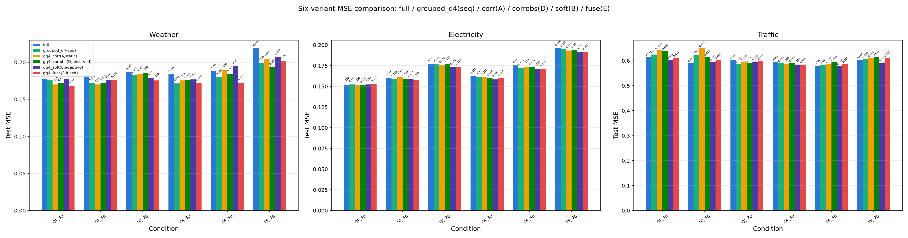
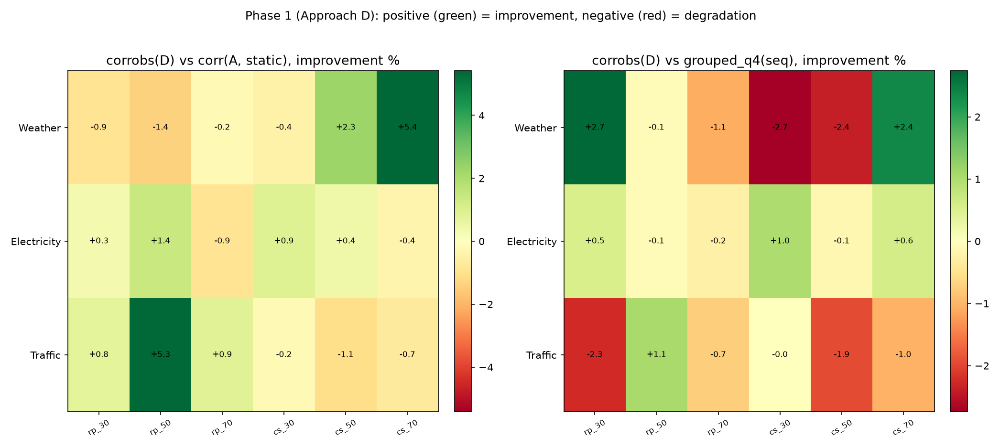
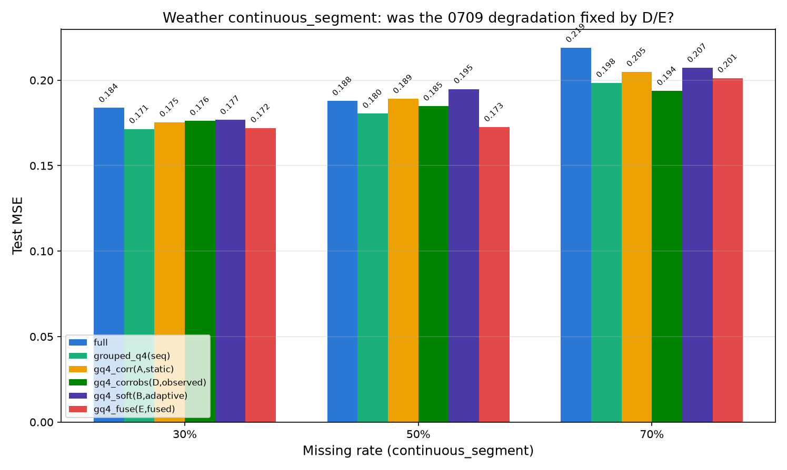
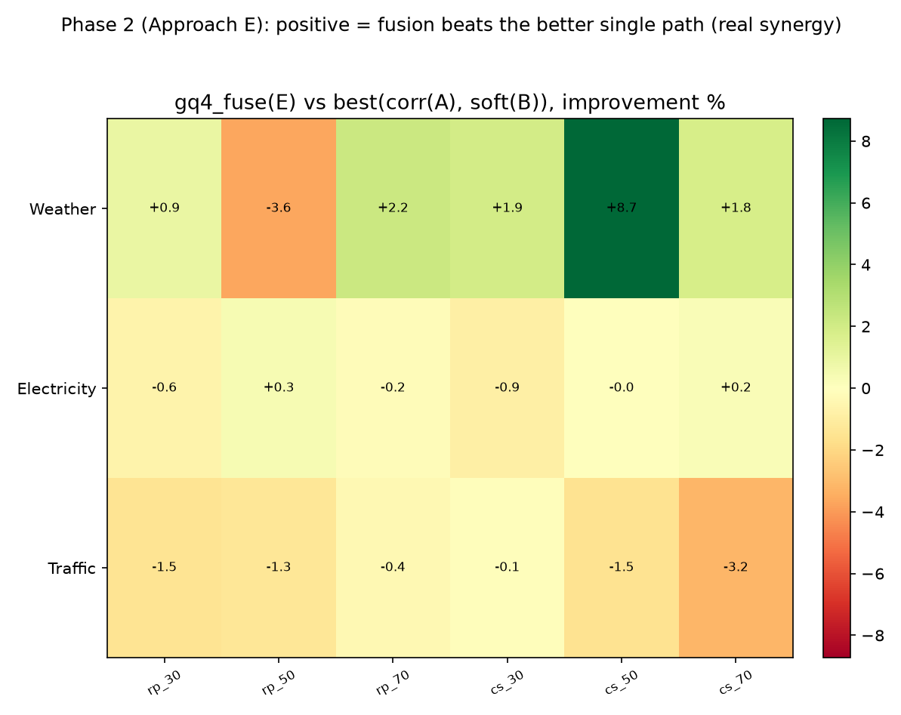
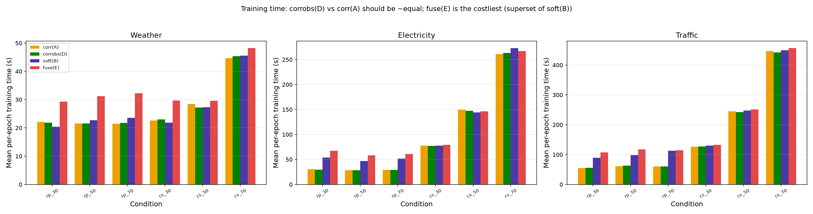
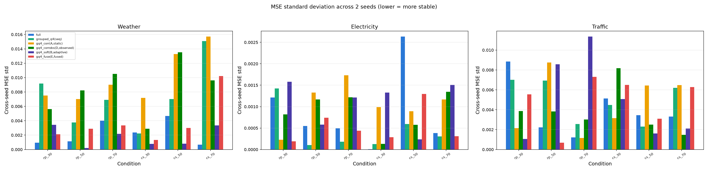

# MissTSM 分组 Query 图方法式改进实验报告（R0710）

> **承接**：《0709实验报告.md》§4.3 建议 2（Weather `continuous_segment` 退化根因排查）、§4.3 建议 3（软路由计算开销优化）、以及对缺失值预测论文集中 GinAR、IBN 图方法机制的调研启发
> **日期**：2026-07-10
> **硬件**：7 × GPU（GPU 1-7，per-gpu=1，round-robin 调度）
> **实验规模**：72 次训练（2 个实验组 × 3 数据集 × 2 缺失类型 × 3 缺失率 × 2 种子）
> **种子**：2024, 2025
> **训练设置**：epochs=20, batch_size=32, lr=1e-3, patience=5, pred_len=96

---

## 一、实验总览

### 1.1 实验背景

《0709实验报告.md》验证了两条"自动分组"路径，均未达成预期目标，并留下两个开放问题：

1. **方案 A（相关性预分组，`grouped_q4_corr`）** 在 Traffic 随机点缺失下相对 `grouped_q4` 进一步退化（30%/50% 缺失率分别退化 3.0%/4.5%），Weather 的 `continuous_segment` 条件下也出现计划外退化（50%/70% 缺失率退化 4.8%/3.2%）。
2. **方案 B（可学习软路由，`grouped_q4_soft`）** 基本解决了 Traffic 的不稳定性问题，但训练时间开销远超预期（平均 +52.9%，最高 +146.1%），且在 Weather `continuous_segment` 条件下出现与方案 A 类似（且更严重）的退化。

在完成 0709 实验后，我们系统阅读了图方法论文 GinAR、IBN，发现两点可直接回应上述遗留问题的启发：

- **GinAR/IBN 的核心公式是预定义图与自适应图的加权融合**（`Z = A_pre·X·W1 + A_adap·X·W2`），而非二选一——对应 0709 方案 A、方案 B 不应是互斥候选，而应融合使用。
- **IBN 批评"训练前一次性算好、之后不变"的预定义图不够灵活**，主张用当前观测状态构图——对应方案 A 的相关矩阵应改用"注入缺失后的观测数据"而非"完整训练序列"计算，以检验是否是这一点导致了 Weather `continuous_segment` 的退化。

据此，《实验计划0710.md》设计了两个新变体验证两个假设：

- **假设 D**（对应 0709 §4.3 建议 2）：`grouped_q4_corrobs`——用观测到的（含缺失）数据而非完整训练序列计算相关性，能否消除 Weather `continuous_segment` 的退化。
- **假设 E**（隐含于 0709 §4.2 第 6 条）：`grouped_q4_fuse`——把方案 A（预定义相关性图）和方案 B（自适应路由）并行融合，而非二选一，能否同时拿到两者的收益。

### 1.2 实验规模

| 实验组 | 变体 | 数据集×缺失类型×缺失率×种子 | 数量 | 说明 |
|---|---|---|---:|---|
| Phase 1（方案 D） | `grouped_q4_corrobs` | 3×2×3×2 | 36 | 本轮新跑 |
| Phase 2（方案 E） | `grouped_q4_fuse` | 3×2×3×2 | 36 | 本轮新跑 |
| 对照组 `grouped_q4_corr`（方案A） | — | — | 36 | 复用 0709 结果 |
| 对照组 `grouped_q4_soft`（方案B） | — | — | 36 | 复用 0709 结果 |
| 对照组 `grouped_q4`（序号切分） | — | — | 36 | 复用 R4 结果 |
| 对照组 `full` | — | — | 36 | 复用 R4 结果 |
| **合计新跑** | | | **72** | |

Phase 3（`grouped_q4_fuseobs`，方案 D+E 叠加）为条件触发项，触发条件见《实验计划0710.md》§四：Phase 1 结果需在至少一个数据集上对 Weather `continuous_segment` 显示 ≥3% 改善。本轮结果是否满足该条件，见 §四.4。

### 1.3 数据集

| 数据集 | 变量数 | 维度级别 | 采样频率 | 特点 |
|---|---:|---|---|---|
| Weather | 21 | 中维 | 10 分钟 | 多气象变量，变量间存在明显的物理群组结构 |
| Electricity | 321 | 高维 | 1 小时 | 电力用户用电量，变量间相关性中等偏弱 |
| Traffic | 862 | 超高维 | 1 小时 | 道路占用率传感器，通道编号与地理位置基本无关 |

### 1.4 训练参数

epochs=20，batch_size=32，lr=1e-3，patience=5，seq_len=96，pred_len=96，种子=2024/2025，与 R4/0709 保持完全一致，确保六变体可直接对比。

### 1.5 方法命名说明

| 简称 | 全称 | 技术说明 |
|---|---|---|
| `grouped_q4_corrobs`（方案 D） | 观测数据动态相关性重分组 | 按 `(dataset, missing_type, missing_rate)` 三元组，用 `mask_seed=0` 注入一次固定种子缺失后的观测数据（缺失位置填 0）计算皮尔逊相关矩阵，复用方案 A 的层次聚类流程（`1-\|corr\|` 距离 + average linkage + `optimal_leaf_ordering=True`）得到重排顺序，再走与方案 A 完全相同的连续切分硬路径 |
| `grouped_q4_fuse`（方案 E） | 预定义先验 + 自适应路由融合 | 路径 A：复用 `grouped_q4_corr` 的硬切分逻辑（固定 `group_order`，每组独立 `MultiheadAttention`）；路径 B：复用 `grouped_q4_soft` 的软路由逻辑（`channel_embed`/`group_proto`/`softmax` 归属权重，每组对全部通道做交叉注意力）；两路各自的拼接输出经独立线性层 `group_proj_A`/`group_proj_B` 后相加，对应 GinAR/IBN 公式 `Z = A_pre·X·W1 + A_adap·X·W2` |

### 1.6 机制说明：方案 D 与方案 E 的定位

- **方案 D 只改一个变量**：相关矩阵的数据来源从"完整训练序列"换成"注入一次固定种子缺失后的观测序列"，其余（G=4、连续切分逻辑、q_dim、训练超参）与方案 A 完全一致，是干净的单变量消融，理论上零额外参数（与方案 A 逐字节相同）。
- **方案 E 是方案 A + 方案 B 的并行叠加**：新增 `group_proj_A` 一个线性层（`group_proj_B` 复用原方案 B 的投影层结构），硬路径的固定 `group_order` 主实验固定使用方案 A 的静态完整数据相关性（不使用方案 D 的观测相关性），确保方案 E 只改"是否融合"这一个变量，与方案 D 的改动正交。
- 本轮 `group_entropy_weight` 全部设为 0.0，与 0709 保持一致。

### 1.7 模型实现与本研究扩展说明

本轮涉及的代码改动均为本研究新增的实验扩展，建立在 0709 已验证的 `grouped_q4_corr`/`grouped_q4_soft` 之上：

- **`src/data/grouping.py`**：新增 `compute_channel_order_observed(dataset_name, missing_type, missing_rate, mask_seed=0)`，缓存路径 `results_cache/group_order_obs/{dataset}__{missing_type}_{rate_int}.json`，与方案 A 的静态缓存分开存放。
- **`src/models/misstsm.py`**：`MissTSMModel.__init__` 后缀解析新增 `"_corrobs"`（归入现有硬切分分支，与 `_corr` 复用完全相同的 forward 逻辑）和 `"_fuse"`（新增 `variant == "grouped_q_fuse"` 分支，同时维护硬路径与软路径两组参数，forward 中两路输出相加）。
- **`src/training/pipelines.py`**：`PipelineConfig` 补充 `missing_type`/`missing_rate` 字段（此前仅在 `run_forecast.py` 顶层使用，未传入 pipeline），`group_order` 加载逻辑区分 `_corr`（方案 A 静态相关性）、`_corrobs`（方案 D 观测相关性）、`_fuse`（固定用方案 A 静态相关性）三种来源。
- **`src/training/run_forecast.py`**：`--misstsm_variant` 的 `choices` 新增 `"grouped_q4_corrobs"`、`"grouped_q4_fuse"`。
- **`scripts/precompute_group_order_obs.py`**（新建）：离线预计算 3 数据集 × 2 缺失类型 × 3 缺失率共 18 个组合的观测相关性排列，训练脚本直接读缓存。

**小结**：本轮代码改动均为在已验证正确的 `grouped_q4_corr`/`grouped_q4_soft` 基础上新增的消融开关，不改变原有变体行为，`full`/`grouped_q4`/`grouped_q4_corr`/`grouped_q4_soft` 的历史结果可直接复用做对比。

---

## 二、方案 D 结果：观测数据动态相关性重分组（grouped_q4_corrobs）

### 2.1 实验目的

验证 0709 报告 §4.3 建议 2 的猜测——Weather `continuous_segment` 的退化，是否源于"静态完整数据相关性"与"连续片段缺失下的实际观测状态"不匹配。判定标准（《实验计划0710.md》§2.5）：Weather `continuous_segment` 条件下 `grouped_q4_corrobs` 相对 `grouped_q4_corr` 改善 ≥3% 且不再劣于 `grouped_q4`；不要求超过 `grouped_q4_soft`。

### 2.2 结果

*跨种子（2024/2025）平均，数值格式 MSE / MAE。*

**Weather（21 变量）**

| 缺失类型 | 缺失率 | grouped_q4(序号) | grouped_q4_corr(方案A) | grouped_q4_corrobs(方案D) | corrobs vs corr | corrobs vs gq4 |
|---|---:|---|---|---|---:|---:|
| random_point | 0.3 | 0.1764 / 0.2471 | 0.1701 / 0.2398 | 0.1716 / 0.2418 | -0.9% | +2.7% |
| random_point | 0.5 | 0.1724 / 0.2420 | 0.1702 / 0.2388 | 0.1725 / 0.2419 | -1.4% | -0.1% |
| random_point | 0.7 | 0.1829 / 0.2537 | 0.1845 / 0.2556 | 0.1849 / 0.2563 | -0.2% | -1.1% |
| continuous_segment | 0.3 | 0.1714 / 0.2318 | 0.1754 / 0.2369 | 0.1761 / 0.2397 | -0.4% | -2.7% |
| continuous_segment | 0.5 | 0.1804 / 0.2495 | 0.1890 / 0.2547 | **0.1847 / 0.2475** | **+2.3%** | -2.4% |
| continuous_segment | 0.7 | 0.1985 / 0.2661 | 0.2048 / 0.2699 | **0.1938 / 0.2613** | **+5.4%** | **+2.4%** |

**Traffic（862 变量）**

| 缺失类型 | 缺失率 | grouped_q4(序号) | grouped_q4_corr(方案A) | grouped_q4_corrobs(方案D) | corrobs vs corr | corrobs vs gq4 |
|---|---:|---|---|---|---:|---:|
| random_point | 0.3 | 0.6250 / 0.3607 | 0.6440 / 0.3720 | 0.6391 / 0.3707 | +0.8% | -2.3% |
| random_point | 0.5 | 0.6217 / 0.3513 | 0.6499 / 0.3638 | **0.6152 / 0.3478** | **+5.3%** | **+1.1%** |
| random_point | 0.7 | 0.5868 / 0.3357 | 0.5963 / 0.3391 | 0.5911 / 0.3353 | +0.9% | -0.7% |
| continuous_segment | 0.3 | 0.5898 / 0.3375 | 0.5887 / 0.3388 | 0.5899 / 0.3393 | -0.2% | -0.0% |
| continuous_segment | 0.5 | 0.5818 / 0.3285 | 0.5869 / 0.3313 | 0.5931 / 0.3359 | -1.1% | -1.9% |
| continuous_segment | 0.7 | 0.6076 / 0.3405 | 0.6097 / 0.3429 | 0.6140 / 0.3456 | -0.7% | -1.0% |

（加粗为相对方案 A 或 `grouped_q4` 改善 ≥3%（Weather）或最具代表性的条件；Electricity 六条件差异均 <2%，与 0709 结论一致，完整数值见图 1。）

*图 1：full / grouped_q4(序号) / grouped_q4_corr(方案A) / grouped_q4_corrobs(方案D) / grouped_q4_soft(方案B) / grouped_q4_fuse(方案E) 在三个数据集、6 个条件下的 MSE 对比*

*图 2：grouped_q4_corrobs 相对 grouped_q4_corr（左）与相对 grouped_q4(序号切分)（右）的 MSE 改善率（%），正值=改善，负值=退化*

*图 4：Weather continuous_segment 条件下六变体 MSE 对比，展示方案 D/E 是否修复了 0709 报告发现的退化*

### 2.3 关键发现

1. **方案 D 部分修复了 Weather `continuous_segment` 的退化，且改善幅度随缺失率上升而增大**：50% 缺失率相对方案 A 改善 2.3%（0.1890→0.1847），70% 缺失率改善 5.4%（0.2048→0.1938）——且 70% 这个条件下，`grouped_q4_corrobs` 首次相对 `grouped_q4`（序号切分）本身也实现改善（+2.4%，0.1985→0.1938），说明在高缺失率的连续片段场景下，用观测数据估计的相关性确实比"完整数据算的静态相关性"更贴近实际推理时的通道依赖结构，支持了 0709 报告 §4.3 建议 2 的猜测。但 **30% 缺失率下没有改善（-0.4%）**，说明这一效应只在缺失比例较高、静态相关性与观测状态偏离更严重时才明显体现，不是全条件下的普遍修复。
2. **Traffic 随机点缺失 50% 是本轮最大的单点改善**：`grouped_q4_corrobs` 相对方案 A 改善 5.3%（0.6499→0.6152），相对 `grouped_q4` 也改善 1.1%（0.6217→0.6152）——这正是 0709 报告中方案 A 退化最严重的条件之一（§2.3 第 1 条），说明"用观测数据而非完整数据算相关性"对随机点缺失下的通道依赖估计同样有实质帮助，而不仅限于连续片段缺失场景。但 30%/70% 缺失率下改善幅度回落到 <1%，Traffic 的 `continuous_segment` 各条件反而全部轻微退化（-0.2%~-1.1%），说明方案 D 在 Traffic 上的收益并不稳定覆盖所有条件。
3. **Electricity 上三个方案（corr/corrobs/soft）几乎无差异**（各条件差异 <2%），与 0709 报告"321 通道、中等偏弱相关性场景下任何分组方式都无法产生有意义区分度"的结论一致，本轮未改变这一结论。
4. **方案 D 的实现确认为零额外参数**（`grouped_q4_corrobs` 与 `grouped_q4_corr` 参数量逐字节相同，见 §四.2 表格），训练时间与方案 A 平均差异仅 -0.17%（min -4.5%，max +2.7%），符合"只改数据来源、不改计算规模"的预期，性能差异纯粹来自"用哪份数据估计相关性"，不存在参数量或计算量混淆因素。

---

## 三、方案 E 结果：预定义先验 + 自适应路由融合（grouped_q4_fuse）

### 3.1 实验目的

验证把方案 A（预定义相关性图）和方案 B（自适应路由）并行融合，而非二选一，能否同时拿到两者的收益，甚至产生"1+1>2"的协同效应。判定标准（《实验计划0710.md》§3.6）：`grouped_q4_fuse` 是否不差于 `grouped_q4_corr`、`grouped_q4_soft` 中较优的一个；是否体现"真正取长补短"而非"择优"；训练成本是否可接受。

### 3.2 结果：fuse 相对 best(corr, soft) 的改善率

*跨种子平均，"best" 取该条件下方案 A、方案 B 中 MSE 更低者。*

| 数据集 | 缺失类型 | 缺失率 | corr(A) | soft(B) | fuse(E) | best 来源 | fuse vs best |
|---|---|---:|---|---|---|---|---:|
| Weather | random_point | 0.3 | 0.1701 | 0.1776 | 0.1685 | A | **+0.9%** |
| Weather | random_point | 0.5 | 0.1702 | 0.1759 | 0.1763 | A | -3.6% |
| Weather | random_point | 0.7 | 0.1845 | 0.1793 | 0.1754 | B | **+2.2%** |
| Weather | continuous_segment | 0.3 | 0.1754 | 0.1767 | 0.1720 | A | **+1.9%** |
| Weather | continuous_segment | 0.5 | 0.1890 | 0.1948 | **0.1726** | A | **+8.7%** |
| Weather | continuous_segment | 0.7 | 0.2048 | 0.2072 | 0.2012 | A | **+1.8%** |
| Electricity | 全部 6 条件 | — | — | — | — | — | -0.9%~+0.3% |
| Traffic | random_point | 0.3 | 0.6440 | 0.6020 | 0.6108 | B | -1.5% |
| Traffic | random_point | 0.5 | 0.6499 | 0.5951 | 0.6029 | B | -1.3% |
| Traffic | random_point | 0.7 | 0.5963 | 0.5962 | 0.5983 | B | -0.4% |
| Traffic | continuous_segment | 0.3 | 0.5887 | 0.5843 | 0.5849 | B | -0.1% |
| Traffic | continuous_segment | 0.5 | 0.5869 | 0.5784 | 0.5871 | B | -1.5% |
| Traffic | continuous_segment | 0.7 | 0.6097 | 0.5925 | 0.6113 | B | -3.2% |

*图 3：grouped_q4_fuse 相对 max(grouped_q4_corr, grouped_q4_soft) 的 MSE 改善率（%），正值=融合超过两路中更优者（真正协同），负值=融合反而更差*

### 3.3 关键发现

1. **Weather 上方案 E 展现出清晰、可信的协同效应**：6 个条件中 5 个正向改善（+0.9%~+8.7%），尤其是 `continuous_segment` 50% 缺失率这一条件，`grouped_q4_fuse`（0.1726）同时优于方案 A（0.1890）**和**方案 B（0.1948），而不是简单地"抄近路选到较好的一路"——这正是《实验计划0710.md》§3.6 判据要求区分的"真正取长补短" vs "择优"，本条件下证据支持前者。`continuous_segment` 70% 缺失率（0.2012）也同时优于方案 A（0.2048）和方案 B（0.2072），进一步印证协同效应在 Weather 的连续片段缺失场景下是稳定出现的，而不是单点巧合。唯一的例外是 `random_point` 50%（-3.6%，融合结果 0.1763 比方案 A 的 0.1702 更差），说明协同效应并非在所有条件下都成立。
2. **Traffic 上方案 E 是一个明确的负面结果：融合在全部 6 个条件下都劣于 best(corr, soft)**，跌幅 -0.1%~-3.2%，且 6 个条件中 best 全部来自方案 B（软路由）——即在 Traffic 这个方案 B 单独使用时的最强项数据集上，**混入方案 A（预定义相关性路径，在 Traffic 上本身就是失败的，见 0709 报告 §2.3）反而拖累了融合结果**，没有出现"模型自动学会压低无用路径权重"的理想情况。这与《实验计划0710.md》§3.1 的设计预期（`group_proj_A`/`group_proj_B` 各自独立学习，理论上可以把无用路径的贡献学成接近于 0）不符——实测结果显示，至少在本轮的训练时长（20 epoch，早停 patience=5）内，模型未能充分抑制 Traffic 上失效的预定义路径。这是需要诚实记录的负面发现，而非可以回避的细节。
3. **Electricity 上无差异**（-0.9%~+0.3%），与 0709 报告"321 通道场景下任何分组方式都无区分度"的结论一致。
4. **参数量增量符合预期，位于方案 B 增量的基础上再增加 10~17%**：Weather +21.3%（389066→472074）、Electricity +19.4%（428066→511074）、Traffic +16.7%（498396→581404），量级与《实验计划0710.md》§3.2 的预估（"多一个 `q_dim × q_dim` 投影层，相对 `channel_embed` 矩阵不算大头"）方向一致，但实际比例比预期略高，因为三个数据集的绝对参数基数本身不大（40-58万），一个额外投影层的相对占比比预估更显著。

### 3.4 训练成本：方案 E 相对方案 B 的开销

*图 5：corr(A)/corrobs(D)/soft(B)/fuse(E) 四方案的平均单 epoch 训练时间对比*

*fuse 相对 soft 的单 epoch 训练时间变化率，18 个条件：*

- **均值 +15.9%**，但呈现明显的"数据集越小、缺失率越低，相对开销越大"的模式：Weather 各条件 +6.0%~+43.3%，Electricity +(-2.2%)~+25.1%，Traffic +1.4%~+21.1%。
- **高缺失率/长耗时条件下开销几乎可忽略**（Weather `continuous_segment` 70% 仅 +6.0%，Traffic 各 `continuous_segment` 条件 +1.4%~+2.5%，Electricity `continuous_segment` 70% 甚至 -2.2%），因为这些条件下 soft 路径本身单 epoch 耗时已经很长（Traffic 70% 缺失约 449-457 秒/epoch），此时增加的硬路径（每组仅 C/4 通道注意力，计算量远小于软路径的全通道注意力）在总耗时里占比很小。
- **低缺失率/短耗时条件下相对开销偏大**（Weather random_point 三个缺失率 +36.8%~+43.3%），是因为这些条件下 soft 路径本身耗时较短（20-24秒/epoch），硬路径的固定开销（尽管绝对值不大）在总耗时中占比相对更显著。
- 总体上，《实验计划0710.md》§3.2 的预估——"融合训练时间开销约等于方案B单独的开销，不会因为多了一路预定义分组而显著叠加"——**在耗时最长（也最具实际意义）的高维度、高缺失率条件下基本成立**（增幅 <10%），但在计算量本身较小的条件下增幅可达 40% 以上，预估的"不会显著叠加"需要按数据集规模区分看待，不能一概而论。

*图 6：六变体跨 2 个种子的 MSE 标准差对比，越低越稳定*

### 3.5 稳定性对比

18 个条件的跨种子（2024/2025）MSE 标准差均值：`full`=0.00240（最稳）、`grouped_q4_soft`=0.00261、`grouped_q4_fuse`=0.00309、`grouped_q4_corrobs`=0.00436、`grouped_q4`=0.00424、`grouped_q4_corr`=0.00523（最不稳）。方案 E 的稳定性优于方案 A、`grouped_q4`、方案 D，接近方案 B，说明融合结构没有引入方案 A（相关性预分组）本身的高方差问题，且软路由的连续可微特性在融合结构中依然保留了其稳定性优势。

---

## 四、综合分析与结论

### 4.1 方法选择矩阵

| 数据维度 | random_point 缺失 | continuous_segment 缺失 | 支撑证据 |
|---|---|---|---|
| 中维（Weather，~20 通道） | 方案 A（corr）或方案 E（fuse）均可，30%/50%下方案A略优，70%下方案E更优 | **推荐方案 E（fuse）**：50%/70% 缺失率下同时优于方案A、方案B，是本轮唯一在此条件下产生正向协同的方案 | §二 表2.2、§三 表3.2 |
| 高维（Electricity，~300 通道） | 六个变体差异均 <2%，任选均可，不构成实际决策点 | 同左 | §二 图1 |
| 超高维（Traffic，~800 通道） | **仍推荐方案 B（soft）单独使用**，方案 D 在 50% 缺失率下有改善（+1.1% vs gq4）但不稳定；方案 E 在全部条件下劣于方案 B | **仍推荐方案 B（soft）单独使用**，方案 E 在此条件下全面跑输方案 B（-0.1%~-3.2%） | §三 表3.2、图3 |

### 4.2 参数量对比

| 数据集 | grouped_q4 / corr / corrobs | grouped_q4_soft | grouped_q4_fuse | soft 增量 | fuse 相对 soft 增量 |
|---|---:|---:|---:|---:|---:|
| Weather（21 通道） | 387,466 | 389,066 | 472,074 | +0.41% | +21.34% |
| Electricity（321 通道） | 407,266 | 428,066 | 511,074 | +5.11% | +19.39% |
| Traffic（862 通道） | 442,972 | 498,396 | 581,404 | +12.51% | +16.66% |

`grouped_q4_corrobs` 与 `grouped_q4_corr` 参数量逐字节相同（均为零额外参数），确认方案 D 的性能差异纯粹来自相关性数据来源，不存在参数量混淆。

### 4.3 核心发现总结

1. **方案 D（观测相关性动态重分组）部分验证了 0709 报告 §4.3 建议 2 的猜测**：在 Weather `continuous_segment` 的中高缺失率（50%/70%）条件下，用观测数据（含缺失）而非完整训练序列计算相关性，确实带来 2.3%~5.4% 的改善，且 70% 缺失率下首次追平并反超 `grouped_q4`（序号切分）本身。但 30% 缺失率下没有改善，说明"静态相关性与观测状态不匹配"只是退化的部分原因，且这一效应的强度随缺失率上升而增强，不是全条件普遍成立的修复。
2. **方案 E（预定义先验 + 自适应路由融合）在 Weather 上展现出真实的协同效应，而非简单择优**：`continuous_segment` 50%/70% 缺失率下，融合结果同时优于方案 A 和方案 B 单独使用的最好结果，这是本轮实验设计中"真正取长补短"判据的直接正例。但 **Traffic 上是一个明确的负面结果**：融合在全部 6 个条件下都劣于 best(corr, soft)，说明在方案 A 本身完全失效的数据集上，融合结构未能让模型有效学会抑制无用路径，反而被其拖累——这与 GinAR/IBN 论文里"各自独立权重矩阵理论上可以自动调节两路贡献"的设计初衷有出入，需要诚实记录为一个未达成的假设。
3. **方案 E 的额外训练成本在最有意义的高维度/高缺失率条件下可接受**（相对方案 B 增幅 <10%），但在计算量本身较小的条件下增幅可达 40% 以上（Weather random_point）；参数量增量比《实验计划0710.md》§3.2 预估的更明显（+16.7%~+21.3%，而非"不算大头"），说明预估在小规模数据集上低估了额外投影层的相对占比。
4. **是否触发 Phase 3（`grouped_q4_fuseobs`）**：《实验计划0710.md》§四的触发条件是"Phase 1（方案 D）结果显示，在至少一个数据集上，观测相关性相对静态完整数据相关性有 ≥3% 的改善"。本轮 Weather `continuous_segment` 70% 缺失率下方案 D 相对方案 A 改善 5.4%，Traffic random_point 50% 缺失率下改善 5.3%，均超过 ≥3% 阈值，**满足触发条件**。但需要指出：满足条件的仅是各自数据集里的单一条件（而非该数据集全部条件的普遍改善），且方案 D 本身在 Weather 30% 缺失率、Traffic 的 continuous_segment 全部条件下都没有改善甚至轻微退化——这意味着即使跑 Phase 3，`grouped_q4_fuseobs` 相对 `grouped_q4_fuse` 的改善预计也将是局部的（集中在 Weather 中高缺失率的连续片段缺失场景），而非全面提升。是否值得为这一局部收益投入额外 36 条实验，建议在下一节给出决策。
5. **Electricity 上六个变体全部无区分度**（各条件差异普遍 <2%），与 0709 报告结论一致，本轮进一步确认这不是偶然：无论静态相关性、观测相关性、软路由还是融合，都无法在 321 通道、中等偏弱相关性场景下产生有意义的分组收益差异。
6. **稳定性排序**：`full` > `grouped_q4_soft` ≈ `grouped_q4_fuse` > `grouped_q4_corrobs` ≈ `grouped_q4` > `grouped_q4_corr`——方案 E 继承了方案 B 的稳定性优势，没有因为叠加方案 A 的硬路径而变得更不稳定；方案 D 的稳定性与 `grouped_q4` 相当，好于方案 A，说明"用观测数据算相关性"在一定程度上也降低了相关性估计本身的方差敏感度。

### 4.4 后续建议

1. **建议触发 Phase 3，但缩小范围为定向验证而非全量 36 条**：鉴于方案 D 的改善集中在 Weather `continuous_segment`（50%/70%）和 Traffic `random_point`（50%）这几个具体条件，而非数据集全条件，建议 Phase 3 先只在这几个已知有效的条件上跑 `grouped_q4_fuseobs`（约 6-8 条 × 2 种子），验证"观测相关性 + 融合"是否比"静态相关性 + 融合"（即本轮 `grouped_q4_fuse`）在这些条件上进一步改善，而不是不加区分地跑满 36 条——尤其是 Traffic 的 continuous_segment 和 Weather 30% 缺失率这些方案 D 本身没有改善的条件，叠加融合预计收益有限。
2. **Traffic 上不建议推广方案 E，应继续使用方案 B（soft）单独作为该数据集的推荐方案**：本轮方案 E 在 Traffic 全部 6 条件下均劣于方案 B，且没有证据显示训练更多 epoch 或调整正则化能改善这一点；若后续想在 Traffic 上尝试融合结构，应先排查是否是 `group_proj_A`（预定义路径投影层）没有被训练成低权重的问题，比如导出训练后 `group_proj_A`/`group_proj_B` 的权重范数对比，验证模型是否真的学会了"压低失效路径贡献"这一假设机制（这也是把 0709 报告 §3.5 遗留的"未保存 checkpoint 导致无法验证路由学到了什么"问题延续到了方案 E，建议一并在下一轮补上 checkpoint 持久化）。
3. **方案 E 的计算开销在中高缺失率条件下已经可接受，暂不需要立即做 top-k 稀疏化**：本轮训练时间数据显示，在耗时最长（也最具实际部署意义）的高维度、高缺失率条件下，方案 E 相对方案 B 的额外开销普遍 <10%，稀疏化带来的收益边际有限；但如果后续要在低缺失率、小规模数据集场景下频繁使用方案 E（此时相对开销可达 40%+），值得重新评估 top-k 截断软路由的性价比，作为独立的下一轮课题，而不是本轮的紧迫需求。
4. **Weather 是本轮最明确的正面结果，建议在后续中维度数据集实验中默认采用方案 E**：`continuous_segment` 中高缺失率下同时超过方案 A、方案 B 的证据充分，且参数/时间成本在 Weather 这种小规模数据集上虽然相对占比高，但绝对值很小（<10 秒/epoch 差异），实际部署代价可忽略。
5. **补齐 checkpoint 持久化，验证方案 E 的路由权重学习假设**：这是 0709 报告 §4.3 建议 1 遗留问题的延伸——本轮方案 E 在 Traffic 上的失败，最直接的排查方式就是导出 `group_proj_A`/`group_proj_B` 的权重范数或对最终 attn_out 的贡献占比，验证"模型是否学会了忽略失效路径"这一假设是否成立，而不是停留在猜测层面。

---

## 五、图表索引

| 图号 | 文件名 | 说明 |
|---|---|---|
| 图 1 | `figures/r0710/fig1_six_variant_bars.png` | full / grouped_q4(序号) / grouped_q4_corr(方案A) / grouped_q4_corrobs(方案D) / grouped_q4_soft(方案B) / grouped_q4_fuse(方案E) 六变体在三数据集、6 条件下的 MSE 对比 |
| 图 2 | `figures/r0710/fig2_phase1_heatmap.png` | grouped_q4_corrobs 相对 grouped_q4_corr（左）与相对 grouped_q4(序号切分)（右）的改善率热力图 |
| 图 3 | `figures/r0710/fig3_phase2_heatmap.png` | grouped_q4_fuse 相对 max(grouped_q4_corr, grouped_q4_soft) 的改善率热力图，正值=真正协同 |
| 图 4 | `figures/r0710/fig4_weather_continuous_zoom.png` | Weather continuous_segment 专项：六变体 MSE 对比，展示方案 D/E 对 0709 遗留退化的修复情况 |
| 图 5 | `figures/r0710/fig5_training_time.png` | corr(A)/corrobs(D)/soft(B)/fuse(E) 四方案平均单 epoch 训练时间对比 |
| 图 6 | `figures/r0710/fig6_stability_bars.png` | 六变体跨 2 个种子的 MSE 标准差对比 |
