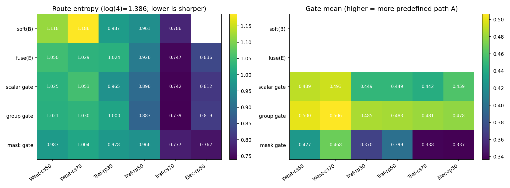
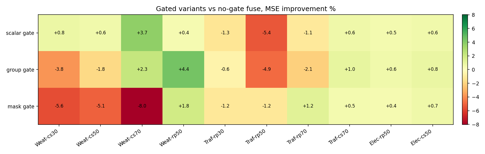
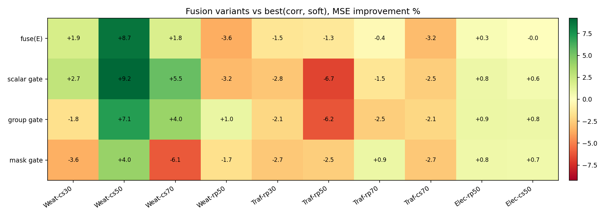
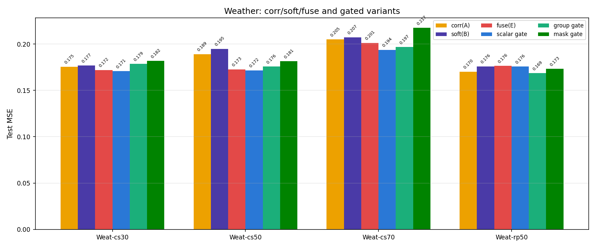
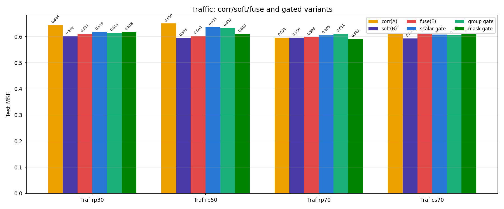
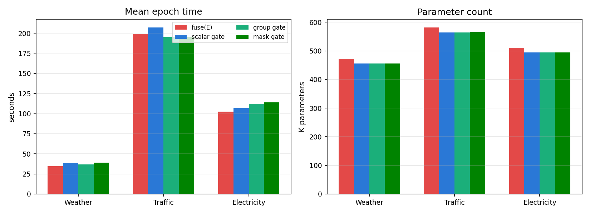

# MissTSM 可靠性感知分组 Query 融合实验报告（R0711）

> **承接**：《0709实验报告.md》关于自动分组的结论、《0710实验报告.md》关于观测相关性与双路融合的正负结果，以及《实验计划0711.md》提出的可靠性感知分组 Query 聚合假设  
> **日期**：2026-07-11 ~ 2026-07-12  
> **硬件**：7 × GPU（GPU 1-7，per-gpu=1，round-robin 调度；GPU 0 未使用）  
> **实验规模**：84 次训练（阶段 0 诊断重跑 24 次 + 阶段 1 门控主实验 60 次）  
> **种子**：2024, 2025  
> **训练设置**：epochs=20, batch_size=32, lr=1e-3, patience=5, seq_len=96, pred_len=96

---

## 一、实验总览

### 1.1 实验背景

0709 与 0710 两轮实验已经把课题从“哪一种通道分组方式更好”推进到一个更具体的问题：缺失多变量时间序列预测中，通道依赖先验不是恒定可靠的。0709 的静态相关性硬分组（代码名 `grouped_q4_corr`）说明，训练前用完整训练序列计算一次静态相关性并不稳定；0710 的观测相关性硬分组（代码名 `grouped_q4_corrobs`）说明，观测状态会改变相关性先验的有效性；0710 的无门控双路融合（代码名 `grouped_q4_fuse`）进一步说明，预定义先验路径与自适应软路由路径可以在 Weather 上产生协同，但在 Traffic 上会被坏先验拖累。

因此，本轮实验的核心问题不是继续枚举更多分组方式，而是验证一个更适合写入课题主线的机制假设：

> 在缺失多变量时间序列预测中，MissTSM-style grouped query aggregation 应当根据当前缺失状态和先验可靠性，动态调节预定义分组路径与自适应软路由路径的贡献。

本轮实验围绕两个问题展开：

1. **阶段 0：机制诊断**。0710 中 Traffic 上无门控双路融合（`grouped_q4_fuse`）失败，是否因为预定义路径没有被模型自动压低；Weather 上融合成功，是否存在两路互补证据。
2. **阶段 1：门控融合**。在无门控双路融合的基础上加入全局标量门控、分组级门控、缺失感知分组门控后，能否保留 Weather 的融合协同，同时缓解 Traffic 上坏先验拖累。

### 1.2 实验规模

| 实验组 | 变体 | 条件 | 种子 | 数量 | 说明 |
|---|---|---:|---:|---:|---|
| 阶段 0 | `grouped_q4_soft`, `grouped_q4_fuse` | 12 个诊断条件 | 2 | 24 | 保存 checkpoint 并导出路由/融合诊断 |
| 阶段 1 | `grouped_q4_fuse_sgate`, `grouped_q4_fuse_ggate`, `grouped_q4_fuse_mgate` | 10 个主实验条件 | 2 | 60 | 三种可靠性门控融合 |
| 对照组 | `grouped_q4_corr`, `grouped_q4_soft`, `grouped_q4_fuse` | 对应条件 | 2 | 复用 0709/0710 | 用于计算相对改善 |
| **合计新跑** | | | | **84** | |

### 1.3 数据集

| 数据集 | 变量数 | 维度级别 | 采样频率 | 特点 |
|---|---:|---|---|---|
| Weather | 21 | 中维 | 10 分钟 | 多气象变量，变量间存在较清晰的物理群组结构 |
| Electricity | 321 | 高维 | 1 小时 | 电力用户用电量，变量间相关性中等偏弱 |
| Traffic | 862 | 超高维 | 1 小时 | 道路占用率传感器，通道编号与真实空间关系不稳定 |

### 1.4 训练参数

本轮所有训练保持与 0709/0710 一致：epochs=20，batch_size=32，lr=1e-3，patience=5，seq_len=96，pred_len=96，seed=2024/2025。阶段 0 与阶段 1 均保存 checkpoint 到 `results/checkpoints/r0711/`，用于后续诊断。

### 1.5 术语与代码缩写说明

本报告正文尽量使用中文名称。由于实验结果文件、训练命令和代码参数都使用英文代码名，表格中会保留代码缩写，便于追溯到 `results/*.json`、`scripts/r0711_cmds.txt` 和模型实现。首次出现或容易混淆的缩写说明如下。

| 缩写或术语 | 中文名称 | 含义 |
|---|---|---|
| MSE / MAE | 均方误差 / 平均绝对误差 | 预测误差指标，数值越低越好 |
| `corr` | 静态相关性硬分组 | `correlation` 的缩写；用完整训练序列计算通道相关性后固定分组 |
| `corrobs` | 观测相关性硬分组 | `correlation on observed data` 的缩写；用注入缺失后的观测数据计算相关性 |
| `soft` | 自适应软路由分组 | 通道到分组的归属不是固定切分，而是通过可学习权重软分配 |
| `fuse` | 无门控双路融合 | `fusion` 的缩写；静态先验路径和自适应软路由路径直接相加 |
| `sgate` | 全局标量门控 | `scalar gate` 的代码缩写；所有分组共用一个融合权重 |
| `ggate` | 分组级门控 | `group gate` 的代码缩写；每个 query group 各自学习一个融合权重 |
| `mgate` | 缺失感知分组门控 | `mask-aware gate` 的代码缩写；根据观测率和全缺失标记动态生成融合权重 |
| gate / 门控 | 融合权重 | 值越大越依赖静态先验路径，值越小越依赖自适应软路由路径 |
| route entropy / 路由熵 | 软路由分布的熵 | 越低表示通道到分组的归属越尖锐；`log(4)=1.386` 是 4 组完全均匀时的上界 |
| cosine / 余弦相似度 | 两路输出方向相似性 | 越高表示静态先验路径与自适应路径越相似，越低表示两路信息差异更大 |
| best(corr, soft) | 两条单路径中的更优者 | 同一条件下，在静态相关性硬分组与自适应软路由分组中取 MSE 较低者 |
| `random_point` | 随机点缺失 | 每个时间点和变量按概率独立缺失 |
| `continuous_segment` | 连续片段缺失 | 时间维度上出现连续缺失片段 |

### 1.6 方法命名说明

| 简称 | 全称 | 技术说明 |
|---|---|---|
| `grouped_q4_corr`（方案 A） | 静态相关性硬分组 | 用完整训练序列计算通道相关性，层次聚类得到通道顺序，再连续切成 4 组，每组独立 query 做跨变量交叉注意力 |
| `grouped_q4_soft`（方案 B） | 自适应软路由分组 | 每个通道学习 `channel_embed`，每个组学习 `group_proto`，通过 softmax 得到通道到 4 个组的软归属权重，每组对全部通道做加权交叉注意力 |
| `grouped_q4_fuse`（方案 E） | 静态先验路径 + 自适应软路由路径直接相加 | 路径 A 复用静态相关性硬分组，路径 B 复用自适应软路由分组，两路分别经投影层后相加 |
| `grouped_q4_fuse_sgate` | 全局标量门控融合 | 在每组输出层面用一个全局可学习标量控制路径 A 与路径 B 的比例 |
| `grouped_q4_fuse_ggate` | 分组级门控融合 | 为 4 个 query group 分别学习门控权重，允许不同组使用不同的路径权重 |
| `grouped_q4_fuse_mgate` | 缺失感知分组门控融合 | 根据全局观测率、组内观测率、组内是否全缺失生成动态门控权重，试图让门控直接感知当前缺失状态 |

### 1.7 门控机制说明

无门控双路融合（`fuse`）的融合方式为：

```python
attn_out = attn_out_A + attn_out_B
```

本轮三种门控统一改为先在 group 输出层面混合，再投影回 `q_dim`：

```python
mixed_g = gate_g * out_A_g + (1 - gate_g) * out_B_g
attn_out = group_proj_mix(concat(mixed_1, ..., mixed_G))
```

其中门控权重 `gate` 越大，表示越依赖静态先验硬分组路径；`gate` 越小，表示越依赖自适应软路由路径。

### 1.8 模型实现与本研究扩展说明

本轮代码改动全部属于本研究新增的实验扩展，没有引入新的 bug 修复，也没有对原有 MissTSM 复现路径做额外简化。

| 文件 | 改动性质 | 说明 |
|---|---|---|
| `src/training/run_forecast.py` | 本研究扩展 | 新增 `--save_checkpoint_dir`，训练后保存最优 checkpoint，包含 `state_dict`、config、best validation MSE 和参数量 |
| `src/models/misstsm.py` | 本研究扩展 | 在 `grouped_q4_fuse` 分支加入全局标量、分组级、缺失感知三种门控；新增诊断缓存，记录路由熵、两路输出范数、余弦相似度、门控均值等 |
| `src/training/pipelines.py` | 本研究扩展 | 对三种门控变体按无门控双路融合一样加载静态相关性 `group_order`，保证先验路径来源一致 |
| `scripts/analyze_route_diagnostics.py` | 本研究扩展 | 从 checkpoint 重建模型，在测试集前向少量 batch，导出路由、融合和门控诊断 JSON |
| `scripts/gen_0711_cmds.py`, `scripts/run_r0711.sh` | 本研究扩展 | 生成 84 条训练命令并按 GPU 1-7 调度 |

**小结**：本轮没有改变静态相关性硬分组、自适应软路由分组、无门控双路融合这三条历史基线的定义。门控实验只改变双路融合方式，因此可以直接与 0709/0710 的基线对比。

---

## 二、阶段 0：checkpoint 诊断与机制验证

### 2.1 实验目的

阶段 0 不是为了取得新的 MSE 排名，而是补齐 0709/0710 缺少 checkpoint 诊断的问题。重点回答三件事：

1. 自适应软路由分组（`soft`）是否形成了非均匀路由，还是接近完全均匀分配；
2. 无门控双路融合（`fuse`）在 Weather 成功和 Traffic 失败时，两路输出是否具有不同的相似性与贡献；
3. 加入门控后，模型是否真的学会按数据集和缺失条件调节路径 A 的权重。

### 2.2 结果一致性

阶段 0 重跑的自适应软路由分组（`soft`）与无门控双路融合（`fuse`）在关键条件上的 MSE 与 0709/0710 报告一致，说明保存 checkpoint 这一工程改动没有改变原有实验结论。例如：

| 变体 | 条件 | 阶段 0 MSE |
|---|---|---:|
| 自适应软路由分组（`soft`） | Traffic 随机点缺失 0.3 | 0.6020 |
| 自适应软路由分组（`soft`） | Traffic 随机点缺失 0.5 | 0.5951 |
| 自适应软路由分组（`soft`） | Traffic 连续片段缺失 0.7 | 0.5925 |
| 无门控双路融合（`fuse`） | Weather 连续片段缺失 0.5 | 0.1726 |
| 无门控双路融合（`fuse`） | Weather 连续片段缺失 0.7 | 0.2012 |
| 无门控双路融合（`fuse`） | Traffic 连续片段缺失 0.7 | 0.6113 |

### 2.3 诊断结果

*跨种子平均；路由熵（route entropy）的上界 `log(4)=1.386`，越低表示路由越尖锐；门控均值越大表示越偏向静态先验路径。*

| 条件 | 自适应软路由的路由熵 | 无门控融合的路由熵 | 无门控融合两路余弦相似度 | 全局标量门控均值 | 分组级门控均值 | 缺失感知门控均值 |
|---|---:|---:|---:|---:|---:|---:|
| Weather 连续片段缺失 0.5 | 1.118 | 1.050 | 0.399 | 0.489 | 0.500 | 0.427 |
| Weather 连续片段缺失 0.7 | 1.186 | 1.029 | 0.357 | 0.493 | 0.506 | 0.468 |
| Weather 随机点缺失 0.5 | — | 0.950 | 0.479 | 0.494 | 0.498 | 0.444 |
| Traffic 随机点缺失 0.3 | 0.987 | 1.024 | 0.430 | 0.449 | 0.485 | 0.370 |
| Traffic 随机点缺失 0.5 | 0.961 | 0.926 | 0.333 | 0.449 | 0.483 | 0.399 |
| Traffic 随机点缺失 0.7 | — | — | — | 0.457 | 0.487 | 0.360 |
| Traffic 连续片段缺失 0.7 | 0.786 | 0.747 | 0.374 | 0.442 | 0.481 | 0.338 |
| Electricity 随机点缺失 0.5 | — | 0.836 | 0.222 | 0.459 | 0.478 | 0.337 |


*图 6：路由熵与门控均值诊断。左图越低表示路由越尖锐；右图越高表示越依赖静态先验路径。*

### 2.4 关键发现

1. **自适应软路由分组（`soft`）的路由不是完全均匀，但也不是极端硬分组**。Weather 的路由熵约 1.12~1.19，Traffic 约 0.79~0.99，均低于 `log(4)=1.386`。这说明软路由确实学到了一定通道偏好，但有效组数大致仍在 2~3 个之间。因此，`soft` 的收益不能简单解释为“多 query 容量增加”，但也不能表述成已经学到了清晰离散的通道簇。
2. **Weather 上无门控双路融合（`fuse`）的成功更像互补融合，而不是某一路完全支配**。Weather 连续片段缺失 50%/70% 的两路余弦相似度分别为 0.399/0.357，两路不是高度重合；同时 `fuse` 在这两个条件下明显优于静态相关性硬分组（`corr`）和自适应软路由分组（`soft`）。这支持 0710 的解释：Weather 中维物理变量场景中，静态先验路径和自适应路由路径提供了互补信息。
3. **Traffic 上无门控双路融合（`fuse`）的失败不能解释为“模型自动忽略了坏先验”**。Traffic 随机点缺失 30%/50% 中 `fuse` 两路余弦相似度仍为 0.430/0.333，路径 A 并没有被显式压成零贡献；而 `fuse` 又持续劣于 `soft`。这支持本轮实验的出发点：坏先验路径需要更明确的可靠性约束。
4. **实际门控学到的是温和偏向，而不是强烈开关**。全局标量门控（`sgate`）和分组级门控（`ggate`）大多停留在 0.44~0.51，缺失感知分组门控（`mgate`）多数条件在 0.34~0.47。换言之，三种门控并没有学到“Traffic 上彻底关闭先验路径”的行为。这一点解释了阶段 1 中 Traffic 修复不彻底的结果。

---

## 三、阶段 1：可靠性门控融合主实验

### 3.1 实验目的

阶段 1 验证三种门控是否能达成计划中的目标：保留 Weather 上无门控双路融合（`fuse`）已经出现的协同，同时避免 Traffic 上被静态先验拖累。评价时同时看两类相对值：

1. **门控相对无门控双路融合**：门控是否比直接相加更好；
2. **门控相对两条单路径中的更优者**：门控是否超过静态相关性硬分组（`corr`）和自适应软路由分组（`soft`）中更好的一个，即是否产生真正有意义的融合收益。

### 3.2 主结果表

*跨种子（2024/2025）平均，数值格式为 MSE / MAE；每行加粗为该条件最优。*

| 数据集 | 缺失类型 | 缺失率 | 静态硬分组 corr(A) | 软路由 soft(B) | 无门控融合 fuse(E) | 全局标量门控 sgate | 分组级门控 ggate | 缺失感知门控 mgate | 最优 |
|---|---|---:|---|---|---|---|---|---|---|
| Weather | 连续片段缺失 | 0.3 | 0.1754 / 0.2369 | 0.1767 / 0.2442 | 0.1720 / 0.2356 | **0.1706 / 0.2371** | 0.1785 / 0.2427 | 0.1817 / 0.2486 | 全局标量门控 |
| Weather | 连续片段缺失 | 0.5 | 0.1890 / 0.2547 | 0.1948 / 0.2665 | 0.1726 / 0.2336 | **0.1716 / 0.2360** | 0.1756 / 0.2442 | 0.1814 / 0.2538 | 全局标量门控 |
| Weather | 连续片段缺失 | 0.7 | 0.2048 / 0.2699 | 0.2072 / 0.2673 | 0.2012 / 0.2623 | **0.1937 / 0.2630** | 0.1966 / 0.2627 | 0.2173 / 0.2842 | 全局标量门控 |
| Weather | 随机点缺失 | 0.5 | 0.1702 / 0.2388 | 0.1759 / 0.2424 | 0.1763 / 0.2448 | 0.1756 / 0.2449 | **0.1685 / 0.2350** | 0.1731 / 0.2461 | 分组级门控 |
| Traffic | 随机点缺失 | 0.3 | 0.6440 / 0.3720 | **0.6020 / 0.3482** | 0.6108 / 0.3565 | 0.6186 / 0.3599 | 0.6146 / 0.3589 | 0.6181 / 0.3576 | 自适应软路由 |
| Traffic | 随机点缺失 | 0.5 | 0.6499 / 0.3638 | **0.5951 / 0.3360** | 0.6029 / 0.3428 | 0.6353 / 0.3583 | 0.6322 / 0.3566 | 0.6101 / 0.3478 | 自适应软路由 |
| Traffic | 随机点缺失 | 0.7 | 0.5963 / 0.3391 | 0.5962 / 0.3352 | 0.5983 / 0.3388 | 0.6049 / 0.3428 | 0.6111 / 0.3443 | **0.5909 / 0.3376** | 缺失感知门控 |
| Traffic | 连续片段缺失 | 0.7 | 0.6097 / 0.3429 | **0.5925 / 0.3341** | 0.6113 / 0.3417 | 0.6074 / 0.3404 | 0.6052 / 0.3395 | 0.6084 / 0.3405 | 自适应软路由 |
| Electricity | 随机点缺失 | 0.5 | 0.1616 / 0.2700 | 0.1587 / 0.2663 | 0.1581 / 0.2656 | 0.1574 / 0.2654 | **0.1572 / 0.2652** | 0.1575 / 0.2660 | 分组级门控 |
| Electricity | 连续片段缺失 | 0.5 | 0.1736 / 0.2805 | 0.1712 / 0.2788 | 0.1713 / 0.2785 | 0.1703 / 0.2768 | **0.1698 / 0.2763** | 0.1701 / 0.2765 | 分组级门控 |


*图 1：三种门控相对无门控双路融合（`grouped_q4_fuse`）的 MSE 改善率。正值表示门控降低 MSE，负值表示退化。*


*图 2：无门控双路融合与三种门控相对“两条单路径中更优者”的 MSE 改善率。正值表示融合超过静态相关性硬分组和自适应软路由分组中更好的一个。*

### 3.3 门控相对无门控双路融合的改善率

*正值=相对无门控双路融合（`fuse`）改善，负值=退化；绝对值 ≥3% 加粗。*

| 数据集 | 缺失类型 | 缺失率 | 全局标量门控 vs 无门控融合 | 分组级门控 vs 无门控融合 | 缺失感知门控 vs 无门控融合 |
|---|---|---:|---:|---:|---:|
| Weather | 连续片段缺失 | 0.3 | +0.8% | **-3.8%** | **-5.6%** |
| Weather | 连续片段缺失 | 0.5 | +0.6% | -1.8% | **-5.1%** |
| Weather | 连续片段缺失 | 0.7 | **+3.7%** | +2.3% | **-8.0%** |
| Weather | 随机点缺失 | 0.5 | +0.4% | **+4.4%** | +1.8% |
| Traffic | 随机点缺失 | 0.3 | -1.3% | -0.6% | -1.2% |
| Traffic | 随机点缺失 | 0.5 | **-5.4%** | **-4.9%** | -1.2% |
| Traffic | 随机点缺失 | 0.7 | -1.1% | -2.1% | +1.2% |
| Traffic | 连续片段缺失 | 0.7 | +0.6% | +1.0% | +0.5% |
| Electricity | 随机点缺失 | 0.5 | +0.5% | +0.6% | +0.4% |
| Electricity | 连续片段缺失 | 0.5 | +0.6% | +0.8% | +0.7% |

### 3.4 数据集专项结果


*图 3：Weather 四个主实验条件下静态相关性硬分组、自适应软路由分组、无门控双路融合与三种门控的 MSE 对比。*

**Weather 是本轮最明确的正面结果。** 全局标量门控（`sgate`）在连续片段缺失 0.3/0.5/0.7 三个条件均为最优，尤其 70% 缺失率下相对无门控双路融合改善 3.7%，相对两条单路径中的更优者改善 5.5%。这说明在 Weather 的连续片段缺失中，直接相加已经有协同，而加一个最简单的全局权重可以进一步缓解过度融合。分组级门控（`ggate`）在随机点缺失 50% 下最优，MSE 从无门控双路融合的 0.1763 降到 0.1685，也把 0710 中无门控融合相对静态相关性硬分组的负例转为正例。

但 Weather 上缺失感知分组门控（`mgate`）没有体现计划预期。它在连续片段缺失 0.3/0.5/0.7 全部劣于无门控双路融合，70% 缺失率下退化 8.0%。这说明“只用全局观测率、组内观测率、全缺失指示”三项缺失特征生成门控，并不足以判断 Weather 中静态物理先验何时可靠。反而可能把连续片段缺失误读为“先验不可靠”，压低了本来有用的静态路径。


*图 4：Traffic 四个主实验条件下静态相关性硬分组、自适应软路由分组、无门控双路融合与三种门控的 MSE 对比。*

**Traffic 是本轮最重要的负面结果。** 计划预期是门控能压低坏先验，使结果接近或超过自适应软路由分组。实测只在随机点缺失 70% 下缺失感知分组门控成为最优（0.5909），其余三个 Traffic 条件仍由自适应软路由分组最优。尤其随机点缺失 50% 下，全局标量门控与分组级门控相对无门控双路融合分别退化 5.4% 和 4.9%，说明简单门控不仅没有修复坏先验，反而削弱了原本的融合结构。

原因在诊断结果中可以看到：Traffic 上门控并没有学习到“关闭先验路径”。全局标量门控多在 0.44~0.46，分组级门控多在 0.48 左右，缺失感知分组门控也只是降到 0.34~0.40。也就是说，模型仍然保留了相当比例的静态先验路径贡献。Traffic 的问题不是“缺一个可学习混合系数”这么简单，而是缺少能够识别坏先验的可靠性信号。

**Electricity 仍然是无区分度数据集。** 两个条件下分组级门控最优，但相对无门控双路融合的改善只有 0.6%~0.8%。这延续了 0709/0710 的结论：在 Electricity 这种高维但通道相关性中等偏弱的数据集上，分组方式和融合方式都难以形成足够大的差异。

### 3.5 训练成本与参数量


*图 5：无门控双路融合与三种门控的平均单 epoch 训练时间和参数量对比。*

| 数据集 | 无门控融合参数量 | 全局标量门控参数量 | 分组级门控参数量 | 缺失感知门控参数量 |
|---|---:|---:|---:|---:|
| Weather | 472,074 | 455,627 | 455,630 | 455,707 |
| Electricity | 511,074 | 494,627 | 494,630 | 494,707 |
| Traffic | 581,404 | 564,957 | 564,960 | 565,037 |

本轮门控版本的参数量反而低于无门控双路融合，原因是无门控版本保留 `group_proj_a` 与 `group_proj_b` 两个投影层，而门控版本在分组输出层面混合后只使用一个 `group_proj_mix`。三种门控之间参数差异极小，缺失感知分组门控只比全局标量门控多一个小型 MLP。

训练时间没有形成明显优势：Weather 上全局标量门控和缺失感知分组门控比无门控双路融合略慢，Traffic 上分组级门控和缺失感知分组门控与无门控双路融合接近，Electricity 上三种门控略慢。结合性能结果，当前门控的价值主要取决于 Weather 场景下的效果，而不是计算成本优势。

---

## 四、综合分析与结论

### 4.1 假设检验

| 假设 | 判定 | 证据 |
|---|---|---|
| 假设 F：Traffic 上无门控双路融合失败是因为坏先验路径没有被自动压低 | **基本支持** | Traffic 上无门控双路融合持续劣于自适应软路由分组，诊断中路径 A 未被关闭，两路仍有明显输出相似性与贡献 |
| 假设 G：显式门控能保留 Weather 协同并避免 Traffic 拖累 | **部分支持** | Weather 上全局标量门控和分组级门控明显有效；Traffic 上只在随机点缺失 70% 出现缺失感知分组门控正例，未普遍接近自适应软路由分组 |
| 假设 H：缺失感知门控优于全局或组级门控 | **不支持第一版实现** | 缺失感知分组门控在 Traffic 随机点缺失 70% 有正例，但 Weather 连续片段缺失全部退化，整体不如全局标量门控和分组级门控稳定 |

### 4.2 方法选择矩阵

| 数据维度 | random_point 缺失 | continuous_segment 缺失 | 支撑证据 |
|---|---|---|---|
| 中维（Weather，约 20 通道） | 50% 条件下推荐分组级门控融合（`grouped_q4_fuse_ggate`），能修复 0710 中无门控双路融合的随机点缺失 50% 负例 | 推荐全局标量门控融合（`grouped_q4_fuse_sgate`），连续片段缺失 0.3/0.5/0.7 均为最优，70% 下相对无门控双路融合改善 3.7% | §三.2、§三.4 |
| 高维（Electricity，约 300 通道） | 各方法差异 <1%，分组级门控略优但不构成强结论 | 同左 | §三.2 |
| 超高维（Traffic，约 800 通道） | 仍以自适应软路由分组（`grouped_q4_soft`）为主，只有随机点缺失 70% 可考虑缺失感知分组门控 | 仍推荐自适应软路由分组，三种门控均未超过它 | §三.2、§三.4 |

### 4.3 核心发现总结

1. **可靠性门控方向有价值，但第一版只在中维 Weather 上形成稳定正例。** 全局标量门控在 Weather 连续片段缺失三个缺失率均最优，分组级门控在 Weather 随机点缺失 50% 最优。这说明“无门控直接相加过于粗糙”这个判断成立，门控确实能改善融合结构。
2. **Traffic 的负面结果说明，坏先验抑制需要显式可靠性信号，而不只是可学习门控参数。** 三种门控没有普遍超过自适应软路由分组，也没有学到接近 0 的先验路径权重。Traffic 的核心难点仍是如何判断静态相关性先验何时失效。
3. **缺失感知门控的第一版特征过弱。** 当前缺失感知分组门控只看全局观测率、组内观测率、全缺失标记。它能在 Traffic 随机点缺失 70% 起作用，但在 Weather 连续片段缺失下明显破坏有用先验。这说明“缺失率高”不能直接等价于“先验不可靠”，可靠性特征需要包含更接近通道依赖质量的量。
4. **Weather 上最有效的反而是低复杂度门控。** 全局标量门控的成功说明，在静态先验整体可靠的数据集上，一个全局融合比例已经足以修正无门控直接相加的尺度问题；复杂的缺失感知门控若缺少足够好的可靠性特征，反而会过拟合或误判。
5. **Electricity 延续无区分度结论。** 本轮两个 Electricity 条件中分组级门控略优，但改善不足 1%。这不支持把 Electricity 作为展示门控创新性的主要数据集，更适合作为“不引入明显退化”的稳定性检查。

### 4.4 下一步实验计划

下一轮不宜继续盲目增加门控形式，而应围绕“可靠性信号”做更精确的消融。当前最值得推进的是三条线：

1. **加入先验可靠性特征，重做缺失感知门控第二版（`mgate_v2`）。** 第一版缺失感知分组门控只有缺失率特征，缺少“这个组的先验本身是否可信”的信息。下一版可加入组内平均相关性、组内相关性方差、观测相关性与静态相关性的偏移量、路由熵等特征。目标是让门控判断“先验质量”，而不是只判断“缺失多少”。
2. **先在 Weather 与 Traffic 的代表条件上做定向小矩阵。** Weather 连续片段缺失 0.5/0.7、Weather 随机点缺失 0.5、Traffic 随机点缺失 0.5/0.7、Traffic 连续片段缺失 0.7 足以覆盖正例、负例和边界条件。每个条件先跑 2 个种子，比直接铺满所有数据集更利于快速定位机制。
3. **对全局标量门控和分组级门控补种子，确认 Weather 正例稳定性。** Weather 上这两个门控已经有论文主线价值，但目前只有 2 个种子。下一步应对 Weather 连续片段缺失 0.5/0.7 和 Weather 随机点缺失 0.5 补 2026/2027/2028，确认改善不是种子偶然。
4. **Traffic 方向需要从“融合静态先验”转向“先验可拒绝”。** 现有门控只是连续混合，无法强制拒绝坏先验。下一轮可以尝试带稀疏或熵约束的路径随机丢弃、先验路径随机丢弃，让模型在 Traffic 上真的学会不用路径 A，而不是始终保留 30%~50% 的先验贡献。
5. **论文表述上应把本轮结果写成“可靠性门控的必要性与挑战”而非“门控全面胜出”。** 正面证据来自 Weather：门控可以修复过度融合并增强协同；负面证据来自 Traffic：没有可靠性信号的门控不能自动识别坏先验。这一正负并存的结论更符合课题的真实进展。

---

## 五、图表索引

| 图号 | 文件名 | 说明 |
|---|---|---|
| 图 1 | `figures/r0711/fig1_gate_vs_fuse_heatmap.png` | 三种门控相对无门控双路融合的 MSE 改善率热力图 |
| 图 2 | `figures/r0711/fig2_vs_best_corr_soft_heatmap.png` | 无门控双路融合与三种门控相对“两条单路径中更优者”的改善率热力图 |
| 图 3 | `figures/r0711/fig3_weather_gate_bars.png` | Weather 条件下六种方法的 MSE 柱状图 |
| 图 4 | `figures/r0711/fig4_traffic_gate_bars.png` | Traffic 条件下六种方法的 MSE 柱状图 |
| 图 5 | `figures/r0711/fig5_efficiency.png` | 无门控双路融合与三种门控的训练时间和参数量对比 |
| 图 6 | `figures/r0711/fig6_diagnostics.png` | 路由熵与门控均值诊断图 |
| 表 CSV | `figures/r0711/r0711_summary.csv` | 本报告主结果表的原始聚合数据 |
| 表 CSV | `figures/r0711/r0711_diagnostics.csv` | 本报告诊断结果的原始聚合数据 |
