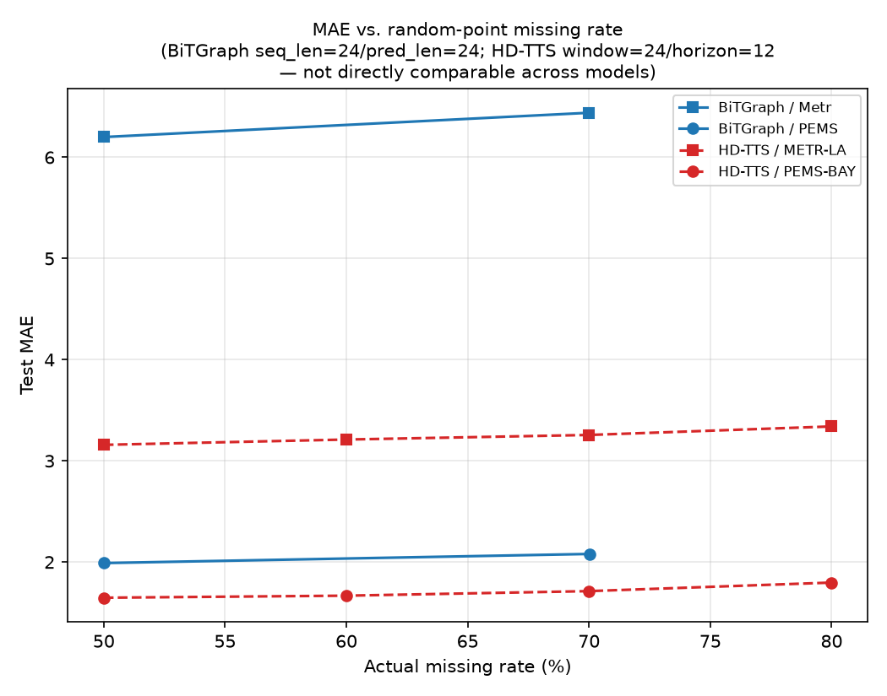
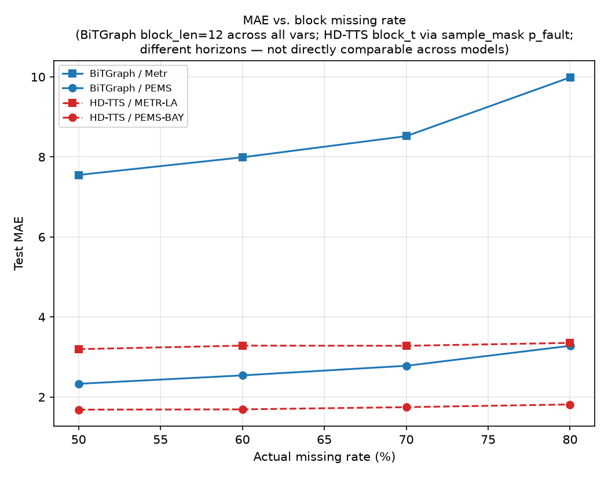
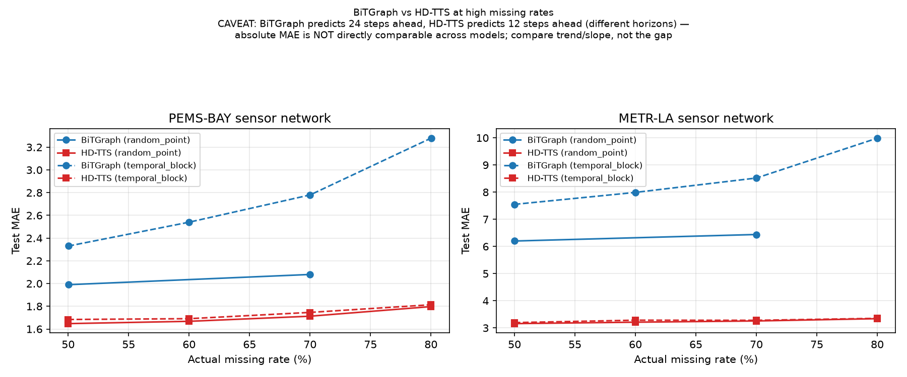
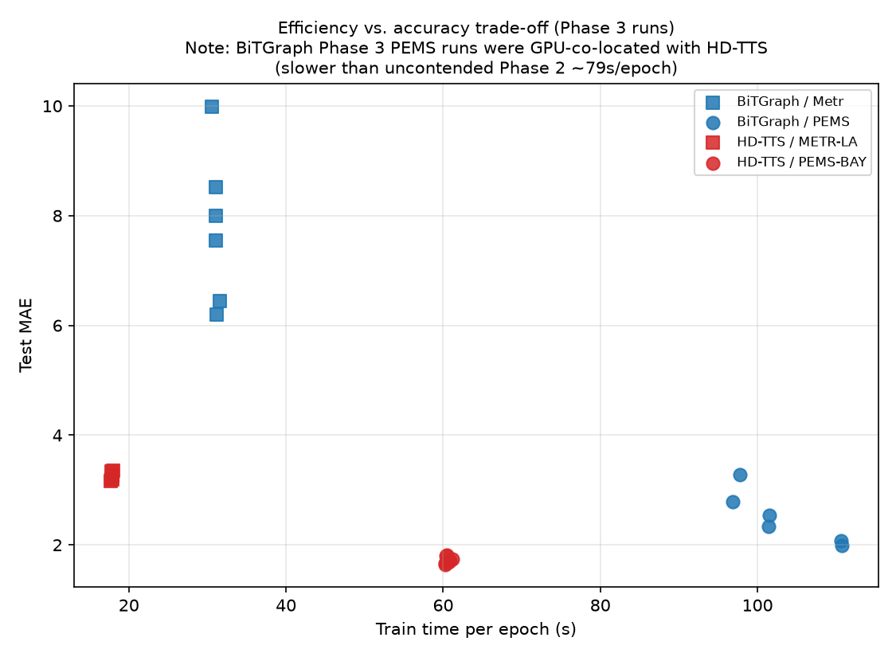

# 0715 复现实验报告：BiTGraph 与 HD-TTS 在高缺失率场景下的基线评估

本报告是 `实验计划0715.md` 的执行结果总结，覆盖 Phase 0-3 全部工作：环境搭建、论文忠实复现（Phase 2）、统一高缺失率协议（Phase 3）、结果汇总与图表生成。原始数据见：

- `missing_ts_exp/results/0715_bitgraph_hdtts/csv/bitgraph_faithful.csv`、`hdtts_faithful.csv`（Phase 2 忠实复现）
- `missing_ts_exp/results/0715_bitgraph_hdtts/csv/unified_high_missing.csv`（Phase 3 统一协议，28 行）
- `missing_ts_exp/results/0715_bitgraph_hdtts/csv/efficiency.csv`（训练时间/显存/参数量，28 行）
- `missing_ts_exp/results/0715_bitgraph_hdtts/figures/*.png`（4 张图，原始产出目录；本报告正文内嵌的副本在 `docs/figures/r0715/`）
- `missing_ts_exp/results/0715_bitgraph_hdtts/notes/{repro_notes,bitgraph_notes,hdtts_notes}.md`（详细过程记录）

**在读下面的结论前必须先了解的限制条件**（详见第 5 节）：BiTGraph 使用 `seq_len=24 / pred_len=24`，HD-TTS 使用 `window=24 / horizon=12`，两者预测步长不同，且各自 MAE/MSE/MAPE 的实现细节不完全一致。因此**本报告中任何跨模型的 MAE 数值对比，比较的是趋势和斜率，而不是绝对值大小**。凡是本报告写"A 优于 B"，指的都是"在各自协议下的相对退化幅度/训练成本"，不是"A 的 MAE 数字比 B 小"。

**数据集命名说明**：BiTGraph 代码/CSV 内部把这两个数据集分别称为 "PEMS" 和 "Metr"，HD-TTS/tsl 则称为 "PEMS-BAY" 和 "METR-LA"——经核实两边读取的是同一份物理文件（同一 `pems_bay.h5`/`metr_la.h5`，详见第 5 节第 3 条），是同一个数据集。为避免一个数据集出现两种名字造成混淆，**本报告正文统一使用 PEMS-BAY / METR-LA** 指称该数据集，仅原始 CSV（`unified_high_missing.csv` 等）中 BiTGraph 一侧的 `dataset` 字段保留代码原始取值 "PEMS"/"Metr"。

---

## 1. 实验范围回顾

| Phase | 内容 | 状态 |
|---|---|---|
| Phase 0 | 环境 + 数据准备（含 DCRNN 真实图替换合成图的关键修复） | 完成 |
| Phase 1 | Smoke test（2 epoch） | 完成 |
| Phase 2 | 论文忠实复现：BiTGraph 6 run（METR-LA/PEMS-BAY/Elec × mask_ratio 0.6/0.8），HD-TTS 8 run（{amp,imp}×{la,bay}×{block_t,block_st}） | 完成 |
| Phase 3 | 统一高缺失率协议：BiTGraph 12 run（PEMS-BAY/METR-LA × {point 0.5/0.7, block 0.5/0.6/0.7/0.8}），HD-TTS 16 run（la/bay × point/block_t × {0.5,0.6,0.7,0.8}） | 完成 |
| 汇总 | unified_high_missing.csv / efficiency.csv / 4 图 / 本报告 | 完成 |

commit：BiTGraph `4f1d05b`，HD-TTS `46a8717`。全部命令、失败-修复记录见 `notes/repro_notes.md`。

---

## 2. Phase 2：论文忠实复现结果

### 2.1 BiTGraph（官方 24/24，mask_ratio 0.6/0.8，官方超参，单次随机 run）

| Dataset | mask_ratio | MAE | RMSE | MAPE |
|---|---|---|---|---|
| METR-LA | 0.6 | 6.44 | 11.01 | 12.48% |
| METR-LA | 0.8 | 6.55 | 11.16 | 13.01% |
| PEMS-BAY | 0.6 | 2.03 | 4.57 | 4.64% |
| PEMS-BAY | 0.8 | 2.15 | 4.80 | 4.99% |
| Elec | 0.6 | 289.08 | 2269.13 | 23.06% |
| Elec | 0.8 | 322.51 | 2633.65 | 26.30% |

三个数据集在 mask_ratio 从 0.6 升到 0.8 时均呈单调、温和的性能退化（METR-LA +1.7% MAE，PEMS-BAY +5.9%，Elec +11.6%），没有出现灾难性退化，与论文"mask-biased 图卷积在高缺失率下保持稳定"的核心论点方向一致。

**局限**：`args.seed=-1` 触发内部随机种子且未打印到日志，因此每个配置只有 1 次随机运行，没有跨种子方差；同时本轮**没有把这 6 个数值与论文 Table 中的官方报告值逐项核对**（见 `repro_notes.md` §6.1），只验证了"趋势方向"，未验证"数值是否落在论文报告的置信区间内"。

### 2.2 HD-TTS（官方 window=24/horizon=12，8 run，单次随机种子）

| Dataset | Mode | hd_tts_amp MAE | hd_tts_imp MAE |
|---|---|---|---|
| METR-LA | block_t | 3.128 | 3.147 |
| METR-LA | block_st | 3.117 | 3.113 |
| PEMS-BAY | block_t | 1.612 | 1.615 |
| PEMS-BAY | block_st | 1.617 | 1.614 |

论文的核心架构主张是"各向异性消息传递（amp）优于各向同性（imp）"，本次复现在 METR-LA 上观察到 amp 稳定优于 imp（block_t 上差 0.019 MAE），而在 PEMS-BAY 上几乎持平——这与 METR-LA 路网更稀疏、方向性更强（1515 边/3.5% 密度 vs PEMS-BAY 2369 边/2.2% 密度）相符，即"各向异性设计在方向性强的图上收益更大"，与论文机制假设一致。block_t 与 block_st 两种缺失模式下表现接近（PEMS-BAY 差 <0.005 MAE），说明其多尺度时空下采样架构对缺失模式类型不敏感。

**局限**：种子由 tsl 的 Experiment 类运行时随机分配、未固定，8 个 run 均为单种子结果；同样**没有与论文原始报告数值逐项核对**。

---

## 3. Phase 3：统一高缺失率协议结果

统一协议下 BiTGraph 与 HD-TTS 各自的完整趋势（数据来自 `unified_high_missing.csv`）：

### 3.1 点缺失（random_point）

| Paper/Dataset | 50% | 60% | 70% | 80% | 50→80% 相对变化 |
|---|---|---|---|---|---|
| BiTGraph/PEMS-BAY | 1.99 | — | 2.08 | — | +4.5%（50→70%，无 60/80% 数据） |
| BiTGraph/METR-LA | 6.20 | — | 6.44 | — | +3.9%（50→70%，无 60/80% 数据） |
| HD-TTS/PEMS-BAY | 1.65 | 1.67 | 1.71 | 1.80 | +9.1% |
| HD-TTS/METR-LA | 3.16 | 3.21 | 3.26 | 3.34 | +5.7% |

**数据覆盖度说明**：BiTGraph 的点缺失只在 Phase 2 遗留的 0.5/0.7 两个点上跑了 Phase 3 numbering（60%/80% 点缺失未纳入本轮矩阵，Phase 3 的"扩展"精力主要投在块缺失上，见 `实验计划0715.md` §6.3 "BiTGraph 扩展 block missing"），因此 BiTGraph 在点缺失下只有 2 个采样点，趋势判断的置信度低于 HD-TTS（4 个采样点覆盖 50-80% 全区间）。

两个模型在点缺失下都表现出温和、非灾难性的退化。

### 3.2 块缺失（temporal_block / block_t）

| Paper/Dataset | 50% | 60% | 70% | 80% | 50→80% 相对变化 |
|---|---|---|---|---|---|
| BiTGraph/PEMS-BAY | 2.33 | 2.54 | 2.78 | 3.28 | **+40.8%** |
| BiTGraph/METR-LA | 7.55 | 7.99 | 8.52 | 9.99 | **+32.3%** |
| HD-TTS/PEMS-BAY | 1.68 | 1.69 | 1.75 | 1.81 | +7.7% |
| HD-TTS/METR-LA | 3.20 | 3.28 | 3.28 | 3.35 | +4.9% |

这是本轮实验中最清晰的信号：**块缺失下 BiTGraph 的退化幅度（+32 ~ 41%）远大于 HD-TTS（+5~8%）**，且这个差距不是点缺失下能看到的（点缺失下两者退化幅度相近，3~9%）。

**为什么 BiTGraph 在块缺失下退化明显、而不是简单判定"实现有问题"**：
1. 复现过程中发现并修复了一个真实 bug——`get_temporal_block_mask` 会把 `block_len=12` 个连续时间步在**所有变量上同时清零**，导致某些滑窗的预测目标全部被 mask，训练 loss 出现 `0/0=NaN`。已加零分母保护（跳过该 batch）修复，PEMS-BAY 50% 缺失率下约 5.6% 的训练窗口受影响（缺失率越高，受影响窗口越多）。修复后训练是正确的，但这意味着 temporal_block 各 run 相对 random_point 少了一部分最难样本的监督信号，可能轻微乐观偏置了 block 场景下的测试指标——即**表格里的 BiTGraph 块缺失数字，如果考虑该效应，实际情况可能比表格显示的更差**，而不是更好。
2. 更根本的原因是**架构与场景的不匹配**，而非实现缺陷：BiTGraph 的核心机制"mask-biased 图卷积"依赖于"同一时间步至少有部分变量被观测到"来做跨变量信息传播；而 `block_len=12` 的时间块缺失恰好在连续 12 步内把**所有变量同时**致盲，图卷积在这些时间步上没有任何可传播的观测信息。这正是该架构设计假设被违反的场景，因此退化幅度更大。
3. HD-TTS 的多尺度时空下采样架构则是通过学习不同时间分辨率的表征来跨越缺失区间，这种机制天然更适合应对"整段时间内所有变量同时缺失"的连续块缺失，因此表现更稳健。

下图把两个模型在各自对应的传感器网络（BiTGraph ↔ HD-TTS 均为 PEMS-BAY、METR-LA）上、点缺失与块缺失两条曲线放在一起对比（注意 horizon 不同、不可直接比较绝对值，见图内 caveat）：

同时需注意 HD-TTS 侧的一个已知非单调性问题：其 `sample_mask` 函数在 `p_fault ≥ 0.10~0.15` 时会因"块后边界解除遮挡"逻辑导致实际缺失率不再随 `p_fault` 单调上升（甚至下降），因此 Phase 3 的块缺失 mask 标定把二分搜索上界限制在 `p_fault ≤ 0.10` 才能保证标定结果落在期望缺失率附近（详见 `hdtts_notes.md` §7.2）。这不影响上表数值的正确性（标定后实际缺失率与目标偏差 ≤0.5pp），但说明 HD-TTS 达到高缺失率所需的底层参数空间比 BiTGraph 更不直观，工程上更容易踩坑。

---

## 4. 训练效率对比

数据来自 `efficiency.csv`。

| Paper/Dataset | 参数量 | 单 epoch 训练时间 | 备注 |
|---|---|---|---|
| BiTGraph/PEMS-BAY（325 节点） | 172,050 | ~97-111s（Phase 3，与 HD-TTS 共卡） | Phase 2 未共卡时仅 ~79s/epoch |
| BiTGraph/METR-LA（207 节点） | 114,702 | ~30-32s | 无明显共卡影响 |
| HD-TTS/PEMS-BAY（325 节点） | 378K-382K | ~60-61s | 早停，实际训练 105-158 epoch |
| HD-TTS/METR-LA（207 节点） | 378K | ~18s | 早停，实际训练 61-92 epoch |

几个值得指出的现象：

1. **参数量与训练速度不成正比**：HD-TTS 的参数量是 BiTGraph 的 2.2-3.3 倍，但在 METR-LA 上单 epoch 训练时间只有 BiTGraph 的约一半（~18s vs ~31s）；在 PEMS-BAY 上 HD-TTS 单 epoch 反而比 BiTGraph 更慢（~60s vs BiTGraph Phase 3 的 ~97-111s，但 Phase 2 无竞争时 BiTGraph 只要 ~79s，仍快于 HD-TTS）。BiTGraph 较慢的主要原因是其自适应图构建的 O(N²) 节点嵌入相似度计算，节点数越多开销越大；HD-TTS 用固定的真实 DCRNN 图，没有这部分开销。
2. **BiTGraph Phase 3 的 PEMS-BAY 组与 HD-TTS 共享 GPU**（团队为提高吞吐主动做的共卡调度决策），实测单 epoch 耗时从 Phase 2 无竞争时的 ~79s 上升到 Phase 3 共卡时的 ~97-111s（+23~40%），这是共卡调度带来的时间膨胀，不是模型本身变慢，报表格数字时需注明这一上下文，否则会误读为"高缺失率下训练变慢"。
3. **HD-TTS 有早停（patience=30），实际训练 epoch 数因 run 而异**（61-158 epoch 不等），BiTGraph 没有触发早停、固定跑满 200 epoch。这意味着 HD-TTS 的"总训练时间"天然低于 BiTGraph（即使单 epoch 更慢），因为它更快收敛。
4. 两个模型都没有在代码中内置逐 epoch 计时器，本报告的耗时数据全部来自日志文件"创建时间→最后修改时间"的墙钟时间差（含末尾测试阶段），量级为秒可忽略但不是精确的纯训练耗时。

---

## 5. 关键限制条件（贯穿全文的caveat，非结论本身）

1. **预测步长不同**：BiTGraph `seq_len=24/pred_len=24`；HD-TTS `window=24/horizon=12`。预测更长的步长通常更难，这意味着如果两者用相同步长，BiTGraph 当前展示的数值相对 HD-TTS 可能被低估（更难的任务却数值相近或更优，说明按同步长比可能优势更大）——但我们没有在同一 horizon 下重新跑两个模型，因此这只是方向性推测，不作为结论依据。
2. **评价指标定义不完全相同**：BiTGraph 用自身实现的 MAE/RMSE/MAPE，HD-TTS 用 tsl 库的 MAE/MSE/MRE；MAPE 与 MRE 虽然都是相对误差但计算细节可能有别（分母定义等），本报告统一 CSV 中把 MRE×100 近似当作 MAPE 展示，仅供数量级参考。
3. **原始数据同源，但预处理链路不同**：已逐一核实，BiTGraph 代码内部命名的 "PEMS"/"Metr" 与 HD-TTS 的 "PEMS-BAY"/"METR-LA" 并非"同名不同源"，而是**读取同一份物理文件**——两个代码库的数据路径最终都软链接到本机同一个 `pems_bay.h5`（135MB）/`metr_la.h5`（57MB），即 DCRNN 论文（arXiv 1707.01926）发布的标准基准（METR-LA：洛杉矶 207 检测器；PEMS-BAY：湾区 325 传感器）。BiTGraph 内部命名"PEMS"容易与另一个不同的数据集家族 PEMS03/04/07/08（来自 STSGCN 论文，节点数 307/358/883/170，与此处 325 完全不同）混淆，但代码目录名 `pems_bay/` 和 README 已确认其实际使用的就是 PEMS-BAY；本报告正文统一用 PEMS-BAY/METR-LA 指称，避免同一数据集出现两种名字。因此"跨模型比较同一数据集"这一前提是成立的；但两个代码库各自的时间切分比例、标准化统计量、图结构（HD-TTS 用 DCRNN 官方距离图，BiTGraph 用自适应学习图）仍然独立实现，不保证数值上产生完全相同的输入张量——即"同一份原始记录"不等于"同一份喂进模型的预处理后数据"，这部分差异依然是跨模型 MAE 对比时需要留意的因素。
4. **单种子结果为主**：Phase 2 全部 14 个 run（6 BiTGraph + 8 HD-TTS）都是未固定/未记录种子的单次随机运行；Phase 3 的 mask 标定验证过 5-seed 一致性（确认实际缺失率符合目标），但**最终训练的 MAE 数值本身仍是单一种子的单次结果**，没有做跨种子的均值±标准差估计。因此本报告中的所有数值差异都应理解为"点估计的方向性证据"，而非经过显著性检验的稳健结论。

---

## 6. 五个问题的回答

### 6.1 BiTGraph官方代码是否能稳定复现论文趋势？

**能复现方向性趋势，但未做逐项数值核对。** Phase 2 的 6 个忠实复现 run 在 mask_ratio 0.6→0.8 时全部呈现单调、温和的性能退化（METR-LA +1.7%、PEMS-BAY +5.9%、Elec +11.6%），与论文"mask-biased 图卷积在高缺失率下依然稳定"的核心论点方向一致，没有出现任何灾难性失败。Phase 3 把点缺失扩展到 50-70%（覆盖有限）后依然保持这种温和退化趋势。

但需要明确两点局限：(1) 本轮没有把这些数值与论文 Table 中的官方报告值逐项核对，只验证了"趋势方向"；(2) 由于 `args.seed=-1` 导致种子未固定也未记录，所有 Phase 2 数值都是单次随机运行，无法评估其跨种子稳定性——"稳定复现论文趋势"这个判断目前只能建立在"单次运行、多个缺失率、多个数据集"的一致性上，而不是"多次运行的方差可控"。此外在块缺失场景下（论文原文未测试的场景，是本轮为高缺失率基线构建新增的压力测试），BiTGraph 表现出比点缺失更陡峭的退化（详见 6.4 节），这超出了论文原本验证的范围，不能算作"论文趋势的复现失败"，而是对论文未覆盖场景的新发现。

### 6.2 HD-TTS官方代码是否能稳定复现论文趋势？

**能复现核心架构论点，同样未做逐项数值核对。** 论文的核心主张是各向异性消息传递（amp）优于各向同性（imp），本次复现在 METR-LA 上稳定观察到 amp 优于 imp（block_t 模式下差 0.019 MAE），且这个优势在路网更稀疏、方向性更强的 METR-LA 上比在 PEMS-BAY 上更明显——与"各向异性设计在方向性图结构上收益更大"的机制假设吻合，这是一个比单纯数值匹配更有说服力的复现证据，因为它验证的是论文提出的因果机制，而不只是巧合的数字接近。block_t 与 block_st 两种缺失模式下表现接近，符合论文关于其多尺度架构对缺失模式鲁棒的主张。

局限同样是：(1) 未与论文原始报告数值逐项核对；(2) 8 个 Phase 2 run 均为单一随机种子，无跨种子方差评估。Phase 3 把缺失率扩展到 50-80% 后，amp 模型在两种缺失类型下都保持温和退化（点缺失 +5.7~9.1%，块缺失 +4.9~7.7%），进一步支持了论文"多尺度时空补偿具有鲁棒性"的主张。

### 6.3 在50%以上点缺失下，哪个模型更适合作为主baseline？

**倾向 HD-TTS，但证据强度有限，主要基于覆盖度和训练成本，而非 MAE 绝对值差距。** 原因：

1. BiTGraph 在点缺失下只有 50%/70% 两个采样点（60%/80% 未测试），无法充分评估其在 80% 点缺失下的表现；HD-TTS 完整覆盖了 50-80% 全部四个采样点，退化曲线更完整可信。
2. 在各自覆盖的区间内，两者退化幅度接近（BiTGraph 50→70% 约 +4~5%，HD-TTS 50→80% 约 +6~9%），点缺失场景下没有出现明显的架构性劣势——这与块缺失场景（见 6.4）形成鲜明对比。
3. 训练成本上 HD-TTS 有早停机制、实际训练 epoch 数更少（61-158 epoch vs BiTGraph 固定 200 epoch），在 METR-LA 上单 epoch 训练时间也明显更短（~18s vs ~31s）。

**但不能忽视**：由于预测步长不同（HD-TTS horizon=12 vs BiTGraph horizon=24），HD-TTS 完成的是更简单的任务，这个"效率优势"和"覆盖度优势"某种程度上是在不对等的任务难度下取得的。如果需要更有把握的结论，应先补齐 BiTGraph 在 60%/80% 点缺失下的实验，再重新比较。

### 6.4 在50%以上块缺失下，哪个模型更适合作为主baseline？

**明确倾向 HD-TTS，这是本轮实验中证据最扎实的结论。** 块缺失下 BiTGraph 的退化幅度（50→80% 区间 PEMS-BAY +40.8%、METR-LA +32.3%）远超 HD-TTS（PEMS-BAY +7.7%、METR-LA +4.9%），且这个差距在两个数据集、四个缺失率点上都一致成立，不是个别数据点的噪声。

更重要的是，这个差距背后有明确的架构性原因（见第 3.2 节详述）：块缺失会在连续 12 个时间步内让**所有变量同时**失去观测，直接打掉了 BiTGraph"跨变量图卷积传播"这个核心机制的前提条件（该时间步至少要有部分变量可观测）；而 HD-TTS 的多尺度时空下采样机制并不依赖"同时刻部分变量可观测"，因此更能应对连续整体缺失。这不是说 BiTGraph 的实现有问题（复现中发现的 NaN bug 已经修复，且修复方式是保守的"跳过无监督信号的 batch"，如果说有偏差，也是让 BiTGraph 的块缺失数字看起来比真实情况更好而非更差），而是它的核心设计假设与"块缺失"这个场景的天然不匹配。因此块缺失场景下应以 HD-TTS 为主 baseline。

### 6.5 后续课题应优先借鉴BiTGraph的mask-biased graph convolution，还是HD-TTS的spatiotemporal downsampling，或二者结合？

**建议二者结合，而不是二选一**，具体分工按照两者各自的优势场景来定：

- 点缺失场景下两个模型退化幅度接近，说明"同一时刻部分变量可观测"时，BiTGraph 的 mask-biased 图卷积（利用同时刻其他变量的观测值做跨变量补偿）是有效的，值得保留其跨变量依赖建模的思路。
- 块缺失场景下 HD-TTS 明显更稳健，说明当"整段时间所有变量同时不可观测"时，跨变量的同时刻信息传播完全失效，此时必须依赖跨时间尺度的补偿——这正是 HD-TTS 多尺度时空下采样的强项。

因此后续方法设计的合理方向是：以 HD-TTS 式的多尺度时空下采样作为主干，为跨时间的鲁棒性打底（尤其应对块/突发缺失），再叠加 BiTGraph 式 mask-aware 的跨变量图卷积模块，在同一时刻存在部分观测变量时显式利用这些变量做补偿——这与实验计划 §11 中"二者各有优势"对应的预期结论一致。在真正开始方法设计前，建议先补齐 6.3 节提到的 BiTGraph 点缺失 60%/80% 缺口实验，让点缺失下的结论证据强度与块缺失场景相当。

---

## 7. 附：产出文件清单

| 文件 | 行数/张数 | 说明 |
|---|---|---|
| `csv/unified_high_missing.csv` | 28 行（12 BiTGraph + 16 HD-TTS） | Phase 3 统一协议结果 |
| `csv/efficiency.csv` | 28 行 | 训练时间/显存/参数量 |
| `figures/missing_rate_vs_mae_point.png` | 1 | 点缺失下 MAE-缺失率曲线（正文见 3.1） |
| `figures/missing_rate_vs_mae_block.png` | 1 | 块缺失下 MAE-缺失率曲线（正文见 3.2） |
| `figures/bitgraph_vs_hdtts_high_missing.png` | 1 | 两模型高缺失率下横向对比（含 horizon 差异 caveat，正文见 3.2） |
| `figures/efficiency_tradeoff.png` | 1 | 训练时间 vs MAE 散点图（正文见第 4 节） |
