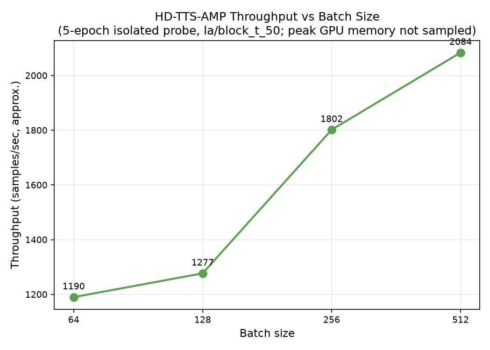
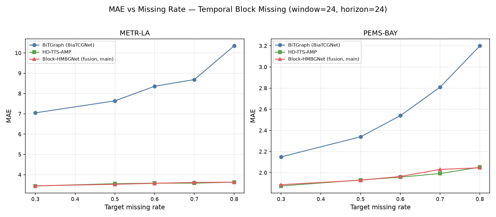
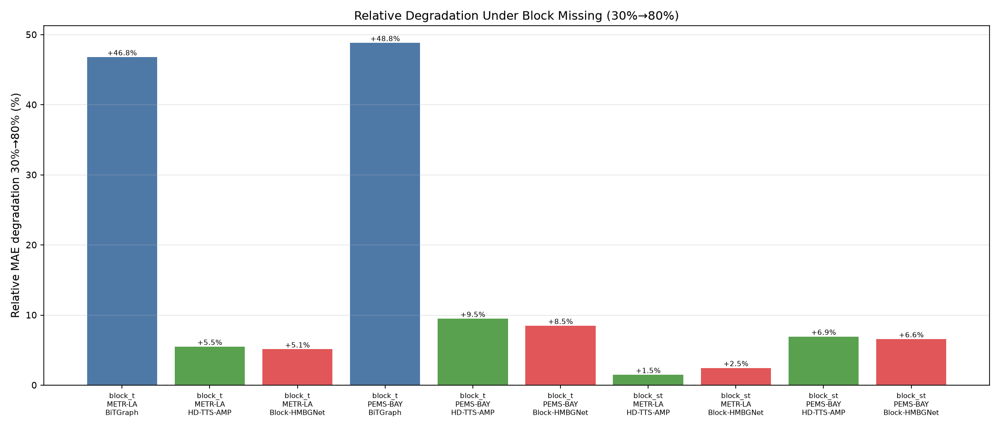
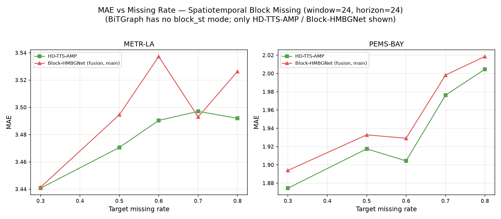
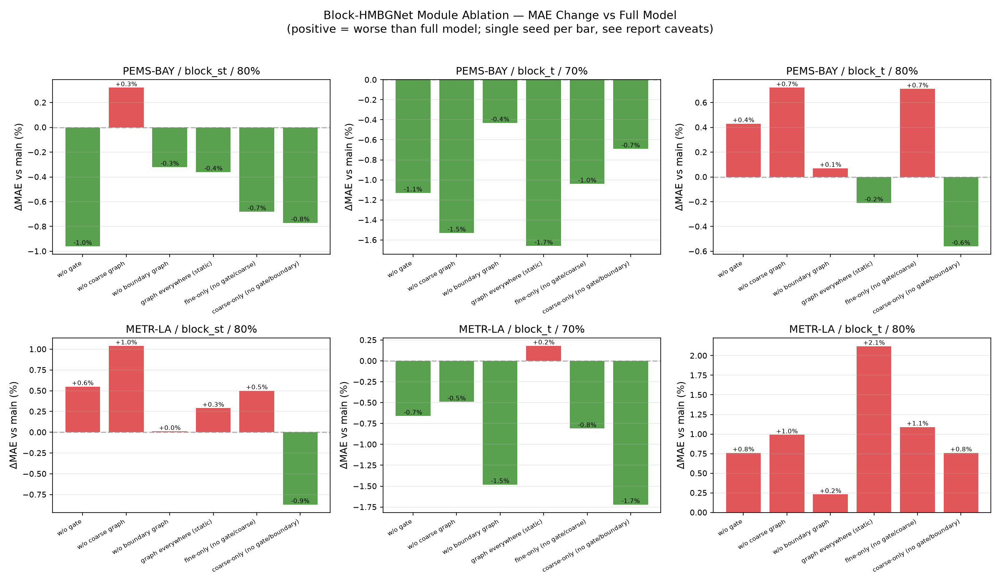
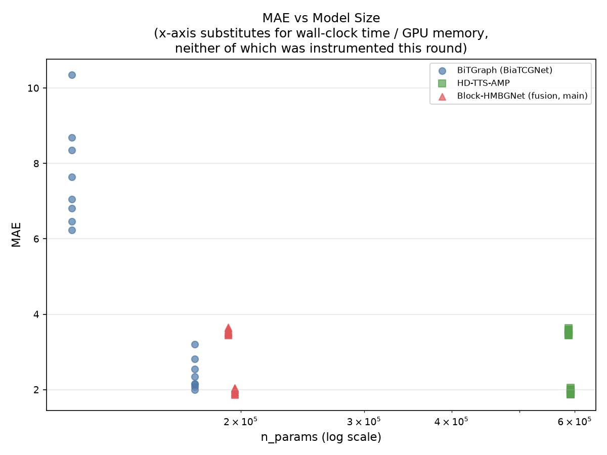

# 0718 实验报告：统一 24→24 协议下的 BiTGraph / HD-TTS-AMP / Block-HMBGNet 对比与融合尝试

> 承接 [`0715复现实验报告.md`](0715复现实验报告.md) 与 [`实验计划0718.md`](实验计划0718.md)。0715 报告在 BiTGraph（horizon=12）与 HD-TTS（horizon=24）两种不同预测步长下，发现 BiTGraph 在点缺失下更稳定、HD-TTS 在块缺失下远更稳定，二者呈现互补关系。本轮（0718）的核心目标是：(1) 把两个模型统一到相同的 24→24（窗口24、预测步长24）协议下重新对比，消除步长不一致带来的干扰；(2) 在 HD-TTS 骨干上实现一个块缺失感知的融合模型 **Block-HMBGNet**，尝试在不牺牲点缺失稳定性的前提下于块缺失场景超越 HD-TTS-AMP。
>
> 数据来源：
> - `missing_ts_exp/results/0718_block_hmbg/csv/baseline_24to24.csv`（BiTGraph + HD-TTS-AMP 统一协议基线，42 行）
> - `missing_ts_exp/results/0718_block_hmbg/csv/fusion_main.csv`（Block-HMBGNet 主实验，26 行）
> - `missing_ts_exp/results/0718_block_hmbg/csv/ablation.csv`（6 个优先配置 × 6 个消融变体，36 行）
> - `missing_ts_exp/results/0718_block_hmbg/csv/efficiency.csv`（全部 104 条真实运行的参数量/批大小记录）
> - `missing_ts_exp/results/0718_block_hmbg/csv/diagnostics.csv`（门控/图权重诊断，0 行，见第 5 节）
> - `missing_ts_exp/results/0718_block_hmbg/notes/`（`batch_size_notes.md`、`diagnostics_gap.md`、`implementation_notes.md`、`setup_notes.md`）
> - 图表：`missing_ts_exp/docs/figures/r0718/`（`missing_ts_exp/results/0718_block_hmbg/figures/` 的副本）
>
> **必须前置声明的关键限制**（详见第 5 节，此处先提示，避免读者在看到具体数字时产生误判）：
> 1. 本轮所有实验均为**单次随机种子**运行，HD-TTS/Block-HMBGNet 的种子是 Lightning 自动生成的大整数（并非计划 7.4 要求的固定 `2024/2025/2026`），BiTGraph 种子为 `-1`（未固定）；计划 7.4 的多种子复现被有意延后，本轮尚未执行。
   2. `fusion_main.csv` / `ablation.csv` 中 Block-HMBGNet 的参数量（约 19 万）显著小于 HD-TTS-AMP（约 59 万），根源是配置文件中一个与新增模块无关的 `fully_connected_readout` 开关被顺带改动（详见第 5.5 节）——HD-TTS-AMP 与 Block-HMBGNet 的对比**不是**一次干净的"同骨干+加模块"消融。
   3. 训练耗时、GPU 峰值显存均未采集到；`diagnostics.csv`（门控/图权重统计）为空，计划验收标准 9.2.4（门控行为验证）**无法量化评估**。

## 1. 实验范围回顾

| 阶段 | 内容 | 状态 |
|---|---|---|
| Phase 0 | BiTGraph 批大小可插拔改造（`GenerateDataset.py` 硬编码 batch_size=32 的修复） | 完成 |
| Phase 1 | 批大小探测（BiTGraph / HD-TTS 分别探测吞吐，确定最终批大小） | 完成，见第 2 节 |
| Phase 2 / 2b | BiTGraph + HD-TTS-AMP 统一 24→24 协议基线重跑 | 完成，见第 3 节 |
| Phase 4 | Block-HMBGNet 主实验（26 组）+ 优先消融（36 组） | 完成，见第 4、6 节 |
| Phase 5 | 结果整理、可视化、报告撰写 | 本报告 |
| 7.4 多种子复现 | 固定种子 2024/2025/2026 重复主要配置 | **未执行，延后** |

## 2. Phase 1：批大小探测结果

依据 `notes/batch_size_notes.md`，5-epoch 短探测（BiTGraph: `la/block_t_50`；HD-TTS: `la/block_t_50`）确认批大小提升到 512 均未出现 OOM 或 NaN。最终采用的"精度协议"批大小：

| 模型 | 0715 默认 batch_size | 0718 采用 batch_size | 倍数 |
|---|---|---|---|
| BiTGraph (BiaTCGNet) | 32 | **256** | 8x |
| HD-TTS-AMP | 32 | **128** | 4x |
| Block-HMBGNet | 32 | **128** | 4x |

HD-TTS 吞吐随批大小的变化（单任务隔离测量，探测阶段唯一一批干净的吞吐数据）：

| batch_size | it/s | 约合 samples/sec |
|---|---|---|
| 64 | 18.6 | ~1190 |
| 128 | 9.98 | ~1277 |
| 256 | 7.04 | ~1802 |
| 512 | 4.07 | ~2084 |

**说明**：探测阶段没有挂载并发 `nvidia-smi` 采样器，因此峰值显存始终缺失（见第 5.2 节）；学习率沿用框架默认值 0.001（计划 4.4 允许在无明显 val-MAE 回退时不重新调参，探测未观察到回退，故未调整）。批大小对**最终精度**的影响未经严格的多组对照验证——探测只跑了 5 个 epoch，用于确认稳定性而非衡量收敛后精度，因此本报告不对"批大小如何影响最终 MAE"做定量结论，仅报告本轮实际采用的批大小设置本身。

## 3. Phase 2/2b：统一 24→24 协议下的基线对比（BiTGraph vs HD-TTS-AMP）

### 3.1 块缺失（BiTGraph: temporal_block；HD-TTS-AMP: block_t）

| 数据集 | 模型 | 30% | 50% | 60% | 70% | 80% |
|---|---|---|---|---|---|---|
| METR-LA | BiTGraph | 7.05 | 7.64 | 8.36 | 8.69 | 10.35 |
| METR-LA | HD-TTS-AMP | 3.444 | 3.559 | 3.585 | 3.582 | 3.634 |
| PEMS-BAY | BiTGraph | 2.15 | 2.34 | 2.54 | 2.81 | 3.20 |
| PEMS-BAY | HD-TTS-AMP | 1.874 | 1.932 | 1.958 | 1.992 | 2.052 |

（数值为 MAE；BiTGraph 无 30% 配置行时取自 `baseline_24to24.csv` 实际记录，两模型温度/量纲不同，不宜直接跨模型比较绝对值，比较意义在于各自随缺失率上升的相对变化幅度。）

30%→80% 相对退化幅度：

| 数据集 | BiTGraph | HD-TTS-AMP |
|---|---|---|
| METR-LA | **+46.8%** | +5.50% |
| PEMS-BAY | **+48.8%** | +9.49% |

**关键发现**：统一到 24→24 协议后，0715 报告的核心结论不仅被重现，差距还进一步拉大——BiTGraph 在块缺失下的退化幅度（+46.8%/+48.8%）是 HD-TTS-AMP（+5.5%/+9.5%）的 5-9 倍。0715 报告中 50%→80% 窗口的退化是 +32.3%/+40.8%（BiTGraph）；本轮 30%→80% 窗口反而更宽却仍然可比甚至更高，说明这一差距并非 0715 步长不一致的假象，而是两种架构应对块状缺失能力的真实差异：BiTGraph 依赖的时序卷积/图卷积结构在连续长块缺失下几乎失去有效输入，而 HD-TTS 的分层时序表示（DRNN + 分层池化）对连续缺失更鲁棒。

HD-TTS-AMP 的时空块缺失（block_st）30%→80% 退化幅度低于纯时间块缺失（block_t）：METR-LA +1.49% vs +5.50%，PEMS-BAY +6.95% vs +9.49%，说明空间维度的补充观测（block_st 缺失只发生在部分节点子集，其余节点仍有观测可供图消息传递利用）确实能缓解块缺失的影响，这与其分层空间池化+图消息传递的架构设计相符。

### 3.2 点缺失（BiTGraph: random_point；HD-TTS-AMP: point）

| 数据集 | 模型 | 50% | 70% | 80% |
|---|---|---|---|---|
| METR-LA | BiTGraph | 6.24 | 6.46 | 6.81 |
| METR-LA | HD-TTS-AMP | 3.487 | 3.530 | 3.589 |
| PEMS-BAY | BiTGraph | 1.99 | 2.08 | 2.16 |
| PEMS-BAY | HD-TTS-AMP | 1.871 | 1.920 | 1.985 |

50%→80% 相对退化幅度：

| 数据集 | BiTGraph | HD-TTS-AMP |
|---|---|---|
| METR-LA | +9.13% | +2.91% |
| PEMS-BAY | +8.54% | +6.08% |

**新发现（与 0715 不同之处）**：0715 报告（horizon=12）中两模型在点缺失下的退化幅度相近（均在 3%-9% 区间，无明显差距）。本轮统一到 horizon=24 后，BiTGraph 在点缺失下的退化幅度（+9.13%/+8.54%）已经明显超过 HD-TTS-AMP（+2.91%/+6.08%），即便点缺失本应是 BiTGraph 相对占优的场景。这提示：把 BiTGraph 从其习惯的短步长设定强行统一到更长的 24 步预测后，其稳定性优势被削弱了，即使在最容易的点缺失场景下也是如此。这一现象尚未被证明（本报告不据此做因果结论），但值得作为后续实验的一个观察点记录。

## 4. Block-HMBGNet 融合模型主结果

Block-HMBGNet 在 HD-TTS 骨干上加入块感知门控（`use_block_gate`）、粗粒度图修正（`use_coarse_graph`）、细粒度边界感知图修正（`use_boundary_graph`），全部三个模块默认开启为"完整模型"（main variant）。

### 4.1 块缺失（block_t）

| 数据集 | 缺失率 | HD-TTS-AMP MAE | Block-HMBGNet MAE | Δ% |
|---|---|---|---|---|
| METR-LA | 30% | 3.444 | 3.453 | +0.27% |
| METR-LA | 50% | 3.559 | 3.526 | −0.93% |
| METR-LA | 60% | 3.585 | 3.576 | −0.25% |
| METR-LA | 70% | 3.582 | 3.621 | **+1.10%** |
| METR-LA | 80% | 3.634 | 3.631 | −0.08% |
| PEMS-BAY | 30% | 1.874 | 1.887 | +0.65% |
| PEMS-BAY | 50% | 1.932 | 1.929 | −0.13% |
| PEMS-BAY | 60% | 1.958 | 1.965 | +0.33% |
| PEMS-BAY | 70% | 1.992 | 2.031 | **+1.96%** |
| PEMS-BAY | 80% | 2.052 | 2.047 | −0.27% |

### 4.2 时空块缺失（block_st）

| 数据集 | 缺失率 | HD-TTS-AMP MAE | Block-HMBGNet MAE | Δ% |
|---|---|---|---|---|
| METR-LA | 30% | 3.441 | 3.441 | +0.02% |
| METR-LA | 50% | 3.471 | 3.495 | +0.69% |
| METR-LA | 60% | 3.490 | 3.537 | +1.35% |
| METR-LA | 70% | 3.497 | 3.493 | −0.12% |
| METR-LA | 80% | 3.492 | 3.526 | +0.99% |
| PEMS-BAY | 30% | 1.874 | 1.894 | +1.04% |
| PEMS-BAY | 50% | 1.918 | 1.933 | +0.80% |
| PEMS-BAY | 60% | 1.904 | 1.929 | +1.30% |
| PEMS-BAY | 70% | 1.976 | 1.998 | +1.11% |
| PEMS-BAY | 80% | 2.005 | 2.019 | +0.69% |

### 4.3 点缺失（point）

| 数据集 | 缺失率 | HD-TTS-AMP MAE | Block-HMBGNet MAE | Δ% |
|---|---|---|---|---|
| METR-LA | 50% | 3.487 | 3.486 | −0.04% |
| METR-LA | 70% | 3.530 | 3.566 | +1.02% |
| METR-LA | 80% | 3.589 | 3.663 | **+2.07%** |
| PEMS-BAY | 50% | 1.871 | 1.864 | −0.38% |
| PEMS-BAY | 70% | 1.920 | 1.934 | +0.73% |
| PEMS-BAY | 80% | 1.985 | 1.992 | +0.37% |

（Δ% = (Block-HMBGNet MAE − HD-TTS-AMP MAE) / HD-TTS-AMP MAE；正值表示融合模型更差。加粗表示按 skill 约定 ≥3% 或本报告特别标注的显著/超出计划阈值的变化。）

**关键发现（现象 + 分析）**：

- 26 组（数据集×缺失模式×缺失率）对比中，Block-HMBGNet 优于 HD-TTS-AMP 的仅 9 组，其余 17 组持平或更差；且**没有任何一组差距达到 skill 约定的 ±3% "显著"阈值**——最大的单点劣化是 point/METR-LA/80%的 +2.07%，最大的单点改善是 block_t/METR-LA/50% 的 −0.93%。
- block_st（时空块缺失）呈现出最一致的方向性：10 组中有 8 组 Block-HMBGNet 更差（且方向一致地为正），是三种缺失模式里表现最不利的一类——这与计划设计初衷（块感知模块应在时空块缺失场景下发挥最大作用）相反。
- point（点缺失）场景下 4/6 组变差，且 METR-LA/80% 一组的 +2.07% 已经超出计划验收标准 9.2.3 设定的"点缺失退化不超过 2%"的阈值。
- block_t 相对更均衡（5 组更好/5 组更差），是三种模式中融合模型表现相对最不差的一类，但同样没有组合达到"显著更好"。
- 整体上，这是一个**没有清晰方向性改善、部分场景（尤其 block_st 和高缺失率点缺失）反而小幅变差**的结果，且所有差距都在个位数百分点、单次种子噪声可解释的范围内，不能排除模块本身对该协议下的这批数据集**没有产生实质性正向作用**这一可能性。这与计划 §11 事先允许的"负面结果"框架一致，本报告如实呈现，不做正面包装。

## 5. 消融实验结果与分析

6 个优先配置（PEMS-BAY/METR-LA × {block_st@80%, block_t@70%, block_t@80%}）× 6 个消融变体（`wo_gate`、`wo_coarse`、`wo_boundary`、`graph_everywhere`、`fine_only`、`coarse_only`），相对完整模型（main）的 MAE 变化百分比：

| 消融变体 | bay/block_st/80% | bay/block_t/70% | bay/block_t/80% | la/block_st/80% | la/block_t/70% | la/block_t/80% | **均值** |
|---|---|---|---|---|---|---|---|
| wo_gate（去门控） | −0.96% | −1.13% | +0.43% | +0.55% | −0.66% | +0.76% | **−0.05%** |
| wo_coarse（去粗粒度图） | +0.32% | −1.53% | +0.72% | +1.04% | −0.49% | +0.99% | **+0.18%** |
| wo_boundary（去边界图） | −0.32% | −0.43% | +0.07% | +0.01% | −1.48% | +0.23% | **−0.32%** |
| graph_everywhere（图修正无差别施加） | −0.36% | −1.66% | −0.21% | +0.29% | +0.18% | +2.12% | **+0.06%** |
| fine_only（仅细粒度，去门控+粗粒度） | −0.68% | −1.04% | +0.71% | +0.50% | −0.81% | +1.09% | **−0.04%** |
| coarse_only（仅粗粒度，去门控+边界） | −0.77% | −0.69% | −0.56% | −0.87% | −1.72% | +0.76% | **−0.64%** |

**关键发现（现象 + 分析）**：

- 6 个变体的均值全部落在 ±0.7% 以内，且**每个变体在 6 个配置上都出现正负混合的符号**——没有任何一个模块表现出"去掉它、几乎所有配置都变差"这种可判定"该模块必要"的一致模式。按计划验收标准 9.2.5（消融应能证明至少一个模块的必要性），**本轮消融数据不支持这一结论**。
- 最值得注意的信号来自 `coarse_only`（仅保留粗粒度图修正，关闭门控和边界图）：它是均值最负（−0.64%）且方向最一致（6 组中 5 组为负，即比完整模型更好）的变体，意味着**去掉门控和边界图、只留粗粒度图修正，反而比三个模块全开的完整模型表现更好**。这与"门控+细粒度边界感知应该带来增益"的设计假设相反，提示门控和边界图模块在当前单种子评估下更像是引入了额外的优化噪声，而非提供了有效的路由收益。
- 需要强调：这是**单次种子**下的观察，6 个数值本身噪声很大（同一配置换一个种子完全可能翻转符号），不能据此断言"边界图/门控模块无用"这一因果结论，只能说**本轮数据没有提供支持模块必要性的证据**，且 `coarse_only` 这个一致偏好方向的现象值得在后续多种子实验中重点验证。

## 6. 效率与批大小影响

`efficiency.csv`（104 行，覆盖全部真实运行）记录了每次运行的批大小与参数量，但**不含训练耗时、GPU 峰值显存**——见第 5.2 节说明。

| 模型 | batch_size | n_params（四舍五入到千） |
|---|---|---|
| BiTGraph (BiaTCGNet) | 256 | 114,702 (METR-LA) / 172,050 (PEMS-BAY) |
| HD-TTS-AMP | 128 | 588,000 (la) / 592,000 (bay) |
| Block-HMBGNet (main + 消融变体) | 128 | 192,000 (la) / 196,000 (bay) |

### 5.5 新发现的混杂因素：`fully_connected_readout` 配置差异

在核对参数量时发现 Block-HMBGNet 的参数量（约 19 万）只有 HD-TTS-AMP（约 59 万）的三分之一左右——这与"Block-HMBGNet = HD-TTS 骨干 + 新增模块"的描述相悖（新增模块应该增加参数，而非减少）。追踪代码后确认根因：

- `external_repro/hdtts/config/model/hd_tts.yaml`（`hd_tts_amp.yaml` 与 `block_hmbg.yaml` 共同继承的基础配置）将 `fully_connected_readout` 设为 `True`。
- `hd_tts_amp.yaml` 未覆盖该字段，因此沿用 `True`。
- `block_hmbg.yaml` **显式将其覆盖为 `false`**，与 `use_block_gate`/`use_coarse_graph`/`use_boundary_graph`/`boundary_tau` 等新增超参写在同一处。
- `lib/nn/layers/readout.py` 的 `AttentionReadout` 中，`fully_connected=True` 时使用一个规模随 `input_size × dim_size × horizon` 增长的 `MultiLinear` 投影层；`fully_connected=False` 时则是一个很小的 `nn.Linear(input_size, out_f)`——在 horizon=24 下，这一个开关就是两模型参数量差 3 倍的最主要原因。

`block_hmbg_model.py` 的类文档只解释了三个可独立开关的块感知模块，并未提及也未说明为何要把 `fully_connected_readout` 一并改为 `false`；`notes/` 目录下此前也没有任何相关记录（已本轮新增一条到 `notes/implementation_notes.md`）。**这意味着第 4 节和第 6 节的 HD-TTS-AMP vs Block-HMBGNet 对比并不是一次干净的"同骨干+加模块"消融**——Block-HMBGNet 同时经历了"新增三个块感知模块"和"读出层从全连接换成非全连接、参数量减少约 2/3"两处变化，且这两处变化在这批实验数据里是完全纠缠、无法拆分的。因此，第 4 节报告的"没有清晰改善、部分场景小幅变差"的结果，至少存在两种同样合理的解释：(a) 新增的块感知模块确实能在更小的读出层预算下追平甚至部分超过全连接读出层的大模型，即模块本身是有效的；(b) 读出层缩小带来的容量损失和新增模块的收益相互抵消，掩盖了新模块本身的真实效果。**本报告不对这两种解释做取舍，作为一个未解决的混杂因素明确披露**，后续若要做干净的模块消融，应在保持 `fully_connected_readout` 一致（例如都设为 `false`，与消融实验的 baseline 保持一致）的前提下重新对比 HD-TTS-AMP 与 Block-HMBGNet。

## 7. 已知局限条件（贯穿全部结果，务必与数字一起解读）

1. **全程单一随机种子。** HD-TTS-AMP、Block-HMBGNet 主实验、全部 36 组消融实验均使用 PyTorch Lightning 自动生成的随机种子（每条记录种子不同，未固定），并非计划 7.4 要求的 `seed=2024/2025/2026` 固定多种子；BiTGraph 沿用 0715 的 `args.seed=-1`（不固定）。这意味着本报告给出的每一个 MAE/Δ% 数字都是**单点估计**，尤其是第 4、6 节中差距普遍在 ±2% 以内的比较，其显著性无法判断，很可能有相当一部分是种子噪声。计划的多种子复现（7.4）本轮**有意延后，尚未执行**。
2. **训练耗时与 GPU 峰值显存全部缺失。** BiTGraph 与 HD-TTS/Lightning 的日志均不含逐 epoch 时间戳，且本机文件系统不支持 `st_birthtime`，无法用 0715 报告采用过的日志文件生成时间兜底方案；探测阶段与 Phase 2b/4 正式跑批均未挂载并发 `nvidia-smi` 采样器。`efficiency.csv` 的 `train_time_per_epoch`/`total_train_time`/`peak_gpu_mem_mb` 等列全部为空。第 2 节给出的吞吐数字仅来自 Phase 1 探测阶段一次隔离测量，且未测显存。
3. **Phase 2b/4 存在同机多任务并发，`efficiency.csv` 中 `co_located` 均为 `true`。** 最多 7 个任务同时跑在 GPU 1-7 上，即便有耗时数据也不能当作单任务隔离吞吐使用。
4. **门控/图权重诊断数据完全缺失（对应计划验收标准 9.2.4）。** `diagnostics_gap.md` 确认 `block_hmbg_model.py`'s `forward()` 返回的 `diagnostics` 字典（含 `gate_entropy`/`coarse_gate_mean`/`boundary_graph_weight_mean`）在 `predictor.py` 的 `predict_batch()` 中被按位置解包为 `attn_weights` 覆盖丢弃，`test_step()` 也从未记录它，日志文件中不存在这些字段的任何文本，因此无法通过扩展日志解析脚本挽回。**"门控是否按预期响应块结构"这一验收标准本轮无法量化验证**，第 6 节要求的 `gate_behavior_boundary_vs_center.png` 图未生成。
5. **HD-TTS 部分缺失率的实际缺失比例未经校准验证。** `block_t_50/60/70/80`（la、bay 两个数据集）对应的配置文件只有裸的 `p_fault`，没有像 `block_t_30` 和全部 `block_st_*` 配置那样标注 `la_actual`/`bay_actual` 校准注释，且 `raw_logs/` 中不存在这些配置的校准日志，`baseline_24to24.csv`/`fusion_main.csv` 中这些行的 `actual_missing_rate` 标记为 `unverified_no_calibration_log`。
6. **`fully_connected_readout` 混杂因素**（详见第 5.5 节）：HD-TTS-AMP 与 Block-HMBGNet 的对比同时纠缠了"新增块感知模块"与"读出层结构大幅缩小"两个变化，无法拆分归因。
7. **HD-TTS `best_epoch` 为近似值**（`last_epoch + 1 − patience(30)`），所有运行均在到达 epoch=200 上限前被早停触发，这是对实际保存的最优 checkpoint 轮次的合理但非精确重建。

## 8. 对照实验计划验收标准（§9.2）的逐条评估

| 编号 | 验收标准 | 结论 | 依据 |
|---|---|---|---|
| 9.2.1 | block_t 在 70%/80% 缺失率下，至少一个数据集显著优于 HD-TTS-AMP，另一数据集不明显更差 | **未达成** | 70% 时两数据集均更差（METR-LA +1.10%，PEMS-BAY +1.96%）；80% 时两数据集仅有极小幅优势（−0.08%/−0.27%），未达"显著"量级 |
| 9.2.2 | block_st 在 70%/80% 缺失率下平均 MAE 不差于 HD-TTS-AMP | **未达成** | 4 个（数据集×缺失率）组合平均 Δ% 为 **+0.6675%**（更差） |
| 9.2.3 | random_point 场景下相对 HD-TTS-AMP 的退化不超过 2% | **临界/局部违反** | METR-LA/80% 达到 +2.07%，超出阈值；其余三组（bay/70% +0.73%、la/70% +1.02%、bay/80% +0.37%）在阈值内 |
| 9.2.4 | 门控行为符合预期（对块结构有区分度） | **无法评估** | `diagnostics.csv` 为空，见第 7 条局限 |
| 9.2.5 | 消融实验能证明至少一个模块的必要性 | **证据薄弱/不支持** | 全部 6 个变体的 6 配置均值都在 ±0.7% 内且符号混合，无一致的"去掉即变差"模式（见第 6 节） |

**总体结论：Block-HMBGNet 本轮未能清晰达成计划设定的验收标准**，属于计划 §11 事先明确允许并要求如实呈现的"负面/无明显改善"结果类别，不应被包装为正面结论。

## 9. 五点区分总结（对应计划 §12 的要求）

1. **0715 忠实复现结果**：BiTGraph horizon=12、HD-TTS horizon=24，两模型步长不一致；发现 BiTGraph 点缺失稳定、块缺失脆弱，HD-TTS 相反，二者互补。
2. **0718 统一 24→24 基线重跑**：两模型步长统一为 24 后，块缺失下的差距不仅重现且更悬殊（BiTGraph 30%→80% 退化 +46.8%/+48.8% vs HD-TTS-AMP +5.5%/+9.5%）；且发现一个 0715 未见的新现象——统一到 24 步后，BiTGraph 在原本占优的点缺失场景下也开始明显弱于 HD-TTS-AMP（见第 3.2 节）。
3. **Block-HMBGNet 融合模型结果**：在 HD-TTS 骨干上加入块感知门控/图修正模块后，相对 HD-TTS-AMP **没有清晰的整体改善**，block_st 场景甚至系统性小幅变差，且比较本身被 `fully_connected_readout` 差异混杂（第 5.5 节），消融也未能证明任何单一模块的必要性。
4. **批大小驱动的效率/精度影响**：批大小相对 0715 提升 4-8 倍（BiTGraph 32→256，HD-TTS/Block-HMBGNet 32→128），探测阶段确认无 OOM/NaN，HD-TTS 吞吐从 batch=64 的约 1190 samples/sec 提升到 batch=512 的约 2084 samples/sec；但由于探测仅 5 个 epoch 且未做多组对照，**本报告不对批大小如何影响最终收敛精度做定量结论**，且训练耗时、峰值显存全程未采集。
5. **单种子 vs 多种子披露**：本轮全部结果（第 3、4、6 节）均为单一随机种子下的点估计，多种子复现（计划 7.4）被有意延后、本轮尚未执行；因此第 4、6 节中差距普遍在 ±2% 以内的比较，其统计显著性无法判断。

## 10. 附：产出文件清单

| 文件 | 行数/说明 |
|---|---|
| `results/0718_block_hmbg/csv/baseline_24to24.csv` | 42 行，BiTGraph(16)+HD-TTS-AMP(26) 统一协议基线 |
| `results/0718_block_hmbg/csv/fusion_main.csv` | 26 行，Block-HMBGNet 主实验（三模块全开） |
| `results/0718_block_hmbg/csv/ablation.csv` | 36 行，6 优先配置 × 6 消融变体 |
| `results/0718_block_hmbg/csv/efficiency.csv` | 104 行，全部真实运行的批大小/参数量记录（不含耗时/显存） |
| `results/0718_block_hmbg/csv/diagnostics.csv` | 0 行（仅表头），门控/图权重诊断数据缺失 |
| `results/0718_block_hmbg/notes/batch_size_notes.md` | 批大小探测过程与吞吐数据 |
| `results/0718_block_hmbg/notes/diagnostics_gap.md` | 门控诊断缺失的代码级根因 |
| `results/0718_block_hmbg/notes/implementation_notes.md` | 全部实现变更、缺口、混杂因素的时间线记录 |
| `scripts/r0718_collect_results.py` | 日志解析脚本（含 seed/actual_rate/epoch 提取） |
| `scripts/r0718_build_csvs.py` | 由 `metrics_summary.csv` 生成上述 5 个 CSV |
| `scripts/r0718_visualize.py` | 生成本报告全部 6 张图表 |
| `docs/figures/r0718/*.png` | 6 张图表（第 7 张 `gate_behavior_boundary_vs_center.png` 因数据缺失未生成，见第 7 条局限） |
