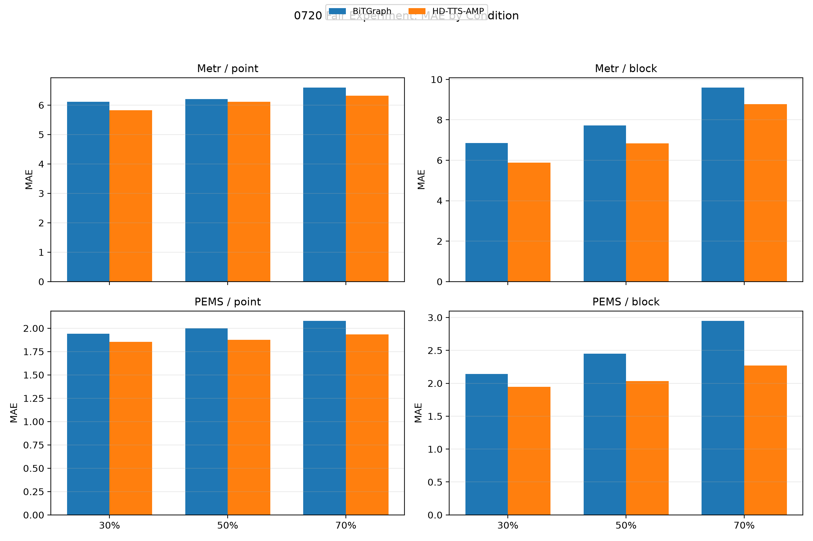
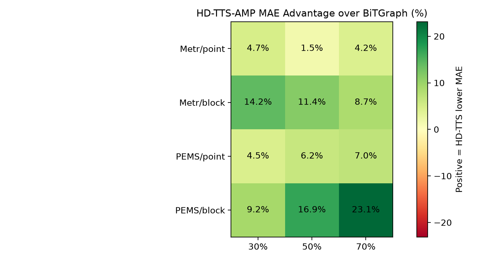
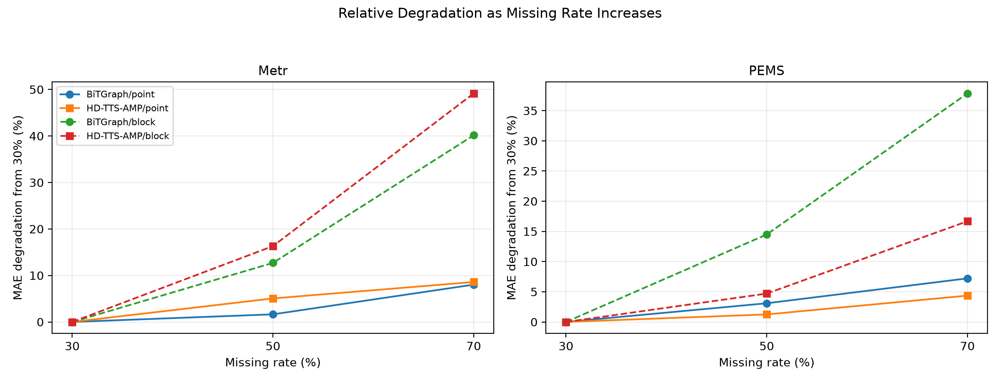

# 0720 实验报告：严格公平数据 / 缺失位置协议下的 BiTGraph 与 HD-TTS-AMP 对比

> **承接**：[`0718实验报告.md`](0718实验报告.md) 与 [`实验计划0720.md`](实验计划0720.md)  
> **日期**：2026-07-20 完成正式训练，2026-07-21 汇总分析  
> **硬件**：NVIDIA A800-SXM4-80GB，正式脚本调度 GPU 1 ～ 7；`gpu_preflight_full.log` 显示 1 ～ 7 号卡启动前基本空闲  
> **实验规模**：24 次正式训练（2 个数据集 × 2 种缺失类型 × 3 个缺失率 × 2 个模型），另有 2 次 smoke 测试，不纳入正式结论  
> **缺失 seed**：统一 mask seed=2024；HD-TTS-AMP 训练 seed=2024；BiTGraph 训练随机种子未显式固定，见第 6 节局限  
> **训练设置**：epochs=200，batch_size=512，window=24，horizon=24；HD-TTS-AMP 使用 train_batches=300、patience=30，BiTGraph 使用原训练循环保存验证集最优 checkpoint
>
> **核心结论**：在严格统一 HDF5 数据源、缺失 mask、缺失位置、window/horizon、batch_size 与窗口切分后，HD-TTS-AMP 在 12 个正式对照组合的 MAE 上全部低于 BiTGraph，平均 MAE 优势为 **9.30%**。优势在块缺失下更明显（平均 **13.91%**），在点缺失下较温和（平均 **4.69%**）。

## 一、实验总览

### 1.1 实验背景

0718 实验已经把 BiTGraph 与 HD-TTS-AMP 统一到 `24→24` 协议下进行比较，但后续核查发现，0718 仍存在三个关键不公平来源：

1. **数据源不一致**：BiTGraph 读取 workspace 下的 HDF5；HD-TTS-AMP 通过 TSL dataset 读取数据，METR-LA 还涉及 `impute_zeros=True`。
2. **缺失位置不一致**：两边各自生成 mask，即使缺失率相同，具体缺失位置也不是同一组。
3. **窗口切分口径不完全一致**：BiTGraph 是滑窗后按样本顺序做 70%/10%/20% 切分；TSL 默认 `TemporalSplitter(val_len=0.1,test_len=0.2)` 的验证集比例实际不是总窗口样本的 10%。

因此，0720 实验只回答一个更窄但更关键的问题：

> 当两个模型使用完全相同的数据矩阵、完全相同的缺失位置、相同的观测 / 预测长度、相同的 batch_size 和相同的窗口样本切分时，BiTGraph 与 HD-TTS-AMP 的相对表现如何？

本轮不引入 Block-HMBGNet，不做融合模型，也不讨论论文原协议差异；它是一次专门用于清除 0718 混杂因素的 baseline 复核。

### 1.2 实验矩阵

| 数据集 | 缺失类型 | 缺失率 | 模型 | 正式训练数 |
| --- | --- | --- | --- | --- |
| METR-LA | point | 30%、50%、70% | BiTGraph、HD-TTS-AMP | 6 |
| METR-LA | block | 30%、50%、70% | BiTGraph、HD-TTS-AMP | 6 |
| PEMS-BAY | point | 30%、50%、70% | BiTGraph、HD-TTS-AMP | 6 |
| PEMS-BAY | block | 30%、50%、70% | BiTGraph、HD-TTS-AMP | 6 |

总计 24 次正式训练。`fair_metrics_summary.csv` 当前共有 26 行，其中 2 行为 smoke 测试（epochs=2），报告正文只使用 epochs=200 的 24 行正式结果。

### 1.3 数据集

| 数据集 | 时间步数 | 节点数 | 通道数 | 采样频率 | 特点 |
| --- | ---: | ---: | ---: | --- | --- |
| METR-LA | 34,272 | 207 | 1 | 5 min | 洛杉矶高速路传感器流量数据，图结构和时序模式都较强 |
| PEMS-BAY | 52,116 | 325 | 1 | 5 min | 湾区高速路传感器流量数据，节点更多、序列更长 |

本轮两个模型均直接读取：

- `dataset/metr_la/metr_la.h5`
- `dataset/pems_bay/pems_bay.h5`

### 1.4 方法命名说明

| 简称 | 全称 | 技术说明 |
| --- | --- | --- |
| BiTGraph | Bi-directional Temporal Graph Network / 本仓库复现入口 BiaTCGNet | 使用 BiTGraph 复现代码的预测入口；本轮新增 `--data_path`、`--mask_path`、`--output_dir`，强制读取统一 HDF5 和统一 observed-mask |
| HD-TTS-AMP | Hierarchical Downsampling Time-Then-Space with anisotropic message passing | 使用 HD-TTS 原仓库的 AMP 配置骨干；本轮新增公平入口 `run_fair_h5_patched.py`，目标序列直接来自 canonical HDF5，邻接矩阵仍由 TSL dataset 提供 |

### 1.5 本轮实现改动与参考仓库一致性说明

BiTGraph 的改动属于**本研究新增实验扩展**：`GenerateDataset.py`、`main.py`、`test_forecasting.py` 增加了外部 `data_path` 与 `mask_path` 参数。当 `mask_path` 存在时，内部随机缺失生成逻辑不再生效，训练和测试都使用同一份 `.npy` observed-mask。该改动不改变 BiTGraph 模型结构，只改变数据输入协议。

HD-TTS-AMP 的改动也属于**本研究新增实验扩展**：新增 `run_fair_h5_patched.py`，绕过 TSL dataset 的目标数据预处理，直接读取 canonical HDF5 作为目标序列，并使用与 BiTGraph 等价的窗口样本切分。原仓库额外的 unmasked diagnostic test 不属于 0720 验收指标，本轮默认跳过，避免附加诊断失败影响正式 masked test 的退出状态。

小结：本轮改动不改变两种模型的核心架构，主要目的是把数据源、缺失位置和样本切分锁定到同一口径。

## 二、公平性验收核查

### 2.1 manifest 与 mask 完整性

`missing_ts_exp/results/0720_fair_b512/fair_data/manifest.csv` 共 12 行，对应：

```text
2 datasets × 2 missing types × 3 missing rates = 12 masks
```

| 数据集 | 缺失类型 | 目标缺失率 | 实际缺失率范围 | mask 数量 |
| --- | --- | --- | --- | ---: |
| METR-LA | point | 30%、50%、70% | 0.300000、0.500000、0.700000 | 3 |
| METR-LA | block | 30%、50%、70% | 0.300041、0.500088、0.700163 | 3 |
| PEMS-BAY | point | 30%、50%、70% | 0.300000、0.500000、0.700000 | 3 |
| PEMS-BAY | block | 30%、50%、70% | 0.300138、0.500173、0.700111 | 3 |

point 缺失率精确等于目标值；block 缺失按连续时间块生成，因一次 mask 一个完整 block，实际缺失率有约 `1e-4` 量级的小偏差，属于预期。

### 2.2 日志与配置验收

正式分析前逐项核查结果：

| 验收项 | 结果 | 说明 |
| --- | --- | --- |
| manifest 行数 | 通过 | 12 行 mask 记录 |
| 正式结果行数 | 通过 | 24 行 epochs=200 结果 |
| 运行状态 | 通过 | 24 行均为 `finished` |
| BiTGraph external mask | 通过 | 每条 BiTGraph 正式 log 均包含 `[external_mask]` |
| HD-TTS fair HDF5 入口 | 通过 | 每条 HD-TTS 正式 log 均包含 `[fair_h5]` |
| 同组 mask_sha256 | 通过 | 12 个 `(dataset, missing_type, rate)` 组合中，两模型 `mask_sha256` 均一致 |
| window/horizon/batch | 通过 | 正式 log 文件名均包含 `h24_b512` |
| HD-TTS 窗口切分 | 通过 | `fair_config.json` 均记录 `BiTGraph-equivalent sequential window split` |
| HD-TTS unmasked test | 通过 | `run_unmasked_test=false`，不影响 masked test 指标 |

HD-TTS-AMP 的窗口样本切分长度为：

| 数据集 | train | val | test |
| --- | ---: | ---: | ---: |
| METR-LA | 23,958 | 3,422 | 6,845 |
| PEMS-BAY | 36,450 | 5,206 | 10,413 |

这与 BiTGraph “先滑窗、再按窗口样本顺序 70%/10%/20% 切分”的口径一致。

## 三、点缺失结果

本节表格使用 `MSE / MAE` 格式。需要说明：BiTGraph 日志提供的是 `RMSE`，表中的 BiTGraph MSE 由 `RMSE²` 近似得到；HD-TTS-AMP 直接使用 Lightning 输出的 `test_mse`。因此，本轮主要用 MAE 判断两模型相对表现，MSE 作为补充观察。

### 3.1 METR-LA 点缺失

| 模型 | 30% | 50% | 70% |
| --- | --- | --- | --- |
| BiTGraph | 116.208 / 6.110 | 118.157 / 6.210 | 122.766 / 6.600 |
| HD-TTS-AMP | 204.020 / 5.821 | 217.679 / 6.116 | 220.890 / 6.321 |

| 指标 | 30% | 50% | 70% |
| --- | ---: | ---: | ---: |
| HD-TTS-AMP 相对 BiTGraph 的 MAE 优势 | +4.72% | +1.52% | +4.22% |

关键发现：

1. HD-TTS-AMP 在三个点缺失率下 MAE 均低于 BiTGraph，但优势不大，最大为 30% 缺失下的 +4.72%，最小为 50% 缺失下的 +1.52%。这说明在 METR-LA 点缺失场景，二者差距并不是架构级“碾压”，更像是 HD-TTS-AMP 在统一数据协议下保持了一个稳定但温和的优势。
2. 30% → 70% 缺失率上升时，BiTGraph MAE 从 6.110 增至 6.600，退化 +8.02%；HD-TTS-AMP 从 5.821 增至 6.321，退化 +8.59%。两者相对退化幅度接近，说明 METR-LA 点缺失下，HD-TTS-AMP 的优势主要来自整体误差基线更低，而不是随缺失率上升更稳。
3. METR-LA 点缺失下出现一个值得注意的指标分歧：HD-TTS-AMP MAE 更低，但 MSE 更高。这可能意味着 HD-TTS-AMP 减少了多数位置的一阶绝对误差，但少量较大误差在平方损失下被放大；也可能与两套评估器的 MSE/RMSE 统计细节有关。因此本报告不使用 METR-LA 的 MSE 单独判断优劣。

### 3.2 PEMS-BAY 点缺失

| 模型 | 30% | 50% | 70% |
| --- | --- | --- | --- |
| BiTGraph | 19.010 / 1.940 | 19.981 / 2.000 | 21.252 / 2.080 |
| HD-TTS-AMP | 17.901 / 1.853 | 18.329 / 1.876 | 19.377 / 1.934 |

| 指标 | 30% | 50% | 70% |
| --- | ---: | ---: | ---: |
| HD-TTS-AMP 相对 BiTGraph 的 MAE 优势 | +4.47% | +6.18% | +7.01% |

关键发现：

1. PEMS-BAY 点缺失下，HD-TTS-AMP 的优势比 METR-LA 更清晰，且随缺失率升高而扩大：从 +4.47% 增至 +7.01%。
2. 30% → 70% 缺失率上升时，BiTGraph MAE 退化 +7.22%，HD-TTS-AMP 只退化 +4.36%。这说明在更高维、更长序列的 PEMS-BAY 上，HD-TTS-AMP 对点缺失的稳定性更好。
3. 这一结果修正了 0718 报告中“点缺失下 BiTGraph 与 HD-TTS-AMP 差距不大”的粗略印象：当数据源和 mask 完全一致后，PEMS-BAY 点缺失场景仍然能观察到 HD-TTS-AMP 的稳定优势。

## 四、块缺失结果

### 4.1 METR-LA 块缺失

| 模型 | 30% | 50% | 70% |
| --- | --- | --- | --- |
| BiTGraph | 143.281 / 6.850 | 176.890 / 7.720 | 180.096 / 9.600 |
| HD-TTS-AMP | 197.178 / 5.879 | 250.907 / 6.838 | 364.140 / 8.769 |

| 指标 | 30% | 50% | 70% |
| --- | ---: | ---: | ---: |
| HD-TTS-AMP 相对 BiTGraph 的 MAE 优势 | +14.17% | +11.42% | +8.66% |

关键发现：

1. METR-LA 块缺失下，HD-TTS-AMP 在 MAE 上仍然全程优于 BiTGraph，优势范围为 +8.66% ～ +14.17%。这说明 0718 中观察到的 HD-TTS 块缺失优势不是由数据源或缺失位置不一致单独造成的。
2. 但从相对退化看，HD-TTS-AMP 并非在所有意义上都“更稳”：30% → 70% 时，BiTGraph 退化 +40.15%，HD-TTS-AMP 退化 +49.15%。也就是说，HD-TTS-AMP 的绝对 MAE 基线更低，但在 METR-LA 块缺失率升高时，增长斜率并不低。
3. 这个现象提示：HD-TTS-AMP 在块缺失下的优势可能主要来自更强的整体预测器和层次表示能力，而不一定来自对所有块缺失强度变化都更小的敏感性。后续如果要分析“块缺失鲁棒性”，应同时看绝对 MAE 和 30%→70% 的相对退化，而不能只看某一个指标。

### 4.2 PEMS-BAY 块缺失

| 模型 | 30% | 50% | 70% |
| --- | --- | --- | --- |
| BiTGraph | 22.468 / 2.140 | 29.812 / 2.450 | 41.216 / 2.950 |
| HD-TTS-AMP | 19.501 / 1.944 | 21.190 / 2.035 | 26.196 / 2.268 |

| 指标 | 30% | 50% | 70% |
| --- | ---: | ---: | ---: |
| HD-TTS-AMP 相对 BiTGraph 的 MAE 优势 | +9.17% | +16.94% | +23.12% |

关键发现：

1. PEMS-BAY 块缺失是本轮差距最明显的场景。HD-TTS-AMP 的 MAE 优势从 +9.17% 持续扩大到 +23.12%，是 12 个正式组合中最强的一组信号。
2. 30% → 70% 缺失率上升时，BiTGraph MAE 从 2.140 增至 2.950，退化 +37.85%；HD-TTS-AMP 从 1.944 增至 2.268，只退化 +16.68%。这说明在 PEMS-BAY 块缺失下，HD-TTS-AMP 不仅绝对误差更低，而且随缺失率升高也明显更稳定。
3. 与 METR-LA 相比，PEMS-BAY 节点更多、序列更长，图结构信息和层次空间聚合可能更有发挥空间。HD-TTS-AMP 的分层时空建模在这个场景下更充分地体现出优势。

## 五、综合分析

### 5.1 总体胜负关系



从 12 个正式对照组合看，HD-TTS-AMP 在 MAE 上全部优于 BiTGraph：

| 统计项 | 数值 |
| --- | ---: |
| HD-TTS-AMP MAE 胜出组合数 | 12 / 12 |
| 平均 MAE 优势 | 9.30% |
| 点缺失平均 MAE 优势 | 4.69% |
| 块缺失平均 MAE 优势 | 13.91% |
| METR-LA 平均 MAE 优势 | 7.45% |
| PEMS-BAY 平均 MAE 优势 | 11.15% |

这比 0718 的结论更干净：0718 能看到 HD-TTS-AMP 在不少场景更好，但由于数据源和 mask 不一致，不能排除实验口径带来的干扰；0720 把这些干扰去掉后，HD-TTS-AMP 的 MAE 优势仍然保留，而且在块缺失下更突出。

### 5.2 优势分布



HD-TTS-AMP 的优势有明显结构性：

1. **块缺失强于点缺失**：块缺失平均优势 13.91%，点缺失平均优势 4.69%。这与 0718 的主线判断一致，即 HD-TTS-AMP 的层次时空结构更适合连续块状缺失。
2. **PEMS-BAY 强于 METR-LA**：PEMS-BAY 平均优势 11.15%，METR-LA 为 7.45%。尤其在 PEMS-BAY/block/70% 下，HD-TTS-AMP 的优势达到 +23.12%。
3. **METR-LA/block 的优势随缺失率升高反而下降**：从 +14.17% 降至 +8.66%。这说明“HD-TTS-AMP 更好”不等于“HD-TTS-AMP 对缺失率升高总是更不敏感”，该结论需要分数据集判断。

### 5.3 缺失率上升带来的退化



| 数据集 | 缺失类型 | BiTGraph 30%→70% MAE 退化 | HD-TTS-AMP 30%→70% MAE 退化 |
| --- | --- | ---: | ---: |
| METR-LA | point | +8.02% | +8.59% |
| METR-LA | block | +40.15% | +49.15% |
| PEMS-BAY | point | +7.22% | +4.36% |
| PEMS-BAY | block | +37.85% | +16.68% |

这张表给出一个比“谁的 MAE 更低”更细的判断：

- 在 PEMS-BAY 上，HD-TTS-AMP 同时具备更低绝对 MAE 和更低退化幅度，尤其是 block 场景。
- 在 METR-LA 上，HD-TTS-AMP 的绝对 MAE 更低，但相对退化幅度不一定更小；block 场景下甚至高于 BiTGraph。
- 因此，如果下一轮要优化“块缺失鲁棒性”，不能只盯 PEMS-BAY 的强优势，也要解释 METR-LA/block 中 HD-TTS-AMP 随缺失率升高更快退化的现象。

### 5.4 与 0718 结论的关系

0720 对 0718 的结论有三点修正：

1. **确认项**：HD-TTS-AMP 在块缺失下优于 BiTGraph 的判断成立，而且不是由 0718 的数据源 / mask 不一致造成的。
2. **强化项**：在严格公平协议下，HD-TTS-AMP 不只在块缺失下占优，在点缺失下也全组合 MAE 更低。
3. **细化项**：HD-TTS-AMP 的“鲁棒性优势”并非在所有数据集都表现为更低退化率。METR-LA/block 中 HD-TTS-AMP 的相对退化高于 BiTGraph，说明模型优势和缺失率敏感性需要分开分析。

## 六、局限条件

1. **本轮仍是单次正式运行，不是多种子统计结论。** mask seed 固定为 2024，HD-TTS-AMP 训练 seed 固定为 2024；但 BiTGraph 训练入口没有显式固定 `--seed 2024`，因此训练随机性没有完全统一。结论应表述为“本次正式运行下的结果”，不应写成统计显著结论。
2. **MSE/RMSE 指标口径不完全对称。** BiTGraph 日志输出 RMSE，本报告中 BiTGraph MSE 由 RMSE 平方得到；HD-TTS-AMP 输出 `test_mse`。因此，跨模型主比较以 MAE 为准。
3. **没有统一离线 evaluator。** 当前结果来自两个模型各自测试入口的日志。严格到指标实现层面的公平评估，下一步最好保存预测值和标签，再用同一个 evaluator 重算 MAE/MSE/RMSE/MAPE。
4. **没有训练耗时和峰值显存统计。** 虽然启动前 `gpu_preflight_full.log` 记录了 A800-80GB 状态，但正式训练过程中没有持续采样显存和吞吐，因此本报告不评价效率。
5. **本轮只比较 baseline，不包含融合模型。** 因此报告不能回答 Block-HMBGNet 或后续融合方案是否优于 HD-TTS-AMP，只能回答严格公平输入下 BiTGraph 与 HD-TTS-AMP 的相对表现。

## 七、结论与后续建议

### 7.1 结论

1. **0720 的公平性验收通过。** 两模型使用同一 HDF5、同一 observed-mask、同一缺失位置、同一 `window=24/horizon=24/batch_size=512`，并且 HD-TTS-AMP 使用 BiTGraph 等价的 70%/10%/20% 窗口样本切分。
2. **HD-TTS-AMP 在 MAE 上全面优于 BiTGraph。** 12 个正式组合全部胜出，平均优势 9.30%。
3. **块缺失是 HD-TTS-AMP 优势最明显的场景。** 块缺失平均优势 13.91%，显著高于点缺失的 4.69%。
4. **PEMS-BAY/block 是最支持 HD-TTS-AMP 的场景。** 在 70% 块缺失下，HD-TTS-AMP 相对 BiTGraph 的 MAE 优势达到 +23.12%。
5. **METR-LA/block 暴露出一个后续值得追的问题。** HD-TTS-AMP 虽然绝对 MAE 更低，但 30%→70% 相对退化更高，说明其优势不是简单的“缺失率越高越鲁棒”。

### 7.2 后续建议

1. **补做统一 evaluator。** 在两个模型测试阶段保存预测值、标签和 mask，用同一份脚本重算 MAE/MSE/RMSE/MAPE。这样可以彻底消除指标实现差异，尤其是当前 METR-LA 中 MAE 与 MSE 方向不一致的问题。
2. **补做多种子公平实验。** 至少固定 3 个训练 seed，例如 2024/2025/2026。mask 可以保持同一组，也可以额外设计 mask seed 维度，用来区分训练随机性和缺失位置随机性。
3. **下一轮融合优化应优先瞄准 PEMS-BAY/block 与 METR-LA/block 的不同现象。** PEMS-BAY/block 显示 HD-TTS-AMP 的块缺失优势很强；METR-LA/block 则显示高缺失率下相对退化仍然明显。融合模型如果要真正有价值，不能只在 PEMS-BAY 上追随 HD-TTS-AMP，还要解释和改善 METR-LA/block 的退化斜率。
4. **保留 0720 作为后续 baseline。** 之后所有融合模型都应复用本轮的 canonical HDF5、mask 文件、切分策略和 batch_size 设置，避免再次出现 0718 那种口径混杂。

## 八、图表索引

| 图号 | 文件名 | 说明 |
| --- | --- | --- |
| 图 1 | `figures/r0720/mae_by_condition.png` | 4 个数据集 / 缺失类型组合下，两模型 MAE 随缺失率变化的柱状对比 |
| 图 2 | `figures/r0720/hdtts_advantage_heatmap.png` | HD-TTS-AMP 相对 BiTGraph 的 MAE 优势热力图，正值表示 HD-TTS-AMP MAE 更低 |
| 图 3 | `figures/r0720/relative_degradation_30_to_70.png` | 以 30% 缺失率为基准，展示缺失率升至 70% 时 MAE 的相对退化 |

## 九、数据与脚本索引

| 类型 | 路径 | 说明 |
| --- | --- | --- |
| 原始汇总 | `missing_ts_exp/results/0720_fair_b512/csv/fair_metrics_summary.csv` | 26 行，包括 2 条 smoke 与 24 条正式结果 |
| 正式结果表 | `missing_ts_exp/results/0720_fair_b512/csv/formal_metrics_0720.csv` | 24 行 epochs=200 结果，已统一出 `mae_primary/mse_primary` |
| 成对对比表 | `missing_ts_exp/results/0720_fair_b512/csv/pairwise_comparison_0720.csv` | 12 行同条件 BiTGraph 与 HD-TTS-AMP 对比 |
| mask manifest | `missing_ts_exp/results/0720_fair_b512/fair_data/manifest.csv` | 12 份统一 mask 的路径、实际缺失率和 sha256 |
| 可视化脚本 | `missing_ts_exp/scripts/r0720_visualize.py` | 生成本报告使用的派生表和图 |
| 启动脚本 | `missing_ts_exp/scripts/r0720_run_fair_baselines.sh` | 0720 smoke/full 实验启动入口 |
