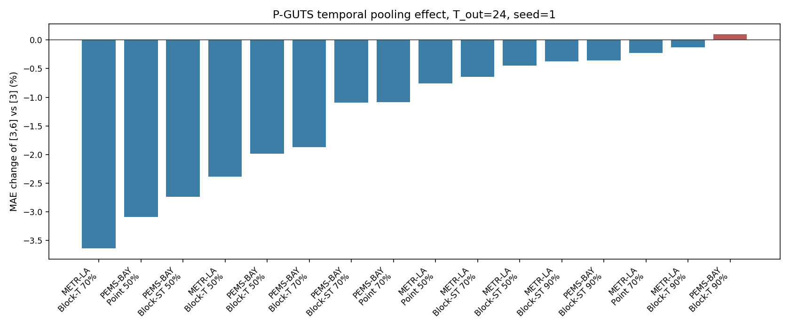
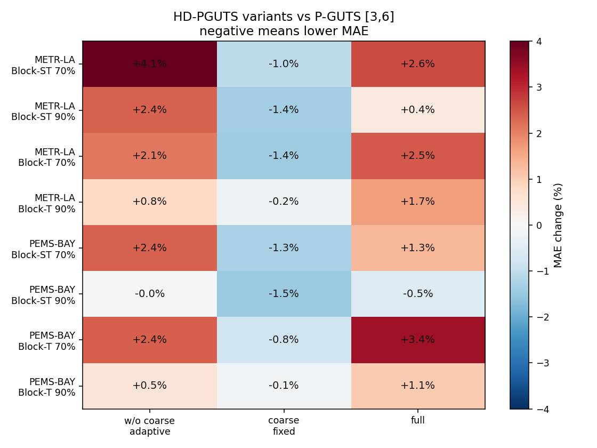
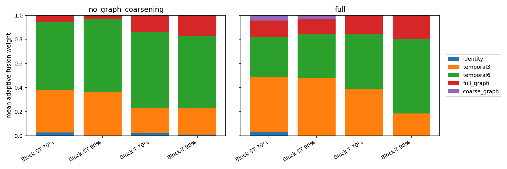
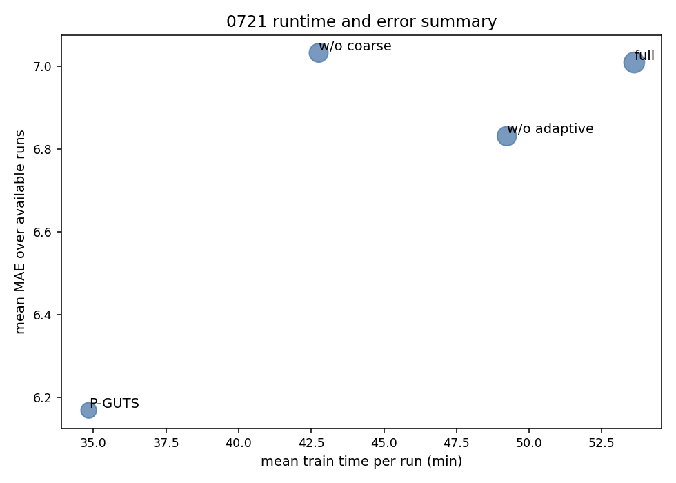

# 0721 实验报告：P-GUTS-Forecaster 与 HD-PGUTS 主线实验

> **承接**：[`0718实验报告.md`](0718实验报告.md)、[`实验计划0721_PGUTS_HDPGUTS主线.md`](实验计划0721_PGUTS_HDPGUTS主线.md)  
> **日期**：2026-07-21 ~ 2026-07-22  
> **硬件**：8 × NVIDIA A800-SXM4-80GB  
> **实验规模**：168 条正式汇总结果，其中 P-GUTS 96 条、HD-PGUTS 72 条  
> **训练设置**：`T_in=24`、`batch_size=512`、`epochs=100`、`lr=1e-3`、`patience=20`  
> **结果目录**：`missing_ts_exp/results/0721_cofill_pguts_forecasting/`

---

## 0. 先读结论

本轮实验原计划回答两个问题：

1. **P-GUTS 能否从 imputation 改造成 forecasting 模型？**  
   可以。P-GUTS-Forecaster 已完成 96 条正式结果，覆盖 Point / Block-T / Block-ST、`T_out=12/24`、`pooling=[3]/[3,6]`，训练稳定，没有出现 NaN 或 90% 块缺失下的系统性失败。

2. **HD-PGUTS full 是否能成为主创新模型？**  
   当前结果不支持。HD-PGUTS full 在 8 个关键块缺失条件中只有 1 个条件优于 P-GUTS `[3,6]`，平均 MAE 反而高 1.55%。最好的 HD 变体不是 full，而是 **HD-PGUTS w/o adaptive fusion**，也就是“有 coarse graph，但不用 adaptive gate”的版本。

最重要的发现可以概括成一句话：

> **粗图分支有用，自适应融合没有用；当前最值得保留的是 coarse graph + fixed fusion，而不是 HD-PGUTS full。**

---

## 一、实验目标与统一协议

### 1.1 本轮实验要回答什么

根据实验计划，本轮只负责 P-GUTS / HD-PGUTS 主线，不负责 CoFILL 主实验，也不负责 HD-TTS / BiTGraph 全量 baseline。实验目标是：

| 问题 | 对应实验 |
|---|---|
| P-GUTS 能否改造成缺失历史条件下的预测模型 | Phase 1 smoke + Phase 2 P-GUTS 全矩阵 |
| 多时间尺度 `[3,6]` 是否比 `[3]` 有收益 | Phase 2 P-GUTS `[3]` 对比 `[3,6]` |
| 加入 HD-TTS 式时空多尺度后是否提升高块缺失预测 | Phase 3 HD-PGUTS 三变体 |
| adaptive fusion 权重是否能解释缺失模式 | Phase 3 scale weights 诊断 |

### 1.2 数据与切分

| 项目 | 设置 |
|---|---|
| 数据集 | METR-LA、PEMS-BAY |
| 原始文件 | `dataset/metr_la/metr_la.h5`、`dataset/pems_bay/pems_bay.h5` |
| 数据形状 | METR-LA `(34272,207,1)`；PEMS-BAY `(52116,325,1)` |
| 输入窗口 | `T_in=24` |
| 预测窗口 | `T_out=12,24`；主分析使用 `T_out=24` |
| 样本切分 | 先滑窗，再按窗口顺序 `70% / 10% / 20%` |
| 缺失 mask | `dataset/0721_missing_masks/` |
| mask 语义 | `1=observed, 0=missing` |
| batch size | 512 |
| 指标 | MAE 为主，RMSE 为辅 |

### 1.3 结果文件

本报告使用以下 CSV：

| 文件 | 行数 | 内容 |
|---|---:|---|
| `csv/pguts_results.csv` | 96 | P-GUTS `[3]` / `[3,6]` 结果 |
| `csv/hd_pguts_ablation_results.csv` | 72 | HD-PGUTS 三变体结果 |
| `csv/hd_pguts_results.csv` | 24 | HD-PGUTS full 子集 |
| `csv/pguts_hdpguts_all_results.csv` | 168 | 全部正式结果 |

报告中的派生表和图由脚本生成：

```bash
conda run -n hzc_agent python missing_ts_exp/scripts/r0721_pguts_visualize.py
```

---

## 二、模型与变体说明

这一节先解释模型名字，避免后面表格读起来像一堆缩写。

### 2.1 P-GUTS-Forecaster

本轮没有复现 P-GUTS 官方完整代码，而是在项目内实现了一个 P-GUTS-style forecasting 入口。核心做法是把预测问题写成“未来段插补”：

```text
X_all = concat(X_hist_observed, zeros_future)
M_all = concat(M_hist, zeros_future_mask)
Y_hat_future = model(X_all, M_all)
loss = MAE(Y_hat_future, Y_future)
```

P-GUTS 有两个版本：

| 名称 | 分支结构 | 融合方式 | 用途 |
|---|---|---|---|
| P-GUTS `[3]` | identity + temporal pool 3 + full graph | fixed linear fusion | 单时间尺度基线 |
| P-GUTS `[3,6]` | identity + temporal pool 3 + temporal pool 6 + full graph | fixed linear fusion | 多时间尺度基线 |

### 2.2 HD-PGUTS 三个变体

Phase 3 的“HD-PGUTS 实验结果”就是下面三个变体在高块缺失条件下的结果。三者都只跑 `T_out=24`，只跑 Block-T / Block-ST 的 70% 和 90%，每个条件跑 `seed=1,2,3`。

| 变体 | 分支结构 | 融合方式 | 这个变体在回答什么 |
|---|---|---|---|
| HD-PGUTS w/o graph coarsening | identity + temporal pool 3/6 + full graph | adaptive gate | 如果不加粗图，只加 adaptive fusion，有没有用 |
| HD-PGUTS w/o adaptive fusion | identity + temporal pool 3/6 + full graph + coarse graph | fixed linear fusion | 如果加粗图，但不用 adaptive fusion，有没有用 |
| HD-PGUTS full | identity + temporal pool 3/6 + full graph + coarse graph | adaptive gate | 完整方案是否最好 |

更直白地说：

```text
P-GUTS [3,6]          = 无 coarse graph + fixed fusion
w/o graph coarsening  = 无 coarse graph + adaptive fusion
w/o adaptive fusion   = 有 coarse graph + fixed fusion
full                  = 有 coarse graph + adaptive fusion
```

所以 Phase 3 真正比较的是两个模块：

1. **coarse graph 分支**：是否需要空间粗化图。
2. **adaptive fusion**：是否需要自适应融合权重。

---

## 三、Phase 1：Smoke 与启动修复

### 3.1 Smoke 矩阵

Smoke 共 8 条：

| 数据集 | 缺失类型 | 缺失率 | `T_out` | pooling |
|---|---|---:|---:|---|
| METR-LA / PEMS-BAY | Block-T / Block-ST | 70% | 24 | `[3]`、`[3,6]` |

验收结果：

- 8 条均完成 5 epoch。
- 无 NaN。
- `batch_size=512`。
- 日志包含 `data_path`、`mask_path`、`mask_sha256`、`actual_missing_rate`、`T_in/T_out`。

### 3.2 启动中修复的问题

有两个工程问题已修复：

1. **环境检查**：当前 base 环境曾缺 `tables/pytables`，会导致 pandas 无法读取 `.h5`。已新增 `r0721_check_pguts_env.py`，启动前会检查 `torch/pandas/tables/CUDA/HDF5`。
2. **PEMS-BAY 距离图读取**：`distances_bay_2017.csv` 没有表头，而 METR-LA 距离图有表头。首版 `load_adjacency()` 对 PEMS-BAY 触发 `KeyError: 'from'`。已改成兼容有表头和无表头的读取函数。修复后 adjacency 检查通过：METR-LA `(207,207)`、PEMS-BAY `(325,325)`，行和约等于 1。

---

## 四、Phase 2：P-GUTS-Forecaster 结果

Phase 2 回答的问题是：

> P-GUTS-Forecaster 是否能稳定训练？多时间尺度 `[3,6]` 是否比 `[3]` 更好？

### 4.1 全矩阵规模

P-GUTS 共 96 条：

| 部分 | 数量 | 说明 |
|---|---:|---|
| seed=1 全矩阵 | 64 | 2 数据集 × 8 缺失条件 × 2 horizon × 2 pooling |
| 关键块缺失补 seed=2,3 | 32 | Block-T / Block-ST，70% / 90%，`T_out=24` |

### 4.2 `T_out=24, seed=1`：`[3]` 对比 `[3,6]`

下表来自 `r0721_pguts_h24_pooling_summary.csv`。Δ% 为 `[3,6]` 相对 `[3]` 的 MAE 变化，负值表示 `[3,6]` 更好。

| 数据集 | 缺失 | 缺失率 | `[3]` MAE | `[3,6]` MAE | Δ% |
|---|---|---:|---:|---:|---:|
| METR-LA | Block-ST | 50% | 8.023 | 7.988 | -0.45% |
| METR-LA | Block-ST | 70% | 8.668 | 8.613 | -0.64% |
| METR-LA | Block-ST | 90% | 9.800 | 9.763 | -0.37% |
| METR-LA | Block-T | 50% | 8.538 | 8.334 | -2.39% |
| METR-LA | Block-T | 70% | 10.008 | 9.644 | **-3.64%** |
| METR-LA | Block-T | 90% | 11.302 | 11.287 | -0.13% |
| METR-LA | Point | 50% | 7.352 | 7.296 | -0.76% |
| METR-LA | Point | 70% | 7.730 | 7.712 | -0.23% |
| PEMS-BAY | Block-ST | 50% | 3.253 | 3.164 | -2.74% |
| PEMS-BAY | Block-ST | 70% | 3.596 | 3.557 | -1.09% |
| PEMS-BAY | Block-ST | 90% | 4.125 | 4.110 | -0.36% |
| PEMS-BAY | Block-T | 50% | 3.253 | 3.189 | -1.99% |
| PEMS-BAY | Block-T | 70% | 3.617 | 3.549 | -1.87% |
| PEMS-BAY | Block-T | 90% | 4.200 | 4.204 | +0.10% |
| PEMS-BAY | Point | 50% | 2.909 | 2.819 | **-3.09%** |
| PEMS-BAY | Point | 70% | 3.077 | 3.043 | -1.08% |



**怎么读这张表**：

- `[3,6]` 在 15/16 个条件下更好，说明增加第二个时间尺度总体有效。
- 改善幅度通常不大，大多低于 2%。
- 90% 块缺失下改善反而很小，说明极端缺失不是简单加时间池化就能解决。

### 4.3 关键块缺失多种子结果

为了判断 `[3,6]` 的收益是否稳定，计划要求对 Block-T / Block-ST 的 70% / 90% 补 `seed=2,3`。下表为三种子平均：

| 数据集 | 缺失 | 缺失率 | `[3]` MAE | `[3,6]` MAE | Δ% |
|---|---|---:|---:|---:|---:|
| METR-LA | Block-ST | 70% | 8.685 ± 0.015 | 8.696 ± 0.098 | +0.13% |
| METR-LA | Block-ST | 90% | 9.796 ± 0.005 | 9.778 ± 0.016 | -0.19% |
| METR-LA | Block-T | 70% | 10.018 ± 0.031 | 9.823 ± 0.235 | -1.95% |
| METR-LA | Block-T | 90% | 11.476 ± 0.151 | 11.435 ± 0.225 | -0.36% |
| PEMS-BAY | Block-ST | 70% | 3.600 ± 0.005 | 3.572 ± 0.014 | -0.78% |
| PEMS-BAY | Block-ST | 90% | 4.125 ± 0.001 | 4.119 ± 0.009 | -0.15% |
| PEMS-BAY | Block-T | 70% | 3.607 ± 0.009 | 3.562 ± 0.022 | -1.26% |
| PEMS-BAY | Block-T | 90% | 4.202 ± 0.008 | 4.197 ± 0.006 | -0.13% |

**结论**：

- 多种子后 `[3,6]` 仍在 7/8 个关键条件下更好。
- 但收益比 seed=1 表格更弱，说明 `[3,6]` 是“小幅稳定收益”，不是决定性提升。
- P-GUTS-Forecaster 值得进入 HD-PGUTS 阶段，因为它稳定、无 NaN，且 `[3]` 与 `[3,6]` 确实有可观察差异。

---

## 五、Phase 3：HD-PGUTS 实验结果

这一节是本轮最核心的结果。计划第八节定义了 HD-PGUTS 的主实验矩阵：

```text
2 数据集 × 2 缺失类型 × 2 缺失率 × 3 变体 × 3 seed = 72 条
```

具体条件是：

| 维度 | 取值 |
|---|---|
| 数据集 | METR-LA、PEMS-BAY |
| 缺失类型 | Block-T、Block-ST |
| 缺失率 | 70%、90% |
| `T_out` | 24 |
| 变体 | w/o graph coarsening、w/o adaptive fusion、full |
| seed | 1、2、3 |

比较基线是 Phase 2 里同条件的 **P-GUTS `[3,6]`**。

### 5.1 HD-PGUTS 三变体主结果

下表给出三种子 MAE 均值 ± 标准差。每行最后一列是这个条件下 MAE 最低的方法。

| 数据集 | 缺失 | 缺失率 | P-GUTS `[3,6]` | w/o graph coarsening | w/o adaptive fusion | full | 最优 |
|---|---|---:|---:|---:|---:|---:|---|
| METR-LA | Block-ST | 70% | 8.696 ± 0.098 | 9.055 ± 0.104 | **8.605 ± 0.030** | 8.924 ± 0.094 | w/o adaptive fusion |
| METR-LA | Block-ST | 90% | 9.778 ± 0.016 | 10.009 ± 0.045 | **9.641 ± 0.044** | 9.816 ± 0.004 | w/o adaptive fusion |
| METR-LA | Block-T | 70% | 9.823 ± 0.235 | 10.030 ± 0.095 | **9.684 ± 0.063** | 10.064 ± 0.037 | w/o adaptive fusion |
| METR-LA | Block-T | 90% | 11.435 ± 0.225 | 11.526 ± 0.164 | **11.412 ± 0.256** | 11.625 ± 0.049 | w/o adaptive fusion |
| PEMS-BAY | Block-ST | 70% | 3.572 ± 0.014 | 3.656 ± 0.010 | **3.526 ± 0.005** | 3.619 ± 0.009 | w/o adaptive fusion |
| PEMS-BAY | Block-ST | 90% | 4.119 ± 0.009 | 4.117 ± 0.013 | **4.057 ± 0.002** | 4.097 ± 0.022 | w/o adaptive fusion |
| PEMS-BAY | Block-T | 70% | 3.562 ± 0.022 | 3.646 ± 0.012 | **3.533 ± 0.009** | 3.682 ± 0.010 | w/o adaptive fusion |
| PEMS-BAY | Block-T | 90% | 4.197 ± 0.006 | 4.218 ± 0.022 | **4.191 ± 0.005** | 4.241 ± 0.007 | w/o adaptive fusion |



### 5.2 这张表说明了什么

**第一，HD-PGUTS full 没有成功。**  
计划的成功标准要求 full 在 Block-ST 70% 或 90% 下稳定优于 P-GUTS `[3,6]`。实际结果不是这样：

- full 只在 PEMS-BAY Block-ST 90% 上略好于 P-GUTS `[3,6]`，改善 -0.52%。
- 其余 7 个关键条件 full 都更差。
- full 平均相对 P-GUTS `[3,6]` 变差 +1.55%。

所以，当前不能把 HD-PGUTS full 作为论文主线结果。

**第二，真正有效的是 `w/o adaptive fusion`。**  
`w/o adaptive fusion` 的含义是：保留 coarse graph 分支，但不用 adaptive gate，而是固定线性融合。它在 8/8 个关键条件下都是最优，平均比 P-GUTS `[3,6]` 改善 -0.97%。

这说明 coarse graph 分支本身有用。

**第三，adaptive fusion 没有带来收益。**  
如果只加入 adaptive fusion，不加入 coarse graph，就是 `w/o graph coarsening`。它平均变差 +1.82%。如果 coarse graph 和 adaptive fusion 都加入，就是 full。full 平均也变差 +1.55%。

因此本轮的消融逻辑很清楚：

```text
coarse graph + fixed fusion      有收益
adaptive fusion alone            无收益
coarse graph + adaptive fusion    无稳定收益
```

### 5.3 相对 P-GUTS `[3,6]` 的汇总

| 变体 | 相对 P-GUTS `[3,6]` 平均 ΔMAE | 最好条件 | 最差条件 |
|---|---:|---:|---:|
| w/o graph coarsening | +1.82% | -0.04% | +4.13% |
| w/o adaptive fusion | **-0.97%** | -1.49% | -0.14% |
| full | +1.55% | -0.52% | +3.38% |

负值表示 MAE 更低。这个表进一步说明：唯一平均改善的变体是 `w/o adaptive fusion`。

### 5.4 为什么说 coarse graph 模块有用

这里要把两个因素拆开看，否则容易误读 HD-PGUTS full 的失败。

`w/o adaptive fusion` 和 P-GUTS `[3,6]` 的主要差别是：

```text
P-GUTS [3,6]        = full graph + temporal3/6 + fixed fusion
w/o adaptive fusion = full graph + coarse graph + temporal3/6 + fixed fusion
```

在这个对照里，融合方式相同，时间尺度相同，缺失条件、seed、horizon 也相同。新增的核心模块就是 **coarse graph 分支**。因此 `w/o adaptive fusion` 相对 P-GUTS `[3,6]` 的提升，可以较干净地归因到 coarse graph。

逐条件看，`w/o adaptive fusion` 在 8/8 个关键块缺失条件下都降低 MAE：

| 条件 | 相对 P-GUTS `[3,6]` ΔMAE |
|---|---:|
| METR-LA Block-ST 70% | -1.04% |
| METR-LA Block-ST 90% | -1.39% |
| METR-LA Block-T 70% | -1.42% |
| METR-LA Block-T 90% | -0.20% |
| PEMS-BAY Block-ST 70% | -1.28% |
| PEMS-BAY Block-ST 90% | -1.49% |
| PEMS-BAY Block-T 70% | -0.79% |
| PEMS-BAY Block-T 90% | -0.14% |

这个结果有三个含义：

1. **coarse graph 的收益是跨数据集的。** METR-LA 平均改善 -1.01%，PEMS-BAY 平均改善 -0.93%，不是只在某一个数据集偶然出现。
2. **coarse graph 对 Block-ST 更敏感。** Block-ST 平均改善 -1.30%，Block-T 平均改善 -0.64%。这符合模块直觉：Block-ST 同时破坏时间连续性和局部空间观测，粗图可以把局部节点层面的缺失传播转成更稳的区域级信息补偿。
3. **90% 极端缺失下收益变小，但没有反向。** 90% 下仍然改善，但 METR-LA Block-T 90% 和 PEMS-BAY Block-T 90% 只有 -0.20% / -0.14%。这说明 coarse graph 不是万能补救；当时间维度长块缺失过重时，空间粗化能提供一些平滑先验，但不能凭空恢复被遮掉的动态细节。

从机制上看，coarse graph 分支可能提供了三类帮助：

- **抗缺失的空间低通先验**：全分辨率图容易受局部节点缺失影响，coarse graph 把相近节点聚合到更粗的区域表示，等价于给模型一条更稳定的空间信息通路。
- **减少局部噪声放大**：在高缺失率下，full graph message passing 可能把稀疏、断裂的观测传播到邻域；coarse graph 的聚合会压低局部异常值的影响，使预测更接近区域交通状态。
- **补充 full graph 的尺度盲区**：P-GUTS `[3,6]` 已经有粗时间尺度，但空间仍主要依赖 full graph。`w/o adaptive fusion` 的提升说明，时间多尺度和空间多尺度不是重复模块，二者解决的是不同方向的信息缺口。

但这个结论也要限定边界：当前 coarse graph 的证据来自 “full graph + coarse graph” 相对 “full graph only” 的提升，还不能说明 coarse graph 单独使用也一定有效。下一步需要把 full graph only、coarse graph only、full+coarse 三组拆开，才能判断 coarse graph 是独立有效，还是只作为 full graph 的补充有效。

### 5.5 为什么 full 加了 coarse graph 却没有更好

`full` 同时加入 coarse graph 和 adaptive fusion，但结果不如 `w/o adaptive fusion`。这说明问题不在 coarse graph 本身，而更可能在 adaptive fusion 如何使用分支。

两个对照支持这个判断：

| 对照 | 平均 ΔMAE | 解释 |
|---|---:|---|
| P-GUTS `[3,6]` → `w/o adaptive fusion` | -0.97% | 固定融合下加入 coarse graph，有收益 |
| `w/o adaptive fusion` → full | +2.55% | 保留 coarse graph，但把 fixed fusion 换成 adaptive gate，明显变差 |

也就是说，coarse graph 分支提供了有用信息，但当前 adaptive gate 没有稳定地把它用起来。第七节的权重诊断也支持这一点：full 中 `coarse_graph` 权重普遍很低，Block-ST 70% 只有 0.043，Block-T 90% 只有 0.002。模型更愿意提高 `temporal6` 权重，而不是使用 coarse graph。

所以更准确的结论不是“HD 空间粗化失败”，而是：

> **空间粗化有效，但当前 adaptive fusion 设计没有把空间粗化的收益释放出来。**

---

## 六、`no_graph_coarsening` 异常与修正

这个问题必须单独写清楚，因为它直接影响 HD-PGUTS 消融的可信度。

### 6.1 发现了什么异常

首版 `no_graph_coarsening` 的 24 条结果，与 P-GUTS `[3,6]` 在相同 `dataset × mask_type × rate × seed` 下 MAE 和 RMSE 逐位相同。进一步检查 checkpoint 后，两者 `state_dict` 也逐张量完全相同。

这说明旧结果不是“两个模型表现相近”，而是“两个模型实际跑了同一个计算图”。

### 6.2 原因是什么

首版代码里：

```text
P-GUTS [3,6]          = identity + temporal3 + temporal6 + full_graph + fixed fusion
no_graph_coarsening   = identity + temporal3 + temporal6 + full_graph + fixed fusion
```

也就是说，`no_graph_coarsening` 名字上像 HD 消融，但架构上等于 P-GUTS `[3,6]`。

### 6.3 怎么处理

处理方式：

1. 旧的 24 条 `no_graph_coarsening` 结果作废。
2. 修正 `no_graph_coarsening` 定义：不加 coarse graph，但使用 adaptive gate。
3. 只重跑这 24 条，不重跑 P-GUTS、`w/o adaptive fusion`、full。
4. 新结果写入 `architecture_signature`，用于核查实际分支和融合方式。

修正后：

```text
P-GUTS [3,6]          = 无 coarse graph + fixed fusion
no_graph_coarsening   = 无 coarse graph + adaptive fusion
no_adaptive_fusion    = 有 coarse graph + fixed fusion
full                  = 有 coarse graph + adaptive fusion
```

修正后的 `no_graph_coarsening` 已经重跑。新结果与 P-GUTS `[3,6]` 不再相同：24 个匹配条件中 MAE 精确相等数为 0，平均相对 P-GUTS `[3,6]` 变差 +1.82%。

---

## 七、自适应融合权重诊断

计划要求 HD-PGUTS full 保存 `scale_weights`，用于判断 adaptive fusion 是否能解释缺失模式。本轮 full 和修正后的 `no_graph_coarsening` 都保存了权重。

下表是跨数据集和 seed 聚合后的平均权重：

| 模型 | 缺失 | 缺失率 | identity | temporal3 | temporal6 | full_graph | coarse_graph |
|---|---|---:|---:|---:|---:|---:|---:|
| full | Block-ST | 70% | 0.030 | 0.457 | 0.331 | 0.139 | 0.043 |
| full | Block-ST | 90% | 0.000 | 0.481 | 0.364 | 0.126 | 0.029 |
| full | Block-T | 70% | 0.000 | 0.390 | 0.456 | 0.149 | 0.006 |
| full | Block-T | 90% | 0.000 | 0.184 | 0.621 | 0.192 | 0.002 |
| w/o graph coarsening | Block-ST | 70% | 0.026 | 0.356 | 0.563 | 0.055 | - |
| w/o graph coarsening | Block-ST | 90% | 0.002 | 0.358 | 0.607 | 0.033 | - |
| w/o graph coarsening | Block-T | 70% | 0.021 | 0.209 | 0.634 | 0.136 | - |
| w/o graph coarsening | Block-T | 90% | 0.008 | 0.225 | 0.598 | 0.169 | - |



### 7.1 怎么解释这些权重

权重有一个合理现象：Block-T 90% 下 `temporal6` 权重最高，说明 gate 确实倾向于使用更粗的时间尺度。这符合“块缺失越严重，越需要粗时间尺度”的直觉。

但也有一个关键问题：full 的 `coarse_graph` 权重很低。Block-ST 70% 是 0.043，Block-T 90% 只有 0.002。也就是说，虽然 `w/o adaptive fusion` 证明 coarse graph 分支有用，但 full 的 adaptive gate 并没有充分使用 coarse graph 分支。

所以本轮权重诊断的结论不是“adaptive fusion 成功解释了缺失模式”，而是更谨慎的：

> adaptive gate 会偏向粗时间尺度，但没有学会有效利用 coarse graph；这可能解释了 full 为什么不如 fixed fusion。

---

## 八、Phase 4 与效率结果

### 8.1 Horizon=12 补实验

P-GUTS 的 `T_out=12` 全矩阵已经完成，共 32 条：

```text
2 数据集 × 8 缺失条件 × 2 pooling × seed=1 = 32
```

结果趋势与 `T_out=24` 类似：`[3,6]` 大多数条件更好，且短预测窗口下 MAE 普遍更低。

但 HD-PGUTS full 的 `T_out=12` 结果没有进入最终 CSV。本报告不对 “HD-PGUTS 在 12 步预测下是否有效” 做结论。

### 8.2 训练时间与显存

| 方法 | runs | 平均 epoch 秒 | 平均训练分钟 | 峰值显存 GB |
|---|---:|---:|---:|---:|
| P-GUTS | 96 | 19.5 | 34.8 | 13.1 |
| w/o graph coarsening | 24 | 23.9 | 42.8 | 19.0 |
| w/o adaptive fusion | 24 | 27.6 | 49.2 | 19.8 |
| full | 24 | 29.9 | 53.6 | 22.9 |



显存角度看，所有模型都远低于单张 A800 的 80GB。正式矩阵用每卡多 run 并发是合理的。效果与成本一起看，`w/o adaptive fusion` 是当前最好的 HD 候选：它比 full 更快、更省显存、MAE 更低。

---

## 九、对实验计划成功标准的回答

| 计划问题 / 标准 | 回答 |
|---|---|
| P-GUTS 能否改造成 forecasting 模型 | **能。** 96 条正式结果完整，smoke 通过，极端块缺失稳定。 |
| `[3,6]` 是否比 `[3]` 有差异 | **有，但幅度小。** seed=1 下 15/16 条改善；关键多种子下 7/8 条改善。 |
| HD-PGUTS full 是否能作为论文主线 | **不能。** full 平均比 P-GUTS `[3,6]` 差 +1.55%，没有稳定优势。 |
| coarse graph 是否有用 | **有。** `w/o adaptive fusion` 保留 coarse graph 且 8/8 条关键条件最优。 |
| adaptive fusion 是否有用 | **当前没有证据支持。** `w/o graph coarsening` 和 full 平均都变差。 |
| scale weights 是否解释缺失模式 | **部分解释。** gate 偏向粗时间尺度，但没有充分使用 coarse graph。 |

---

## 十、最终结论

1. **P-GUTS-Forecaster 这条改造线是成立的。** 它可以在统一 mask、统一切分、`batch_size=512` 下稳定完成 forecasting 训练。
2. **P-GUTS `[3,6]` 比 `[3]` 更稳，但只是小幅改进。** 这说明多时间尺度有价值，但不够成为核心创新。
3. **HD-PGUTS full 没有成功。** 它没有稳定优于 P-GUTS `[3,6]`，不满足计划第 8.4 节的主线成功标准。
4. **最有价值的模块是 coarse graph，不是 adaptive fusion。** `w/o adaptive fusion` 也就是“有 coarse graph + fixed fusion”的版本，在 8/8 个关键条件下最优。
5. **adaptive fusion 需要重新设计。** 当前 gate 倾向于使用 temporal6，但忽略 coarse graph，导致解释上看似合理、性能上没有收益。
6. **消融实验必须记录架构签名。** `no_graph_coarsening` 首版同构 bug 说明，只看变体名字不够，后续每条结果都应记录实际分支结构与融合方式。

---

## 十一、后续建议

下一轮实验不建议继续扩大 full 的矩阵，而应围绕 coarse graph 和 adaptive fusion 分开验证。

### 11.1 coarse graph 细消融

当前最重要的后续实验是把图分支拆开：

| 实验名 | full graph | coarse graph | 融合 | 目的 |
|---|---|---|---|---|
| graph_full_only | 是 | 否 | fixed | 对应 P-GUTS `[3,6]`，作为基线 |
| graph_coarse_only | 否 | 是 | fixed | 判断 coarse graph 单独是否有效 |
| graph_full_plus_coarse | 是 | 是 | fixed | 对应当前 `w/o adaptive fusion` |
| graph_none | 否 | 否 | fixed | 判断预测主要来自时间分支还是图分支 |

建议先只跑关键矩阵：

```text
2 数据集 × 2 缺失类型 × 2 缺失率 × 4 图设置 × 3 seed = 96 条
```

判断标准：

- 如果 `graph_full_plus_coarse` 继续稳定最好，说明 coarse graph 主要是 full graph 的补充尺度。
- 如果 `graph_coarse_only` 接近或优于 `graph_full_only`，说明粗空间结构本身就是强先验，可以考虑简化模型。
- 如果 `graph_none` 退化明显，说明高块缺失下图结构确实必要；如果退化不明显，则需要重新审查图模块贡献。

### 11.2 coarse graph 构造方式消融

当前 coarse graph 的正向信号还没有回答“什么样的粗化最好”。建议比较：

| 方向 | 可选设置 | 观察点 |
|---|---|---|
| coarse ratio / cluster 数 | 例如 25%、50%、75% 节点规模 | 过粗会丢局部信息，过细可能和 full graph 重复 |
| 聚类方法 | 距离聚类、谱聚类、交通相关性聚类 | 判断物理距离图是否足够 |
| coarse adjacency | hard cluster 图、soft assignment 图、top-k coarse 图 | 判断粗图边是否过密或过平滑 |
| 是否共享参数 | full/coarse graph 分支共享或不共享 GCN 参数 | 判断收益来自结构还是额外参数量 |

这组实验的目标不是追求最大矩阵，而是解释 coarse graph 为什么有效。优先跑 `Block-ST 70/90, T_out=24, seed=1/2/3` 即可。

### 11.3 adaptive fusion 重做

当前 adaptive gate 的问题是：它会提高粗时间尺度权重，但没有充分使用 coarse graph。下一版 gate 不应只依赖 branch summary，建议显式加入缺失模式统计：

```text
mask_missing_rate
longest_missing_run
observed_ratio_per_node
observed_ratio_per_time
spatial_coverage_ratio
mask_type_embedding
```

建议做三组对照：

| 融合方式 | 输入 | 目的 |
|---|---|---|
| fixed fusion | 无 gate | 当前最佳基线 |
| branch-only gate | branch summary | 对应当前 full |
| mask-aware gate | branch summary + mask statistics | 验证缺失统计能否引导 coarse graph 权重 |

判断标准不只看 MAE，还要看权重是否可解释：

- Block-ST 高缺失下 `coarse_graph` 权重应高于 Block-T。
- 90% 缺失下粗时间或粗空间权重应高于 70%。
- 如果权重变化合理但 MAE 不提升，说明 gate 可解释但优化目标不匹配。
- 如果 MAE 提升但权重不可解释，则不能把 adaptive fusion 作为解释性卖点。

### 11.4 预测窗口与外部 baseline

目前 HD-PGUTS 只有 `T_out=24` 结论。若要写进论文，还需要补：

```text
HD candidate = coarse graph + fixed fusion
T_out = 12, 24
Block-ST / Block-T = 70%, 90%
seed = 1, 2, 3
```

同时需要接入统一 evaluator，与 HD-TTS-AMP、BiTGraph、CoFILL 的公平 baseline 合并比较。本报告只能说明 P-GUTS / HD-PGUTS 内部消融结论，还不能给出跨方法最终排名。

---

## 十二、图表索引

| 图号 | 文件 | 说明 |
|---|---|---|
| 图 1 | `figures/r0721/pguts_pooling_delta_h24.png` | P-GUTS `[3,6]` 相对 `[3]` 的 `T_out=24, seed=1` MAE 变化 |
| 图 2 | `figures/r0721/hdpguts_delta_vs_pguts36.png` | HD-PGUTS 三变体相对 P-GUTS `[3,6]` 的 MAE 变化，负值表示更好 |
| 图 3 | `figures/r0721/adaptive_scale_weights.png` | adaptive fusion 权重分布 |
| 图 4 | `figures/r0721/efficiency_tradeoff_pguts_hdpguts.png` | 训练时间、显存与误差概览 |

## 十三、产出文件索引

| 文件 | 行数 | 内容 |
|---|---:|---|
| `csv/pguts_results.csv` | 96 | P-GUTS 全矩阵 |
| `csv/hd_pguts_ablation_results.csv` | 72 | HD-PGUTS 三变体结果 |
| `csv/hd_pguts_results.csv` | 24 | HD-PGUTS full 子集 |
| `csv/pguts_hdpguts_all_results.csv` | 168 | 本轮全部正式结果 |
| `csv/r0721_hdpguts_vs_pguts36_delta.csv` | 24 | HD-PGUTS 相对 P-GUTS `[3,6]` 的变化率 |
| `csv/r0721_adaptive_scale_weights_summary.csv` | 48 | scale weights 诊断 |
| `notes/no_graph_coarsening_invalid_20260722.md` | - | `no_graph_coarsening` 首版失效说明 |
