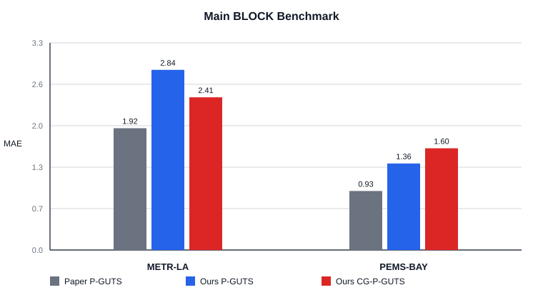
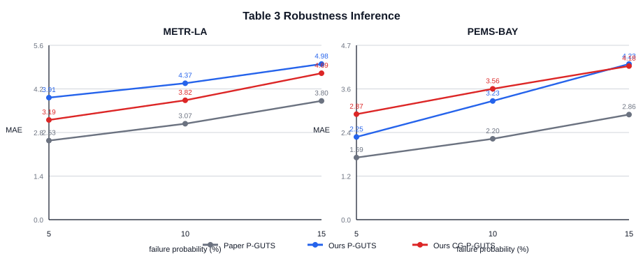

# 0723 实验报告：P-GUTS + Coarse Graph 插补实验

> **承接**：`0721_PGUTS_HDPGUTS实验报告.md`、`实验计划0723_PGUTS_CoarseGraph插补.md`  
> **日期**：2026-07-23 ~ 2026-07-30  
> **硬件**：8 × NVIDIA A800-SXM4-80GB  
> **实验代码**：官方 P-GUTS 仓库 `external_repro/pguts/`，固定 commit `f8a26162de2e8d775bfcbb9bc714746fb5f8db30`，在此基础上增加 coarse graph 分支  
> **实验规模**：8 条正式训练 + 24 条 Table 3 鲁棒性 inference  
> **种子**：训练 `seed=1,2`；Table 3 测试 mask seed `6043,2043,3043,4043,5043`  
> **训练设置**：`window=24`、`stride=1`、`epochs=300`、`batch_size=16`、`batches_epoch=300`、`lr=8e-4`、`patience=40`
> **结果目录**：`missing_ts_exp/results/0723_official_pguts_coarse_imputation/`

---

## 一、实验总览

### 1.1 本轮实验要回答什么

0721 forecasting 实验里，HD-PGUTS 的最佳变体不是完整 adaptive gate 版本，而是：

```text
full graph + coarse graph + temporal [3,6] + fixed fusion
```

这说明 coarse graph 分支可能提供有用的空间低频信息。0723 实验把这个模块迁回 P-GUTS 原始任务，也就是时空序列插补，回答两个问题：

1. 使用官方 P-GUTS 代码和论文交通数据协议时，我们能否得到可用的 P-GUTS `[3,6]` 复现实验结果。
2. 在只增加 coarse graph 分支、其他设置保持一致时，CG-P-GUTS `[3,6]` 是否比 P-GUTS `[3,6]` 更好。

### 1.2 实验协议

本轮只覆盖 P-GUTS 论文交通数据部分：

| 项目 | 本轮设置 |
|---|---|
| 数据集 | METR-LA、PEMS-BAY |
| 任务 | 窗口内 spatiotemporal imputation |
| 窗口 | `window=24`, `stride=1` |
| 主 benchmark mask | 官方 traffic BLOCK 协议，训练固定 `p_fault=0.0015`, `p_noise=0.05` |
| Table 3 鲁棒性 | 不重新训练；复用同一 checkpoint，只在 inference 阶段替换测试 `eval_mask` |
| Table 3 测试强度 | `p_fault=0.05,0.10,0.15`, `p_noise=0` |
| pooling | 只跑论文交通数据最佳组合 `factor_t=[3,6]` |
| 指标 | MAE 为主，RMSE 辅助 |

注意：论文报告中 METR-LA / PEMS-BAY 经过 BLOCK benchmark 处理后的整体缺失率约为 16.52% / 9.10%。Table 3 的 `5%/10%/15%` 是测试阶段的 failure probability，不是给每个缺失强度重新训练一个模型。

### 1.3 方法命名

| 简称 | 代码设置 | 技术说明 |
|---|---|---|
| Paper P-GUTS `[3,6]` | 论文表中报告的结果 | P-GUTS 论文 Table 2 / Table 3 的交通数据结果，用作外部参照 |
| Ours P-GUTS `[3,6]` | `graph_variant=full_only` | 官方 P-GUTS 图路径，不启用 coarse graph，是本轮复现实验和内部对照基线 |
| Ours CG-P-GUTS `[3,6]` | `graph_variant=full_plus_coarse` | 在官方 P-GUTS 上只增加 coarse graph 分支，仍使用 fixed concat/MLP 融合 |

本报告中的 CG-P-GUTS 指的是**基于道路空间信息构造的 distance-greedy coarse graph**。此前临时跑过的“按节点编号连续分组”版本属于错误实现，不进入正式结果表。

### 1.4 模型实现一致性

本轮改造位置主要是：

| 文件 | 改动性质 | 说明 |
|---|---|---|
| `external_repro/pguts/code/models/pguts.py` | 本研究新增扩展 | 新增 `CoarseGraphBranch`，并增加 `graph_variant=full_only/full_plus_coarse/coarse_only/none_graph` 开关；正式实验只用 `full_only` 和 `full_plus_coarse` |
| `external_repro/pguts/experiments/run_imputation.py` | 工程兼容 | 增加命令行覆盖、TSL 数据目录环境变量、PyG/TSL collate 兼容补丁 |
| `external_repro/pguts/experiments/run_inference.py` | 工程兼容 | 用于 Table 3 口径 inference，只替换测试 mask，不重训模型 |
| `missing_ts_exp/results/0723_official_pguts_coarse_imputation/coarse_assignments/*.npy` | 本研究新增扩展 | 使用道路距离图生成 coarse assignment；METR-LA 为 207 节点到 55 组，PEMS-BAY 为 325 节点到 92 组 |

`Ours P-GUTS [3,6]` 的模型路径保持 `full_only`，不读取 coarse assignment；`Ours CG-P-GUTS [3,6]` 才读取 distance-greedy assignment。因此本轮内部比较只改变 coarse graph 一个模块。

### 1.5 和论文设置的差异

本轮目标是“在官方代码基础上的模块验证”，不是完全字节级复现论文。主要差异有三点：

1. 论文使用 3 个 random initializations，本轮为了控制耗时使用 2 个训练种子。
2. 论文交通数据训练使用 `batch_size=8`，本轮按你的要求统一使用 `batch_size=16`。
3. 官方仓库被加入了工程兼容补丁和 CG 扩展，但 `graph_variant=full_only` 的复现路径不启用 CG 分支。

因此，论文数值用于外部参照；本轮最可靠的判断来自同一代码、同一 batch、同一 seed 矩阵下的 `Ours P-GUTS` 和 `Ours CG-P-GUTS` 配对比较。

---

## 二、主 benchmark 结果

本节对应论文 Table 2 traffic 部分。训练 mask 固定为 `p_fault=0.0015, p_noise=0.05`，每个模型训练一次后在标准测试集上评估。表中本轮结果为 2 个训练种子的平均，括号内为跨训练种子的标准差。

| 数据集 | Paper P-GUTS `[3,6]` MAE | Ours P-GUTS `[3,6]` MAE / RMSE | Ours CG-P-GUTS `[3,6]` MAE / RMSE | CG 相对本轮 P-GUTS |
|---|---:|---:|---:|---:|
| METR-LA | 1.92 ± 0.01 | 2.839 ± 0.009 / 5.590 ± 0.009 | 2.408 ± 0.035 / 4.580 ± 0.136 | **-15.21%** |
| PEMS-BAY | 0.93 ± 0.01 | 1.364 ± 0.010 / 3.123 ± 0.011 | 1.604 ± 0.093 / 3.986 ± 0.367 | +17.60% |



### 2.1 关键发现

**第一，METR-LA 上 coarse graph 是明确有效的。** CG-P-GUTS 的 MAE 从 2.839 降到 2.408，改善 15.21%；RMSE 从 5.590 降到 4.580，也同步下降。这不是单个 seed 的偶然现象：两个 seed 都改善，且 best validation MAE 从 P-GUTS 的 0.194 降到 CG-P-GUTS 的 0.165。

**第二，PEMS-BAY 上 coarse graph 反而伤害性能。** CG-P-GUTS 的 MAE 从 1.364 升到 1.604，退化 17.60%；RMSE 也从 3.123 升到 3.986。训练过程同样支持这一点：PEMS-BAY 的 P-GUTS best validation MAE 为 0.143，而 CG-P-GUTS 为 0.168，并且 CG 两个 seed 都在 epoch 107 停止，明显早于 P-GUTS 的 epoch 197/202。

**第三，本轮复现和论文绝对数值仍有明显差距。** Ours P-GUTS 在 METR-LA 上比论文 Table 2 高 47.88%，在 PEMS-BAY 上高 46.64%。这说明当前本机复现还没有达到论文报告水平。考虑到本轮 batch size、seed 数和工程补丁都与论文存在差异，后续如果要以“复现论文数值”为目标，需要单独跑 `batch_size=8, seed=1/2/3` 的严格复现实验。

**第四，内部配对比较仍然有价值。** 虽然复现绝对值偏高，但 P-GUTS 和 CG-P-GUTS 使用同一官方代码、同一数据缓存、同一训练超参和同一 seed 集合。因此“METR-LA 有收益、PEMS-BAY 退化”是本轮对 coarse graph 模块最可信的结论。

---

## 三、Table 3 鲁棒性结果

本节对应论文 Table 3。实验口径是：先使用主 benchmark checkpoint，然后在 inference 阶段替换测试 `eval_mask`，分别评估 `p_fault=0.05/0.10/0.15`。每个 checkpoint 使用 5 个测试 mask seed，先取 5 个 mask 的平均，再对 2 个训练 seed 求平均。

| 数据集 | 测试 `p_fault` | Paper P-GUTS `[3,6]` MAE | Ours P-GUTS `[3,6]` MAE | Ours CG-P-GUTS `[3,6]` MAE | CG 相对本轮 P-GUTS |
|---|---:|---:|---:|---:|---:|
| METR-LA | 5% | 2.53 ± 0.02 | 3.905 ± 0.085 | 3.190 ± 0.010 | **-18.31%** |
| METR-LA | 10% | 3.07 ± 0.03 | 4.365 ± 0.085 | 3.820 ± 0.110 | **-12.49%** |
| METR-LA | 15% | 3.80 ± 0.06 | 4.980 ± 0.010 | 4.685 ± 0.325 | **-5.92%** |
| PEMS-BAY | 5% | 1.69 ± 0.03 | 2.250 ± 0.000 | 2.870 ± 0.210 | +27.56% |
| PEMS-BAY | 10% | 2.20 ± 0.03 | 3.230 ± 0.110 | 3.560 ± 0.100 | +10.22% |
| PEMS-BAY | 15% | 2.86 ± 0.03 | 4.235 ± 0.185 | 4.180 ± 0.110 | -1.30% |



### 3.1 关键发现

**第一，METR-LA 的鲁棒性结论与主 benchmark 一致。** CG-P-GUTS 在 5%、10%、15% 三个测试缺失强度下都优于本轮 P-GUTS，改善幅度分别为 18.31%、12.49%、5.92%。缺失越重，改善幅度越小，说明 coarse graph 对中低强度故障更有帮助；当连续故障过强时，粗图分支本身也会缺少足够局部证据。

**第二，PEMS-BAY 的鲁棒性结论同样延续主 benchmark 的负面结果。** 在 5% 和 10% 测试缺失下，CG-P-GUTS 明显退化；到 15% 时只小幅改善 1.30%，不足以抵消主 benchmark 和低缺失强度下的退化。这个结果说明 PEMS-BAY 上的 coarse graph 不是“整体更鲁棒”，最多是在极端测试缺失下有一点补偿。

**第三，Table 3 再次暴露复现差距。** Ours P-GUTS 在 METR-LA 三个强度下分别比论文高 54.35%、42.18%、31.05%；PEMS-BAY 分别高 33.14%、46.82%、48.08%。因此不要把本轮结果解释为“已复现论文绝对指标并在此基础上创新”。更准确的说法是：本轮完成了官方代码路径下的可控对照，发现 coarse graph 的收益高度依赖数据集。

---

## 四、为什么 coarse graph 在两个数据集上表现相反

### 4.1 METR-LA：粗图补上了有用的空间低频先验

METR-LA 只有 207 个节点，道路距离图相对稠密度和局部邻近关系更容易被 distance-greedy 分组捕捉。CG 分支把邻近节点聚到粗粒度组后，相当于为模型提供一个更平滑的空间视角：当某些传感器连续缺失时，模型可以从同组或邻近组的低频交通状态里恢复缺失片段。

这个解释和三类证据一致：

1. 主 benchmark MAE / RMSE 都明显下降。
2. Table 3 三个测试缺失强度都下降。
3. CG-P-GUTS 的 best validation MAE 明显低于 P-GUTS，说明收益不是测试集偶然波动。

### 4.2 PEMS-BAY：当前 coarse assignment 可能引入了错误平滑

PEMS-BAY 有 325 个节点，本轮 distance-greedy `coarse_factor=4` 得到 92 个 coarse groups。这个分组策略很可能过于简单：它只根据道路距离做局部贪心合并，并没有验证组内交通动态是否一致，也没有引入可学习的抑制机制。

在 fixed concat/MLP 融合下，模型无法显式关闭 coarse branch。如果 coarse group 把动态模式不同的传感器混到一起，粗图分支就会把错误的低频信息注入融合层，表现为：

1. PEMS-BAY CG 的 validation MAE 明显高于 P-GUTS。
2. 两个 CG seed 的测试 RMSE 方差更大，seed 1 尤其差。
3. Table 3 低缺失强度下退化更明显，说明当 full graph 已经有足够信息时，错误粗化反而干扰预测。

### 4.3 这轮实验对 0721 结论的修正

0721 forecasting 实验给出的结论是“coarse graph + fixed fusion 值得迁回 P-GUTS 插补任务”。0723 的结果把这个结论修正为：

> coarse graph 不是无条件有效模块；它在 METR-LA 上明显有效，但在 PEMS-BAY 上当前实现会退化。模块是否有效，取决于 coarse assignment 是否和真实交通空间结构、节点动态模式匹配。

这也解释了为什么此前“按节点编号分组”的 CG 结果不能作为正式证据。编号分组没有空间语义，即使数值偶然好看，也不能证明 coarse graph 机制有效。本报告只使用 distance-greedy 空间分组结果。

---

## 五、结论与后续实验建议

### 5.1 核心结论

1. **本轮已完成官方 P-GUTS 代码路径下的 P-GUTS `[3,6]` 和 CG-P-GUTS `[3,6]` 配对实验。** 训练共 8 条，Table 3 inference 共 24 条，结果均已归档为 CSV。

2. **CG-P-GUTS 在 METR-LA 上成立。** 主 benchmark MAE 改善 15.21%，Table 3 三个测试缺失强度分别改善 18.31%、12.49%、5.92%。

3. **CG-P-GUTS 在 PEMS-BAY 上不成立。** 主 benchmark MAE 退化 17.60%，Table 3 在 5% 和 10% failure probability 下分别退化 27.56% 和 10.22%，只在 15% 下有 1.30% 的微弱改善。

4. **本轮复现绝对值明显弱于论文。** 因此对论文的比较应作为外部参照，不应写成“超过论文结果”。当前最可靠结论是内部配对比较，而不是论文指标级别的绝对复现。

5. **coarse graph 的关键问题从“要不要加”变成了“怎么分组、怎么控制注入强度”。** METR-LA 证明它有潜力；PEMS-BAY 说明简单 distance-greedy + fixed fusion 还不够稳。

### 5.2 下一步建议

1. **先做严格 P-GUTS 复现。** 使用论文 batch size `8`、3 个训练 seed、官方参数，至少跑 METR-LA / PEMS-BAY 的 P-GUTS `[3,6]`，确认本机与论文绝对数值差距来自 batch size、seed 数，还是数据/代码环境差异。

2. **做 coarse assignment 对照，而不是继续盲目加模块。** 建议比较 `distance-greedy`、谱聚类、k-medoids、图社区发现、随机分组。随机分组是必要负对照，用来确认收益来自空间结构而不是参数量增加。

3. **扫 `coarse_factor`。** 当前只用了 `coarse_factor=4`。PEMS-BAY 可能需要更小的粗化强度，例如 2；METR-LA 可以测试 2/4/8 看收益是否有峰值。

4. **加入可抑制的 residual gate。** 不建议直接回到 0721 的复杂 adaptive fusion；更稳的下一步是给 coarse branch 一个标量或通道级 residual gate，并初始化接近 0，让模型在 PEMS-BAY 这类场景下可以自动少用粗图。

5. **分析 coarse groups 的结构质量。** 对 METR-LA 和 PEMS-BAY 分别统计组内道路距离、组内相关系数、跨组连接密度。如果 PEMS-BAY 的组内动态一致性明显更差，就能解释当前退化。

---

## 六、结果文件索引

| 文件 | 说明 |
|---|---|
| `missing_ts_exp/results/0723_official_pguts_coarse_imputation/csv/bs16be300_main_runs.csv` | 8 条正式训练的逐 seed 测试 MAE/RMSE、best epoch、best validation MAE |
| `missing_ts_exp/results/0723_official_pguts_coarse_imputation/csv/bs16be300_main_summary.csv` | 主 benchmark 跨 seed 汇总 |
| `missing_ts_exp/results/0723_official_pguts_coarse_imputation/csv/bs16be300_table3_runs.csv` | Table 3 inference 逐 checkpoint、逐测试强度、5 个 mask seed 结果 |
| `missing_ts_exp/results/0723_official_pguts_coarse_imputation/csv/bs16be300_table3_summary.csv` | Table 3 跨训练 seed 汇总 |
| `missing_ts_exp/results/0723_official_pguts_coarse_imputation/csv/bs16be300_paper_comparison.csv` | 本轮 P-GUTS 复现与论文结果差距 |
| `missing_ts_exp/figures_r0723_pguts_cg/bs16be300_main_mae.svg` | 主 benchmark MAE 对比图 |
| `missing_ts_exp/figures_r0723_pguts_cg/bs16be300_table3_mae.svg` | Table 3 鲁棒性 MAE 对比图 |
| `missing_ts_exp/scripts/r0723_aggregate_bs16be300_results.py` | 本报告 CSV 聚合脚本 |
| `missing_ts_exp/scripts/r0723_visualize_bs16be300_results.py` | 本报告 SVG 图表生成脚本 |

