# 2024 年以后观测缺失条件下时间序列预测相关文献补充

本文档从已有 7 篇论文出发，按两种方式补充相关文献：

1. **参考文献/引用线索**：从 CRIB、MissTSM、S4M、Merlin、CoIFNet、GinAR、IBN 的正文、实验基线和参考文献中筛选 2024 年及以后相关工作。
2. **网络主题检索**：围绕关键词 `time series forecasting with missing values`、`incomplete multivariate time series forecasting`、`irregular multivariate time series forecasting`、`time series imputation forecasting`、`spatiotemporal imputation` 检索 2024 年以后的论文。

筛选原则：

- 年份：2024 年及以后。
- 质量：优先顶会/顶刊，如 ICLR、ICML、NeurIPS、KDD、TKDE、TMLR、ECML PKDD；若是 arXiv，则优先有代码、实验完整、与主题高度相关的工作。
- 相关性：优先“输入观测值存在缺失时直接做预测”的论文；其次是对预测任务很重要的插补、不规则采样、鲁棒预测论文。

## 1. 最推荐优先阅读的论文

这组论文与“观测值有缺失条件下的时间序列预测”最贴近，建议优先读。

| 论文 | 年份/来源 | 获取方式 | 为什么值得读 | 与当前综述的关系 |
|---|---|---|---|---|
| [Biased Temporal Convolution Graph Network for Time Series Forecasting with Missing Values, BiTGraph](https://openreview.net/forum?id=O9nZCwdGcG) | ICLR 2024 | 参考文献 + 网络检索 | 直接研究 missing values 下的时间序列预测，是 CoIFNet、CRIB、S4M、GinAR 等多篇论文的重要基线 | 很适合作为 2024 年直接预测缺失值场景的代表基线 |
| [Graph-based Forecasting with Missing Data through Spatiotemporal Downsampling](https://arxiv.org/abs/2402.10634) | ICML 2024 | 参考文献 + 网络检索 | 直接研究图时空预测中的缺失输入，尤其强调连续块缺失；通过时空层次下采样融合多尺度表示 | 与 CoIFNet、S4M 的块缺失问题高度相关 |
| [Irregular Multivariate Time Series Forecasting: A Transformable Patching Graph Neural Networks Approach, t-PatchGNN](https://proceedings.mlr.press/v235/zhang24bw.html) | ICML 2024 | 网络检索 | 面向不规则多变量时间序列预测，提出 transformable patching + time-adaptive GNN；构建 IMTS forecasting benchmark | 与 MissTSM 的 IMTS 路线相关，是不规则采样预测方向的重要基线 |
| [GinAR+: A Robust End-to-End Framework for Multivariate Time Series Forecasting With Missing Values](https://ieeexplore.ieee.org/document/11002729/) | IEEE TKDE 2025 | manifest + 参考文献 | GinAR 的扩展版，题目从 variable missing 扩展到更一般的 missing values，且发表在 TKDE | 是 GinAR/IBN 后续最该补读的一篇 |
| [S4M: S4 for Multivariate Time Series Forecasting with Missing Values](https://openreview.net/forum?id=BkftcwIVmR) | ICLR 2025 | 已在当前目录 + 网络确认 | 把缺失处理集成进 S4，兼顾预测性能和效率 | 已在当前综述中，但它是该方向 2025 年高质量代表 |
| [Merlin: Multi-View Representation Learning for Robust Multivariate Time Series Forecasting with Unfixed Missing Rates](https://dl.acm.org/doi/10.1145/3711896.3737046) | KDD 2025 | 已在当前目录 + 网络确认 | 处理现实中缺失率随时间变化的问题，通过蒸馏和对比学习做语义对齐 | 已在当前综述中，适合连接“鲁棒缺失率”主题 |
| [HyperIMTS: Hypergraph Neural Network for Irregular Multivariate Time Series Forecasting](https://arxiv.org/abs/2505.17431) | ICML 2025 | 网络检索 | 直接做不规则多变量时间序列预测，用超图统一表示不对齐观测之间的依赖 | 是 t-PatchGNN 之后 IMTS forecasting 的强相关后续 |
| [MissTSM: Investigating a Model-Agnostic and Imputation-Free Approach for Irregularly-Sampled Multivariate Time-Series Modeling](https://openreview.net/forum?id=HgJ0DMVAA3) | TMLR 2026 | 已在当前目录 | 模型无关、免插补的 IMTS 适配器，预测和分类都覆盖 | 已在当前综述中，和 t-PatchGNN/HyperIMTS 可组成 IMTS 分支 |

## 2. 从参考文献和实验基线中挖出的相关论文

### 2.1 直接预测缺失输入

**BiTGraph - ICLR 2024**  
论文：Biased Temporal Convolution Graph Network for Time Series Forecasting with Missing Values  
链接：https://openreview.net/forum?id=O9nZCwdGcG  
代码：https://github.com/chenxiaodanhit/BiTGraph  

BiTGraph 是多篇后续论文的直接比较对象。它用 biased temporal convolution 和 biased graph convolution 显式建模缺失模式，目标是同时捕获时间依赖和空间/变量结构。它的重要性在于：它是 2024 年之后 MTSF-M 方向最常被引用的直接端到端基线之一。

适合在综述里放的位置：作为 CoIFNet、CRIB、S4M 的前置代表方法。

**Graph-based Forecasting with Missing Data through Spatiotemporal Downsampling - ICML 2024**  
论文链接：https://arxiv.org/abs/2402.10634  
PMLR PDF：https://raw.githubusercontent.com/mlresearch/v235/main/assets/marisca24a/marisca24a.pdf  
代码：https://github.com/marshka/hdtts  

这篇论文直接处理图时空预测中的缺失观测，通过时间和空间两个维度的层次下采样，得到多尺度表示，再根据观测值和缺失模式用注意力组合这些表示。它对连续块缺失特别有针对性。

适合在综述里放的位置：块缺失和时空图预测分支，和 CoIFNet/S4M 对照。

**RobustTSF - ICLR 2024**  
论文：Towards Theory and Design of Robust Time Series Forecasting with Anomalies  
链接：https://openreview.net/forum?id=ltZ9ianMth  
代码：https://github.com/haochenglouis/RobustTSF  

严格说它研究的是异常污染下的鲁棒预测，不是专门研究 missing values。但 MissTSM 的附录把它作为相关鲁棒方法讨论，因为缺失值、异常值都可以看作输入污染。它提供了一个有理论分析的鲁棒预测视角。

适合在综述里放的位置：鲁棒预测/缺失作为噪声的补充讨论。

### 2.2 插补方法，但与预测任务强相关

**ImputeFormer - KDD 2024**  
论文：ImputeFormer: Low Rankness-Induced Transformers for Generalizable Spatiotemporal Imputation  
链接：https://dl.acm.org/doi/10.1145/3637528.3671751  
代码：https://github.com/tongnie/ImputeFormer  

ImputeFormer 是 CRIB、CoIFNet 中都出现的重要插补基线。它强调时空数据的低秩结构，用 Transformer 做可泛化的 spatiotemporal imputation。虽然任务是插补，但它常被用于“先插补再预测”的 pipeline，因此对缺失预测综述很重要。

适合在综述里放的位置：插补基线、两阶段 pipeline 的代表。

**Task-oriented Time Series Imputation Evaluation via Generalized Representers - NeurIPS 2024**  
论文链接：https://arxiv.org/abs/2410.06652  
OpenReview：https://openreview.net/forum?id=n2dvAKKQoM  
代码：https://github.com/hkuedl/Task-Oriented-Imputation  

这篇论文的观点和 CRIB/CoIFNet 的争论非常契合：插补不应只看重建误差，还应该看下游任务，例如 forecasting、classification、anomaly detection 的收益。它提出不用反复重训下游模型也能估计不同插补策略对下游任务贡献的方法。

适合在综述里放的位置：评价方法部分，解释“为什么插补好不等于预测好”。

**Conditional Information Bottleneck Approach for Time Series Imputation - ICLR 2024**  
链接：https://openreview.net/forum?id=K1mcPiDdOJ  

这篇论文把 Information Bottleneck 用于时间序列插补，目标是在保留时序上下文有用信息的同时减少冗余。它和 CRIB 的关系很自然：CRIB 也是信息瓶颈，但 CRIB 把目标从“插补”转到“直接预测”。

适合在综述里放的位置：信息瓶颈路线的前置工作。

**BayOTIDE - ICML 2024 Spotlight**  
论文：Bayesian Online Multivariate Time Series Imputation with Functional Decomposition  
链接：https://openreview.net/forum?id=FGoq622oqY  
代码：https://github.com/xuangu-fang/bayotide  

BayOTIDE 是在线多变量时间序列插补方法，使用 functional decomposition 和 Gaussian Process prior，能处理任意时间戳、在线到达数据，并提供不确定性。它不是直接预测论文，但对真实部署中“观测不规则 + 数据流式到达 + 需要不确定性”的场景很有价值。

适合在综述里放的位置：真实在线缺失/不规则采样插补方向。

**PriSTI - NeurIPS 2024**  
论文：Learning from Highly Sparse Spatio-temporal Data  
链接：https://openreview.net/forum?id=rTONicCCJm  

PriSTI 面向高度稀疏的时空数据插补，用 diffusion model 做 spatio-temporal imputation。它的动机和 GinAR、IBN、CoIFNet 都有交集：当观测极稀疏时，普通插补会出现信息损失和误差累积。

适合在综述里放的位置：高稀疏时空插补，作为高缺失率场景补充。

## 3. 通过网络主题检索补充的论文

### 3.1 不规则多变量时间序列预测

**t-PatchGNN - ICML 2024**  
论文：Irregular Multivariate Time Series Forecasting: A Transformable Patching Graph Neural Networks Approach  
链接：https://proceedings.mlr.press/v235/zhang24bw.html  
代码：https://github.com/usail-hkust/t-PatchGNN  

它把不规则单变量序列变成可变长度 patch，再用 time-adaptive GNN 学不同变量间随时间变化的关系。它关注的是 irregular forecasting，不完全等同于缺失值预测，但在实际数据中“不规则采样”和“观测缺失”常常是同一个问题的两种表述。

**HyperIMTS - ICML 2025**  
论文：Hypergraph Neural Network for Irregular Multivariate Time Series Forecasting  
链接：https://arxiv.org/abs/2505.17431  
OpenReview：https://openreview.net/forum?id=u8wRbX2r2V  

HyperIMTS 用超图表示不规则多变量时间序列中的非对齐观测，强调在统一结构中建模原始观测依赖。它是 t-PatchGNN 之后很值得跟进的 IMTS forecasting 工作。

**Hi-Patch - ICML 2025**  
论文：Hierarchical Patch GNN for Irregular Multivariate Time Series  
链接：https://openreview.net/forum?id=OGtUfA6Amo  

Hi-Patch 更偏 irregular multivariate time series 表示学习/分类，但它的层次 patch GNN 思想与 t-PatchGNN、MissTSM、HyperIMTS 处在同一技术谱系。若你的综述想覆盖 IMTS 更完整，可以作为补充。

### 3.2 新一代通用插补/基础模型

**NuwaTS - arXiv 2024**  
论文：NuwaTS: a Foundation Model Mending Every Incomplete Time Series  
链接：https://arxiv.org/abs/2405.15317  
代码：https://github.com/Chengyui/NuwaTS  

NuwaTS 尝试用预训练语言模型做通用时间序列插补，强调跨变量、跨领域泛化。它不是顶会正式发表版本，但主题很新，且与“大模型/基础模型修补缺失序列”方向有关。

**LSCD - ICML 2025**  
论文：Lomb-Scargle Conditioned Diffusion for Time series Imputation  
链接：https://openreview.net/forum?id=GdYg0Ohx0k  
代码：https://github.com/asztr/LombScargle  

LSCD 用 Lomb-Scargle 谱估计处理不规则采样序列，并把频域条件送入 diffusion model 做插补。它特别适合解释一个问题：不规则采样时直接用 FFT 会有偏差，因为 FFT 假设均匀采样。

**Cross-Domain Conditional Diffusion Models for Time Series Imputation - ECML PKDD 2025**  
论文链接：https://arxiv.org/abs/2506.12412  

这篇论文处理跨领域时间序列插补，适合迁移场景：源域和目标域的动态不同，目标域又有高缺失率。它和 CRIB、Merlin 的“语义对齐/域差异”主题有一定联系。

**Probabilistic Time Series Modeling with Decomposable Denoising Diffusion Model - ICML 2024**  
OpenReview：https://openreview.net/forum?id=BNH8spaR3l  
DBLP：https://dblp.org/rec/conf/icml/YanGHZX24.html  

D3M 是概率时间序列建模的 diffusion 方法，覆盖生成、插补、预测等任务。它不专门为 MTSF-M 设计，但如果想扩展到“概率预测 + 缺失补全 + 不确定性”，可以作为扩展阅读。

## 4. 建议加入综述的阅读路线

如果你想把现有综述进一步扩成一篇更完整的文献综述，我建议按以下路线组织。

### 4.1 直接预测路线

核心问题：缺失输入下，能不能不先插补，直接预测？

建议纳入：

- BiTGraph, ICLR 2024
- Graph-based Forecasting with Missing Data through Spatiotemporal Downsampling, ICML 2024
- S4M, ICLR 2025
- CRIB, 2025/2026
- MissTSM, TMLR 2026

### 4.2 端到端联合插补-预测路线

核心问题：如果要插补，能不能让插补服务于预测，而不是两阶段割裂？

建议纳入：

- CoIFNet, 2025
- GinAR, KDD 2024
- GinAR+, TKDE 2025
- IBN, 2025
- Task-oriented Time Series Imputation Evaluation, NeurIPS 2024

### 4.3 不规则采样/IMTS 预测路线

核心问题：当不同变量在不同时间点观测不齐，传统 token 化和规则采样模型如何改？

建议纳入：

- t-PatchGNN, ICML 2024
- HyperIMTS, ICML 2025
- Hi-Patch, ICML 2025
- MissTSM, TMLR 2026
- BayOTIDE, ICML 2024 Spotlight

### 4.4 插补基础模型和不确定性路线

核心问题：缺失值恢复能否跨领域泛化？能否给出不确定性？

建议纳入：

- ImputeFormer, KDD 2024
- NuwaTS, arXiv 2024
- LSCD, ICML 2025
- Cross-Domain Conditional Diffusion Models for Time Series Imputation, ECML PKDD 2025
- PriSTI, NeurIPS 2024
- Conditional Information Bottleneck for Time Series Imputation, ICLR 2024

## 5. 精简版必读清单

如果只想补读 8 篇，我建议选：

1. **BiTGraph, ICLR 2024**：MTSF-M 直接预测强基线。
2. **Graph-based Forecasting with Missing Data through Spatiotemporal Downsampling, ICML 2024**：块缺失 + 图时空预测。
3. **t-PatchGNN, ICML 2024**：IMTS forecasting 重要基线。
4. **Task-oriented Time Series Imputation Evaluation, NeurIPS 2024**：解释“插补好不等于预测好”。
5. **ImputeFormer, KDD 2024**：现代强插补基线。
6. **GinAR+, TKDE 2025**：GinAR 后续扩展。
7. **HyperIMTS, ICML 2025**：IMTS forecasting 最新强相关。
8. **LSCD, ICML 2025**：不规则采样插补的频域 diffusion 视角。

## 6. 与现有 7 篇论文的连接图

```mermaid
flowchart TD
    A["已有综述: 缺失值下 MTSF"]
    A --> B["直接预测/免插补"]
    A --> C["端到端联合插补-预测"]
    A --> D["变量缺失/图结构"]
    A --> E["非固定缺失率/鲁棒性"]
    A --> F["不规则采样 IMTS"]
    A --> G["插补评价与基础模型"]

    B --> B1["BiTGraph, ICLR 2024"]
    B --> B2["HD-TTS, ICML 2024"]
    B --> B3["CRIB"]
    B --> B4["MissTSM"]

    C --> C1["CoIFNet"]
    C --> C2["S4M"]
    C --> C3["Task-oriented Imputation, NeurIPS 2024"]

    D --> D1["GinAR"]
    D --> D2["GinAR+, TKDE 2025"]
    D --> D3["IBN"]

    E --> E1["Merlin"]
    E --> E2["RobustTSF, ICLR 2024"]

    F --> F1["t-PatchGNN, ICML 2024"]
    F --> F2["HyperIMTS, ICML 2025"]
    F --> F3["Hi-Patch, ICML 2025"]

    G --> G1["ImputeFormer, KDD 2024"]
    G --> G2["NuwaTS, 2024"]
    G --> G3["BayOTIDE, ICML 2024"]
    G --> G4["LSCD, ICML 2025"]
    G --> G5["CD2-TSI, ECML PKDD 2025"]
```

